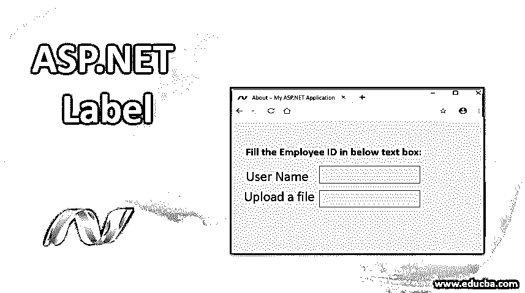
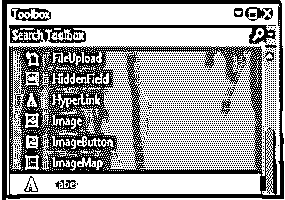

# ASP.NET 标签

> 原文：<https://www.educba.com/asp-dot-net-label/>




## ASP.NET 标签介绍

Label 控件用于在网页上显示文本。此标签控件与文本框等其他控件一起使用。标签和文本框一起使用是很常见的。标签通常通过书面指示帮助用户在文本框中提供数据。标签是服务器端控件。我们可以通过设置 text through text 属性在标签控件中显示文本。通过更改其标签控件属性，我们可以更改标签控件的样式或外观。所以我们可以按照我们的要求定制它。

**语法**

<small>网页开发、编程语言、软件测试&其他</small>

```
< asp:Label ID="Label1" runat="server" Text="Label" ></asp:Label>
```

### ASP.NET 标签是如何工作的？

让我们看看 ASP.NET 标签到底是如何工作的。

*   打开 visual studio 并创建一个新的空 web 应用程序。
*   现在添加一个新的 web 表单，它位于解决方案资源管理器中。
*   从工具箱中选择 label 控件，将其拖放到 web 窗体上。




*   从 label 控件中设置其 Text 和 ID 属性。
*   我们需要在 label 控件中分配文本，以便使用它的 text 属性。通过设置标签文本属性中的文本值，文本将显示在标签控件上。
*   我们可以通过在 asp.cs 页面中编写代码，以编程方式使用标签的 text 属性来更改标签的文本。
*   Text = " EduCba

**Default.aspx.cs 代码**

```
Using System;
Using System.Collections.Generic;
Using System.Linq;
Using System.web;
Using System.Web.UI;
Using System.Web.UI.WebControls;
Public partial class _Default : System.Web.UI.Page
{
Protected void page_Load(object sender, EventArgs e)
{
Label1.Test=” Welcome to EduCba”;
}
}
```

### 性能

标签控件有自己的属性，这些属性将被用来使其更加增强。

*   **访问键:**使用访问键为标签添加快捷键。
*   **TabIndex:** 它决定了 web 服务器的选项卡控件的索引。
*   **BackColor:** 为了增强外观并使其具有不同的颜色，我们可以使用该属性，这样它将有助于改变标签的背景颜色。
*   如果我们想设置标签边框的颜色，我们可以使用这个属性。
*   **BorderWidth** :这个属性允许我们为标签边框设置一个特定的宽度。
*   **Font** :我们需要设置标签文本的字体，然后才能使用这个属性。
*   **前景色**:用于设置标签文字的颜色。
*   **Text:** 该属性使用了标签需要显示的文本。
*   工具提示(ToolTip):它提供了当我们试图将鼠标放在标签上时显示的文本。
*   **Visible:** 它将允许我们[在 web 表单上设置控件的可见性](https://www.educba.com/css-visibility/)。
*   **Height:** 提供我们设置标签控件的高度。
*   如果我们需要自动调整标签控件的大小，它将允许我们为它设置值。
*   **BorderStyle** :我们可以根据应用需求设计标签控件的边框。
*   **FlatStyle** :处理标签控件的平面样式外观。
*   **字体**:决定标签控件文本的字体。它将为它设置值。
*   **TabStop** :如果用户可以使用标签控件的 tab，那么这个属性决定了它的值。
*   **TextAlign** :为标签控件中的文本提供对齐方式。

### ASP.NET 标签示例

以下是 ASP.NET 标签的例子:

**代码:**

```
<%@ Page Language="C#" AutoEventWireup="true" CodeBehind="WebControls.aspx.cs"
Inherits="WebFormsControlls.WebControls" %>
<!DOCTYPE html>
<html >
<head runat="server">
<title></title>
<style type="text/css">
.auto-style1 {
width: 150%;
}
.auto-style2 {
margin-left: 0px;
}
.auto-style3 {
width: 102px;
}
</style>
</head>
<body>
<form id="form1" runat="server">
<div>
<h4>Fill the Employee ID in below text box:</h4>
<table class="auto-style1">
<tr>
<td class="auto-style3">
<asp:Label ID="Label1" runat="server" Text="Employee ID"></asp:Label></td>
<td>
<asp:TextBox ID="TextBox1" runat="server" CssClass="auto-style2"></asp:TextBox></td>
</tr>
<tr>
<td class="auto-style3">
<asp:Label ID="Label2" runat="server" Text="Upload a File"></asp:Label></td>
<td>
<asp:FileUpload ID="FileUpload1" runat="server" /></td>
</tr>
</table>
</div>
</form>
</body>
</html>
```

**对上面代码的解释:**在上面的代码中我们可以看到，asp 给出了自己的标签来使用它作为标签。< asp:Label ID =Label1 >决定其 ID。“运行于”总是被设置为“服务器”，因为这是服务器端控制。我们在这里添加了 2 个标签，文本为员工 ID 和上传文件。我们可以使用这种标签控制方法。

*   **GetPreferredSize** :用于获取控件可以放入的矩形区域的大小。
*   **刷新**:它会立即重画自己和任何依赖控件(如果有的话)。此外，强制控件使其工作区无效。
*   **选择:**激活控制。
*   **显示**:向用户显示控件。
*   **ToString** :它将返回一个字符串，该字符串具有控件的名称。

下面给出了一些标签控件:

*   **AutoSizeChanged** :当 AutoSize 属性的值改变时，就会发生这种情况。
*   **点击**:当我们点击标签控件时，使用这个。
*   **双击**:当标签控件被双击时会出现这种情况。
*   **GotFocus** :当标签控件接收到焦点时，就会发生这种情况。
*   **Leave** :当输入控件离开时，控件标签的焦点就到了图片下面。

**输出:**


因此，您已经看到了如何使用 label 控件在网页上显示文本内容。此外，它可以被设计成颜色，字体，大小等，这些都可以很容易地改变。标签控件很容易被 jQuery 和 JavaScript 访问。默认情况下，标签控件显示为 HTML < span >标签，文本显示在包含的 HTML 标签中。如果我们使用 AssociatrControlID 属性，那么内容将包含在<标签>中。

### 结论

我们已经了解了标签[在 ASP.NET 框架](https://www.educba.com/asp-dot-net-framework/)中是如何工作的。借助于一个例子，可以更清楚地看到它是如何被用来显示文本框中的文本的。我们也通过标签的属性来进一步增强它。

### 推荐文章

这是 ASP.NET 标签指南。在这里，我们讨论语法，ASP.NET 标签如何工作的例子和代码实现。您也可以浏览我们的其他相关文章，了解更多信息——

1.  [ASP.Net 验证控制](https://www.educba.com/asp-dot-net-validation-controls/)
2.  [在 ASP.NET 的职业生涯](https://www.educba.com/career-in-asp-dot-net/)
3.  [ASP.NET 文件上传|属性和示例](https://www.educba.com/asp-dot-net-fileupload/)
4.  [ASP.NET 检查表完整指南](https://www.educba.com/asp-dot-net-checkbox-list/)