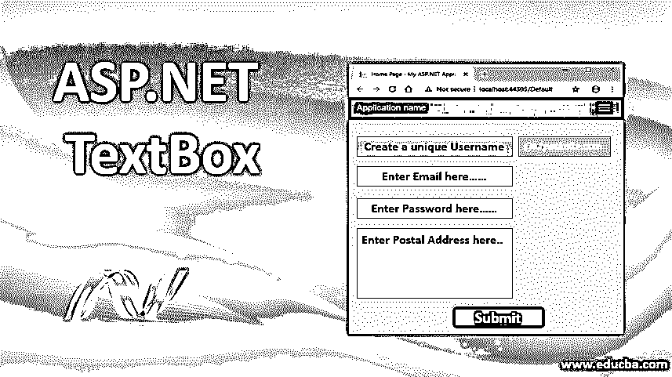
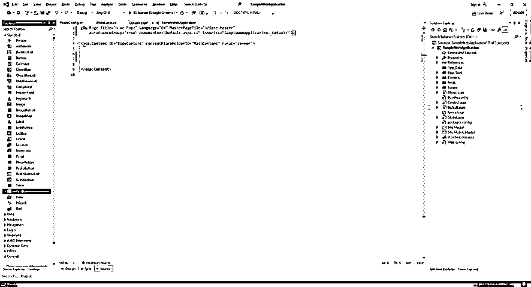
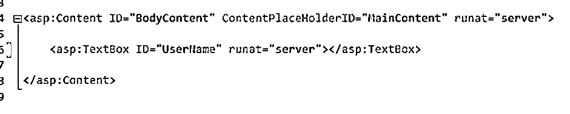
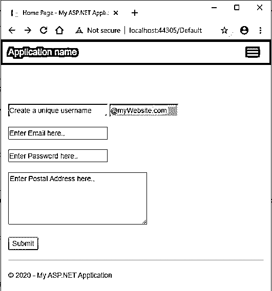
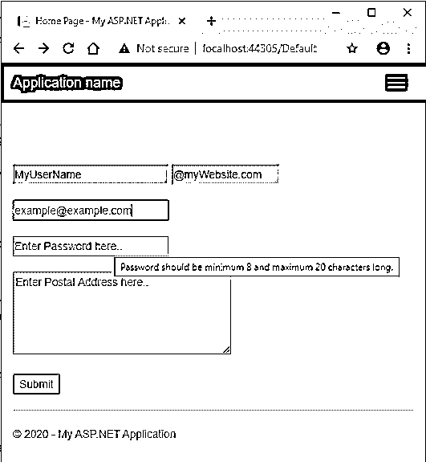
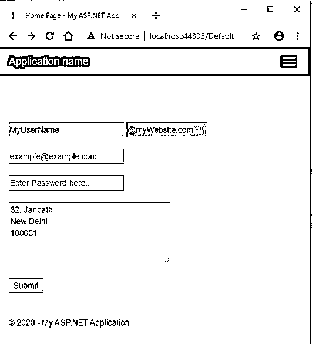

# ASP.NET TextBox

> 原文：<https://www.educba.com/asp-dot-net-textbox/>




## ASP.NET 简介文本框

TextBox 服务器控件是一个简单的框，它接受用户的一些输入文本。为什么我要使用服务器这个术语？因为像所有其他服务器控件一样，[ASP.NET 为运行在服务器上的文本框控件提供了自己的标签](https://www.educba.com/asp-dot-net-label/),生成的 HTML 代码作为响应返回给浏览器。

因此，从 HTML 的角度来看，TextBox 控件生成 HTML 文本输入元素。它让用户输入一些文本并对其执行所需的操作。

<small>网页开发、编程语言、软件测试&其他</small>

**语法:**

可以使用 ASP.Net 提供的标记对 TextBox 控件进行编码，也可以使用 Visual Studio IDE 对其进行拖放。拖放功能最终会生成相同的代码。ASP.Net 文本框的语法最简单的形式是:

```
<asp:TextBox ID="<textBoxId>" runat="server" ></asp:TextBox>
```

### 在幕后

幕后发生了什么？当你从浏览器发送一个 ASP.Net 页面的请求时，服务器找到合适的代码，ASP.Net 引擎开始编译它。当 ASP.Net 编译器遇到任何标记为在服务器上运行的 ASP 标记时，它会将该标记转换为本机 HTML 代码。然后，生成的 HTML 代码在响应中被发送到浏览器。

例如，ASP.Net 文本框控件编码如下:

```
<asp:TextBox ID="myTextBox" runat="server" ></asp:TextBox>
```

服务器在以下 HTML 控件中将它呈现给浏览器:

```
<input name="myTextBox" id="myTextBox" type="text">
```

### ASP.NET 文本框的属性

ASP.Net 文本框控件带有许多预定义的属性。这些属性被转换为本机 HTML 代码中的属性。它们帮助定义 TextBox 控件的附加行为。让我们详细讨论一些常用的:

#### 1.背景色，前景色

此属性获取或设置文本框的背景色和前景色。

```
<asp:TextBox ID="myTextBox" BackColor="DarkBlue" ForeColor="White" runat="server" ></asp:TextBox>
```

#### 2\. BorderColor, BorderStyle and BorderWidth

这些属性获取或设置文本框控件的边框样式。

```
<asp:TextBox ID="myTextBox" BorderWidth="5" BorderColor="Blue" BorderStyle="dashed" runat="server" ></asp:TextBox>
```

#### 3.绑定容器

该控件获取对文本框绑定控件的引用。此绑定控件保存数据绑定到控件的信息。

#### 4.行，列

这些属性获取或设置以字符数表示的文本框的高度和宽度。

```
<asp:TextBox ID="myTextBox" Rows="5" Columns="20" runat="server" ></asp:TextBox>
```

#### 5.CssClass

此属性获取或设置要应用于控件的 CSS 类。

```
<asp:TextBox ID="myTextBox" CssClass="txtBxClass" runat="server" ></asp:TextBox>
```

#### 6.使能够

此属性获取或设置指示文本框控件是启用还是禁用的值。默认值为 true。

```
<asp:TextBox ID="myTextBox" Enabled="false" runat="server" ></asp:TextBox>
```

#### 7.高度、宽度

这些属性以像素为单位获取或设置文本框的高度和宽度。

```
<asp:TextBox ID="myTextBox" Height="100" Width="500" runat="server" ></asp:TextBox>
```

#### 8.身份证明

此属性获取或设置文本框的唯一标识符属性。

```
<asp:TextBox ID="myTextBox" runat="server" ></asp:TextBox>
```

#### 9\. MaxLength

此属性获取或设置一个值，该值指示文本框中允许的最大字符数。

```
<asp:TextBox ID="myTextBox" MaxLength="10" runat="server" ></asp:TextBox>
```

#### 10.只读的

此属性指示用户是否可以更改文本框控件的值。默认值为 false。

```
<asp:TextBox ID="myTextBox" ReadOnly="true" runat="server" ></asp:TextBox>
```

#### 11.文本

此属性获取或设置文本框的文本内容(值)。

```
<asp:TextBox ID="myTextBox" Text="Enter text here.." runat="server" ></asp:TextBox>
```

#### 12.文本方式

该属性获取或设置输入文本的模式，如多行、密码等。

```
<asp:TextBox ID="myTextBox" TextMode="MultiLine" runat="server" ></asp:TextBox>
```

#### 13.工具提示

此属性获取或设置当鼠标指针悬停在文本框上时要显示的工具提示值。

```
<asp:TextBox ID="myTextBox" TextMode="Password" ToolTip="Password should be minimum 8 characters long." runat="server" ></asp:TextBox>
```

#### 14.看得见的

此属性确定文本框控件是显示在用户界面上还是隐藏。

```
<asp:TextBox ID="myTextBox" Visible="false" runat="server" ></asp:TextBox>
```

### ASP.NET 文本框示例

让我们创建一个带有各种文本框的 ASP.Net web form 来演示 ASP.Net 文本框及其属性的工作。

**步骤 1—**创建一个新的 ASP.Net web 应用程序项目。这将创建一个带有工作应用程序和默认 aspx 页面的 shell 模板。

**步骤 2-**转到 Default.aspx 文件，删除 shell 模板的内容，如下所示:




**第 3 步–**在 Visual Studio IDE 的工具箱窗格中，您会注意到一组准备好拖放到项目中的 Web 控件。找到 TextBox 控件并将其拖动到 Default.aspx 页中。


**步骤 4—**一旦你放下文本框控件，你会注意到在你的 Default.aspx 文件中自动生成的 ASP.Net 文本框标签。修改代码，如下所示。




或者，您可以跳过拖放部分，自己编写上面的代码。

**步骤 5-**将以下代码复制到 Default.aspx 文件中。

```
<%@ Page Title="Home Page" Language="C#" MasterPageFile="~/Site.Master"
AutoEventWireup="true" CodeBehind="Default.aspx.cs" Inherits="SampleWebApplication._Default" %>
<asp:Content ID="BodyContent" ContentPlaceHolderID="MainContent" runat="server">
<br /><br /><br /><br />
<asp:TextBox ID="UserName" placeholder="Create a unique username" BackColor="LightBlue"
ForeColor="DarkBlue" Width="200" runat="server"></asp:TextBox>
<asp:TextBox BackColor="LightGray" ReadOnly="true" Columns="15"
Text="@myWebsite.com" runat="server"></asp:TextBox>
<br /><br />
<asp:TextBox ID="Email" placeholder="Enter Email here.." Width="200" TextMode="Email" runat="server"></asp:TextBox>
<br /><br />
<asp:TextBox ID="Password" placeholder="Enter Password here.." Width="200" TextMode="Password" MaxLength="20"
ToolTip="Password should be minimum 8 and maximum 20 characters long." runat="server"></asp:TextBox>
<br /><br />
<asp:TextBox ID="Address" placeholder="Enter Postal Address here.." TextMode="MultiLine"
Rows="5" Columns="50" runat="server"></asp:TextBox>
<br /><br />
<asp:Button ID="Submit" runat="server" Text="Submit" />
</asp:Content>
```

**步骤 6—**运行应用程序。下面是代码的输出。它有 5 个文本框和一个按钮。各种文本框使用各种属性来修改行为。

用户名文本框有背景色和前景色。旁边是一个只读文本框。




“密码”文本框的“文本模式”属性设置为“密码”，并且有一个工具提示描述用户的期望值。它还将最大长度设置为 20，从而将用户输入限制为 20 个字符。




地址文本框是一个设置了行和列属性的多行文本框。




### 推荐文章

这是一个 ASP.NET 文本框指南。在这里，我们讨论了 ASP.NET 文本框的介绍和属性，以及语法和例子。您也可以阅读以下文章，了解更多信息——

1.  [ASP.NET 的单选按钮](https://www.educba.com/radio-button-in-asp-dot-net/)
2.  [ASP.NET 的 ImageButton](https://www.educba.com/imagebutton-in-asp-net/)
3.  [ASP.NET 检查列表](https://www.educba.com/asp-dot-net-checkbox-list/)
4.  [ASP.NET 按钮](https://www.educba.com/button-in-asp-net/)