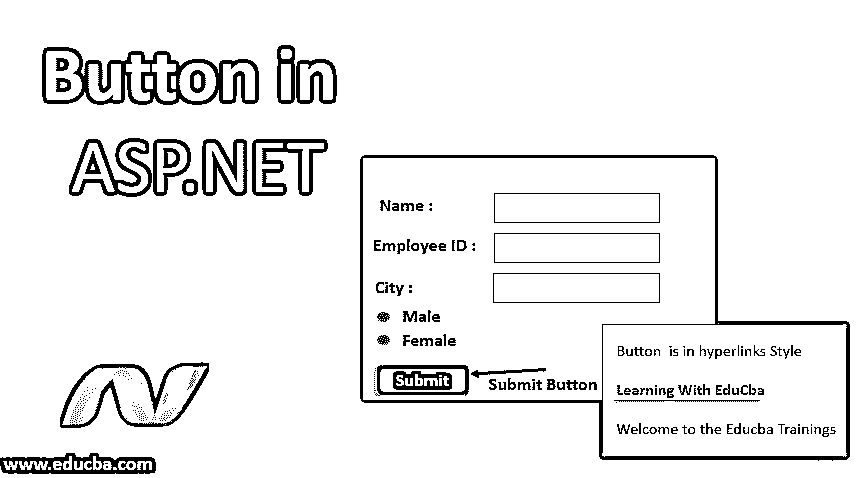
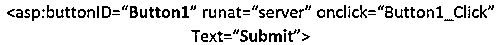
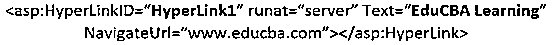
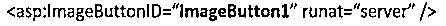
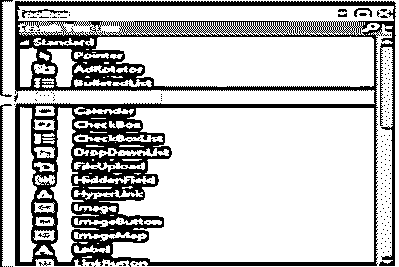
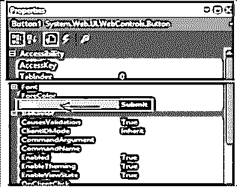
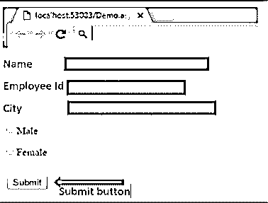
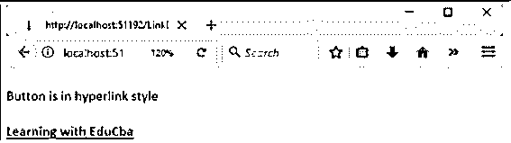
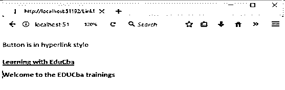

# ASP.NET 的巴顿

> 原文：<https://www.educba.com/button-in-asp-net/>




## ASP.NET 巴顿介绍

ASP 中的按钮。NET 是 ASP .NET 中的基本控件，通常用来显示一个普通的按钮。这个按钮可能是提交按钮，也可能是命令按钮。默认情况下，它的控件是一个提交按钮。它提供了三个基本的按钮控件。这种类型的控件基本上用于执行事件。它会将客户端请求提交给服务器。

下面是 ASP 中提供的三个按钮。网络:

<small>网页开发、编程语言、软件测试&其他</small>

*   **按钮:**这将在矩形区域内显示文本。
*   **链接按钮:**这将显示带有超链接的文本
*   **图像按钮:**该按钮将显示一幅图像。

当用户单击特定按钮时，会引发两个事件，一个是 Click 事件，另一个是 Command 事件。要创建按钮，我们可以编写代码，也可以使用 visual studio IDE 中的拖放功能。

**语法**

让我们看看按钮的基本语法。

**1。按钮控制**




**2。超链接按钮**




**3。图像按钮**




### 巴顿在 ASP.NET 是如何工作的？

让我们看看这个按钮在 ASP.NET 是如何工作的。

*   当我们从工具箱中拖放按钮控件时。在按钮上，我们看到标准按钮的文本，看起来像是一个按钮。
*   通过改变按钮控件的文本属性，我们可以改变按钮上的文本。就像我们希望按钮显示为“提交”一样。所以我们修改它的文本来提交。
*   只要我们单击按钮，就会生成一个事件处理程序。
*   现在假设我们需要写一条消息来响应点击按钮。我们将通过使用 Response.write(“单击按钮”)在事件处理程序内部进行编写。
*   当我们点击这个提交按钮时，将会出现一条消息，我们通过它来响应。

现在让我们看看超链接是如何工作的。它有自己的控件属性，即 ImageUrl、NavigateUrl、Text 和 Target。基本上，它将使用这些属性中的一个来设置网页上的超链接，该超链接将重定向到其目的地。目的地可以是图像或文本，也可以是另一页上的两者。

*   如果我们想在另一页或同一页的某一部分导航，就要使用超链接控件。
*   其主要且重要的属性是 **NavigateUrl**
*   NavigateUrl 属性存储目标网页的地址。
*   net 超链接控件用于通过其 NavigateUrl 属性将用户导航到 ASP.NET 中的另一页。
*   当用户点击给定的超链接时，它将直接被重定向到其目标页面。
*   我们可以设置 ImageUrl 和 Text 这两个属性。如果图像不可用，它将搜索要显示的文本。
*   如果我们为 ImageUrl 属性设置一个图像路径，它将在我们的 web 页面应用程序中显示我们想要的图像

### 在 Asp.Net 实现按钮的例子

让我们看一个“提交”按钮的例子。

#### 示例 1–提交按钮

我们将通过添加一个简单的按钮来实现它。此提交按钮用于点击并提交整个表单。

**步骤 1:** 从工具箱中，将 button 控件拖动到 Web 表单上，如下面突出显示的代码片段所示。




**第二步:**拖动按钮后，就会添加。现在我们需要通过点击按钮控件进入属性窗口。将控件按钮的 text 属性更改为 submit。另外，将其 ID 属性更改为“btnSubmit”。




**第三步:**一旦完成以上所有更改。我们将看到下面的输出。我们现在可以在表单的末尾看到 Submit 按钮。所以现在添加了按钮。




#### 示例 2–图像按钮

步骤 1: 通过在 visual studio 中打开一个新的 web 应用程序来创建它。

**第二步:**从工具箱中拖拽网页上的图片按钮，如上一节的按钮示例所示。

**第三步:**现在我们需要为控件上的显示图像设置 ImageButton 控件的 ImageUrl 属性。

第四步:之后，我们需要将 PostBackUrl 属性设置为它的目标网页名称，这样它将重定向到另一个页面。

**第五步:**为了在 image button 控件上写代码，我们需要去 Imagebutton 控件的 CLICK 事件。

#### 示例 3–链接按钮

下面是 LinkButton.aspx 的代码:

**代码:**

```
<%@ Page Language="C#" AutoEventWireup="true" CodeBehind="WebControls.aspx.cs"
Inherits="WebFormsControlls.WebControls" %>
<!DOCTYPE html>
<html >
<head runat="server">
<title></title>
</head>
<body>
<form id="form1" runat="server">
<div>
<p>Button is in hyperlink style<p>
<asp:LinkButton ID="LinkButton1" runat="server" OnClick="LinkButton1_Click">learning with EduCba </asp:LinkButton>
</div>
</form>
<br />
<asp:Label ID="Label1" runat="server"></asp:Label>
</body>
</html>
```

**内联代码:**它指的是在 ASP.NET 网页中编写的代码，其扩展名为. aspx。它允许使用<脚本>标签将代码与 HTML 源代码一起编写。无论何时部署网页，它都与 webform 页面一起部署。尤其是它的身体。aspx 文件。

**后面的代码:**

```
using System;
using System.Collections.Generic;
using System.Linq;
using System.Web;
using System.Web.UI;
using System.Web.UI.WebControls;
namespace WebFormsControlls
{
public partial class LinkButtonDemo: System.Web.UI.Page
{
protected void LinkButton1_Click(object sender, EventArgs e)
{
Label1.Text = "Welcome to the EDUCba online trainings”;
}
}
}
```

**对上述程序的解释:**这里，为了处理 LinkButton1 的 click 事件，我们有另一个扩展名为 aspx.cs 的文件，在这个类中写的任何代码都称为代码隐藏。这段代码被编译并以. aspx 文件的形式给出输出。对于每一个。aspx 页面，我们可以在。的 cs。vb 格式，因为所有的网页都被编译成 DLL。这允许网页在没有任何内嵌服务器代码的情况下被托管。

**输出:**

它将显示带有链接“通过 EduCba 学习”的文本。




点击链接按钮时，将显示消息“欢迎参加 EDUCba 培训”。




### 结论

到目前为止，我们已经在一个例子的帮助下学习了按钮及其工作原理。我们也有一些关于它的工作原理和语法的知识。我们可以说它用于允许用户点击一个按钮来开始处理表单。此外，这些 web 服务器控件也用于数据控件中。

### 推荐文章

这是去 ASP.NET 巴顿的指南。在这里，我们讨论在 ASP.NET 的按钮介绍，按钮如何与适当的语法和相应的例子一起工作。您也可以浏览我们的其他相关文章，了解更多信息——

1.  [在 ASP.NET 的职业生涯](https://www.educba.com/career-in-asp-dot-net/)
2.  [ASP.NET 服务器控件](https://www.educba.com/asp-dot-net-server-controls/)
3.  [ASP.NET 图像](https://www.educba.com/asp-dot-net-image/)