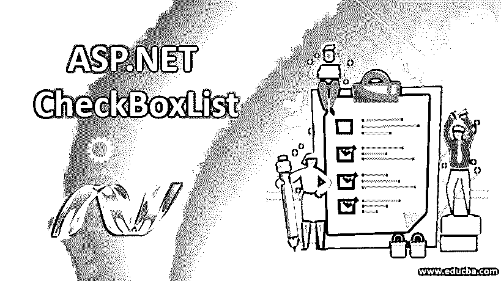
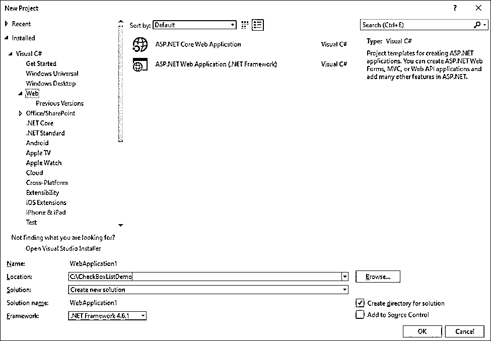
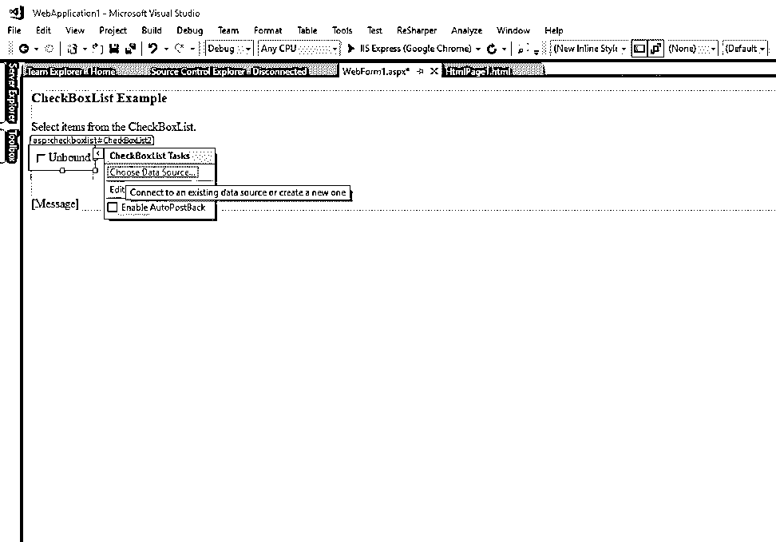
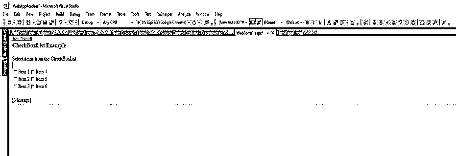
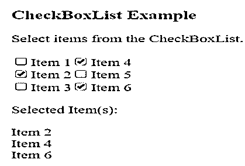

# ASP.NET 复选框列表

> 原文：<https://www.educba.com/asp-dot-net-checkbox-list/>




## ASP.NET 复选框列表介绍

CheckBoxList 类派生自 system . Web . ui . web controls . list controls 类。ASP.NET CheckBoxList 是一个 web 控件，可用于整理可检查的项，从而使用户能够同时选择多个项。可以使用数据绑定函数动态生成复选框列表中的项目列表。CheckBoxList 控件类实现了不同的接口，如 INamingContainer、IPostBackDataHandler、IRepeatInfoUser。

**语法:**

<small>网页开发、编程语言、软件测试&其他</small>

通过从 ASP.NET 工具栏窗口拖放控件，可以使用设计部分创建 checkboxlist，或者也可以使用下面的代码从标记部分创建 checkboxlist。

```
<asp:CheckBoxList id= "checkboxlist1" AutoPostBack = "True" TextAlign = "Right" OnSelectedIndexChanged = "CheckList_Clicked" runat= "server">
<asp:ListItem> Item 1 </asp:ListItem>
<asp:ListItem> Item 2 </asp:ListItem>
<asp:ListItem> Item 3 </asp:ListItem>
```

上面的代码将创建一个名为“checkboxlist1”的 checkboxlist，其中包含使用元素<listitem>创建的项目“Item1”、“Item2”和“item3”。这些项目包含列表中每个元素前面的复选框。</listitem>

### ASP.NET 复选框列表的属性

可以用不同的属性访问 checkboxlist 项。

*   **CellPadding:** 设置单元格内容之间的距离。
*   **RepeatedItemCount:** 显示列表中项目的总数。
*   **RepeatColumns:** 获取要在复选框列表中显示的列数
*   **RepeatDirection:** 该属性设置复选框列表中控件的垂直或水平显示方向。
*   **单元格间距:**用于设置复选框列表中两个单元格之间的距离。
*   **HasFooter:** 检查复选框列表是否有页脚部分。这是一个布尔属性，false 表示没有页脚部分。
*   **HasHeader:** 检查复选框列表是否有标题部分。这是一个布尔属性，false 表示没有标题部分。
*   **HasSeparators:** 检查复选框列表中的项目之间是否有分隔符。这是一个布尔属性，false 表示项目之间没有分隔符。
*   **RenderWhenDataEmpty:** 当数据源中没有数据时，该属性获取或设置条件的值。True 表示即使数据源中没有数据，控件仍会呈现。
*   **RepeatLayout:** 指定如何使用 table 元素、ul 元素或 span 元素来呈现列表。
*   **TextAlign:** 指定复选框中项目的文本对齐方式。
*   **Items:** 从列表中获取项目集合。
*   **AutoPostBack:** 如果设置为 true，当用户选择列表中的复选框时，将发生自动回发。

若要将 CheckBoxList 控件绑定到数据源，需要使用 DataControlObject 创建数据源，该数据源包含用于显示的项。创建此数据源后，使用 DataBind 方法将数据源绑定到 CheckBoxList 控件。“DataTextField”和“DataValueField”这两个不同的属性可用于指定数据源中的哪些字段分别绑定到 Text 和 Value 属性。

*   **DataTextField:** 指定数据源字段的名称，该字段绑定到 checkboxlist 项的文本。
*   **DataValueField:** 返回数据源字段的名称，该字段绑定到 checkboxlist 项的值。
*   **DataSource:** 指定填充 checkboxlist 框中项目的数据源。

### ASP.NET 复选框列表示例

1.打开 Visual Studio 2017 并创建一个空网站。给应用程序起一个名字，比如 CheckBoxList_Example。




2.向网站添加 Web 表单。转到解决方案资源管理器->添加->新项。从对话框中选择 Web 表单。将 web 表单命名为 CheckBoxList_Example.aspx


3.在 web 表单的设计部分，从屏幕左侧的工具栏中拖放一个复选框列表。智能箭头帮助用户将复选框列表绑定到数据源。此外，拖放三个标签，向我们的 web 表单添加有意义的消息，并显示选定的项目。




还可以为 web 表单的代码部分添加复选框列表，如下所示:

```
<asp:CheckBoxList id="checkboxlist1" AutoPostBack="True" CellPadding="5" CellSpacing="5" RepeatColumns="2" RepeatDirection="Vertical" RepeatLayout="Flow" TextAlign="Right" OnSelectedIndexChanged="Check_Clicked"  runat="server">
```

4.使用下面的代码向 checkboxlist 添加项目。

```
<asp:ListItem>Item 1</asp:ListItem>
<asp:ListItem>Item 2</asp:ListItem>
<asp:ListItem>Item 3</asp:ListItem>
<asp:ListItem>Item 4</asp:ListItem>
<asp:ListItem>Item 5</asp:ListItem>
<asp:ListItem>Item 6</asp:ListItem>
```

上述代码的设计如下所示:




5.在代码部分，编写以下代码来显示从 checkboxlist 中选择的项，如下所示:

```
void Check_Clicked (Object sender, EventArgs e)
{
Message.Text = "Selected Item(s):<br /><br />";
// Iterate through the Items collection of the CheckBoxList
// control and display the selected items.
for (int i=0; i<checkboxlist1.Items.Count; i++)
{
if (checkboxlist1.Items[i].Selected)
{Message.Text += checkboxlist1.Items[i].Text + "<br />";            }
}
}
```

程序的最终输出如下所示:




上面的代码创建了一个包含六个项目的 checkboxlist 通过勾选复选框选择这些项目后，所选项目将显示在下面的标签中。用于此复选框列表的重复方向是垂直的，重复布局设置为“流动”，这意味着项目将在相等部分垂直对齐。

CheckBoxList 也由构造函数组成。

```
CheckBoxList checkboxlistObject = new CheckBoxList ();
```

它创建 CheckBoxList 项的新实例。使用对象“checkboxlistObject”，可以从代码段创建新的列表；此外，可以类似地创建一组复选框。也可以使用代码手动注册事件。

```
checkboxlistObject.SelectedIndexChanged += new EventHandler (this.Check_Clicked);
```

### 结论

复选框列表是一个 web 控件，它通过在一个框中列出选项并提供同时检查多个元素的功能来简化任务。此外，在布局属性的帮助下，复选框列表中的项目可以根据用户的想象进行排列。该复选框列表也可以绑定到数据源，这意味着可以在运行时设置值。这个小功能被证明在许多情况下是有用的，因为它在网页上提供了更好的数据显示。

### 推荐文章

这是 ASP.NET 复选框列表指南。这里我们讨论 ASP.NET 复选框列表的语法和属性，以及不同的例子和代码实现。您也可以看看以下文章，了解更多信息–

1.  [ASP.Net 比较验证器](https://www.educba.com/asp-net-comparevalidator/)
2.  [ASP.NET 时段](https://www.educba.com/asp-dot-net-session/)
3.  [ASP.NET 图像](https://www.educba.com/asp-dot-net-image/)
4.  [ASP.NET 复选框](https://www.educba.com/asp-dot-net-checkbox/)