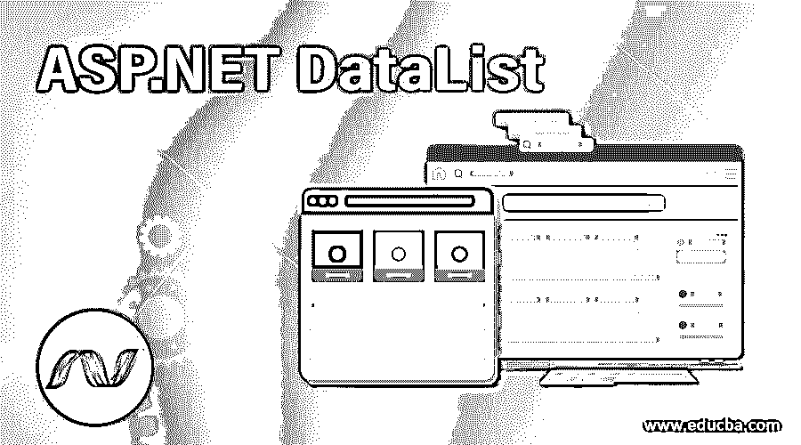
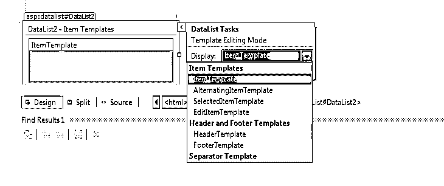
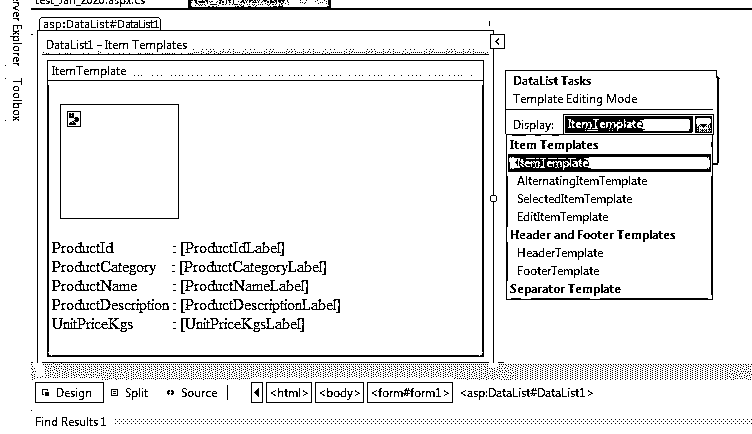
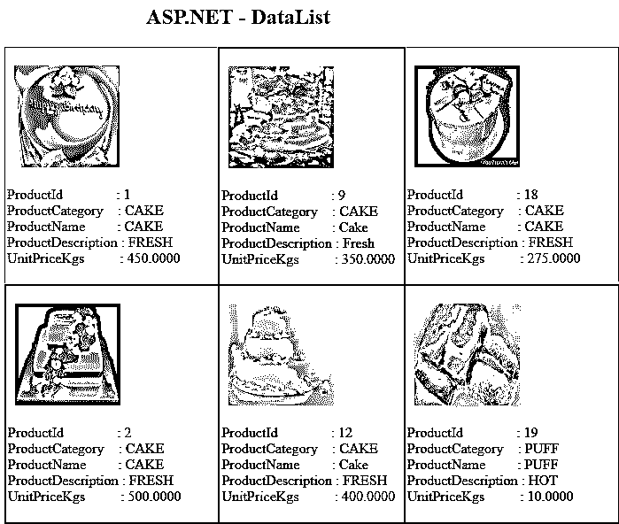
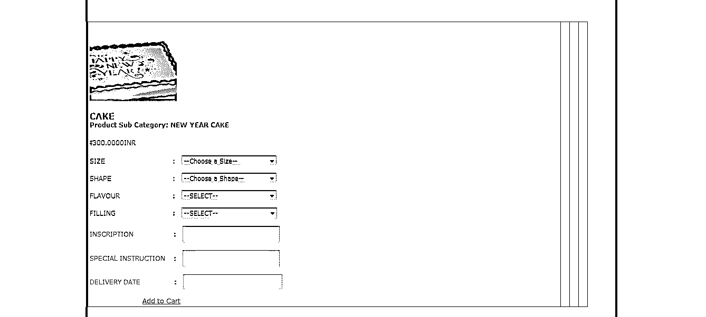

# ASP.NET 数据列表

> 原文：<https://www.educba.com/asp-dot-net-datalist/>




## ASP.NET 数据表简介

ASP.NET 数据列表是一个服务器端控件，它充当数据项的容器，显示来自数据源的数据，并以各种布局显示行，如将它们排列成行或列。

****语法:****

<small>网页开发、编程语言、软件测试&其他</small>

```
<html>
<body>
<form id="Form2" runat="server">
<asp:DataList id="DataList1" runat="server">

...

<ItemTemplate>
...
</ItemTemplate>

...

</asp:DataList>
</form>
</body>
</html>
```

### ASP.NET 数据列表中的模板字段

ASP.NET DataList 控件类似于一个 repeater 控件，用于显示绑定到控件的重复列表中的项目。它是一个轻量级控件，显示连续的信息，它是一个数据绑定控件，管理 web 应用程序中的数据。DataList 控件由其模板字段管理。




让我们看看支持的数据列表模板字段，如下所示:

*   ******item template:****它指定数据源中存在的元素，并在浏览器中呈现数据源集合中出现的尽可能多的行。**
***   ******header template:****表头元素的内容，用于向数据源集合显示表头文本。*****   ******footer template:****页脚元素的内容渲染一次，用于向数据源显示页脚文本。*****   ******EditItem 模板:****edit item 模板用于向用户授予编辑权限。*****   ******item style:****item style 用于给 ItemTemplate 添加样式。*****   ******edit style:****edit style 用于给 EditItemTemplate 添加样式*****   ******header style:****header style 用于给 HeaderTemplate 添加样式*****   ******footer style:****footer style 用于给 FooterTemplate 添加样式。****************

 ****对于构建数据库，您可以根据您的约束来跟踪它。在本文中，我将生成一个带有一些重复记录的临时表，用于表示数据列表控件。

#### 表格设计

*   ****表名:**** 产品主
*   ****用途:**** 可用产品详情
*   ****主键:**** 产品 Id

| ****字段编号**** | ****字段名**** | ****数据类型**** | ****描述**** |
| **1** | 产品 id | （同 Internationalorganizations）国际组织 | 自动生成的产品 Id，它是一个主键 |
| **2** | 产品类别 | varchar(50) | 产品的类别 |
| **3** | 产品名称 | varchar(50) | 产品名称 |
| **4** | 产品说明 | varchar(50) | 产品描述 |
| **5** | 单价 Kgs | 钱 | 产品成本(千克) |

### 实现 ASP.NET 数据列表的示例

下面是实现 ASP.NET 数据表的不同例子。

#### 示例#1

****设计师源代码:****

```
<%@ Page Language="C#" AutoEventWireup="true" CodeFile="Sample.cs" Inherits=" Sample " %>
<!DOCTYPE html>
<html >
<head id="Head1" runat="server">
<title>ASP.NET - DataList Control</title>
<style type="text/css">
.auto-style1
{
margin-left: 80px;
}
</style>
</head>
<body>
<form id="form1" runat="server">
<div class="auto-style1">
<h2 style="color:black; " class="auto-style1">ASP.NET - DataList</h2>
</div>
<asp:DataList ID="DataList1" runat="server" DataKeyField="ProductId" DataSourceID="SqlDataSource1" BackColor="LightGoldenrodYellow" BorderColor="Tan" BorderWidth="1px" CellPadding="2" Font-Names="Times New Roman" ForeColor="Black" RepeatColumns="3">
<AlternatingItemStyle BackColor="PaleGoldenrod" BorderWidth="2px" />


<ItemTemplate>
<br />
<asp:Image ID="Image1" runat="server" Height="115px" ImageUrl='<%# Eval("ProductImagePath") %>' Width="119px" />      <br />
<br />
ProductId:
<asp:Label ID="ProductIdLabel" runat="server" Text='<%# Eval("ProductId") %>' />
<br /> ProductCategory:
<asp:Label ID="ProductCategoryLabel" runat="server" Text='<%# Eval("ProductCategory") %>' />
<br />
ProductName:
<asp:Label ID="ProductNameLabel" runat="server" Text='<%# Eval("ProductName") %>' />
<br />
ProductDescription:
<asp:Label ID="ProductDescriptionLabel" runat="server" Text='<%# Eval("ProductDescription") %>' />
<br />
UnitPriceKgs:
<asp:Label ID="UnitPriceKgsLabel" runat="server" Text='<%# Eval("UnitPriceKgs") %>' />
<br />
<br />
</ItemTemplate>
<SelectedItemStyle BackColor="DarkSlateBlue" ForeColor="GhostWhite" />
</asp:DataList>
<asp:SqlDataSource ID="SqlDataSource1" runat="server" ConnectionString="<%$ ConnectionStrings:db %>" SelectCommand="SELECT [ProductId], [ProductCategory], [ProductName], [ProductDescription], [UnitPriceKgs], [ProductImagePath], [ProductImageName] FROM [ProductMaster]"></asp:SqlDataSource>
<p> </p>
</form>
</body>
</html>
```

**输出:**




我们也可以通过代码隐藏来做到这一点，让我们看看下面的代码示例。

****代码后面:****

```
using System;
using System.Collections.Generic;
using System.Linq;
using System.Web;
using System.Web.UI;
using System.Web.UI.WebControls;
using System.Data;
using System.Data.SqlClient;
public partial class Product : System.Web.UI.Page
{
protected void Page_Load(object sender, EventArgs e)
{
SqlConnection con = new SqlConnection("Data Source=test;Integrated Security=true;Initial Catalog=db");
con.Open();
SqlCommand cmd = new SqlCommand();
cmd.Connection = con;
cmd.CommandText = "select ProductId, ProductDescription ,ProductName,ProductCategory,ProductSubCategory,UnitPriceKgs from ProductMaster;
SqlDataAdapter da = new SqlDataAdapter(cmd);
DataSet ds = new DataSet();
da.Fill(ds, "ProductMaster");
DataList1.DataSource = ds.Tables["ProductMaster"];
DataList1.DataBind();
con.Close();
}
}
```

**输出:**




#### 实施例 2

在 ASP.NET 数据列表控件中，我们可以添加各种控件，这些控件有文本框、下拉列表、图像控件、超链接等等。让我们看看下面的例子

****设计师源代码:****

```
<%@ Page Language="C#" AutoEventWireup="true" CodeFile="Sample2.cs" Inherits=" Sample2 " %>
<!DOCTYPE html>
<html>
<head id="Head1" runat="server">
<title>ASP.NET - DataList Control</title>
<style type="text/css">
.auto-style1
{
margin-left: 80px;
}
</style>
</head>
<body>
<form id="form1" runat="server">
<div class="auto-style1">
<h2 style="color:black; " class="auto-style1">ASP.NET - DataList</h2>
</div>
<asp:DataList ID="DataList1" runat="server" BackColor="#DEBA84"
BorderColor="#DEBA84" BorderStyle="None" BorderWidth="1px" CellPadding="3"
CellSpacing="2" DataKeyField="ProductId" GridLines="Both" Height="428px"
RepeatColumns="4" Width="948px">


<ItemStyle BackColor="#FFF7E7" ForeColor="#8C4510" />
<ItemTemplate>
<a href='Shopping_Cart.aspx?cart_id=<%# Eval("ProductId") %>'>
<asp:Image ID="Image1" runat="server" Height="147px"
ImageUrl='<%# Eval("ProductImagePath") %>' Width="165px" />
<br />
</a>
<h4>
<asp:Label ID="lb" runat="server" Font-Bold="True" Font-Size="12pt"
Text='<%# Eval("ProductName") %>'></asp:Label>
<br />
Product Sub Category: <%# Eval("ProductSubCategory") %>
</h4>
<del>र</del><%# Eval("UnitPriceKgs")%>INR<br />
<br />
SIZE :
<asp:DropDownList ID="DropDownList3" runat="server" Height="17px" Width="180px">
<asp:ListItem>--Choose a Size--</asp:ListItem>
<asp:ListItem>Xsmall </asp:ListItem>
<asp:ListItem>Small</asp:ListItem>
<asp:ListItem>Medium</asp:ListItem>
<asp:ListItem>Large  </asp:ListItem>
<asp:ListItem>XLarge </asp:ListItem>
</asp:DropDownList>
<br />
<br />
SHAPE :
<asp:DropDownList ID="DropDownList4" runat="server" Height="17px" Width="180px">
<asp:ListItem>--Choose a Shape--</asp:ListItem>
<asp:ListItem>Round</asp:ListItem>
<asp:ListItem>Square</asp:ListItem>
<asp:ListItem>Heart</asp:ListItem>
<asp:ListItem>Hexagon</asp:ListItem>
<asp:ListItem>Oval</asp:ListItem>
<asp:ListItem>Rectangle</asp:ListItem>
<asp:ListItem>Petal</asp:ListItem>
</asp:DropDownList>
<br />
<br />
FLAVOUR :
<asp:DropDownList ID="DropDownList1" runat="server" Height="17px" Width="180px">
<asp:ListItem>--SELECT--</asp:ListItem>
<asp:ListItem>Chocolate & Vanilla</asp:ListItem>
<asp:ListItem>VENNILLA</asp:ListItem>
<asp:ListItem>STRAWBERRY</asp:ListItem>
<asp:ListItem>Vanilla & Strawberry</asp:ListItem>
<asp:ListItem>Chocolate & Coconut</asp:ListItem>
<asp:ListItem>White Chocolate</asp:ListItem>
<asp:ListItem>Light Fruit</asp:ListItem>
<asp:ListItem>Marble & Vanilla</asp:ListItem>
</asp:DropDownList>
<br />
<br />
FILLING :
<asp:DropDownList ID="DropDownList2" runat="server">
<asp:ListItem>--SELECT--</asp:ListItem>
<asp:ListItem>ButterCream</asp:ListItem>
<asp:ListItem>ButterCream & Coconut</asp:ListItem>
<asp:ListItem>ButterCream & Strawberry</asp:ListItem>
<asp:ListItem>Chocolate Fudge</asp:ListItem>
<asp:ListItem>Apricot Jam</asp:ListItem>
<asp:ListItem>Strawberry Jam & Coconut</asp:ListItem>
</asp:DropDownList>
<br />
<br />
INSCRIPTION :
<asp:TextBox ID="TextBox3" runat="server" Height="25px" Width="178px"></asp:TextBox>
<br />
<br />
SPECIAL INSTRUCTION :
<asp:TextBox ID="TextBox4" runat="server" Height="25px" Width="178px"></asp:TextBox>
<br />
<br />
DELIVERY DATE :
<asp:TextBox ID="TextBox2" runat="server" Height="22px" style="z-index: 1"
Width="182px"></asp:TextBox>
<br />
<br />
<a href='link_here=<%# Eval("ProductId") %>'>Add to Cart</a>
</ItemTemplate>
<SelectedItemStyle BackColor="#738A9C" Font-Bold="True" ForeColor="White" />
</asp:DataList>
</form>
</body>
</html>
```

**输出:**




****代码后面:****

```
public partial class SearchByProduct : System.Web.UI.Page
{
protected void Page_Load(object sender, EventArgs e)
{
SqlConnection con = new SqlConnection("Data Source=test;Integrated Security=true;Initial Catalog=db");
con.Open();
SqlCommand cmd = new SqlCommand();
cmd.Connection = con;
cmd.CommandText = "select ProductId, ProductDescription ,ProductName,ProductCategory,ProductSubCategory,UnitPriceKgs from ProductMaster where ProductName ='Cake'";
SqlDataAdapter da = new SqlDataAdapter(cmd);
DataSet ds = new DataSet();
da.Fill(ds, "ProductMaster");
DataList1.DataSource = ds.Tables["ProductMaster"];
DataList1.DataBind();
con.Close();
}
}
```

### 结论

在本文中，我们学习了 ASP.NET 数据列表控件如何使用它的各种模板，如上面的例子所示。我希望这篇文章能帮助你理解 ASP.NET 数据表的概念。

### 推荐文章

这是 ASP.NET 数据表的指南。在这里，我们讨论了 ASP.NET 数据表的基本概念和属性，以及示例和代码实现。您也可以阅读以下文章，了解更多信息——

1.  [ASP.NET 服务器控件](https://www.educba.com/asp-dot-net-server-controls/)
2.  [ASP.NET 标签](https://www.educba.com/asp-dot-net-label/)
3.  [ASP.NET 检查列表](https://www.educba.com/asp-dot-net-checkbox-list/)
4.  [ASP.NET 按钮](https://www.educba.com/button-in-asp-net/)****