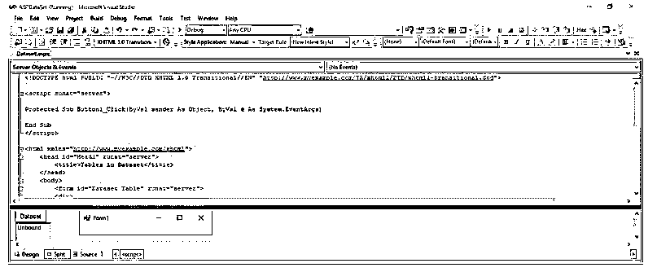
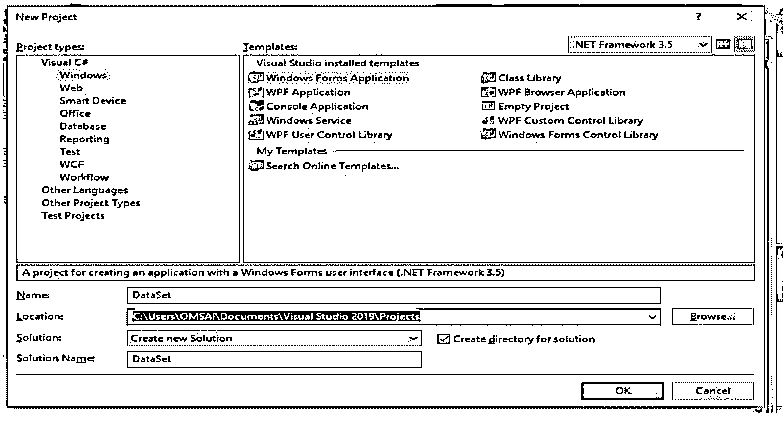
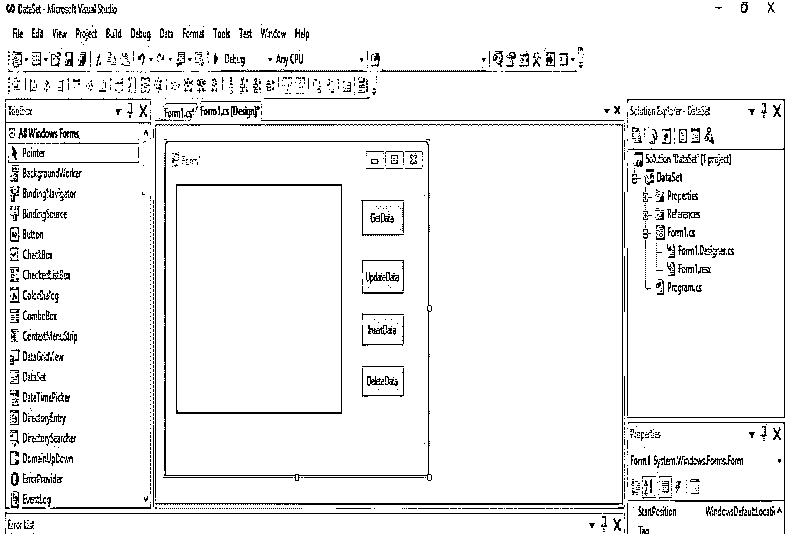
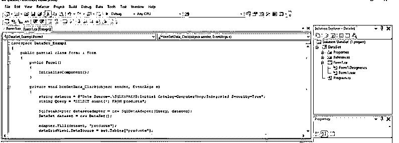
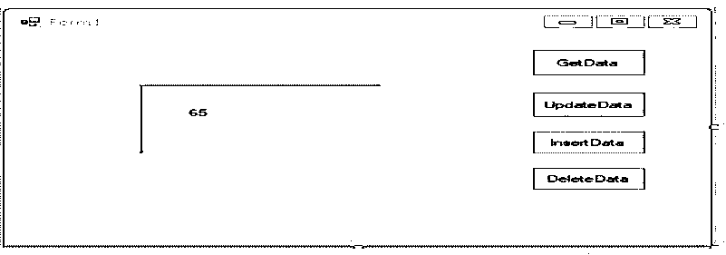

# ASP.NET 的数据集

> 原文：<https://www.educba.com/dataset-in-asp-dot-net/>

## ASP.NET 数据集简介

ASP.NET 的数据集提供与数据源断开的结果的表示，并且该结果与数据源完全分离。ASP.NET 数据集在不知道数据来源的情况下处理数据，数据集在处理数据结果集时提供了更大的灵活性。与数据读取器相比，ASP.NET 数据集具有更多优势，因为 ASP.NET 的数据读取器只处理面向连接的数据源。ASP.NET 中的数据集只不过是一个或多个包含数据库数据的数据表对象的容器。

### ASP.NET 的数据集是什么？

*   ASP.NET 中的数据集只不过是数据表中一个或多个对象的容器，这些对象包含从数据库中检索到的数据。
*   我们还可以在单个数据集中设置与数据表对象相关的数据。数据适配器对象允许将数据表填充到数据集中。我们还可以使用数据适配器填充方法来填充数据集中的数据。
*   ASP.NET 的数据集可以动态填充，也可以使用数据源填充。
*   ASP.NET 中的数据集包含列、主键、行、数据表对象关系和约束。
*   我们可以说，ASP.NET 是驻留在内存中的数据的代表，它提供了一个一致的关系编程模型。
*   我们还将数据集 sqladapter 类用于数据集的组合。ASP.NET 的 sqladapter 类允许我们在数据表中填充数据集。
*   ASP.NET 数据集是包含数据的数据表的集合。Dataset 用于获取数据，无需与任何数据源交互。
*   它只不过是内存中的数据存储，并且曾经拥有多个表。我们还可以使用 ASP.NET 数据集来读写 XML 文档中的数据。
*   ASP.NET 提供了用于创建数据集对象的数据集类。它还用于对方法和构造函数执行数据相关的操作。
*   在 ASP.NET，数据集代表数据库中内存的子集。这意味着 ASP.NET 只不过是一个表数据的集合，其中包含表格格式的关系数据。
*   ASP.NET 数据集需要一个持续活动且开放的数据库服务器连接。此外，我们可以说数据集是基于断开的架构。
*   我们可以从数据集中获取数据，而无需与任何其他数据源进行交互。

### 如何在 ASP.NET 使用数据集？

我们可以使用数据集作为 ASP.NET 的容器，它可以是包含我们从数据库中检索的数据的数据对象。数据集是访问数据的图层的一部分。

<small>网页开发、编程语言、软件测试&其他</small>

以下是显示如何在 ASP.NET 使用数据集的步骤。

*   设置并声明连接字符串
*   构建并声明连接字符串
*   创建 SQL 数据适配器对象
*   填写数据并创建数据集对象
*   将我们的数据集与 DataGridView 绑定

**1。设置连接字符串**

*   要在我们的应用程序中使用数据集，第一步是设置连接字符串。该任务将被声明并实例化与数据库的连接。
*   当我们访问数据库服务器时，我们需要一个连接字符串。我们使用 sql 连接类来连接 MSSQL server 数据库。

**2。构建并声明查询字符串**

*   在此步骤中声明的指定程序中使用的所有查询语句。

**3。创建 SQL 数据适配器对象**

*   数据适配器主要用于从数据库服务器检索数据。数据适配器只不过是介于断开部分和连接部分之间的连接器类。
*   基本上，数据适配器类是用新的构造函数实例化的。

**4。填充账户数据并创建数据集对象**

*   在这一步中，我们将在项目中声明数据集对象，我们将如下声明该对象:

aspDataSet =新数据集()

*   设置数据集和适配器后，我们必须填充数据集。填充方法数据适配器类用于刷新和填充数据集的对象。

**5。将数据集附加到 DataGridView**

*   在这一步中，我们对用于附加数据集的 DataGridView 控件使用 datasource 方法。

### 在 ASP.NET/行计数中查找表数据集

基本上，数据表集合包含数据表的一个或多个对象。数据表还包含数据表的零对象。基本上，SQL 数据适配器对象允许我们填充数据集中的表。我们还可以使用数据源和数据适配器来构建和填充数据集中的每个表数据。

在下面的例子中，我们从 dataset 对象中查找表的数量。

下面的 ASP.NET 代码用于从数据集对象中查找表的数量，如下所示:

**代码:**

`</script> -- End of script tags
<html > -- Start of html tag.
<head id="Head1" runat="server"> -- Start of head tag.
<title>Tables in Dataset</title> -- Start and end of title tag.
</head> -- End of head tags
<body> -- Start of body tags
<form id="Dataset Table" runat="server"> -- Start of form id tag.

 -- Start of div tags.
<asp:Button ID="Button1" runat="server" Text="Dataset" onclick="Button1_Click" />
  -- End of br tag.
<asp:ListBox ID="ListBox1" runat="server"></asp:ListBox>
  -- End of br tag.
<asp:Label ID="Label1" runat="server" Text="Table"></asp:Label>

 -- End of div tags
</form> -- End of form tags
</body> -- End of body tags
</html> -- End of html tags`

**输出:**

### ASP.NET 数据集示例

下面是提到的例子:

1.创建新项目。

名称–数据集

2.拖动数据网格视图。

3.提取数据。

在下面的例子中，我们检查产品表的计数。我们可以看到产品表计数是 65。

**代码:**

`private void btnGetData_Click(object sender, EventArgs e)
{
string datacon = @"Data Source=.\SQLEXPRESS;Initial Catalog=ComputerShop;Integrated Security=True";
string Query = "SELECT count(*) FROM products";
SqlDataAdapter datasetadapter = new SqlDataAdapter (Query, datacon);
DataSet dataset = new DataSet ();
adapter.Fill (dataset, "products");
dataGridView1.DataSource = set.Tables ["products"]; }`

**输出:**

### 结论——ASP.NET 的数据集

ASP.NET 的数据集可以动态填充，也可以使用数据源填充。ASP.NET 中的数据集包含列、主键、行、数据表对象关系和约束。ASP.NET 的数据集提供了来自数据源的断开连接的结果的表示。数据集在 ASP.NET 非常重要。

### 推荐文章

这是 ASP.NET 数据集指南。在这里我们讨论的介绍，使用，在 ASP.NET 查找表数据集/行计数和例子。您也可以看看以下文章，了解更多信息–

1.  [在 ASP.NET 验证](https://www.educba.com/validation-in-asp-net/)
2.  [ASP.NET 更新面板](https://www.educba.com/asp-dot-net-updatepanel/)
3.  [ASP.NET 视图状态](https://www.educba.com/asp-dot-net-viewstate/)
4.  [ASP.NET 正则表达式验证器](https://www.educba.com/asp-dot-net-regularexpressionvalidator/)