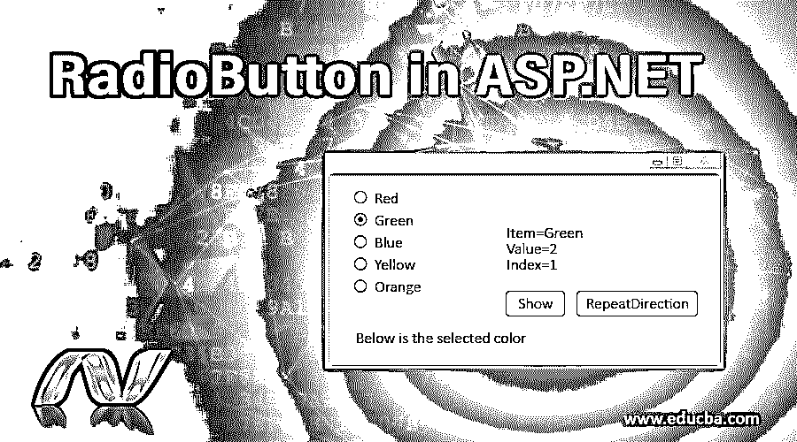
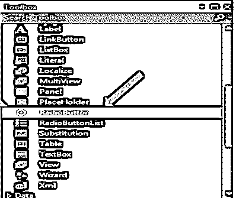
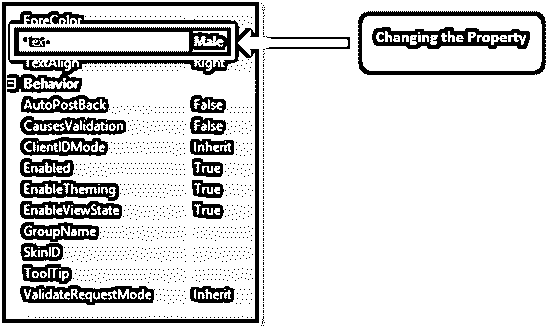
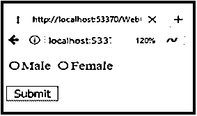
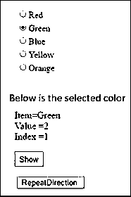

# ASP.NET 的单选按钮

> 原文：<https://www.educba.com/radio-button-in-asp-dot-net/>




## ASP.NET 单选按钮简介

在本文中，我们将讨论 ASP.NET 的 RadioButton。您可能在许多表单中看到过单选按钮，但却只能从许多选项中选择一个。我们可以说，在任何网站的任何通用表格或注册表格中，都有一个用于选择性别的单选按钮，一个用于男性，另一个用于女性。同样，ASP.NET 的 RadioButton 为我们提供了从众多选项中选择一个的功能，因此开发人员可以用它来创建网页。这是一个输入控件，通过它用户可以从多个选项中进行选择。

### 如何在 ASP.NET 创建一个单选按钮？

让我们举一个例子，看看如何借助图表和代码在 ASP.NET 创建一个 RadioButton。

<small>网页开发、编程语言、软件测试&其他</small>

**步骤 1:** 我们在 ASP.NET 有一个工具箱，所以首先我们需要从工具箱中拖动 web 表单中给定的“radiobutton”控件。我们可以根据需要选择并拖动单选按钮。假设我们正在创建三个选项，因此我们需要确保添加 3 个单选按钮。




我们可以看到上面代码片段中给出的箭头指向单选按钮。

**步骤 2:** 添加 Radiobutton 后，我们需要通过单击 Radiobutton 控件来更改“text”属性。我们希望为表单添加单选按钮，因此对于男性和女性单选按钮，我们需要将其文本属性更改为“男性”

**步骤 3:** 现在重复同样的操作，添加一个单选按钮作为“女性”。将相应控件的 ID 属性更改为 rdMale 和 rdFemale。




参考上面的片段可以更好的理解。

**步骤 4:** 完成所有这些更改后，我们可以看到下面的输出。

**输出:**

我们可以看到我们的网页有两个单选按钮，一个是“男性”，另一个是“女性”。




同样，我们可以根据需要创建许多单选按钮，并将它们添加到我们的网页中。

### ASP.NET 的单选按钮示例

ASP.NET 单选按钮用于允许用户选择多个选项中的任何一个。让我们来看一个简单的程序，它有一个单选按钮，用于从各种颜色的列表中选择颜色。

**代码:**

```
using System;
using System.Web.UI.WebControls;
public partial class ListControls : System.Web.UI.Page
{
protected void Page_Load(object sender, EventArgs e)
{
}
protected void Button1_Click(object sender, EventArgs e)
{
Label1.Text = "Below is the selected color </br> Item=" +
RadioButtonList_New.SelectedItem.Text + "</br> Value =" +
RadioButtonList_New.SelectedValue       + "</br> Index =" +
RadioButtonList_New.SelectedIndex ;
}
protected void Button2_Click(object sender, EventArgs e)
{
if (RadioButtonList_New.RepeatDirection == RepeatDirection.Vertical)
{
RadioButtonList_New.RepeatDirection = RepeatDirection.Horizontal;
}
else
{
RadioButtonList_New.RepeatDirection = RepeatDirection.Vertical;
}
}
}
```

*   使用属性窗口，我们可以通过项目集合在 RadioButtonList 中添加项目，以拥有多个单选按钮。
*   RepeatDirection 用于单选按钮的排列。根据我们的应用要求，我们可以将它布置成垂直和水平的方式。
*   所以现在我们想给单选按钮添加值。RadioButtonList_New 包含不同的颜色值。
*   下面是除单选按钮之外的不同颜色的代码。

**代码:**

```
<asp:RadioButtonList ID="RadioButtonList_New" runat="server">
<asp:ListItem Value="1">Red</asp:ListItem>
<asp:ListItem Value="2">Green</asp:ListItem>
<asp:ListItem Value="3">Blue</asp:ListItem>
<asp:ListItem Value="4">Yellow</asp:ListItem>
<asp:ListItem Value="5">Orange</asp:ListItem>
</asp:RadioButtonList>
```

**输出:**




*   假设现在我们希望颜色的单选按钮是水平的。因此，我们可以简单地更改代码如下。

    ```
    RadioButtonList_New.RepeatDirction=RepeatDirection.Horizontal;
    ```

*   我们可以看到有一个 RepeatDirection 选项卡，它将单选按钮的布局从垂直改为水平。


*   默认情况下，默认列的值为零，根据应用程序的要求，我们可以更改该默认值。
*   让我们看看如果我们改变这个默认值，它会是什么样子。假设您想将默认值设置为 3，那么下面是相同的输出。
*   正如我们所看到的，它需要 3 个单选按钮，因为默认值已经设置为 3。


布局会受到 RadioButtonList 控件支持的重要属性的影响。

**RepeatColumns** :显示单选按钮的列数。

**RepeatDirection** :用于决定单选按钮的方向，即应该水平还是垂直。默认情况下，方向设置为垂直。

**RepeatLayout** :用于确定 HTML 表格中的单选按钮。

它接受四个值，即 Table、flow、tableorderedlist 和 unorderedlist。让我们来看看这四个值是什么意思，以及如何使用它。

1.  **Table** :如果我们选择表格，那么单选按钮的输出将以表格的形式出现。
2.  **Flow** :如果我们选择了 Flow，它将不会获取单选按钮的表格，而是原样显示单选按钮。
3.  **UnorderedList** :用圆点表示只支持垂直布局。单选按钮前面会有项目符号。
4.  **OrderedList** :它会在单选按钮中显示数字而不是项目符号。

**NOTE:** We can use these two OrderedList and UnorderedList only when the layout is set to vertical. Otherwise, it will show an error when we try to use it.

单选按钮控件有两种不同的语法，一种用于 Radio Button 控件，另一种用于 RadioButtonList。

**单选按钮控件的语法:**

```
<asp:RadioButton ID="Radio1"runat="server"></asp:RadioButton>
```

**单选按钮列表的语法:**

```
<asp:RadioButtonList ID="RadioButtonList1"runat="server" AutoPostBack="True"
OnSelectedldexChanged="RadioButton1_SelectedlndexChanged></asp:RadioButtonList>
```

**单选按钮控件的重要属性:**

让我们看看单选按钮控件的一些重要属性

*   **Text:** 用于添加单选按钮控件的文本。
*   **项:**单个单选按钮被添加到控件中。
*   **RepeatColumns:** 值重复使用的列数。
*   **TextAlign:** 用于控件的 text 属性的正确对齐。
*   **选中:**用于判断用户到底点击了什么，根据点击事件返回真或假。

### 结论

因此，我们可以说它是 ASP.NET 框架提供的一种工具，用于从多个选项中选择单个选项，即单选按钮。我们已经学习了如何在 ASP.NET 使用一个非常简单的程序实现不同颜色的单选按钮。

### 推荐文章

这是一个在 ASP.NET 的单选按钮指南。在这里，我们讨论了介绍和如何在 ASP.NET 创建一个单选按钮，以及不同的例子和代码实现。您也可以看看以下文章，了解更多信息–

1.  [ASP.Net 的数据绑定](https://www.educba.com/data-binding-in-asp-net/)
2.  [ASP.NET 链接按钮](https://www.educba.com/asp-dot-net-linkbutton/)
3.  [ASP.NET 的 ImageButton？](https://www.educba.com/imagebutton-in-asp-net/)
4.  [ASP.NET 按钮](https://www.educba.com/button-in-asp-net/)