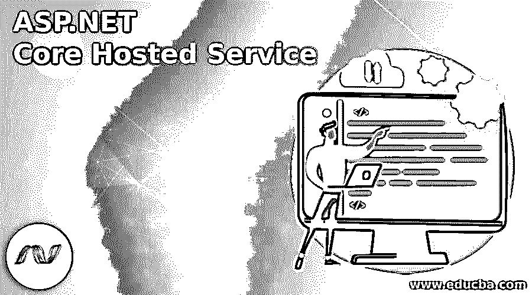
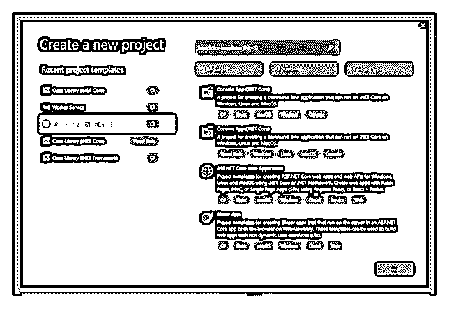
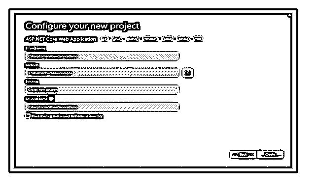
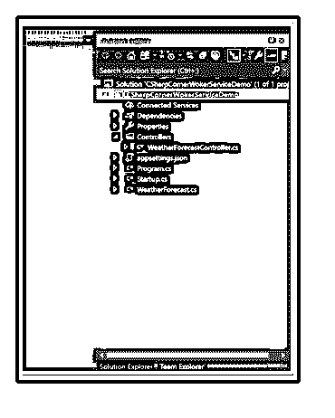
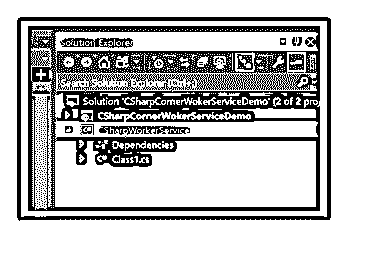
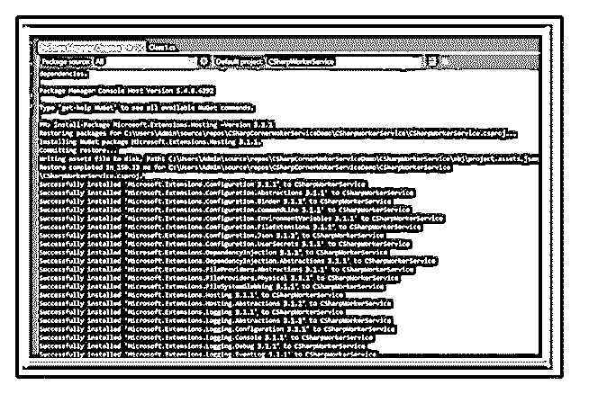
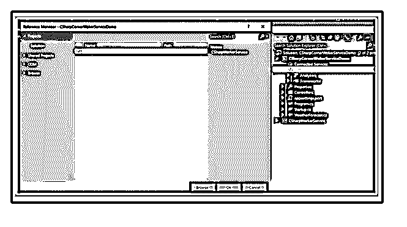
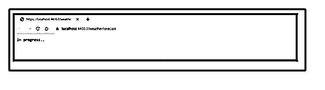
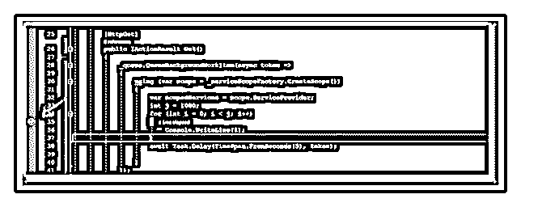

# ASP.NET 核心托管服务

> 原文：<https://www.educba.com/asp-dot-net-core-hosted-service/>

## ASP.NET 核心托管服务简介

ASP.NET 核心托管服务是实现 IHostedService 接口的后台逻辑任务、作为托管服务实现的后台任务以及在计时器上执行的任务的类。这个托管服务被激活为作用域服务，它使用依赖注入(DI)。IHostedService 接口提供了在 web 应用程序中正确启动后台任务的最佳方法。

### 什么是 ASP.NET 核心托管服务？

ASP.NET 核心托管服务定义了开发者团队的日常后台任务。在这个类中，后台逻辑任务实现 IHostedService 接口，后台任务作为托管服务实现。对于后台任务的执行，我们不需要任何像 NuGet 这样的包；它将在 ASP.NET 核心基础设施中提供。要知道后台任务在 ASP.NET 核心中有两种实现方式，他们使用 IHostedService 作为接口，使用 BackgroundService 类和 IHostedService。

<small>网页开发、编程语言、软件测试&其他</small>

它由两个方法组成:StartAsync (CancellationToken)和 stop async(cancellation token)。StartAsync 是一个触发器，一旦应用程序主机准备好启动，它就启动服务；它由启动后台任务逻辑组成。在流程请求管道配置(启动)之前调用 StartAsync。Configured)，它启动服务器并触发 iapplicationlifetime . application started .应用程序主机正在执行关机过程；它会触发 StopAsync。IHostedService 接口为在 Web 应用程序中启动后台任务提供了一个更好的方法。

### 如何使用托管服务？

*   要托管服务，我们需要遵循它们是什么，
*   使用 BackgroundService 构建 Windows 服务
*   创建队列服务。
*   在 Windows 服务中承载核心。由 ASP.NET 核心上的服务托管的后台任务。
*   使用 IHostedService 和 BackgroundService 类在微服务中实现后台任务。此外，要实现接口 IHostedService。

### 创建 ASP.NET 核心托管服务

要创建新的 ASP.NET 核心托管服务，只需点击文件并选择新建，然后在 Visual Studio (VS)中选择合适的项目模板

然后只需点击“下一步”来创建并给项目起一个合适的名字，

然后，它创建项目和项目结构；如下图所示，

完成上述过程后，我们必须为项目创建类库，右键单击解决方案资源管理器，并包含托管服务的新类库，然后项目结构如下所示。

之后，通过运行如下所示的命令从 NuGet 包安装托管服务，

### 安装包微软。扩展。托管-版本 3.1.2

我们需要在 NuGet 包管理器控制台的类库项目中给出。在控制台上执行/运行该命令后，如下所示

要添加一个接口作为“IBackgroundTaskQueue”，右键单击类库项目。要添加新类，只需右键单击并包含名为“BackgroundTaskQueue”的类，以继承接口“IBackgroundTaskQueue”要构建两个方法作为请求的入队和出队，如下所示，

线程安全类是并发队列，用于读写队列中的各种请求，它提供了数据结构 FIFO。当同时获得各种请求时，它会放置队列并逐步处理它们。

### 实施 ASP.NET 核心托管服务

为了设置线程的数量，我们需要使用 SemaphoreSlim 来并发运行。让我们看一个例子，如果我们设置为 2，如果我们在一个队列中有 5 个请求，它将并行拾取 2 个。

`public class BackgroundTaskQueue : IBackgroundTaskQueue
{
private ConcurrentQueue<Func<CancellationToken, Task>> _workItems =
new ConcurrentQueue<Func<CancellationToken, Task>>();
private SemaphoreSlim _signal = new SemaphoreSlim(0);
public void QueueBackgroundWorkItem(
Func<CancellationToken, Task> workItem)
{
if (workItem == null)
{
throw new ArgumentNullException(nameof(workItem));
}
_workItems.Enqueue(workItem);
_signal.Release();
}
public async Task<Func<CancellationToken, Task>> DequeueAsync(
CancellationToken cancellationToken)
{
await _signal.WaitAsync(cancellationToken);
_workItems.TryDequeue(out var workItem);
return workItem;
}
}`

为了在接口中包含方法声明，接口看起来如下所示。

`public interface IBackgroundTaskQueue
{
void QueueBackgroundWorkItem(Func<CancellationToken, Task> workItem);
Task<Func<CancellationToken, Task>> DequeueAsync(
CancellationToken cancellationToken);
}`

要添加名为“QueuedHostedService”的新类，只需右键单击并包含，然后从微软继承“BackgroundService”。扩展。托管

`public class QueuedHostedService : BackgroundService
{
private readonly ILogger _logger;
public QueuedHostedService(IBackgroundTaskQueue taskQueue,
ILoggerFactory loggerFactory)
{
TaskQueue = taskQueue;
_logger = loggerFactory.CreateLogger<QueuedHostedService>();
}
public IBackgroundTaskQueue TaskQueue { get; }
protected async override Task ExecuteAsync(
CancellationToken cancellationToken)
{
_logger.LogInformation("Queued Hosted Service is starting.");
while (!cancellationToken.IsCancellationRequested)
{
var workItem = await TaskQueue.DequeueAsync(cancellationToken);
try
{
await workItem(cancellationToken);
}
catch (Exception ex)
{
_logger.LogError(ex,
"Error occurred executing {WorkItem}.", nameof(workItem));
}
}
_logger.LogInformation("Queued Hosted Service is stopping.");
}
}`

一旦完成类库，然后调用它来使用它，

### BackgroundService 是一个基类

要调用 core Web API 中的 backgroundservice(这是一种基本情况),要调用 Core Web API 中的后台服务，请右键单击 Web 项目中的依赖项，将类库引用添加到解决方案中，如下所示。

在 Startup.cs 文件中，插入以下依赖项，

*   AddHostService<queuedhostservice>()；</queuedhostservice>
*   add singleton<ibackgroundtaskqueue backgroundtaskqueue="">()；</ibackgroundtaskqueue>

完成后，转到控制器类注入“IBackgroundTaskQueue ”,然后调用名为“QueueBackgroundWorkItem”的方法，如下所示。

使用微软的 IServiceScopeFactory 接口。主要的事情是，当 API 返回它的响应时，整个服务，包括 DB 上下文，被处理掉，再次构建 IServiceScopeFactory。

`public class WeatherForecastController : ControllerBase
{
public IBackgroundTaskQueue _queue { get; }
private readonly IServiceScopeFactory _serviceScopeFactory;
public WeatherForecastController(IBackgroundTaskQueue queue, IServiceScopeFactory serviceScopeFactory)
{
_queue = queue;
_serviceScopeFactory = serviceScopeFactory;
}
[HttpGet] public IActionResult Get()
{
_queue.QueueBackgroundWorkItem(async token =>
{
using (var scope = _serviceScopeFactory.CreateScope())
{
var scopedServices = scope.ServiceProvider;
int j = 1000;
for (int i = 0; i < j; i++)
{
Console.WriteLine(i);
}
await Task.Delay(TimeSpan.FromSeconds(5), token);
}
});
return Ok("In progress..");
}
}`

一旦完成这个 API，我们将得到“进行中”的响应然后后台任务调用并继续执行代码中创建的循环，

API 返回一条消息&后台服务开始运行。

### 推荐文章

这是 ASP.NET 核心托管服务指南。这里我们讨论如何在核心应用程序中构建服务，以及如何调用后台服务。您也可以看看以下文章，了解更多信息–

1.  [ASP.NET 安全](https://www.educba.com/asp-dot-net-security/)
2.  [ASP.NET 国家管理](https://www.educba.com/asp-dot-net-state-management/)
3.  [ASP.NET 更新面板](https://www.educba.com/asp-dot-net-updatepanel/)
4.  [ASP.NET 认证](https://www.educba.com/authentication-in-asp-dot-net/)