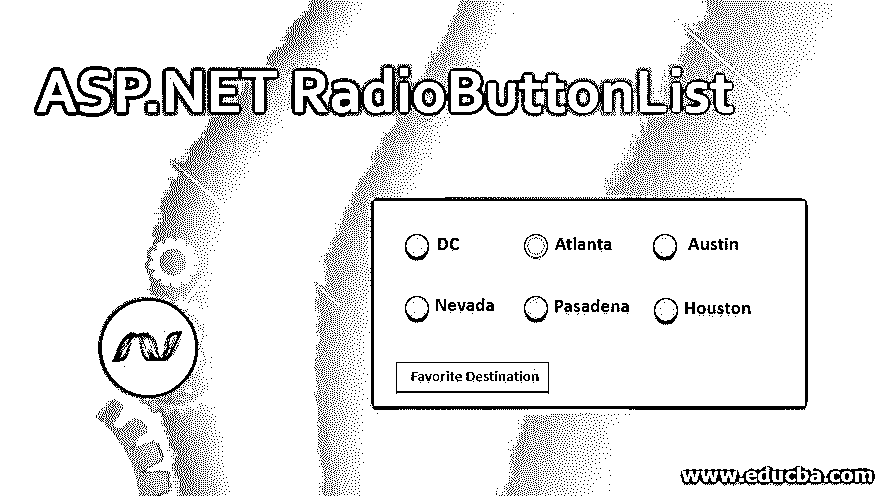
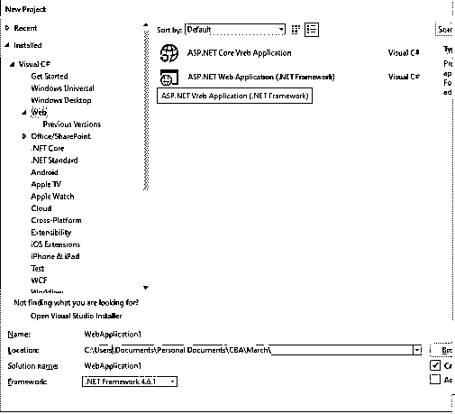
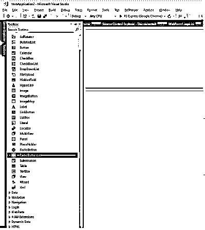
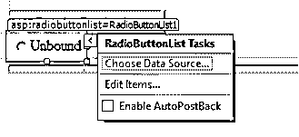
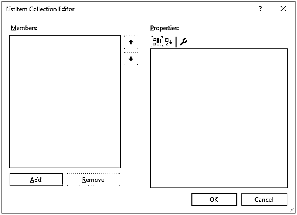
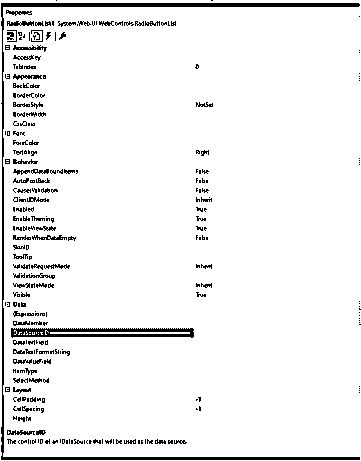
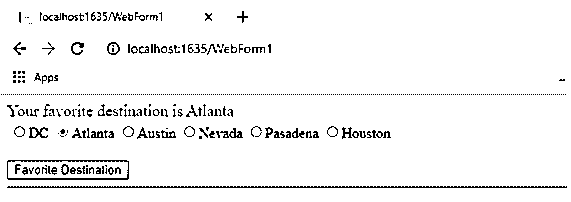

# ASP.NET 单选按钮列表

> 原文：<https://www.educba.com/asp-dot-net-radiobuttonlist/>




## ASP.NET 单选按钮列表介绍

RadioButton List 类派生自对单选按钮控件进行分组的 Web 控件类。这极大地帮助了程序员，因为它提供了一个单选按钮组。这个组也可以在数据绑定的帮助下动态生成。在这个主题中，我们将学习 ASP.NET 单选按钮列表。

### 句法

```
<asp:RadioButtonList  AppendDataBoundItems="True|False" AutoPostBack="True|False"  CssClass="string"  DataMember="string"  DataSource="string" DataSourceID="string"  DataTextField="string"   DataTextFormatString="string"  DataValueField="string"  ID="string"  OnDataBinding="Databinding event handler" OnDataBound="Data Bound event handler"  OnSelectedIndexChanged="SelectedIndexChanged event handler"  OnTextChanged="Text Changed event handler"  RepeatColumns="integer"  RepeatDirection="Horizontal|Vertical"  RepeatLayout="Table|Flow|OrderedList|UnorderedList"  runat="server"  SelectedIndex="integer"  SelectedValue="string"   Visible="True|False"  Width="size" >
<asp:ListItem Enabled="True|False" Selected="True|False" Text="string" Value="string" />
</asp: RadioButtonList>
```

典型的单选按钮列表如下所示

<small>网页开发、编程语言、软件测试&其他</small>

```
<asp:RadioButtonList  ID="rblRadioButtonListExample"  AppendDataBoundItems="True" AutoPostBack="True" DataMember="ABC"  DataSource="test" DataSourceID="dbTest"  DataTextField="Name"   DataTextFormatString="Bold"  DataValueField="txtName"  OnDataBinding=" BtnSubmit_Click" OnDataBound=" BtnSubmit_Click"  OnSelectedIndexChanged="TxtID_LostFocus"  OnTextChanged="txtID_TextChanged"  RepeatColumns="1"  RepeatDirection="Horizontal "  RepeatLayout="Table "  runat="server" Visible="true"  Width="30" >
<asp:ListItem Enabled="True" Selected="True" Text="Name" Value="CBA" />
</asp:RadioButtonList>
```

ASP.NET 单选按钮列表写在标签 <asp: radiobuttonlist="">中。单选按钮列表中的 ID 属性很重要，因为控件是通过程序使用该属性来访问的，此处 ID 属性的值为“rblRadioButtonListExample”，因此单选按钮列表将在源代码以及使用该值的代码中被访问。在上面的代码中，AutoPostBack 属性被设置为 true，这表明只要列表中的任何一项被选中，页面就会被回发。为了将数据库中的数据绑定到列表，使用了以单词“Data…”开头的属性。数据绑定过程可以使用 OnDataBinding 事件绑定到事件处理程序，此处使用 BtnSubmit_Click 事件，这意味着单击“提交”按钮时，DataSourceID 属性中指定的数据源将绑定到单选按钮列表，并使用 DataMember、DataTextField、DataValueField 属性适当地映射到字段。重复方向属性以垂直或水平格式对齐列表中的项目。</asp:>

使用标签添加单选按钮列表中的项目。列表项的 value 属性将包含将在网页上显示的实际值。selected 属性如果设置为 true，将在呈现页面时显示默认选中的项目。可以通过单击列表中的任何其他项目来更改此选择。

### ASP.NET 单选按钮列表的属性

下面是 ASP.NET 单选按钮列表的属性

*   #### AppendDataBoundItems

表示一个值，该值显示在数据绑定前是否应清除单选按钮中的项。

*   #### automatic postback

表示当列表中的选择发生更改时，是否发生到服务器的回发。

*   #### CssClass

可以在此处指定级联样式表，该样式表由客户端上的 web 服务器控件呈现。

*   #### data source

此属性指定控件的 ID，RadioButton 列表一旦相互绑定，将从该控件接收数据。

*   #### Data text field

Text Field 属性指定将绑定到列表中 RadioButton 的字段的文本。

*   #### 数据文本格式字符串

指定绑定到单选按钮控件的数据的显示格式。

*   #### Data value field

指定使用绑定属性绑定的字段的实际值。

*   #### OnSelectedIndexChanged

此方法从列表控件继承而来，它引发单选按钮控件的 SelectedIndexChanged 事件。

*   #### repeat layout

重复布局帮助我们指定列表将如何呈现，是使用元素还是

元素。

*   #### Visible

它是布尔属性，如果设置为 true，单选按钮列表将显示在客户端，如果设置为 false，控件将隐藏。

*   #### Duplicate column

指定呈现控件时要在列表中显示的列数。

*   #### Repeat direction

指定控件是水平显示还是垂直显示。

*   #### Project

返回列表中出现的项目集合。

### ASP.NET 单选按钮列表的示例

1.打开 Visual Studio 2017 ->文件->新建->项目->选择 ASP.NET Web 应用




2.选择 Web 表单，因为我们正在演示一个简单的单选按钮列表示例


3.单选按钮列表可以添加到。使用以下代码创建网页的 aspx 部分

```
<%@ Page Language="C#" AutoEventWireup="true" CodeBehind="WebForm1.aspx.cs" Inherits="WebApplication2.WebForm1" %>
<!DOCTYPE html>
<html >
<head runat="server">
<title></title>
</head>
<body>
<form id="form1" runat="server">
<div>
<asp: Label ID="lblResult" runat="server" Font-Size="Large" ForeColor="Crimson"></asp: Label>
<asp: RadioButtonList ID="rblLocations" runat="server" RepeatDirection="Horizontal">
<asp: ListItem>DC</asp: ListItem>
<asp: ListItem>Atlanta</asp: ListItem>
<asp: ListItem>Austin</asp: ListItem>
<asp: ListItem>Nevada</asp: ListItem>
<asp: ListItem>Pasadena</asp: ListItem>
<asp: ListItem>Houston</asp: ListItem>
</asp: RadioButtonList>
<div>
</form>
</body>
</html>
```

重复方向属性设置为水平，列表中的元素将以水平方式显示。

4.单选按钮列表也可以从。通过从工具箱中拖放 RadioButton 列表选项来创建




5.在拖放控件时，ASP.NET 提供了在第一步绑定数据源的选项。




该步骤还提供了在单选按钮列表中插入列表项的选项




单击“选择数据源”选项，将显示一个交互式窗口，该窗口提供了通过创建数据源连接到数据库的选项，还提供了选择数据字段的选项，这些数据字段将在单选按钮列表的项目集合中显示为文本和值字段。

6.单选按钮列表的属性也可以通过声明的方式从页面设计器部分的“属性”窗口添加。




7.添加完列表及其项目后，添加一个按钮来显示选定的项目。

```
<br />
<asp:Button ID="BtnSubmit" runat="server" Text="Favorite Destination" OnClick="BtnSubmit_Click" />
<hr />
```

8.按钮点击事件可以被写入。cs 部分如下。

```
protected void BtnSubmit_Click (object sender, EventArgs e)
{
lblResult.Text = "Your favorite destination is " + rblLocations.SelectedItem.ToString();
}
}
```

9.最终的输出看起来像这样




### 结论

单选按钮的 AutoPostBack 属性是其他控件的标准属性，但 SelectedIndexChanged 是控件中最常见的属性，它会在列表中的项目被选中后立即回发。除了单选按钮列表的绑定属性，它还支持主题和皮肤。单选按钮列表也可以有 CSS 样式，为此它定义了一个 CssClass 属性，可以在创建单选按钮列表时引用该属性。该值可以指向任何需要进行样式设置的外部 CSS 文件。

### 推荐文章

这是 ASP.NET 单选按钮列表的指南。这里我们讨论 ASP.NET 单选按钮列表的例子以及语法和属性。您也可以看看以下文章，了解更多信息–

1.  [ASP.NET 数据网格](https://www.educba.com/asp-dot-net-datagrid/)
2.  [ASP.NET 日历](https://www.educba.com/calendar-in-asp-net/)
3.  [ASP.NET 下拉列表](https://www.educba.com/drop-down-list-in-asp-dot-net/)
4.  [ASP.NET 时段](https://www.educba.com/asp-dot-net-session/)