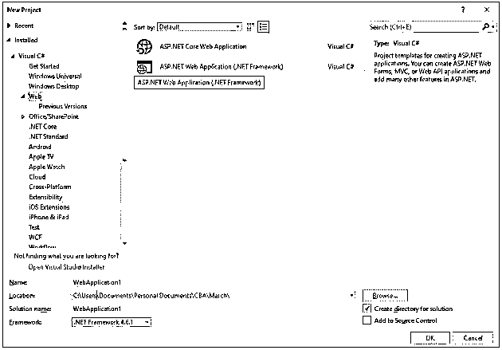
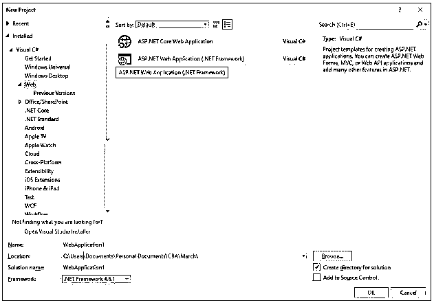
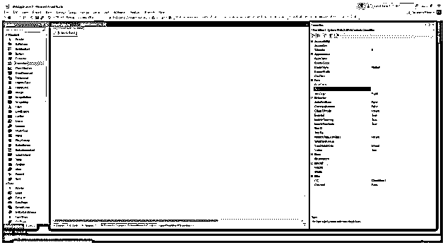
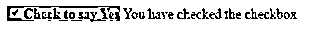

# ASP.NET 复选框

> 原文：<https://www.educba.com/asp-dot-net-checkbox/>

## ASP.NET 简介复选框

Checkbox 控件继承自 web controls 类，当需要从用户处获取多个输入时使用该类。它的控制复选框接受“真”或“假”形式的输入，可以转换成不同的原因。

**语法:**

<small>网页开发、编程语言、软件测试&其他</small>

`<asp:CheckBox    AccessKey="string"    AutoPostBack="True|False"    BackColor="color name|#dddddd"    BorderColor="color name|#dddddd"    BorderStyle="NotSet|None|Dotted|Dashed|Solid|Double|Groove|Ridge|        Inset|Outset"    BorderWidth="size"    CausesValidation="True|False"    Checked="True|False"    CssClass="string"    Enabled="True|False"    EnableTheming="True|False"    EnableViewState="True|False"    Font-Bold="True|False"    Font-Italic="True|False"    Font-Names="string"    Font-Overline="True|False"    Font-Size="string|Smaller|Larger|XX-Small|X-Small|Small|Medium|        Large|X-Large|XX-Large"    Font-Strikeout="True|False"    Font-Underline="True|False"   ForeColor="color name|#dddddd"    Height="size"    ID="string"    nCheckedChanged="CheckedChanged event handler"    OnDataBinding="DataBinding event handler"    OnDisposed="Disposed event handler"    OnInit="Init event handler"    OnLoad="Load event handler"    OnPreRender="PreRender event handler"    OnUnload="Unload event handler"    runat="server"    SkinID="string"    Style="string"    TabIndex="integer"    Text="string"    TextAlign="Left|Right"    ToolTip="string"    ValidationGroup="string"    Visible="True|False"    Width="size"/>`

**举例:**

上面的代码创建了一个 ID 为“chkbx_TestBox”的复选框按钮，其背景色为黄色。复选框按钮还可以绑定到数据库字段，将值转换为选中和未选中。OnDataBinding 事件将数据库字段绑定到复选框按钮。通过分别使用“checked”和“visible”属性，该按钮还可以默认呈现为选中状态以及可见或不可见状态。

### ASP.NET 的属性复选框

以下是 ASP.NET 复选框的属性:

*   **访问键:**访问键上设置的值有助于导航到其他 web 服务器控件。
*   **属性:**用于在网页上呈现复选框按钮控件的属性。
*   **AutoPostBack:** 该属性设置复选框是否自动回发到 web 服务器。
*   **BackColor:** 该属性设置控件的背景颜色。
*   **BorderColor:** 复选框控件的边框可以被赋予不同于背景色的颜色。
*   **Checked:** 该值设置或获取复选框是否默认呈现为选中状态
*   **Context:** 该属性获取当前 web 请求的 HttpContext 对象。
*   **Enabled:** 这个属性可以设置值或者返回已经设置好的值，这个值告诉复选框是否默认启用。
*   **Forecolor:** 该属性设置复选框按钮文本的字体颜色。
*   **Height:**Height 属性设置控件的高度。
*   **ID:** 借助 ID 属性中设置的值，它可以用来访问网页上任何位置的控件。
*   **Text:**Text 属性设置将与 checkbox 按钮控件一起显示的文本。
*   **Visible:** 该属性决定控件是否会呈现在网页上。
*   **Width:** 属性设置控件的宽度。

### ASP.NET 复选框的示例

以下是 ASP.NET 复选框的示例。

**1。**打开 Visual Studio 2017 - >文件- >新建- >项目- >选择 ASP.NET Web 应用

**2。**选择 Web 表单，因为我们正在演示一个简单的复选框按钮。

**3。**复选框按钮可以添加到。使用以下内容创建网页的 aspx 部分:

**代码:**

`<%@ Page Language="C#" AutoEventWireup="true" CodeBehind="Default.aspx.cs" Inherits="WebApplication2.Default" %>
<!DOCTYPE html>
<html >
<head runat="server">
<title></title>
</head>
<body>
<form id="form1" runat="server">

<asp:CheckBox ID="chkbx_ExampleBox" Text ="Check to say Yes" Checked ="false" BackColor="#33ccff" Font-Bold="true" runat="server" OnCheckedChanged="chkbx_ExampleBox_CheckedChanged" AutoPostBack="true"/>
<asp:Label ID="Label1" runat="server"></asp:Label>

</form>
</body>
</html>`

**4。**复选框控件也可以从。aspx 页，方法是从工具箱中拖放复选框按钮选项

**5。**复选框控件的属性可以在 ide 右侧的属性窗口中设置。

**6。**在复选框按钮的复选标记上显示文本的代码可以写成:

**代码:**

`using System;
using System.Collections.Generic;
using System.Linq;
using System.Web;
using System.Web.UI;
using System.Web.UI.WebControls;
namespace WebApplication2
{
public partial class Default : System.Web.UI.Page
{
protected void Page_Load(object sender, EventArgs e)
{
}
protected void chkbx_ExampleBox_CheckedChanged(object sender, EventArgs e)
{
if(chkbx_ExampleBox.Checked)
{
Label1.Text = "You have checked the checkbox";
}
else
{
Label1.Text = string.Empty;
}
}
}
}`

如果复选框按钮被选中，上面的代码将在标签控件中显示文本。OnCheckChanged 事件导致网页自动回发，然后控件进入“if”条件，检查复选框是否已选中。当复选框被选中时，控件进入 if 循环，在 web 控件的“Text”属性的帮助下,“您已选中复选框”的消息显示在网页上。如果用户取消选中该复选框，回发将再次发生，这一次控件进入“If”循环的“else”部分，并且“label”控件的“Text”属性被设置为空。

7 .**。**最终的输出将是这样的。

### 结论

checkbox 按钮的 AutoPostBack 属性是其他控件的标准属性，但 SelectedIndexChanged 是该控件中最常见的属性，它会在复选框被选中时导致立即回发。除了复选框按钮的绑定属性，它还支持主题和皮肤。checkbox 按钮也可以有 CSS 样式，为此它定义了一个 CssClass 属性，在创建 Checkbox 按钮时可以提到该属性。该值可以指向任何需要进行样式设置的外部 CSS 文件。复选框按钮提供了为用户选择多个选项的功能。

### 推荐文章

这是 ASP.NET 复选框的指南。在这里，我们讨论 ASP.NET 复选框及其高级属性的介绍，以及它的例子和代码实现。你也可以浏览我们推荐的其他文章来了解更多信息-

1.  [ASP.NET 图像](https://www.educba.com/asp-dot-net-image/)
2.  [ASP.NET 隐藏场](https://www.educba.com/asp-dot-net-hidden-field/)
3.  [ASPnet listbox〔t1〕网](https://www.educba.com/asp-dot-net-listbox/)
4.  [ASP.NET 的计时器](https://www.educba.com/timer-in-asp-dot-net/)