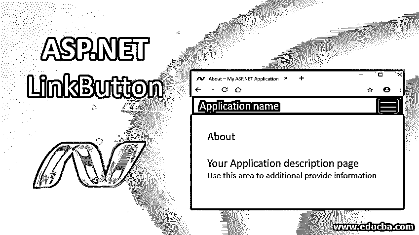
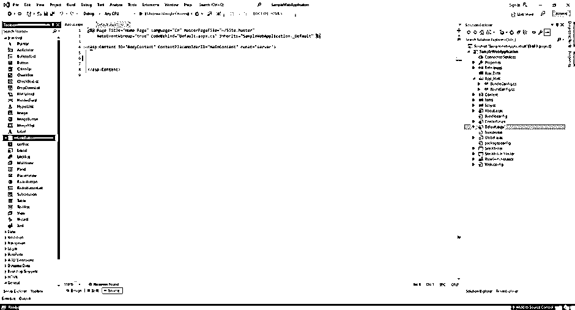
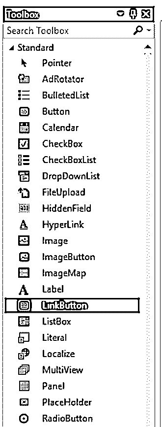
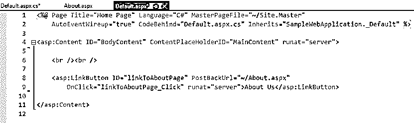
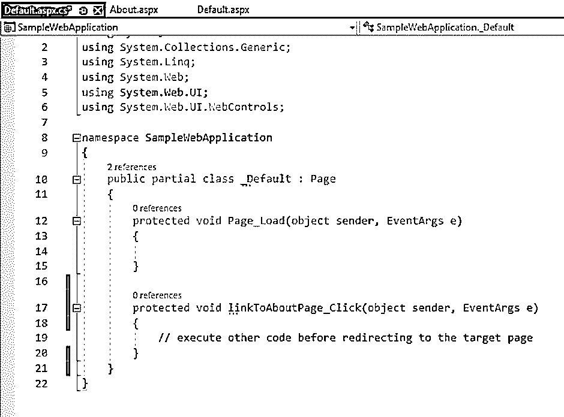
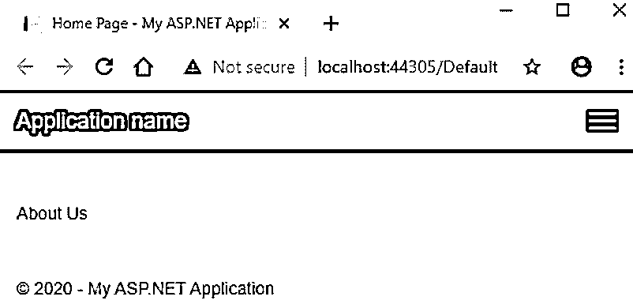
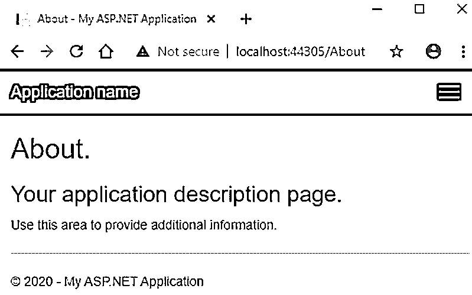

# ASP.NET 链接按钮

> 原文：<https://www.educba.com/asp-dot-net-linkbutton/>




## ASP.NET link button 简介

LinkButton 服务器控件在网页上显示超链接样式的按钮。为什么我要使用服务器控件这个术语？因为像所有其他服务器控件一样，[ASP.NET 为运行在服务器上的 LinkButton 控件提供了自己的标签](https://www.educba.com/asp-dot-net-label/)，生成的 HTML 代码作为响应返回给浏览器。

因此，从 HTML 的角度来看，LinkButton 控件生成 HTML 锚(超链接)元素。它允许用户导航到页面中的一个部分或另一个页面。LinkButton 控件看起来像网页上的超链接，其功能相当于一个按钮。这使它成为一个非常有用的控件。

<small>网页开发、编程语言、软件测试&其他</small>

**语法:**

LinkButton 控件可以使用 ASP.Net 提供的标记进行编码，也可以使用 Visual Studio IDE 进行拖放。拖放功能最终会生成相同的代码。

ASP.Net 链接按钮最简单的语法是:

```
<asp:LinkButton ID="<linkButtonId>" runat="server">DisplayText</asp:LinkButton>
```

### 在幕后

幕后发生了什么？当你从浏览器发送一个 ASP.Net 页面的请求时，服务器找到合适的代码，ASP.Net 引擎开始编译它。当 ASP.Net 编译器遇到任何标记为在服务器上运行的 ASP 标记时，它会将该标记转换为本机 HTML 代码。然后，生成的 HTML 代码在响应中被发送到浏览器。

例如，ASP.Net link button 控件编码为:

```
<asp:LinkButton ID="myLinkButton" PostBackUrl=”~/myWebPage.aspx” runat="server"> Click here! </asp:LinkButton>
```

服务器在以下 HTML 控件中将它呈现给浏览器:

```
<a id="myLinkButton" href="www.myWebSite.com/myWebPage.aspx"> Click here! </a>
```

**Note:** The above rendered HTML is simplified for illustration and better explanation. The actual rendered HTML is a bit complex as it contains the JavaScript postback method. Read below for more explanation.

### 链接按钮与超链接

现在你可能想知道 LinkButton 是一个多余的控件，因为 ASP.Net 已经有了一个非常简化的超链接控件来做同样的工作。你说对了一部分。尽管 LinkButton 和 HyperLink 控件都执行将用户从一个页面导航到另一个页面的相同任务，但两者之间有一个基本的区别。超链接控件立即将用户重定向到目标页面。没有对服务器的中间调用。都是浏览器处理的。

LinkButton 控件在将用户重定向到目标页之前对服务器进行回发调用。这个回发调用将带有目标 URL 和其他要处理的代码的表单发送到服务器。服务器处理这个回发请求，在其响应中，用户被重定向到目标页面。当您希望在导航到目标页面之前在服务器中执行一些代码时，这非常有用。

### ASP.NET 链接按钮的属性

ASP.Net link button 控件带有某些预定义的属性。这些属性被转换为本机 HTML 代码中的属性。它们帮助定义 LinkButton 控件的其他行为。让我们详细讨论一些常用的:

#### 1.背景色，前景色

该属性获取或设置链接按钮的背景色和前景色。

```
<asp:LinkButton ID="myLinkButton" BackColor="DarkBlue" ForeColor="White" runat="server" >Click here </asp:LinkButton>
```

#### 2\. BorderColor, BorderStyle and BorderWidth

这些属性获取或设置链接按钮控件的边框样式。

```
<asp:LinkButton ID="myLinkButton" BorderWidth="5" BorderColor="Blue" BorderStyle="dashed" runat="server" > Click here </asp:LinkButton>
```

#### 3.原因验证

此属性获取或设置一个值，该值指示单击链接按钮时是否必须执行验证。默认值为 true。

```
<asp:LinkButton ID="myLinkButton" CausesValidation="false" runat="server" > Click here </asp:LinkButton>
```

#### 4.CssClass

此属性获取或设置要应用于控件的 CSS 类。

```
<asp:LinkButton ID="myLinkButton" CssClass="txtBxClass" runat="server" > Click here </asp:LinkButton>
```

#### 5.使能够

此属性获取或设置指示是启用还是禁用链接按钮控件的值。默认值为 true。

```
<asp:LinkButton ID="myLinkButton" Enabled="false" runat="server" > Click here </asp:LinkButton>
```

#### 6.字体

此属性获取或设置链接按钮中显示的文本的字体。有许多样式和选项，如粗体、斜体、下划线、删除线等。

#### 7.高度、宽度

这些属性获取或设置链接按钮的高度和宽度，以像素为单位。

```
<asp:LinkButton ID="myLinkButton" Height="100" Width="500" runat="server" > Click here </asp:LinkButton>
```

#### 8.身份证明

此属性获取或设置链接按钮的唯一标识符属性。

```
<asp:LinkButton ID="myLinkButton" runat="server" > Click here </asp:LinkButton>
```

#### 9.PostBackUrl

此属性获取或设置从当前页导航到的页的 URL。

```
<asp:LinkButton ID="myLinkButton" PostBackUrl="~/mywebpage.aspx" runat="server" > Click here </asp:LinkButton>
```

#### 10.文本

此属性获取或设置链接按钮控件中显示的文本。

```
<asp:LinkButton ID="myLinkButton" Text="Click here" runat="server" > </asp:LinkButton>
```

#### 11.工具提示

此属性获取或设置当鼠标指针悬停在链接按钮上时要显示的工具提示值。

```
<asp:LinkButton ID="myLinkButton" ToolTip="Click here to go to my web page." runat="server" > Click here </asp:LinkButton>
```

#### 12.看得见的

此属性确定链接按钮控件将在用户界面上显示还是隐藏。默认值为 true。

```
<asp:LinkButton ID="myLinkButton" Visible="false" runat="server" > Click here </asp:LinkButton>
```

### ASP.NET 链接按钮示例

让我们创建一个带有链接按钮的 ASP.Net web form，以导航到同一网站上的另一个 ASP.Net 页面。

**第一步。**创建一个新的 ASP.Net[web 应用](https://www.educba.com/what-is-web-application/)项目。这将使用带有 Default.aspx 和 About.aspx 页面的工作应用程序创建一个 shell 模板。

**第二步。**转到 Default.aspx 文件，删除 shell 模板的内容，如下所示:




**第三步。**在 Visual Studio IDE 的工具箱窗格中，您会注意到一组 Web 控件准备好拖放到您的项目中。找到 LinkButton 控件并将其拖动到 Default.aspx 页中。




**第四步。**一旦放下 LinkButton 控件，您会注意到 Default.aspx 文件中自动生成的 ASP.Net link button 标记。修改代码，如下所示。




或者，您可以跳过拖放部分，自己编写上面的代码。

```
<asp:LinkButton ID="linkToAboutPage" PostBackUrl="~/About.aspx" OnClick="linkToAboutPage_Click" runat="server">About Us</asp:LinkButton>
```

**第五步。**将以下代码复制到 Default.aspx.cs 文件中。

```
protected void linkToAboutPage_Click(object sender, EventArgs e)
{
// execute code before redirecting to the target page
}
```




**第六步。**运行应用。下面是代码的输出。它有一个链接按钮，可以重定向到应用程序的 About.aspx 页面。

代码隐藏文件有一个 OnClick()函数。您可以编写要在导航到目标页面之前执行的代码。




单击该链接，您将被重定向到 About.aspx 页面。




### 推荐文章

这是一个 ASP.NET 链接按钮指南。这里我们讨论 ASP.NET 链接按钮的介绍和属性，以及链接按钮和超链接之间的区别。您也可以阅读以下文章，了解更多信息——

1.  [ASP.NET 的单选按钮](https://www.educba.com/radio-button-in-asp-dot-net/)
2.  [ASP.NET 的缓存](https://www.educba.com/caching-in-asp-dot-net/)
3.  [ASP.NET 的 ImageButton？](https://www.educba.com/imagebutton-in-asp-net/)