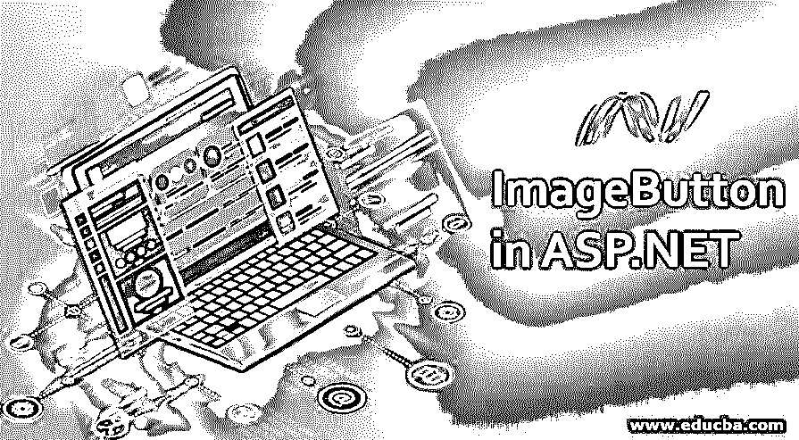
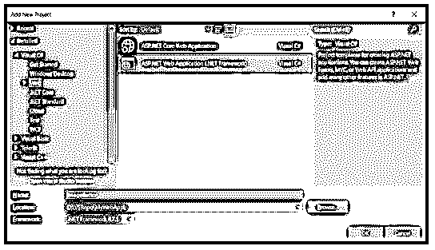
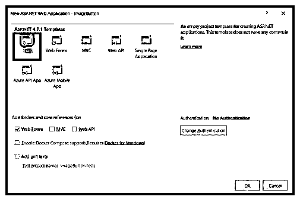
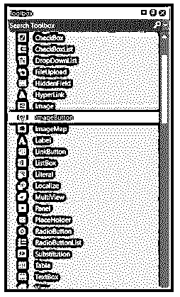
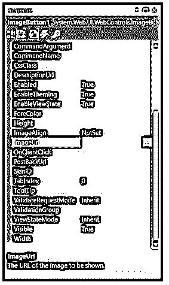
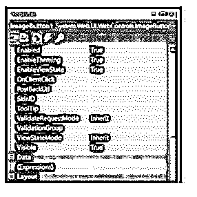
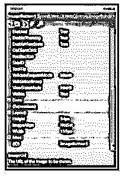
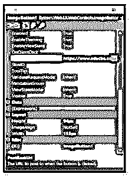
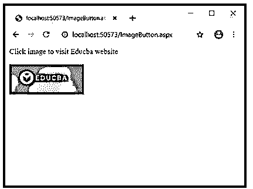
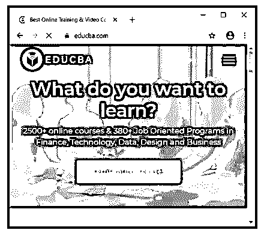

# ASP.NET 的 ImageButton

> 原文：<https://www.educba.com/imagebutton-in-asp-net/>




## **ASP.NET**ImageButton 简介

ASP.Net 的 ImageButton 控件用于按钮的形成，通过它我们可以使用图像。它就像一个上面有图像的按钮。一般来说，我们已经看到了网站上的图片，点击后，某些活动执行。所以，在这种情况下，我们需要使用 ImageButton 控件。它用于在客户端或服务器端单击 ImageButton 后触发事件。我们可以在按钮上设置我们想要的图像。我们一点击，这个图像按钮就会对鼠标点击做出反应。当我们单击图像按钮控件时，它会引发 click 事件和 command 事件。

**语法:**

<small>网页开发、编程语言、软件测试&其他</small>

```
<asp:ImageButton ID="ImageButton_new" runat="server" />
```

### 如何在 ASP.NET 创建 ImageButton？

让我们看看如何在 ASP.Net 的网页上创建一个 ImageButton？

**步骤 1:** 打开 Visual Studio，新建一个空的 web 应用。




**步骤 2:** 为图片按钮显示创建一个新的网页。




**步骤 3:** 现在，我们需要从工具箱中拖动 ImageButton 控件并将其放到网页上。




**第四步:**ImageButton 控件拖放后，我们需要设置 ImageButton 的 ImageUrl 属性。ImageUrl 用于提供 Url，以便它可以显示。尝试提供相关的网址，这将使它更容易。




**步骤 5:** 现在选择我们想要在 ASP.NET 的 ImageButton 控件上显示的图像。

**步骤 6:** 需要给 ImageButton 属性。因此，在项目中创建一个文件夹，并将其命名为 image。在这个文件夹中放置我们要设置为 ImageButton 的图像。

**步骤 7:** 要提供属性，请按 f4 或点击属性窗口并提供其属性。




**步骤 8** :从属性中提供图像的高度和宽度。我们可以在下面的代码片段中看到黄色突出显示的部分包含高度和宽度。




**步骤 9:** 设置 PostBackUrl 属性，使其被重定向到目标网页。我们已经提供了 www.educba.com 的网址，所以我们可以在下面的例子中使用它。




**第十步:**之后，我们需要在 ImageButton 上写代码。

### ASP.NET 的 ImageButton 示例

现在我们都知道如何通过上面的步骤创建一个图像按钮控件。让我们借助一个例子把它说得更清楚些。看下面的代码是用来显示图像按钮的。

**代码:**

```
ImageButton.aspx
<%@ Page Language="C#" AutoEventWireup="true" CodeBehind="ImageButton.aspx.cs" Inherits="MyCalendar.ImageButton" %>
<!DOCTYPE html>
<html >
<head runat="server">
<title></title>
<style type="text/css">
#form1 {
height: 118px;
}
</style>
</head>
<body>
<form id="form1" runat="server">
Click image to visit Educba website<div>
<br />
</div>
<asp:ImageButton ID="ImageButton1" runat="server" ImageUrl="~\Educba.png" Height="64px" Width="158px" Imagealign=“Left” PostBackUrl="https://www.educba.com/" />
</form>
</body>
</html>
```

**说明:**

上述脚本的输出将为我们提供图像，这是可点击的。我们已经在“ImageUrl”中提供了图像路径。它将在 ImageButton 上显示 educba.png 图像。

Imagealign 在代码中用于对我们提供的图像进行对齐。在我们的代码中，它是靠左对齐的，这就是为什么我们的图像会在网页的左侧。

Runat 用于设置服务器端控件，这就是它被设置为“server”的原因。PostbackUrl 用于设置我们点击图片按钮后的链接。在我们的例子中，它将打开 www.educba.com。

因此，当我们运行这个脚本时，我们将得到如下带有图像的输出:




现在，如果我们点击图像上的任何地方，它将被重定向到 educba 网站。




**ASP.Net 的 Imagebutton 具有下面列出的某些重要属性:**

*   **ID** :用于识别的唯一 ID。
*   **ImageUrl** :在图像 Url 的帮助下，我们可以为图像按钮控件上的图像设置图像路径。
*   **AlternateText** :如果图像没有显示在网页上，将显示 AlternateText。
*   **PostBackUrl** :当我们点击图片按钮时，它会重定向到另一个页面。PostBackUrl 是此页面的路径。
*   **OnClientClick** :它会编写 java 脚本，当图像被点击时，它会执行函数名。
*   **Runat:** 这个必须设置为“服务器”。它用于指定服务器端的控件。
*   **GenerateEmptyAlternateText:**空的时候会生成一个空字符串作为替代文本。

当我们单击网页的图像(图像按钮)时，将引发 click 和 Command 事件。如果我们希望 ImageButton 的行为像命令按钮一样，那么我们可以使用事件处理程序“OnCommand”。你们一定都有一个问题，如果我们想在一个应用程序的网页上放置多个图像按钮会怎么样。为此，我们有 CommandName 属性，通过它我们可以放置多个 ImageButton **。**默认情况下，CommandName 的值为零。

**命令名**的语法

```
[System.Web.UI.Themeable(false)] public string CommandName { get; set; }
```

你们中的任何人都想知道如何确定用户点击的时间和地点。ASP。NET 有一个事件处理程序，即 OnClick，它可以确定用户单击图像的确切位置。基于坐标值，我们可以对响应进行编码。我们需要特别注意，原点是(0，0)，它位于图像的左上角。

ASP.NET 代码中的代码隐藏运行在。NET 框架，它总是在服务器端。所以不管编译的是什么代码，我们想在代码后面写什么。cs 或者。vb 将在服务器端运行。

### 结论

所以，从 ImageButton 在 ASP.NET 的文章中，我们已经了解了 ImageButton 及其在 ASP.NET 的使用。我们看到了 ImageButton 的例子。在 ImageButton 控件的帮助下，我们可以在按钮上以良好的图形表示显示图像。我们可以借助图像的各种属性(如高度、宽度、左对齐或右对齐)来对齐图像。

### 推荐文章

这是 ASP.NET 的 ImageButton 指南。在这里我们讨论一下入门，如何在 ASP.NET 创建 ImageButton？并附有详细例子。您也可以看看以下文章，了解更多信息–

1.  [ASP.NET 链接按钮](https://www.educba.com/asp-dot-net-linkbutton/)
2.  [ASP.NET 按钮](https://www.educba.com/button-in-asp-net/)
3.  [ASP.NET 复选框](https://www.educba.com/asp-dot-net-checkbox/)
4.  [ASP.NET 隐藏场](https://www.educba.com/asp-dot-net-hidden-field/)