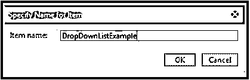
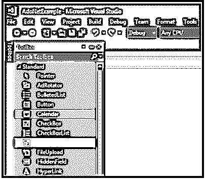
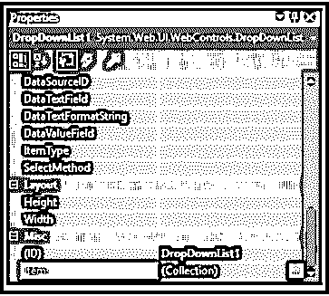
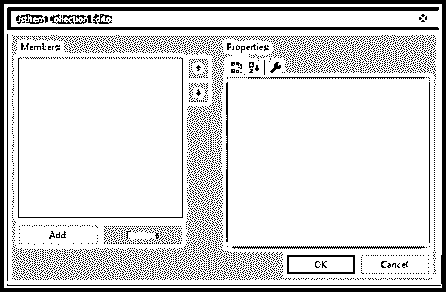
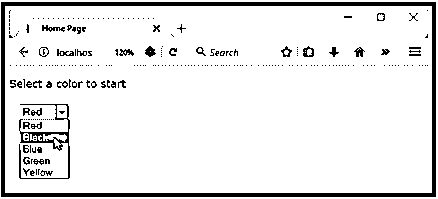
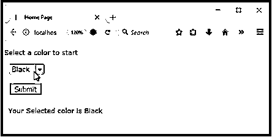

# ASP.NET 的下拉列表

> 原文：<https://www.educba.com/drop-down-list-in-asp-dot-net/>


## ASP.NET 下拉列表介绍

我们一定都见过各种各样的网页，这些网页都有包含各种选项的下拉菜单。它通常是一个带有选项的列表。大多数情况下，在注册表格中或在任何页面上签名时输入我们的详细信息，我们填写我们的详细信息，在那里我们可以看到带有国家、州、地区等的下拉列表。下拉列表控件通常由开发人员用来从下拉列表或列出的项目中的多个选项中选择一个选项。在这个主题中，我们将学习 ASP.NET 的下拉列表。它用于存储多个项目。下拉列表控件也称为组合框控件。

**语法**

<small>网页开发、编程语言、软件测试&其他</small>

```
<asp:DropDownList ID="Trainings" runat="server">
<asp:ListItem Enabled="true" Text= "Select Subject" Value= "-1"></asp:ListItem>
<asp:ListItem Text= "Science' Value="1"><asp:ListItem>
< asp:ListItem Text= "Politics" Value="2"><asp:ListItem>
</asp:DropDownList>
```

### ASP.NET 下拉列表的属性

让我们看看 ASP 中下拉列表的一些重要属性。网

*   **DropDownList1。Items.Count:** 用于提供下拉列表中选项或项目的总数。
*   **DropDownList1。Items.Add("ItemName"):** 假设我们要添加一些新的条目，那么这个属性对于在下拉列表中添加条目很有用。
*   **DropDownList1。Items.Remove("ItemName"):** 这将有助于从下拉列表中删除项目。
*   **DropDownList1。Items.Insert(int index，" ItemName"):** 如果我们希望在特定位置添加项目，该属性有助于在下拉列表控件中的特定位置添加新项目。
*   **DropDownList1。Items.RemoveAt(int index):** 它将从下拉列表控件的特定位置(index)移除特定的项。
*   **DropDownList1。Items.Clear()** :如果我们不想要所有的项目，现在我们想添加另一个项目，或者我们想改变下拉列表中的项目，那么最好先清除所有的项目。该属性用于从下拉列表中清除所有提供的项目。
*   **DropDownList1。SelectionItem.Text:** 这是一个重要的属性，因为它将返回下拉列表中所选项目的文本值。
*   **DropDownList1。SelectedIndex:** 索引将始终从零开始。当我们从下拉列表中选择任何项目时，它都与索引相关联。该属性将返回所选项目的位置，即其索引值**。**
*   **DropDownList1。DataSource:** 多为 DataTable 或 DataSet。
*   **DropDownList1。DataValueField:** 它将值绑定到下拉列表，该列表将在下拉列表中可见。
*   **项目**:提供下拉列表中项目的集合。
*   **AutoPostBack:** 其值为‘真’或‘假’。True 表示当用户更改下拉列表选择时，表单自动回发到服务器。
*   DataTextField :最终用户可以看到值，用于设置下拉列表控件中的文本。
*   **数据值字段**:用于将列名设置为下拉列表中的一个值。最终用户看不到该值。

### 如何在 ASP.Net 创建下拉列表？

现在让我们看看如何在 ASP 中创建一个下拉列表。NET 的帮助下，下面的步骤。

#### 第一步:

打开 Visual Studio 2015 并创建一个新的 webform。




#### 第二步:

现在，我们需要从工具箱中拖动下拉列表，并将其放到表单中。




拖动 dropdownlist 后，它将如下所示


#### 第三步:

要在列表中添加项目，请转到 items 属性并添加它。




单击项目(集合),将弹出一个新窗口，如下所示。最初，它没有任何项目。它提供了一个 add 按钮，用于向列表中添加新的项目。

#### 第四步:

点击项目后，它会给我们一个新的窗口弹出。在此窗口中，最初不会列出任何项目。我们需要点击 add 按钮在列表中添加新的条目。




#### 第五步:

向文本和值属性提供值，添加项目。

我们还可以通过属性来设置它的高度和宽度。它有一些属性，通过这些属性我们可以修改背景色、前景色等等。通过的样式属性。像图像控件属性一样，它在下拉列表控件中没有任何 borderstyle、borderwidth 属性。与其他控件相比，它需要增强的属性非常少。

我们有两个选项来添加物品，一个是将其多个选项直接写入物品列表中。aspx 页面。其次，在运行时，我们可以动态添加它或通过数据库绑定它。

### ASP.NET 下拉列表示例

现在我们将看看如何通过代码在 ASP.NET 实现下拉列表。为了更好地理解，我们来看一下这个例子。

#### 例子

在本例中，我们希望从下拉列表中的多个颜色选项中显示颜色。

**代码:**

```
**<**%@ Page Title="Home Page" Language="C#" AutoEventWireup="true"
CodeBehind="Default.aspx.cs" Inherits="DropDownListExample._Default" %**>**
<!DOCTYPE html**>**
**<**html **>**
**<**head runat="server"**>**
<title></title>
</head>
<body>
<form id="form1" runat="server">
<p>Select a color to start</p>
<div>
<asp:DropDownList ID="DropDownList1" runat="server" >
<asp:ListItem>Red</asp:ListItem>
<asp:ListItem>Black</asp:ListItem>
<asp:ListItem>Blue</asp:ListItem>
<asp:ListItem>Green</asp:ListItem>
<asp:ListItem>Yellow</asp:ListItem>
</asp:DropDownList>
</div>
<br />
<asp:Button ID="Button1" runat="server" OnClick="Button1_Click" Text="Submit">  <br />
<br />
<asp:Label ID="Label1" runat="server" EnableViewState="False"></asp:Label>
</form>
</body>
</html>
```

#### DropDownListExample.aspx.cs

**代码:**

```
using System;
using System.Collections.Generic;
using System.Linq;
using System.Web;
using System.Web.UI;
using System.Web.UI.WebControls;
namespace DropDownListExample
{
public partial class _Default : Page
{
protected void Page_Load(object sender, EventArgs e)
{
}
protected void Button1_Click(object sender, EventArgs e)
{
if (DropDownList1.SelectedValue == "")
{
Label1.Text = "";
}
else
Label1.Text = "Your selected color is: " + DropDownList1.SelectedValue;
}
}
}
```

执行上述代码后，我们将得到带有不同颜色下拉菜单的输出。

DropDownList1 此代码中使用 SelectedValue 属性来提供下拉列表中的选定项。在这里，ListItem 包含了所有需要列表的项，这些项需要显示在下拉列表中。

**输出**:




在 ASP.NET 从下拉列表中选择颜色后，它将显示给用户。这里我们选择了“黑色”的颜色。




### 结论

我希望现在你对 ASP.NET 的下拉列表有了一些基本的了解。因此，我们已经看到了下拉列表在。这是一个非常有用的特性，当你有一个很大的列表时，最好将这些值存储在下拉列表中。

### 推荐文章

这是一个指南下拉列表在 ASP.NET。在这里，我们讨论如何在 ASP.NET 创建一个下拉列表，以及例子和一些基本属性。您也可以看看以下文章，了解更多信息–

1.  [ASP.NET 的数据绑定](https://www.educba.com/data-binding-in-asp-net/)
2.  [ASP.NET 框架](https://www.educba.com/asp-dot-net-framework/)
3.  [ASP.NET 标签](https://www.educba.com/asp-dot-net-label/)
4.  [ASP.NET 检查列表](https://www.educba.com/asp-dot-net-checkbox-list/)