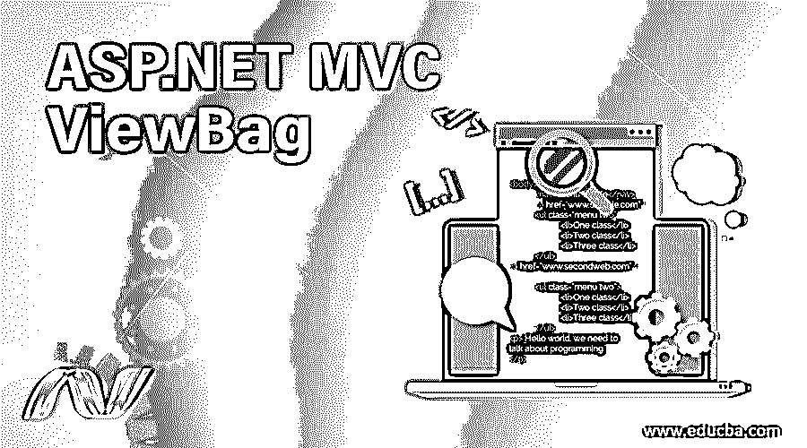
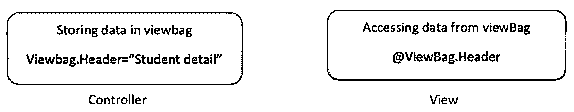
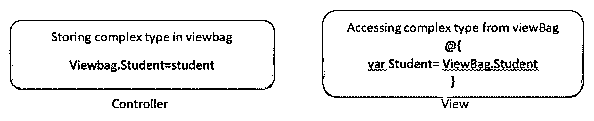
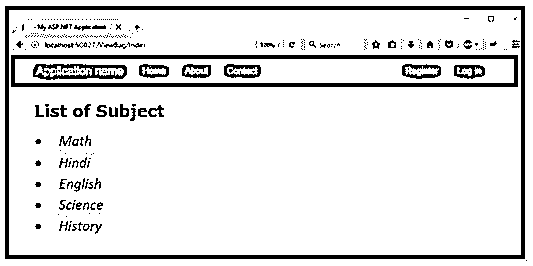
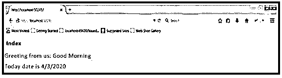

# ASP.NET MVC 视窗包

> 原文：<https://www.educba.com/asp-net-mvc-viewbag/>




## ASP.NET MVC 视窗包介绍

ASP.NET MVC 框架为我们提供了一个将数据从控制器传递到视图的选项。ViewBag 实际上是视图数据的包装器。对于 ViewBag，我们使用动态属性。当我们想从控制器发送少量临时数据来查看时，这是很有用的。它是 ControllerBase 类的动态类型属性。该类是所有其他控制器的基类。ViewBag 仅将数据从控制器传输到视图，但反之则不可能。如果反之亦然，则 ViewBag 的值将为空。


<small>网页开发、编程语言、软件测试&其他</small>

在上面的代码片段中，您可以看到 name 属性被附加到带有点符号的 ViewBag，它在控制器中为它分配了一个字符串“EduCba”。因此，这将在类似@ViewBag.Name 的视图中访问。我们知道@是一个用于访问服务器端变量的 razor 符号或语法。

### 什么时候用？

它主要用于我们希望共享动态值的时候。有许多变量的值只在运行时输入。在我们运行程序之前，这些变量是未知的。这就是为什么我们可以将任何值放入 ViewBag 中的主要原因。此外，我们还可以使用 ViewBag 对象来减少从控制器传输到视图的数据量。在很多情况下，它都能很好地工作，比如下拉列表选项、购物车、小部件和聚合数据。

**view bag 的语法:**

带字符串类型

*

* 

复杂类型的 ASP.NET 视图包




### ASP.NET MVC 视图包示例

下面是一些例子:

#### 示例#1

让我们以 ViewBag 为例。假设我们有一个要显示的科目列表，包括数学、印地语、英语、科学和历史。

在这里，我们首先创建一个控制器，然后它将向浏览器返回一个视图。控制器会将主题视图数据传递给视图。

首先，我们需要在家庭控制器中创建一个新的 MVC 应用程序，然后编写以下代码。

**代码:**

```
using System;
using System.Collections.Generic;
using System.Web.Mvc;
namespace ViewBagExample.Controllers
{
public class ViewBagController : Controller
{
// GET: ViewBag
public ActionResult Index()
{
List<string> Subject = new List<string>();
Subject.Add("Math");
Subject.Add("Hindi");
Subject.Add("English");
Subject.Add("Science");
Subject.Add("History”);
ViewData["Subject"] = Subject;
return View();
}
}
}
View
// Index.cshtml
<!DOCTYPE html>
<html>
<head>
<meta name="viewport" content="width=device-width" />
<title>Index</title>
</head>
<body>
<h2>List of Subject</h2>
<ul>
@{
foreach (var Subject in ViewData["Subject"] as List<string>)
{
<li> @Subject</li>
}
}
</ul>
</body>
</html>
```

这将输出控制器中提到的主题列表，这意味着它将把控制器的值传递给视图。

**输出**:

在下面的输出中，我们可以看到显示的主题列表




#### 实施例 2

让我们举一个更小的例子，日期和时间。像往常一样，我们需要创建 MVC 应用程序 in-home controller，并在 index 方法中编写以下代码。

**代码:**

```
{
Public ViewResult Index()
{
ViewBag.Message=”Good Morning”;
ViewBag.Date=DateTime.Now;
Return View();
}
```

我们通过给消息和日期赋值定义了两个属性。消息包含“早安”值，日期包含“日期时间”。现在”即会经过当前时间。

现在，如果我们想读取数据，我们需要获得我们在操作方法中设置的相同属性。

我们需要在 Index.cshtml 中编写下面的代码。

**代码:**

```
@{
ViewBag.Title=”Index”;
}
<h2>Index</h2>
Greeting from us:@ViewBag.Message
Today date is @ViewBag.Date
```

**输出:**

下面是代码的输出，它会给我们传递的 ViewBag 消息，以及今天的日期。




### 关于 ViewBag 的几点看法

*   ViewBag 是 viewdata 的包装器。
*   我们可以为视图包分配 n 个属性，并为其提供值。
*   它非常容易使用，因为它是作为视图和控制器的属性来实现的。
*   当我们在任何给定的视图上指定标题页时，ViewBag 是强制的。
*   我们可以将同一个属性名多次分配给 viewBag。
*   即使给定了多个属性名，它也会考虑分配给该属性的最后一个值。
*   它不能将数据传回控制器。
*   检查空值更简单。
*   ViewBag 的语法使得添加控制器和视图更加容易和快速。
*   由于 ViewBag 是 DynamicViewData 对象，它将提供对存储在 ViewData 中的对象的动态访问。
*   ViewBag 不需要任何铸造，这就是为什么它更方便，更容易使用。
*   ViewBag 的语法使得添加控制器和视图变得更快。

### 限制

*   它主要用于将少量数据传输到控制器。该语句本身告诉我们它的局限性，即它不适合更大数据量或更复杂的数据。
*   复杂的关系数据、大量的聚合数据、仪表板数据或来自不同来源的数据。另外，当我们使用它的时候，有一些潜在的问题。
*   在编译过程中，错误不容易被发现。动态特性允许它相应地创建视图包名称；但是，在编译期间不会像其他类型那样检查这些类型。这意味着我们将无法检测我们是否使用了正确的名称，以及它是否与指定名称的视图相匹配。此外，ViewBag 在 Razor 页面中不可用。

### 结论-ASP.NET MVC 视图包

我们可以得出结论，ViewBag 只是 ViewData 的包装器。它是一个动态属性，使用了 C# 4.0 中新的动态属性。此外，我们可以分配任意数量的属性并将值传递给 ViewBag。它只持续到 http.in 的当前请求。此外，它对少量数据集很有用。

### 推荐文章

这是一个 ASP.NET MVC 视图包指南。这里我们讨论一下什么时候用的入门？例子和限制。您也可以看看以下文章，了解更多信息–

1.  [ASP.NET 检查列表](https://www.educba.com/asp-dot-net-checkbox-list/)
2.  [ASP.NET MVC 路由](https://www.educba.com/asp-dot-net-mvc-routing/)
3.  [ASPnet listbox〔t1〕网](https://www.educba.com/asp-dot-net-listbox/)
4.  [ASP.NET 时段](https://www.educba.com/asp-dot-net-session/)