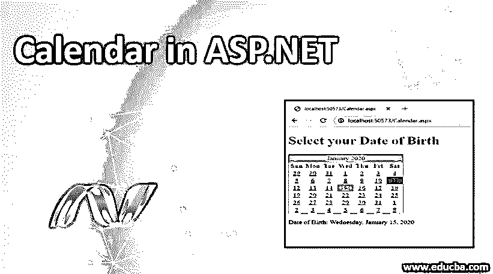
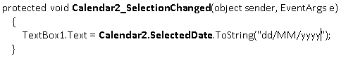
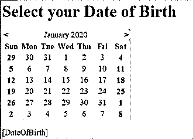
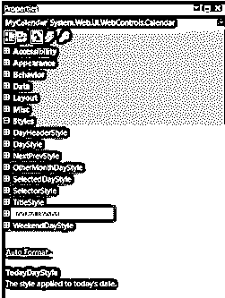
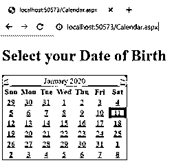
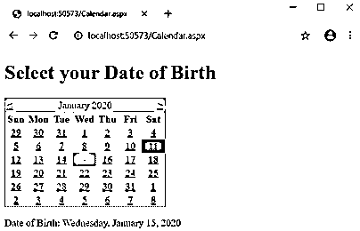

# ASP.NET 日历

> 原文：<https://www.educba.com/calendar-in-asp-net/>




## ASP.NET 日历介绍

ASP.NET 框架提供了一个非常重要的控件，用于在网页上显示日历及其控件。它允许用户选择特定的日期或月份。此外，我们可以选择任何前一个月和下个月的日期。

**语法**

<small>网页开发、编程语言、软件测试&其他</small>

现在我们了解了什么是 ASP.NET 的日历控件，这个强大而复杂的 web 控件帮助我们将日历功能添加到您的网页中。该日历控件语法如下所示:

```
<asp:Calendar ID = "Calendar1" runat = "server"></asp:Calendar>
```

### 如何在 ASP.NET 制作日历？

*   假设我们有一些字段，其中的数据需要输入、存储和从数据库中检索。我们在脑海中怀疑我们应该使用什么来输入日期，在 ASP.NET 网站上的日历控制或任何其他方法。
*   我们可以通过从工具栏中选择日历控件来使用 ASP.net 的日历控件。
*   calender 2 _ selection changed event on calendar ' s event 我们可以选择如下所示的日期




*   将一个没有任何代码的日历控件放在它的文件后面会给我们一个合适的可工作的日历。它会告诉我们一年中的月份和日子。此外，它将导航到下个月和上个月。它允许网页用户选择一天或一系列日期或整个月。这主要由 SelctionMode 属性完成。
*   我们可以使用日历控件功能创建一个日历框，在网页应用程序上一次显示一个月。最终用户可以选择他们想选择的任何日期，可以选择月份和各种日期。在选择日期的情况下，这种大范围的日期选择是允许的。我们可以使用它的不同属性来创建日历的每个部分。
*   此外，当用户更改日期选择时，会触发事件，使能够做出反应。它有许多与格式相关的属性，这些属性被映射到它的 HTML 表表示中，包括单元格填充、单元格间距、标题等等。此外，还可以通过处理 DayRender 事件来更改单元格外观。我们可以改变周末的背景色和前景色来代表假期。用户可以不选择日期。

### ASP.NET 日历的属性

为了定制日历的外观和功能，我们可以使用许多属性。日历控件有它的属性。我们来讨论一下它的一些主要性质。

*   **日:**该属性允许从日历中选择一个日期。
*   **日周:**这将允许选择一整周。
*   **DayWeekMonth:** 这将允许选择单个日期、整月或整周。
*   **无**:不允许我们从日历中选择任何一个日期。

我们可以通过两种方式设置属性:

*   我们可以通过右击日历控件来选择日历的自动套用格式属性。
*   另外，我们可以手动设置它。

### ASP.NET 日历的例子

让我们用一个选择出生日期的简单例子来看看它是如何工作的。我们将从一个例子开始，为需要选择出生日期的用户实现日历控制。

**步骤 1:** 打开您的 ASP.NET 应用程序，并打开您想要添加日历控件的页面

要添加任何控件，我们有两种方法可以开始

*   只需拖放控件
*   在标记中直接编辑或键入控件，即 aspx 文件(如语法所示)

第二步:在这里，我通过拖放添加控件，一旦你添加了控件，它将看起来像下面的代码片段。




**第三步:**现在右键单击控件，选择属性选项，会显示如下属性面板。我们可以看到许多属性将有助于布局，风格，外观等。




步骤 4: 在这个面板中，您可以对日历控件进行样式化和事件处理。在这个例子中，我用粗体标出了周末，用绿色标出了今天的日期。

**步骤 5:** 如果您打开标记，即 Calender.aspx，它将包含以下代码，对于本例，我已经为我们的应用程序添加了标题和标签。

**代码:**

```
Calendar.aspx
<%@ Page Language="C#" AutoEventWireup="true" CodeBehind="Calendar.aspx.cs" Inherits="MyCalendar.Calendar" %>
<!DOCTYPE html>
<html >
<head runat="server">
<title></title>
</head>
<body>
<form id="MyForm" runat="server">
<h1>Select  your Date of Birth</h1>
<div>
<asp:Calendar ID="MyCalendar" runat="server" OnSelectionChanged="MyCalendar_SelectionChanged">
<TodayDayStyle BackColor="#009900" />
<WeekendDayStyle Font-Bold="True" />
</asp:Calendar>
</div>
</form>
<p>
<asp:Label runat="server" ID="DateOfBirth"></asp:Label>
</p>
</body>
</html>
```

*   如果我们去 Calendar.aspx.cs

**代码:**

```
using System;
using System.Collections.Generic;
using System.Linq;
using System.Web;
using System.Web.UI;
using System.Web.UI.WebControls;
namespace MyCalendar
{
public partial class Calendar : System.Web.UI.Page
{
public void MyCalendar_SelectionChanged (object sender, EventArgs e)
{
DateOfBirth.Text = "Date of Birth: " + MyCalendar.SelectedDate.ToString("D");
}
}
}
```

**对上面代码的解释:**在 Calendar.aspx 中我们添加了 event OnSelectionChanged，这个事件在 Calendar.aspx.cs 代码中处理，当用户从 Calendar 事件中选择任意日期时，它将被路由到我们的。cs 文件，它将在我们的应用程序中添加我们选择的标签，即选择的出生日期。

**输出:**

*   当我们运行我们的应用程序时，它会显示一个如下的网页。




*   你可以看到周末用粗体显示，今天用绿色显示。
*   为了这个例子，现在我选择任意一个日期




在这里我们可以看到，选择后，出生日期，即“2020 年 1 月 15 日，星期三”被添加到网页上。

### 结论

我希望看完这篇文章后，你们都有了一些关于 ASP.NET 日历控制的基本知识。日历在[许多网络应用](https://www.educba.com/what-is-web-application/)中扮演着重要的角色，从选择任何申请表中的出生日期开始，直到选择提交的日期。这篇文章的主要目的是介绍日历在 ASP.NET 框架中是如何工作的。

### 推荐文章

这是 ASP.NET 日历指南。在这里，我们讨论介绍，属性，例子，以及如何在 ASP.NET 日历与适当的语法一起工作。您也可以浏览我们的其他相关文章，了解更多信息——

1.  [ASP.NET 的单选按钮](https://www.educba.com/radio-button-in-asp-dot-net/)
2.  [。NET 框架架构](https://www.educba.com/dot-net-framework-architecture/)
3.  [ASP.NET 图像](https://www.educba.com/asp-dot-net-image/)
4.  [ASP.NET 复选框](https://www.educba.com/asp-dot-net-checkbox/)