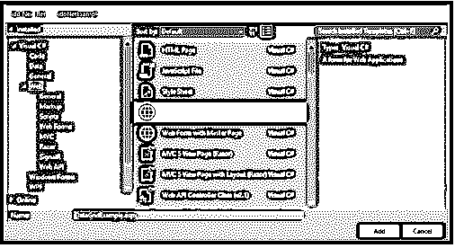
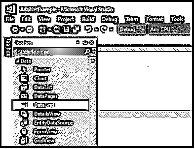
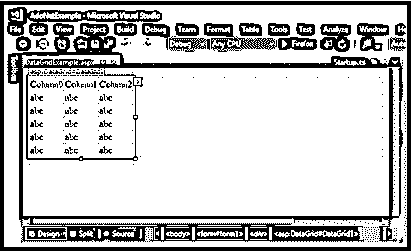
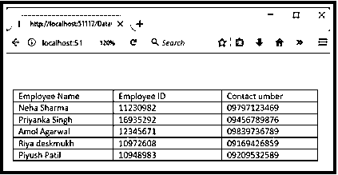
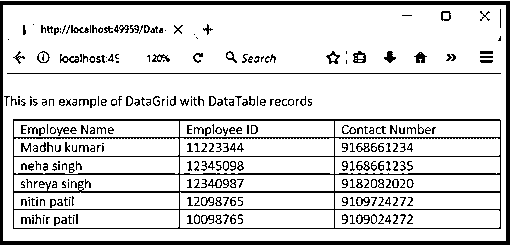

# ASP.NET 数据网格

> 原文：<https://www.educba.com/asp-dot-net-datagrid/>


## ASP.NET 数据网格简介

当我们想要显示任何带有数据的可滚动表格时，这时我们可以使用 ASP.NET 框架的 Datagrid 控件。它将[从 JSON](https://www.educba.com/what-is-json/) 或 [web 服务获取数据，并以表格格式显示](https://www.educba.com/what-is-web-services/)。通过使用 Datagrid 控件，可以制作更有吸引力和增强的 UI。它比 ASP.NET web 窗体的默认 gridview 控件功能更强大。它将显示两者之一，可能是单个表，也可能是一组表之间的层次关系。

ASP.NET 数据网格控件具有丰富的功能，包括许多功能，如编辑，过滤，分组，分页，数据绑定适配器等等。

<small>网页开发、编程语言、软件测试&其他</small>

**语法:**

```
<asp:DataGrid ID="Grid" runat="server" >
<Columns>
<asp:BoundColumn HeaderText="EmpId" DataField="EmpId"> </asp:BoundColumn>
</Columns>
</asp:DataGrid>
```

这里的头文本用于提供头的文本并提供它的值。

Runat 被设置为“server ”,因为它在服务器端。

### ASP.NET 数据网格是如何创建的？

让我们借助片段来看看并理解 ASP.NET 的 Datagrid。让我们看看如何创建一个 ASP.NET 数据网格。

**第一步:**打开一个 visual studio。现在创建一个新的空表单。请参考下面的片段。




**第二步:**进入工具箱，你会在这里找到 DataGrid，选中它，将 DataGrid 控件拖拽到新的空表单中。




**第三步:**拖动这个数据网格后，看起来会像下图。它将为我们提供一个包含行和列表格。




这个表单包含后端的源代码

### ASP.NET 数据网格示例

借助例子，我们可以更好地理解。因此，让我们举一个例子来显示包含雇员姓名、雇员 id 和联系电话的表。这里我们将向您展示两个示例，一个是带有数据表的 ASP.NET 数据网格示例，另一个是带有数据库的 ASP.NET 数据网格示例。

#### 1.带有数据库的 ASP.NET 数据网格示例

以下代码适用于 DataGridExample.aspx

```
**<**%@ Page Language="C#" AutoEventWireup="true"
CodeBehind="DataGridExample.aspx.cs" Inherits="AdoNetExample.DataGridExample" %**>**
<!DOCTYPE html**>**
**<**html **>**
**<**head runat="server"**>**
**<**title**></**title**>**
**</**head**>**
**<**body**>**
**<**form id="form1" runat="server"**>**
**<**div**>**
**</**div**>**
**<**asp:DataGrid ID="DataGrid1" runat="server"**>**
</asp:DataGrid>
**</**form**>**
**</**body**>**
**</**html**>**
```

下面是 DataGridExample.aspx.cs 代码。

```
using System;
using System.Data;
using System.Data.SqlClient;
namespace AdoNetExample
{
public partial class DataGridExample : System.Web.UI.Page
{
protected void Page_Load(object sender, EventArgs e)
{
using (SqlConnection con = new SqlConnection("data source=.; database=employee; integrated security=SSPI"))
{
SqlDataAdapter sde = new SqlDataAdapter("Select * from Employee", con);
DataSet ds = new DataSet();
sde.Fill(ds);
DataGrid1.DataSource = ds;
DataGrid1.DataBind();
}
}
}
}
```

该数据库将包含我们希望使用 DataGrid 控件显示的雇员记录。该表将包含员工姓名、员工 ID 和联系电话。

在本例中，数据库被用作数据源，以在数据网格上显示它。

**输出:**

我们将得到下面的输出，其中包含雇员表的详细信息




#### 2.带有数据表的 ASP.NET 数据网格示例

这个带有数据表的 Datagrid 示例将使用数据表将数据绑定到 Datagrid 控件。

**代码:**

```
**<**%@ Page Language="C#" AutoEventWireup="true" CodeBehind="DataGridExample2.aspx.cs" Inherits="DataGridExample.DataGridExample2" %**>**
<!DOCTYPE html**>**
<html >
<head runat="server">
<title></title>
</head>
<body>
<form id="form1" runat="server">
<div>
<p>This is an example of DataGrid with DataTable records </p>
<asp:DataGrid ID="DataGrid1" runat="server">
</asp:DataGrid>
</div>
</form>
</body>
</html>
```

**代码在**后面

```
using System;
using System.Data;
namespace DataGridExample
{
public partial class DataGridExample : System.Web.UI.Page
{
protected void Page_Load(object sender, EventArgs e)
{
DataTable table = new DataTable();
table.Columns.Add("Employee Name");
table.Columns.Add("Employee ID");
table.Columns.Add("Contact Number");
table.Rows.Add("Madhu kumari", "11223344", "9168661234");
table.Rows.Add("neha singh", "12345098", "9168661235");
table.Rows.Add("shreya singh", "12340987", "9182082020");
table.Rows.Add("nitin patil", "12098765", "9109724272");
table.Rows.Add("mihir patil", "10098765", "9109024272");
DataGrid1.DataSource = table;
DataGrid1.DataBind();
}
}
```

**输出:**




我们可以看到我们的输出只是黑白的，太简单了。我们可以利用它的特性让它变得更好。这些属性允许我们改进网格的外观。

数据网格有一些重要的特性和属性，让我们逐一讨论一下:

*   我们可以在<datagrid>级别单独设置属性，或者我们可以在项目基础上将相关属性逐个分组。</datagrid>
*   在 ASP.NET，Datagrid 比 gridview 更方便。
*   数据网格比网格视图有更多的列类型。
*   我们可以改变单元格的文本颜色，背景颜色，鼠标经过的动作。
*   ForeColor 属性用于更改单元格的前景色。
*   如果我们想要设置特定背景列的标题颜色，那么我们可以在根级别使用 headerstyle-backcolor 属性。

**举例:**

```
<asp:DataGrid runat=”server”  id= “grid” headerstyle-backcolor= “blue”>
```

*   此外，我们可以在<datagrid>声明中定义子节点，并设置它的属性 BackColor。</datagrid>

**举例:**

```
<asp:DataGrid runat=”server” id=”grid”>

</asp:DataGrid>
```

*   将数据绑定到 gid 非常重要，它由可绑定数据的列数组成。
*   通过将 AutoGenerateColumns 属性设置为 false，我们可以更改行为。网格将显式显示列集合中列出的列。
*   我们通过在服务器控件<datagrid>的主体中使用标签<columns>来绑定列。</columns></datagrid>

```
<asp:datagrid runat= “server” id=”grid”>
…
<coloumn>
<asp:boundcolumn runat=”server”>
Datafield=”quantityperunit”
HeaderText="Packaging" />
<asp:boundcolumn runat="server"
DataField="unitprice"
HeaderText="Price"
DataFormatString="{0:c}">
<itemstyle width="100px"
horizontalalign="left" />
</asp:boundcolumn>
/columns>
</asp:datagrid>
```

*   AllowPaging 属性用于在数据网格中启用分页。此属性需要设置为 true。
*   如果我们想要控制页面大小，我们可以使用 page size 属性来控制每页必须包含的最大行数。
*   pageSize 的默认值设置为 10。
*   如果页面索引发生更改，控件会将 PageIndexChanged 事件写入应用程序。
*   DataGrid 提供了 PageIndexChanged 属性，因此当用户单击时，程序员可以很容易地切换到新页面。

### 结论

在本文中，我们已经浏览了 Datagrid 控件。我希望你们都能更好地理解我们是如何创建 Datagrid 控件并使用它的。数据网格 web 服务器控件是一个数据绑定控件，它是多列的。我们看到它有许多特性，在显示可滚动表格时非常有用。

### 推荐文章

这是 ASP.NET 数据网格的指南。在这里，我们详细讨论了 ASP.NET 数据网格是如何创建的，并给出了相应的例子。您也可以看看以下文章，了解更多信息–

1.  [ASP.NET 标签](https://www.educba.com/asp-dot-net-label/)
2.  [ASP.NET 检查列表](https://www.educba.com/asp-dot-net-checkbox-list/)
3.  [ASP.NET 图像](https://www.educba.com/asp-dot-net-image/)
4.  [ASP.NET 复选框](https://www.educba.com/asp-dot-net-checkbox/)