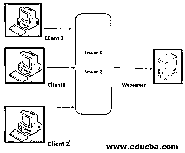

# ASP.NET 会话 ID

> 原文：<https://www.educba.com/asp-net-sessionid/>

## SessionID 简介

每个人一定都在浏览器上访问过任何一个网站。因此，当我们访问任何网站时，这意味着它正在发送一个 HTTP(超文本标记协议)请求。因为 HTTP 是一个无状态请求，所以每个 HTTP 请求都将被 web 服务器视为一个独立的请求。ASP.NET 会话将很容易识别从同一浏览器的客户端发送的请求。该会话具有唯一的 ID，通过该 ID，在服务器上的会话数据的帮助下，唯一地识别浏览器。此 SessionID 值是由 ASP.NET 随机生成的值，将存储在浏览器的会话 cookie 中，并且不会过期。

**语法**

<small>网页开发、编程语言、软件测试&其他</small>

让我们看看下面 SessionID 的语法，它向我们展示了如何在会话中存储用户名。

`Session["UserName"] = txtUser.Text`

**我们如何从会话中检索值？**

`//checking for the session whether null or not
if (Session["UserName"] != null)
{
// UserName is Retrieved from Session
lblWelcome.Text = "Welcome to EDUCBA : " + Session["UserName"];
}
else
{
//Do Something else
}
We can also store the dataset in session. Let’s see the code or syntax for it.
//Storing dataset on Session
Session["DataSet"] = _objDataSet;`

### 如何创建会话 ID？

让我们看看如何创建、存储和检索会话 id。下面的代码向我们展示了如何为用户的雇员姓名和电子邮件 id 创建一个 ASP.NET 页面，这将设置他们从按钮点击事件的文本框控件中检索值

**为存储会话 ID 中的值，可编写以下代码:**

`protected void btnSubmit_Click(object sender, EventArgs e)
{
Session["EmployeeName"] = txtEmployeeName.Text;
Session["EmaiIDl"] = txtEmaiIDl.Text;
Response.Redirect("http://localhost/SessionIDDemoe/employeeDetail.aspx");
}
For retrieving the value:
protected void Page_Load(object sender, EventArgs e)
{
if (Session["EmployeeName"] != null && Session["EmailID"] != null)
{
string name = Session["EmployeeName"].ToString();
string email = Session["EmailID"].ToString();
Response.Write(string.Format("My name is :{0} and Email id is :{1}",name,email));
}
}`

不需要向集合声明会话变量。

此代码将允许应用程序在特定会话中存储一个值，并在单击按钮后将其重定向或发送到其他页面。

### 例子

为了更好地理解会话如何处理 web 服务器和客户端，我们可以查看下图。

*   我们有两个客户端和一个 web 服务器。假设我们访问两个不同的页面，比如说一个是网站的“主页”,另一个是“公司信息”。
*   假设我们首先进入公司的信息页面，这意味着我们请求第一个 HTTP 请求并获得信息。
*   之后，当我们导航到其他“主页”时，它将创建另一个请求，也是 HTTP 请求。
*   这意味着现在我们有两个 HTTP 请求，它们也来自同一个客户端，即 web 浏览器。
*   然而，这两个请求是独立的，因为它们处理不同的页面。
*   由于 web 服务器不能识别谁在访问，如果我们在一个页面上存储值，而现在我们想在另一个页面上检索它，这就是主要的问题。
*   所以这个程序的解决方案是 ASP.NET 会话。它将存储值，并帮助我们在另一个页面上为用户检索它。
*   ASP.NET 会话将识别来自同一浏览器的请求。
*   然后，它将提供一种方法来为有限的时间窗口(即会话)继续变量值。

内部发生的是当用户发送请求时，服务器根据请求发送响应，但之后它会忘记用户是谁。他对用户一无所知。所以下次当同一个用户来的时候，服务器会把它当作一个新的请求/新的用户，因为它忘记了用户之前到底做了什么。每当我们点击按钮时，请求被发送并作为一个新的请求。

服务器总是为其每个会话生成一个唯一的会话 ID。这个 ID 以 Cookie 的形式存储在用户的内存中。这个 cookie 由一组看起来像“kjdksja2323kjdkomudzaq”的字符组成。服务器用于存储可能存储在 SQLServers 中的会话数据。假设如果 cookies 被禁用，那么会发生什么。因此，在这种情况下，会话 id 附加在 URL 上。

### ASP.NET 会话 ID 示例

**带 Cookie 的网址:** `http://www.educba.com/page.aspx/(s(kjdksja2323kjdkomudzaq))page.aspx`
**不带 Cookie 的网址:** `http://www.educba.com/page.aspx`

然而，使用 url cookie 的方法是不安全的，因为用户可以将该 url 保存为书签，这可能会产生问题。会话值取决于 cookies。会话是服务器端，cookies 是客户端管理。每当我们在会话中存储任何值时，该值都存储在服务器中，而会话 id 以 cookie 的形式存储在客户端机器上。每当我们试图从会话中获取值时，我们必须从 cookie 的头请求中发送会话 id，然后只有我们可以获取值。此会话 id 在内部发送。

如果用户清除了浏览器的缓存和 cookie，那么我们将无法获得会话值。一旦我们清除了 cookies，会话 id 也会被自动清除，并且将无法找到我们无法从服务器获取值的密钥，即使会话在浏览器上。

### 会议的优势

*   它单独提供和维护用户数据及其设置。
*   我们可以在会话中存储值类型和引用类型数据。
*   存储和检索这些值很容易。
*   它是服务器端的，而不是客户端的，所以更安全。因为它存储在服务器端，所以需要更多的内存。

### 结论-ASP.NET 会话 ID

我希望这篇文章详细解释了 ASP.NET 会话 Id。借助示例和语法，我们可以非常清楚地创建一个会话。因此，我们可以说，会话可以在服务器上存储唯一标识的值，称为 SessionID。这是最好的状态管理技术，因为它以基于客户端的方式存储值。

### 推荐文章

这是 ASP.NET 会话 ID 的指南。这里我们讨论如何用属性创建 ASP.NET session id，还有一个例子。您也可以浏览我们的其他相关文章，了解更多信息——

1.  [ASP.NET 按钮](https://www.educba.com/button-in-asp-net/)
2.  [ASP.NET 检查列表](https://www.educba.com/asp-dot-net-checkbox-list/)
3.  [ASP.NET 版本](https://www.educba.com/asp-dot-net-versions/)
4.  [ASP.NET 隐藏场](https://www.educba.com/asp-dot-net-hidden-field/)