# ASP.NET 更新面板

> 原文：<https://www.educba.com/asp-dot-net-updatepanel/>

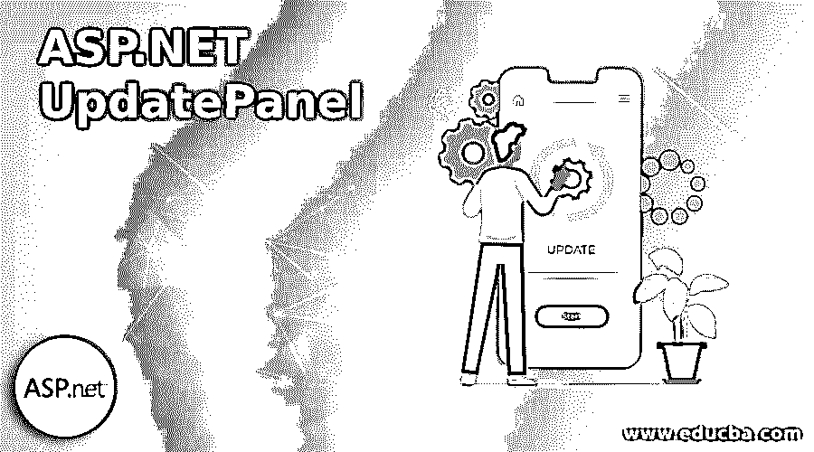

## ASP.NET 更新面板简介

在当前软件行业的情况下，每个客户端都非常普遍地期望，每次数据更改都不需要刷新页面，这意味着页面会突然被某种内部服务器端调用填充，但从客户端的角度来看，它永远不会刷新页面。ASP.NET 更新面板是流行的控件之一，它通过使用 ajax 调用来管理只更新页面的一部分而不是整个页面，通常 ASP.NET 有两种 Ajax 控制器，脚本管理器和更新面板，更新面板主要是流行的一种。

### ASP.NET 更新面板的语法

ASP.NET 脚本管理器控制器或更新面板控制器，两者都主要确保在客户端进行一些 ajax 调用，更新面板是确保部分页面重载而无需页面刷新的关键特性之一。panel 主要确保维护 Ajax 定义的客户端代码，其中需要提供执行这些代码的准确 URL，之后更新面板基本上与后端服务器端代码通信，执行逻辑，提取所需或相应的数据并显示在屏幕上，而无需刷新页面。

<small>网页开发、编程语言、软件测试&其他</small>

最终用户无法理解屏幕上发生的刷新或渲染，因为页面刷新不存在。但开发人员需要确保在特定时间没有可操作的按钮应该工作，这些按钮需要为用户禁用，因为数据填充逻辑已经在 ajax 调用中定义。

UpdatePanel 主要使用两种子标签，一种是' ContentTemplate '，另一种是' Trigger '。这里的“ContentTemplate”确保将再次呈现的 HTML 代码部分，触发器确保呈现发生时的事件细节。在“ContentTemplate”部分中定义的代码部分将只考虑通过 panel 中的更新面板控制器进行页面呈现。

整个更新基本上是异步处理的，因为只有“ContentTemplate”部分将被刷新，而其他网页将完全不变。这个更新面板控制器主要允许我们发送多个请求或者将任何 web 支持的数据发布到服务器端代码中，但是页面刷新或者整个页面提交绝对不是必需的，这就是为什么“更新面板”控制器被称为“异步”的原因。

`<asp:UpdatePanel ID="updatepnl1" runat="server1">
<ContentTemplate>`

### ASP.NET 更新面板示例

下面是提到的例子:

一个很常见的例子，页面的一部分随着页面刷新而刷新。在“内容模板”中定义的代码部分将根据后端服务器端代码库中定义的逻辑进行刷新。在下面的例子中，触发点应该是单击一个按钮。

使用“文件”、“新建”、“项目”选项在 visual studio 中创建新项目。

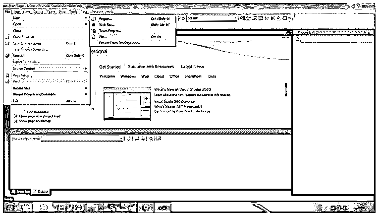

选择开发此 web 应用程序的特定 ASP.NET 版本。

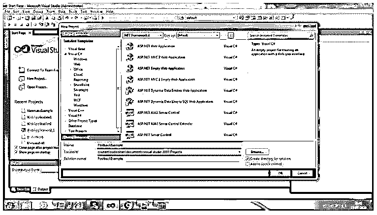

选择特定的模板来设计页面并定义相应的后端代码。

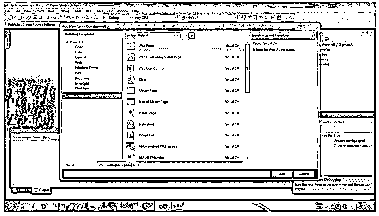

在定义的模板中添加为 ASP.NET web 应用程序设计所需页面所需的项目。

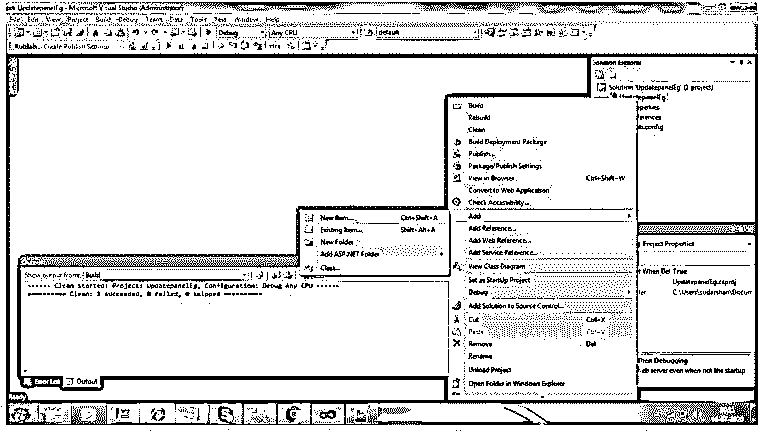

选择一个模板来生成另一个页面，这基本上不需要页面刷新渲染。

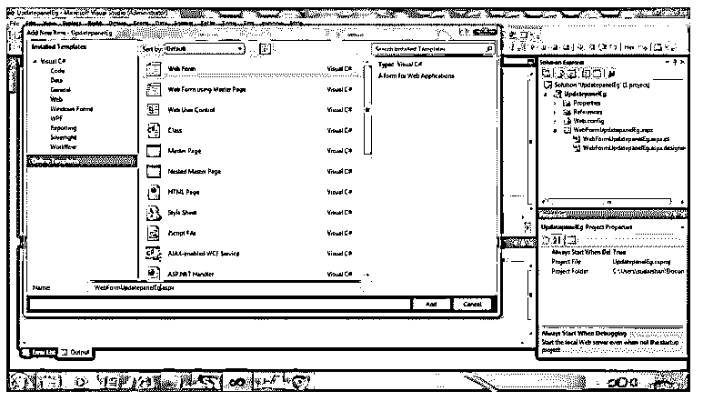

选择相应的 ASPX 文件，并移至该特定文件的设计选项卡以设计页面。转到设计页面后，有工具箱选项，在特定的工具箱下有 ajax 扩展选项，在该选项下是 ScriptManager，然后有添加更新面板的选项。

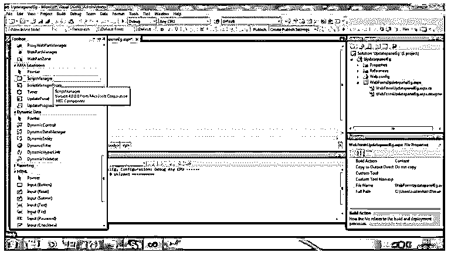

打开 UpdatePanel 类，用于创建所需的后端逻辑，以便在页面呈现时执行。

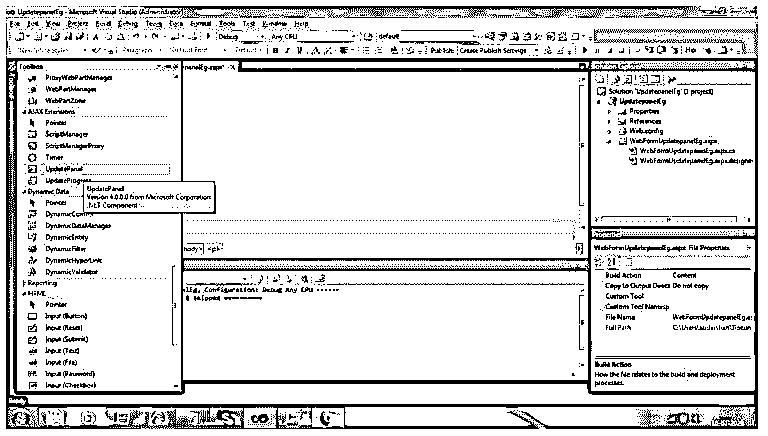

添加一个特定的标签和按钮，用于设计相应的更新面板页面，该按钮将是通过更新面板控制器呈现部分页面的触发点。

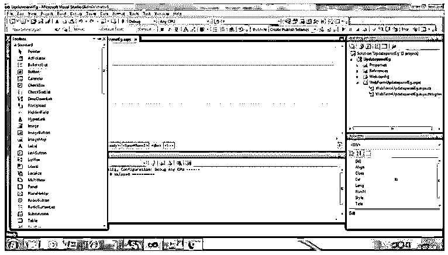

添加一个标签和按钮后，页面在 visual studio 设计预览中应该如下所示。

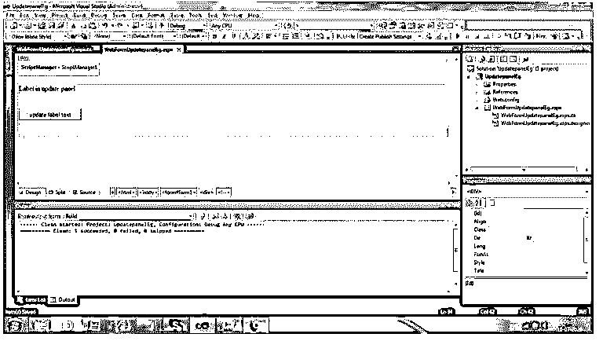

在更新面板外添加另一个标签和按钮，设计如下。

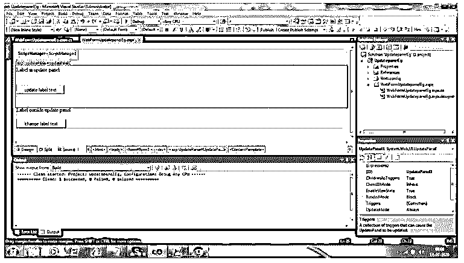

设计完成后，visual studio 自动生成的 HTML 代码如下:

**代码:**

`<%@ Page Language="C#" AutoEventWireup="true" CodeBehind="WebFormUpdatepanelEg.aspx.cs" Inherits="UpdatepanelEg.WebFormUpdatepanelEg" %>
<!DOCTYPE html PUBLIC "-//W3C//DTD XHTML 1.0 Transitional//EN" "http://www.w3.org/TR/xhtml1/DTD/xhtml1-transitional.dtd">
<html >
<head runat="server">
<title></title>
</head>
<body>
<form id="form1" runat="server">

<asp:ScriptManager ID="ScriptManager1" runat="server">
</asp:ScriptManager>
 
<asp:UpdatePanel ID="UpdatePanel1" runat="server">
<ContentTemplate>
<asp:Label ID="Label1" runat="server" Text="Label in update panel"></asp:Label>
 
 
 
<asp:Button ID="Button1" runat="server" onclick="Button1_Click"
Text="update label text" />
 
 
 
</ContentTemplate>
</asp:UpdatePanel>
<asp:Label ID="Label2" runat="server" Text="Label outside update panel"></asp:Label>
 
 
<asp:Button ID="Button2" runat="server" Text="change label text"
onclick="Button2_Click" />

</form>
</body>
</html>`

**输出:**

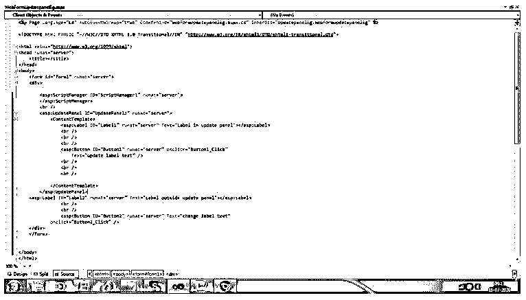

ASPX 后端代码的逻辑已经被定义，它确保当有人试图通过更新面板控制器实用程序呈现页面而不刷新页面时会发生什么。

**代码:**

`using System;
using System.Collections.Generic;
using System.Linq;
using System.Web;
using System.Web.UI;
using System.Web.UI.WebControls;
namespace UpdatepanelEg
{
public partial class WebFormUpdatepanelEg : System.Web.UI.Page
{
protected void Page_Load(object sender, EventArgs e)
{
}
protected void Button1_Click(object sender, EventArgs e)
{
Label11.Text = "Inside Panel: " + DateTime.Now.ToString();
Response.AddHeader("REFRESH", "600;URL=WebFormUpdatepanelEg.aspx");
}
protected void Button2_Click(object sender, EventArgs e)
{
Label21.Text = "outside panel: " + DateTime.Now.ToString();
Response.AddHeader("REFRESH", "600000;URL=WebFormUpdatepanelEg.aspx");
}
}
}`

**输出:**

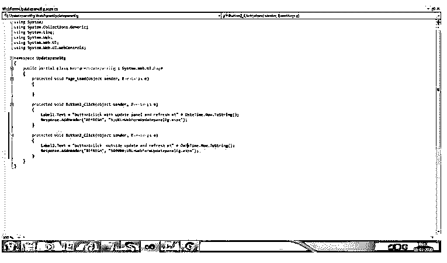

保存 ASPX 编译代码，编译它，然后以 ASP.NET web 应用程序模式运行该文件。

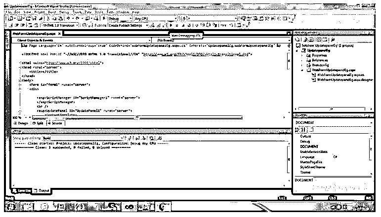

根据设计，页面填充，其中标签的两个部分即将到来，一部分显示“更新面板内的标签”，这一部分实际上在没有页面刷新的情况下再次呈现，而标签的另一部分“更新面板外的标签”，将不会由于 ajax 调用而更新。

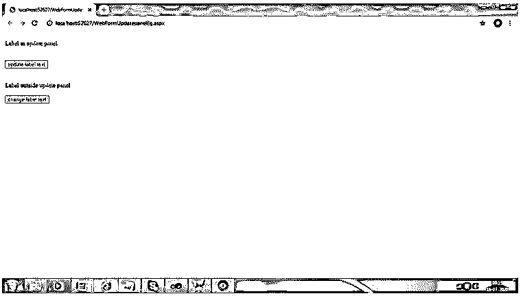

“更新标签文本”按钮被设计成一个触发点，所以当我们点击它时，它将调用后端代码，并重新填充页面而不刷新。

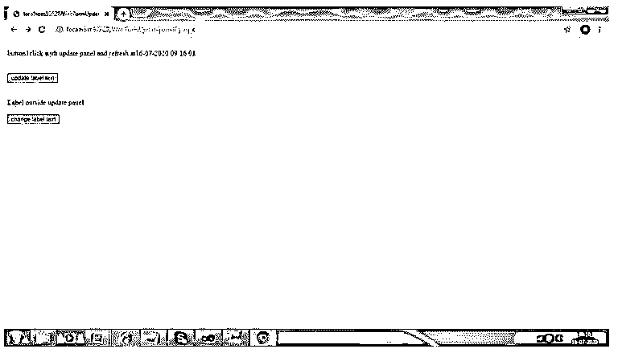

如果我们再次单击同一个按钮，文本不会发生变化，只有时间戳会根据后端代码中定义的逻辑发生变化。

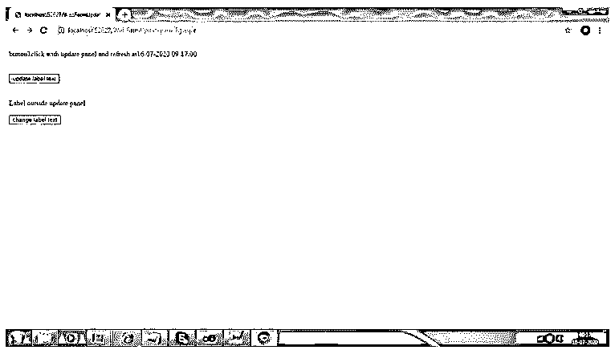

但是当我们点击更新面板外的“更改标签文本”(下方按钮)时，将会刷新整个页面。

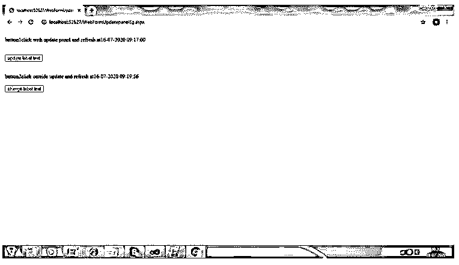

页面刷新或重新提交后，下方的文本也被刷新。

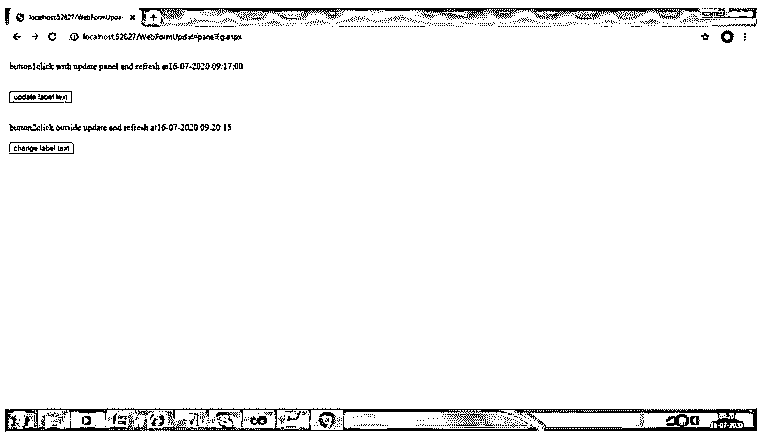

### 结论

UpdatePanel 是最常用的控制器，用于 ASP.NET web 应用程序的最大客户端。UpdatePanel 确保应用程序应该在没有页面刷新的情况下迅速出现，它有时比正常的页面刷新更快，它也将给用户一个比多次页面刷新更好的呈现。

### 推荐文章

这是一个 ASP.NET 更新面板的指南。在这里，我们讨论了 ASP.NET 更新面板的介绍以及编程示例。您也可以看看以下文章，了解更多信息–

1.  [ASP.NET 复选框](https://www.educba.com/asp-dot-net-checkbox/)
2.  [ASP.NET 隐藏场](https://www.educba.com/asp-dot-net-hidden-field/)
3.  [ASP.NET 会话 ID](https://www.educba.com/asp-net-sessionid/)
4.  [ASP.NET 版本](https://www.educba.com/asp-dot-net-versions/)