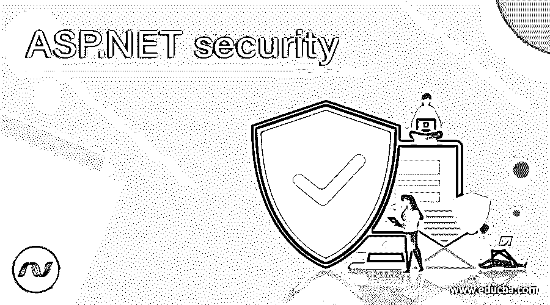

# ASP.NET 安全

> 原文：<https://www.educba.com/asp-dot-net-security/>

## ASP.NET 安全性介绍

在 ASP.NET，应用程序的安全性有两个紧密相关的概念，一个是身份验证，另一个是授权。在认证过程中，从用户处获得某种标识，并使用该标识来验证用户的身份。在授权过程中，允许经过身份验证的用户访问资源。认证过程总是进行到授权过程。在本主题中，我们将学习 ASP.NET 安全。

### ASP.NET 安全认证

在 ASP.NET，web 应用程序有许多不同类型的认证过程。如果你想指定你自己的认证方法，那也是可能的。不同的模式通过可应用于应用程序的 web.config 文件的设置来接受。web.config 文件是基于 XML 的文件，允许用户轻松更改 ASP.NET 的行为。在 ASP.NET，有三种不同的身份验证提供程序，即 windows 身份验证、表单身份验证和 passport 身份验证。

<small>网页开发、编程语言、软件测试&其他</small>

**1。Windows 认证**

此身份验证提供程序是 ASP.NET 的默认提供程序。它根据用户的 windows 帐户对用户进行身份验证。windows 身份验证依赖于 IIS 来进行身份验证。可以配置 IIS，以便只有 Windows 域上的用户才能登录。如果用户试图访问某个页面，但没有通过身份验证，那么将向用户显示一个对话框，要求用户输入用户名和密码。然后，该信息被传递到 web 服务器，并对照域中的用户列表进行检查。基于该结果，向用户授予访问权。

要使用 windows 身份验证，代码如下

`<system.web>
<authentication mode = "Windows"/>
<authorization>
<allow users = "*"/>
</authorization>
</system.web>`

windows 身份验证中有四个可以在 IIS 中配置的选项

1.  基本身份验证:在这种情况下，必须提供 windows 用户名和密码才能连接。该信息以纯文本形式在网络上发送，因此这是一种不安全的身份验证。
2.  集成的 windows 身份验证:在这种情况下，不通过网络发送密码，而是使用一些协议来验证用户。它提供了身份验证工具，并使用强大的加密技术来帮助保护整个网络中系统的信息。
3.  匿名身份验证:在这种情况下，IIS 不执行任何身份验证检查，并允许任何用户访问 ASP.NET 应用程序。
4.  摘要式身份验证:它与基本身份验证几乎相同，但密码在通过网络发送之前经过哈希处理。

**2。表单认证**

它提供了一种在 ASP.NET 应用程序中使用您自己的定制逻辑来处理身份验证的方法。当用户请求应用程序的页面时，ASP.NET 检查是否存在特殊的会话 cookie。如果 cookie 存在，ASP.NET 假定用户已经过身份验证并处理请求。如果 cookie 不存在，ASP.NET 会将用户重定向到您提供的 web 表单。当用户通过身份验证后，处理请求并通过设置属性向 ASP.NET 表明这一点，这会创建特殊的 cookie 来处理后续请求。

要使用表单身份验证，代码如下

`<authentication mode = "Forms">
< forms loginUrl = "login.aspx" name = "loginform">
</forms>
</authentication>
<deny users = "?" />
<authorization>
</authorization>`

**3。护照认证**

它允许使用微软的 passport 服务来验证应用程序的用户。如果您的用户已经注册了 passport，并且您将应用程序的身份验证模式设置为 passport 身份验证，那么所有身份验证任务都将转移到 passport 服务器。它使用加密的 cookie 机制来指示经过身份验证的用户。如果用户在访问网站时已经登录了 passports，那么他们将被视为通过了 ASP.NET 的认证。否则，他们将被重定向到 passport 服务器进行登录。当他们成功登录后，只有他们会被重定向回您的网站。

要使用 passport 身份验证，代码如下

`<authentication mode = "Passport">
<passport RedirectionUrl = "login.aspx" />
</authentication>`

### ASP.NET 安全局的授权

身份验证和授权是两个相互关联的安全概念。授权是检查用户是否有权访问他们请求的资源的过程。在 ASP.NET，有两种授权形式，一种是文件授权，另一种是 URL 授权。

*   **文件授权:**文件授权由 FileAuthorizationModule 执行。它使用的 ACL(访问控制列表)。aspx 来解析用户是否应该有权访问该文件。对用户的 windows 身份确认 ACL 权限。
*   **URL 授权:**在 web.config 文件中，您可以使用<授权>元素为各种目录或文件指定授权规则。

语法如下

`<system.web>
<authorization>
<allow users = "SwatiTawde"/>
<deny users = "*"/>
</authorization>9
</system.web>`

该代码将允许用户 SwatiTawde 并拒绝所有其他用户访问该应用程序。如果你想给更多的用户权限，只需添加用逗号分隔的用户名，如 SwatiTawde，eduCBA，edu 等。如果您希望只允许管理员角色访问应用程序，而拒绝所有角色的权限，则在 web.config 中编写以下代码

`<system.web>
<Authorization>
<allow roles = "Admin"/>
<deny users = "*"/>
</Authorization>
</system.web>`

### 推荐文章

这是 ASP.NET 安全指南。这里我们讨论了 ASP.NET 安全的两个主要概念，即身份验证和授权及其语法。您也可以看看以下文章，了解更多信息–

1.  [ASP.NET 网格视图](https://www.educba.com/asp-dot-net-gridview/)
2.  [数字广播](https://www.educba.com/numpy-broadcasting/)
3.  [ASP.NET 认证](https://www.educba.com/authentication-in-asp-dot-net/)
4.  [ASP.NET 更新面板](https://www.educba.com/asp-dot-net-updatepanel/)