# ASP.NET 的认证

> 原文：<https://www.educba.com/authentication-in-asp-dot-net/>

## ASP.NET 认证简介

在当今世界，web 安全性是任何应用程序的关键要求之一。数字犯罪现在也在增加，每次开发人员或公司定义安全团队来阻止世界上通常发生的任何类型的黑客活动时，像许多其他编程语言一样，ASP.NET 也为 web 应用程序提供了一些安全机制，主要与定义的身份验证机制集成在一起。具有特定角色授权过程，分配机密性或实现不同的集成，以修复任何类型的 web 应用程序所需的多种安全性。

### ASP.NET 的认证语法

ASP.NET 主要遵循安全集成的两个关键特征。一个是认证，另一个是授权。

<small>网页开发、编程语言、软件测试&其他</small>

*   **认证:**主要是保证用户对该特定应用的识别。它从用户那里获取一些数据输入，并检查他们在特定应用程序上维护的相应用户模型数据的身份。
*   **授权:**这种方法确保用户被完全授权使用特定的应用程序，他们的角色和活动在整个应用程序中基于这种授权过程得到完全维护。

每个应用程序都遵循多个身份验证过程，一些应用程序处理由应用程序开发人员实现的逻辑，但一些应用程序使用一些第三方工具来保护其应用程序的通用身份验证安全过程。

一个特定应用程序的用户维护可以通过两种方法完成:

*   **IIS 服务器:**有些情况下用户和特定角色完全配置在 IIS 服务器中。因此，服务器决定该特定应用程序或该特定 IIS 服务器上部署的应用程序的整个身份验证过程。
*   **应用程序自己的逻辑:**一些应用程序在应用程序本身中维护完整的用户认证。逻辑和处理流程完全在应用程序内部定义或处理。

### ASP.NET 认证示例

下面给出的是一个很常见的例子:

在 visual studio 中创建新的 ASP.NET 项目:

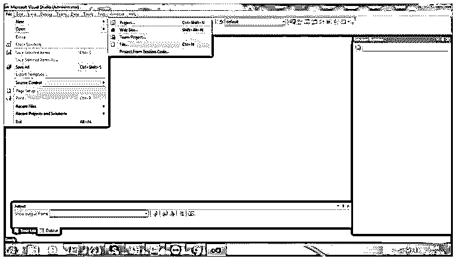

选择适当的。net 框架:

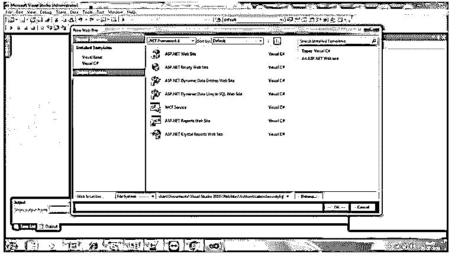

为登录配置 ASP.NET 网页:

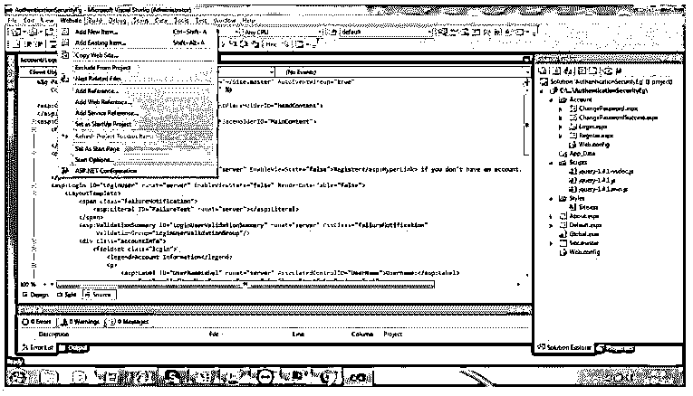

AcountLogin.aspx 格式的缩写：

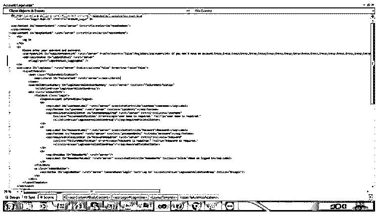

**代码:**

`<h2>
Log In Page
</h2>

<asp:HyperLink ID="RegisterHyperLink1" runat="server" EnableViewState="false">Not Have Account</asp:HyperLink>
<asp:LoginStatus ID="LoginStatus12" runat="server"
onloggingout="LoginStatus12_LoggingOut1" />

<asp:Login ID="LoginUser1" runat="server" EnableViewState="false" RenderOuterTable="false">
<LayoutTemplate>

<asp:Literal ID="FailureText1" runat="server"></asp:Literal>

<asp:ValidationSummary ID="LoginUserValidationSummary1" runat="server" CssClass="failureNotification1"
ValidationGroup="LoginUserValidationGroup1"/>

<fieldset class="login1">
<legend>Information of the Account</legend>

<asp:Label ID="UserNameLabel1" runat="server" AssociatedControlID="UserName1">User Name:</asp:Label>
<asp:TextBox ID="UserName1" runat="server" CssClass="textEntry1"></asp:TextBox>
<asp:RequiredFieldValidator ID="UserNameRequired11" runat="server" ControlToValidate="UserName1"
CssClass="failureNotification1" ErrorMessage="Required." ToolTip="Required."
ValidationGroup="LoginUserValidationGroup1">*</asp:RequiredFieldValidator>

<asp:Label ID="PasswordLabel11" runat="server" AssociatedControlID="Password1">Pass::</asp:Label>
<asp:TextBox ID="Password1" runat="server" CssClass="passwordEntry1" TextMode="Password1"></asp:TextBox>
<asp:RequiredFieldValidator ID="PasswordRequired1" runat="server" ControlToValidate="Password11"
CssClass="failureNotification1" ErrorMessage="Required." ToolTip="Required."
ValidationGroup="LoginUserValidationGroup1">*</asp:RequiredFieldValidator>

<asp:CheckBox ID="RememberMe1" runat="server"/>
<asp:Label ID="RememberMeLabel" runat="server" AssociatedControlID="RememberMe1" CssClass="inline">…</asp:Label>

</fieldset>

<asp:Button ID="LoginButton1" runat="server" CommandName="Login1" Text="Login1" ValidationGroup="LoginUserValidationGroup1" OnClick="OnLogin1"/>

</LayoutTemplate>
</asp:Login>
</asp:Content>`

登录屏幕:

Login.aspx.cs:

**代码:**

`using System;
using System.Collections.Generic;
using System.Linq;
using System.Web;
using System.Web.UI;
using System.Web.UI.WebControls;
public partial class Account_Login : System.Web.UI.Page
{
protected void Page_Load(object sender, EventArgs e)
{
RegisterHyperLink.NavigateUrl = "Register.aspx?ReturnUrl=" + HttpUtility.UrlEncode(Request.QueryString["ReturnUrl"]);
}
protected bool authenticate(String uname1, String pass1)
{
if (uname1 == "Tom")
{
if (pass1 == "tom123")
return true;
}
if (uname1 == "Dick")
{
if (pass1 == "dick123")
return true;
}
if (uname1 == "Harry")
{
if (pass1 == "har123")
return true;
}
return false;
}
public void OnLogin(Object src, EventArgs e)
{
if (authenticate(UserName.Text, Password.Text))
{
FormsAuthentication.RedirectFromLoginPage(UserName.Text, RememberMe.Checked);
}
else
{
Response.Write("Invalid user name or password");
}
}
}`

AccountLogin.asps.cs 实现:

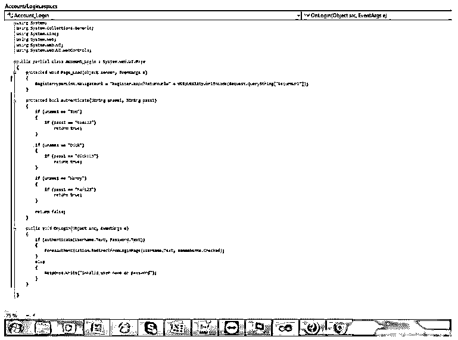

用于运行 Web 应用程序的 web 配置文件:

**代码:**

`<?xml version="1.0"?>
<configuration>
<location path="Register.aspx">
<system.web>
<authorization>
<allow users="*"/>
</authorization>
</system.web>
</location>
<system.web>
<authentication mode="Forms">
<forms loginUrl ="Login.aspx"/>
</authentication>
<authentication mode="Forms">
<forms loginUrl ="Register.aspx" defaultUrl = "../Default.aspx" />
</authentication>
<authorization>
<deny users="?"/>
</authorization>
</system.web>
</configuration>`

**输出:**

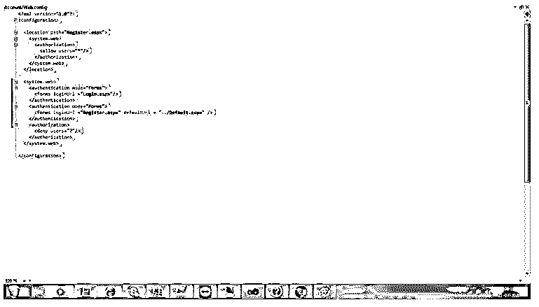

ChangePassword.aspx:

**代码:**

`<%@ Page Title="Change Password" Language="C#" MasterPageFile="~/Site.master" AutoEventWireup="true"
CodeFile="ChangePassword.aspx.cs" Inherits="Account_ChangePassword" %>
<asp:Content ID="HeaderContent" runat="server" ContentPlaceHolderID="HeadContent">
</asp:Content>
<asp:Content ID="BodyContent" runat="server" ContentPlaceHolderID="MainContent">
<h2>
Change Password
</h2>

Use the form below to change your password.

New passwords are required to be a minimum of <%= Membership.MinRequiredPasswordLength %> characters in length.

<asp:ChangePassword ID="ChangeUserPassword" runat="server" CancelDestinationPageUrl="~/" EnableViewState="false" RenderOuterTable="false"
SuccessPageUrl="ChangePasswordSuccess.aspx">
<ChangePasswordTemplate>

<asp:Literal ID="FailureText" runat="server"></asp:Literal>

<asp:ValidationSummary ID="ChangeUserPasswordValidationSummary" runat="server" CssClass="failureNotification"
ValidationGroup="ChangeUserPasswordValidationGroup"/>

<fieldset class="changePassword">
<legend>Account Information</legend>

<asp:Label ID="CurrentPasswordLabel" runat="server" AssociatedControlID="CurrentPassword">User Old Password:</asp:Label>
<asp:TextBox ID="CurrentPassword" runat="server" CssClass="passwordEntry" TextMode="Password"></asp:TextBox>
<asp:RequiredFieldValidator ID="CurrentPasswordRequired" runat="server" ControlToValidate="CurrentPassword"
CssClass="failureNotification" ErrorMessage="Password is required." ToolTip="Old Password is required."
ValidationGroup="ChangeUserPasswordValidationGroup">*</asp:RequiredFieldValidator>

<asp:Label ID="NewPasswordLabel" runat="server" AssociatedControlID="NewPassword">User New Password:</asp:Label>
<asp:TextBox ID="NewPassword" runat="server" CssClass="passwordEntry" TextMode="Password"></asp:TextBox>
<asp:RequiredFieldValidator ID="NewPasswordRequired" runat="server" ControlToValidate="NewPassword"
CssClass="failureNotification" ErrorMessage="New Password is required." ToolTip="New Password is required."
ValidationGroup="ChangeUserPasswordValidationGroup">*</asp:RequiredFieldValidator>

<asp:Label ID="ConfirmNewPasswordLabel" runat="server" AssociatedControlID="ConfirmNewPassword">Please Confirm New Password:</asp:Label>
<asp:TextBox ID="ConfirmNewPassword" runat="server" CssClass="passwordEntry" TextMode="Password"></asp:TextBox>
<asp:RequiredFieldValidator ID="ConfirmNewPasswordRequired" runat="server" ControlToValidate="ConfirmNewPassword"
CssClass="failureNotification" Display="Dynamic" ErrorMessage="Confirm New Password is required."
ToolTip="Confirm New Password is required." ValidationGroup="ChangeUserPasswordValidationGroup">*</asp:RequiredFieldValidator>
<asp:CompareValidator ID="NewPasswordCompare" runat="server" ControlToCompare="NewPassword" ControlToValidate="ConfirmNewPassword"
CssClass="failureNotification" Display="Dynamic" ErrorMessage="The Confirm New Password must match the New Password entry."
ValidationGroup="ChangeUserPasswordValidationGroup">*</asp:CompareValidator>

</fieldset>

<asp:Button ID="CancelPushButton" runat="server" CausesValidation="False" CommandName="Cancel" Text="Cancel"/>
<asp:Button ID="ChangePasswordPushButton" runat="server" CommandName="ChangePassword" Text="Change Password"
ValidationGroup="ChangeUserPasswordValidationGroup"/>

</ChangePasswordTemplate>
</asp:ChangePassword>
</asp:Content>`

**输出:**

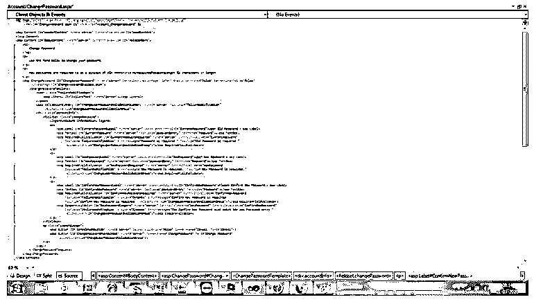

主页面应该如下图所示:

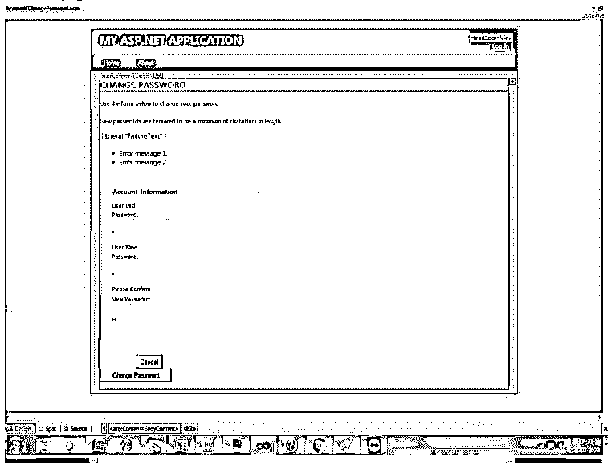

Register.aspx 代码:

**代码:**

`<%@ Page Title="Register" Language="C#" MasterPageFile="~/Site.master" AutoEventWireup="true"
CodeFile="Register.aspx.cs" Inherits="Account_Register" %>
<asp:Content ID="HeaderContent" runat="server" ContentPlaceHolderID="HeadContent">
</asp:Content>
<asp:Content ID="BodyContent" runat="server" ContentPlaceHolderID="MainContent">
<asp:CreateUserWizard ID="RegisterUser" runat="server" EnableViewState="false" OnCreatedUser="RegisterUser_CreatedUser">
<LayoutTemplate>
<asp:PlaceHolder ID="wizardStepPlaceholder" runat="server"></asp:PlaceHolder>
<asp:PlaceHolder ID="navigationPlaceholder" runat="server"></asp:PlaceHolder>
</LayoutTemplate>
<WizardSteps>
<asp:CreateUserWizardStep ID="RegisterUserWizardStep" runat="server">
<ContentTemplate>
<h2>
Create a New Account
</h2>

Use the form below to create a new account.

Passwords are required to be a minimum of <%= Membership.MinRequiredPasswordLength %> characters in length.

<asp:Literal ID="ErrorMessage" runat="server"></asp:Literal>

<asp:ValidationSummary ID="RegisterUserValidationSummary" runat="server" CssClass="failureNotification"
ValidationGroup="RegisterUserValidationGroup"/>

<fieldset class="register">
<legend>Account Information</legend>

<asp:Label ID="UserNameLabel" runat="server" AssociatedControlID="UserName">User Name:</asp:Label>
<asp:TextBox ID="UserName" runat="server" CssClass="textEntry"></asp:TextBox>
<asp:RequiredFieldValidator ID="UserNameRequired" runat="server" ControlToValidate="UserName"
CssClass="failureNotification" ErrorMessage="User Name is required." ToolTip="User Name is required."
ValidationGroup="RegisterUserValidationGroup">*</asp:RequiredFieldValidator>

<asp:Label ID="EmailLabel" runat="server" AssociatedControlID="Email">E-mail:</asp:Label>
<asp:TextBox ID="Email" runat="server" CssClass="textEntry"></asp:TextBox>
<asp:RequiredFieldValidator ID="EmailRequired" runat="server" ControlToValidate="Email"
CssClass="failureNotification" ErrorMessage="E-mail is required." ToolTip="E-mail is required."
ValidationGroup="RegisterUserValidationGroup">*</asp:RequiredFieldValidator>

<asp:Label ID="PasswordLabel" runat="server" AssociatedControlID="Password">Password:</asp:Label>
<asp:TextBox ID="Password" runat="server" CssClass="passwordEntry" TextMode="Password"></asp:TextBox>
<asp:RequiredFieldValidator ID="PasswordRequired" runat="server" ControlToValidate="Password"
CssClass="failureNotification" ErrorMessage="Password is required." ToolTip="Password is required."
ValidationGroup="RegisterUserValidationGroup">*</asp:RequiredFieldValidator>

<asp:Label ID="ConfirmPasswordLabel" runat="server" AssociatedControlID="ConfirmPassword">Confirm Password:</asp:Label>
<asp:TextBox ID="ConfirmPassword" runat="server" CssClass="passwordEntry" TextMode="Password"></asp:TextBox>
<asp:RequiredFieldValidator ControlToValidate="ConfirmPassword" CssClass="failureNotification" Display="Dynamic"
ErrorMessage="Confirm Password is required." ID="ConfirmPasswordRequired" runat="server"
ToolTip="Confirm Password is required." ValidationGroup="RegisterUserValidationGroup">*</asp:RequiredFieldValidator>
<asp:CompareValidator ID="PasswordCompare" runat="server" ControlToCompare="Password" ControlToValidate="ConfirmPassword"
CssClass="failureNotification" Display="Dynamic" ErrorMessage="The Password and Confirmation Password must match."
ValidationGroup="RegisterUserValidationGroup">*</asp:CompareValidator>

</fieldset>

<asp:Button ID="CreateUserButton" runat="server" CommandName="MoveNext" Text="Create User"
ValidationGroup="RegisterUserValidationGroup"/>

</ContentTemplate>
<CustomNavigationTemplate>
</CustomNavigationTemplate>
</asp:CreateUserWizardStep>
</WizardSteps>
</asp:CreateUserWizard>
</asp:Content>`

帐户注册. aspx 页面:

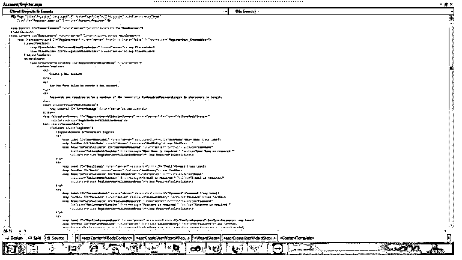

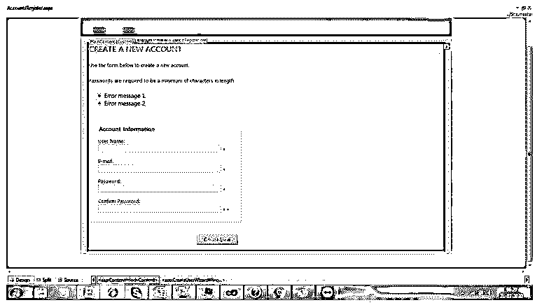

**输出:**

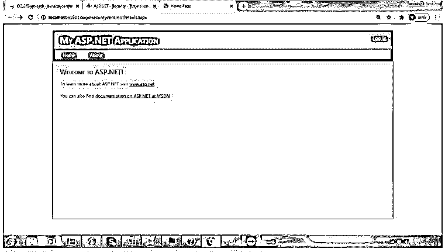

点击登录–点击登录按钮:

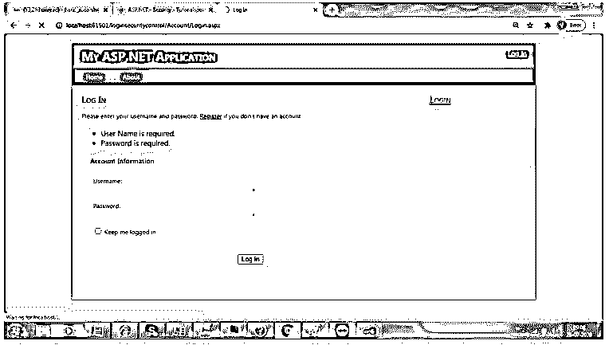

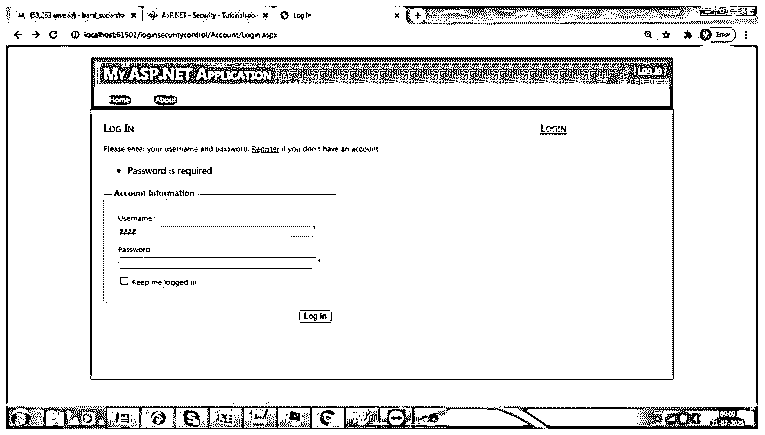

点击注册:

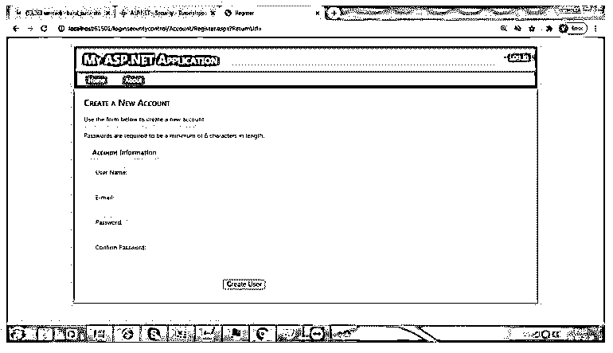

创建新用户:

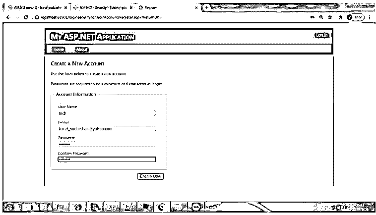

### 结论

ASP.NET 网络安全必须在当前场景中实现。在这个数字犯罪行业，每个客户都需要他们的应用程序完全安全，没有任何黑客机会。一些组织招募了一些特定的应用程序扫描安全专家，他们确保在任何特定的实施之前检查应用程序的安全性。ASP.NET 认证确保完全安全地登录到 web 应用程序，而不破坏安全漏洞。

### 推荐文章

这是 ASP.NET 认证指南。在这里，我们分别以实例讨论 ASP.NET 的认证介绍。您也可以看看以下文章，了解更多信息–

1.  [ASP.NET 版本](https://www.educba.com/asp-dot-net-versions/)
2.  [ASP.NET 检查列表](https://www.educba.com/asp-dot-net-checkbox-list/)
3.  [ASP.NET MVC 路由](https://www.educba.com/asp-dot-net-mvc-routing/)
4.  [ASP.NET 隐藏场](https://www.educba.com/asp-dot-net-hidden-field/)