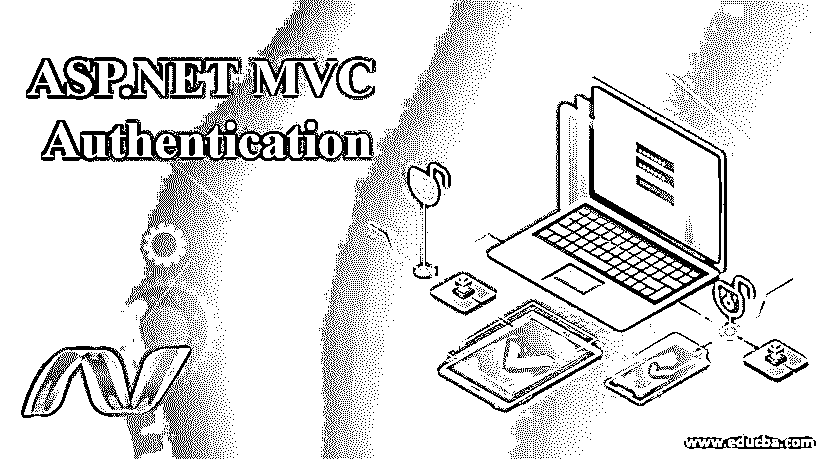
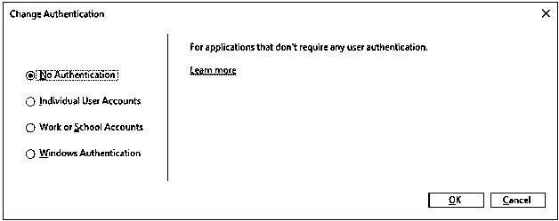
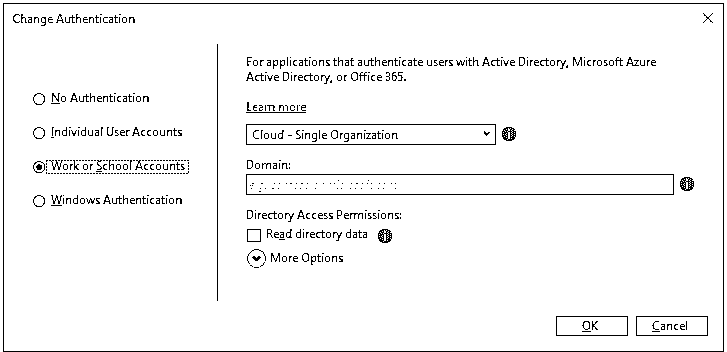
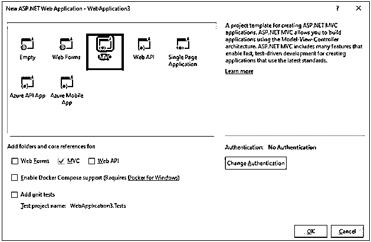
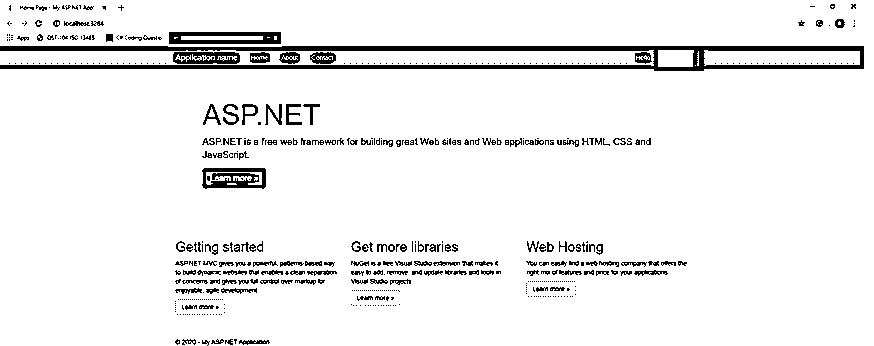

# ASP.NET MVC 认证

> 原文：<https://www.educba.com/asp-dot-net-mvc-authentication/>




## ASP.NET MVC 认证简介

ASP.NET MVC 认证是 MVC 中的一个特性，有助于使网站高度安全。认证是确认或验证用户身份的过程，以确定试图访问网页或 web 应用程序的用户是否是真正的用户。每个用户都有一个在 active directory 中定义的用户上下文，它具有 principle 属性，而 principle 属性又包含 Identity 和 Roles 属性。身份属性对用户进行身份验证，而角色属性授予访问资源的权限。IPrincipal 和 identity 是为了使用 Identity 和 Role 属性而实现的。

### ASP.NET MVC 认证

身份验证是 ASP.NET MVC 的主要特性之一，因为它建立在传统的 ASP.NET 之上，它包括 ASP.NET 提供的验证属性，使 web 应用程序健壮、安全。Visual Studio 提供了一种在创建网站的第一步就包含身份验证的简单方法。

<small>网页开发、编程语言、软件测试&其他</small>


单击“更改身份验证”按钮，会弹出另一个窗口，从中可以选择身份验证的类型。默认模式是无身份验证。项目的 web.config 文件有一个身份验证选项卡

```
<authentication mode=" "/>
```

模式定义了身份验证的模式，可以从 web.config 文件中进行更改。也可以从项目的“属性”窗口中设置身份验证模式。

### 什么是 MVC ASP.NET 认证？

ASP.NET MVC 是一个框架，它结合了 ASP.NET 的 web 开发特性和建立在 ASP.NET 框架上的模型视图控制器架构。在模型视图控制器设计模式中，关注点相互分离，例如将数据提取登录与显示逻辑分离。这导致了设计的复杂性，但是提供了更多的好处。模型视图控制器设计模式非常适合 web 应用程序。




ASP.NET MVC 认证可以用四种不同的方式来完成

#### 1.个人登录帐户

这是通常的基于表单的身份验证，在这种情况下，访问网站的用户需要用他的登录名和密码创建一个帐户。这些用户凭据存储在 SQL Server 数据库中。当然，密码首先被散列，然后存储在数据库中。表单身份验证的语法如下所示

**代码:**

```
[HttpPost]
[ValidateAntiForgeryToken]
public ActionResult Login(UserModel user)
{
if (ModelState.IsValid)
{
bool IsValidUser = _dbContext.Users
.Any(u => u.Username.ToLower() == user
.Username.ToLower() && user
.Password == user.Password);
if (IsValidUser)
{
FormsAuthentication.SetAuthCookie(user.Username, false);
return RedirectToAction("Index", "Employee");
}
}
ModelState.AddModelError("", "invalid Username or Password");
return View ();
}
```

#### 2.工作或学校账户

这种类型的身份验证主要用于使用 active directory 服务存储数据的商业工作场所。这些服务通常为内部应用提供单点登录功能。它需要 Office 365 或 Azure Active Directory 服务进行此身份验证。




您可以注册您的组织或多个组织进行工作或学校身份验证，为其提供域名以便于访问。

#### 3.Windows 身份验证

这种类型的身份验证主要用于内部网应用程序，在这种应用程序中，网站是从同一个域或防火墙中的桌面启动的。这有助于网站从桌面的 Active Directory 中检索凭据的使用。要启用 windows 身份验证，身份验证的形式需要从项目中的 web.config 文件进行注释。

**代码:**

```
<--
<authentication mode="Forms">
<forms loginUrl="~/Account/Login" timeout="2880" />
</authentication>
-->
<authentication mode="Windows" />
```

#### 4.无认证

不使用身份验证选项意味着网站及其页面是公开的，任何访问该网站的人都可以访问。这可以用在公共网站的情况下，其中显示的信息不是机密的，并且需要显示给所有用户。稍后可以从 web.config 文件的“身份验证”选项卡中更改身份验证。

**例子**

**第一步:**2017 年打开 visual studio。创建新的 ASP.NET web 应用程序。将显示一个窗口，询问您想要创建哪种类型的 web 应用程序。




*   在上面的窗口中选择 MVC。通过单击“更改身份验证”按钮，选择您的网站需要的身份验证类型。点击确定。

**第二步:**进入 HomeController.cs，对访问网页的用户进行授权。

**代码:**

```
using System;
using System.Collections.Generic;
using System.Linq;
using System.Web;
using System.Web.Mvc;
namespace WebApplication3.Controllers
{
[Authorize]
public class HomeController : Controller
{
public ActionResult Index()
{
return View();
}
[Authorize]
public ActionResult About()
{
ViewBag.Message = "Your application description page.";
return View();
}
public ActionResult Contact()
{
ViewBag.Message = "Your contact page.";
return View();
}
}
}
```

*   [Authorize]属性也可以放在控制器类之前，这将导致需要授权控制器中的所有方法。

**步骤 3:** 在 RouteConfig.cs 文件中检查默认 HomeController 是否为 Home Controller。默认控制器可以从该文件中更改，应用程序可以指向创建的自定义控制器。

**代码:**

```
public static void RegisterRoutes(RouteCollection routes)
{
.
.
.
defaults: new {controller = "Default", action = "Index", id = UrlParameter.Optional }
);
}
```

**输出:**

在启动网站时，它会要求如下凭据。登录后，网页将被定向到。




### 结论

ASP.NET MVC 具有非常强大的认证和授权功能，使得在其中创建的网站安全可靠。Visual Studio 附带的内置功能有助于在很短的时间内创建一个丰富的安全网站。在表单身份验证的情况下，密码以哈希形式存储在 SQL server 中，从而避免了 SQL 注入问题。表单身份验证还允许顺利处理帐户锁定解锁问题。而使用 windows 身份验证，由于桌面和 web 应用程序位于同一个防火墙中，不安全登录的情况大大减少。

### 推荐文章

这是 ASP.NET MVC 认证的指南。在这里，我们讨论了简介，什么是 ASP.NET MVC 认证和它的四种不同的方式与详细的解释。您也可以浏览我们的其他相关文章，了解更多信息——

1.  [ASP.NET 检查列表](https://www.educba.com/asp-dot-net-checkbox-list/)
2.  [ASP.NET 会话 ID](https://www.educba.com/asp-net-sessionid/)
3.  [ASP.NET 版本](https://www.educba.com/asp-dot-net-versions/)
4.  [ASP.NET 验证摘要](https://www.educba.com/asp-dot-net-validationsummary/)