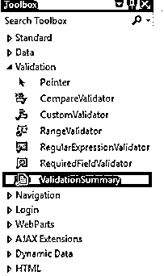
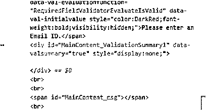
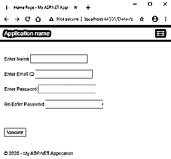
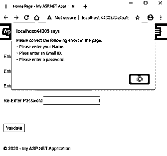
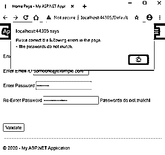
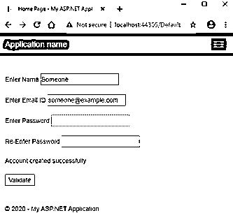

# ASP.NET 验证摘要

> 原文：<https://www.educba.com/asp-dot-net-validationsummary/>


## ASP.NET 验证简介摘要

ValidationSummary 服务器控件是一个以数据形式显示所有错误的合并摘要的控件，供用户更正。错误可以在各自的控件中列出，也可以在消息框中列出，或者两者都列出。因此，应用程序开发人员可以通过指导用户在提交表单之前解决错误来使网页更加用户友好。

为什么我要使用服务器控件这个术语？嗯，因为像所有其他服务器控件一样，ASP.NET 为在服务器上运行的 ValidationSummary 控件提供了自己的标记，生成的 HTML 代码作为响应返回给浏览器。

<small>网页开发、编程语言、软件测试&其他</small>

因此，从 HTML 的角度来看，ValidationSummary 控件生成 HTML div 标记，它包含表单中所有验证错误的无序列表。

### 句法

ValidationSummary 控件可以使用 ASP.NET 提供的标记进行编码，也可以使用 Visual Studio IDE 进行拖放。拖放功能最终会生成相同的代码。最简单的 ASP.NET 验证摘要的语法是:

```
<asp:ValidationSummary ID="ValidationSummaryId" runat="server" />
```

您可以从 Visual Studio 的工具箱窗格中拖放 ValidationSummary 控件:




**代码:**

```
<asp:ValidationSummary ID="ValidationSummary1" runat="server" />
```

生成的 HTML 代码:




### 在幕后

那么，ValidationSummary 控件是如何工作的呢？当 ASP.NET 引擎遇到该控件时，它会在响应中添加等效的 HTML 标记，其 hidden 属性最初设置为 true。每当用户试图将表单数据发送到服务器时，就会触发验证。如果表单中有错误，所有错误的摘要会以项目符号(无序)列表或消息(警告)框的形式显示。

所有错误的汇总从何而来？这是个好问题。该摘要是从表单中各种验证控件的 ErrorMessage 属性中获取的。

但是等等，所有的验证控件都显示相同的消息。那总结有什么必要？这里使用的是文本属性。所有验证控件都有两个属性——error message 和 Text。当 Text 属性未设置为任何值时，ErrorMessage 值将显示在控件中。因此，作为一种良好的编码实践，Text 属性用于提醒用户该字段中存在一些错误。ErrorMessage 属性中应该有更详细的错误描述，然后显示在摘要中。

### ASP.NET 验证摘要的属性

ASP.NET 验证摘要控件附带了某些预定义的属性。这些属性被转换为本机 HTML 代码中的属性。它们帮助定义 ValidationSummary 控件的附加行为。让我们详细讨论一些常用的:

#### 1.背景色，前景色

此属性获取或设置控件的背景色和前景色。

```
<asp:ValidationSummary ID="myValidationSummary" BackColor="DarkBlue" ForeColor="White" runat=“server” />
```

#### 2\. BorderColor, BorderStyle and BorderWidth

这些属性获取或设置控件的边框样式。

```
<asp:ValidationSummary ID="myValidationSummary" BorderWidth="5" BorderColor="Blue" BorderStyle="dashed" runat="server" />
```

#### 3.CssClass

此属性获取或设置要应用于控件的 CSS 类。

```
<asp:ValidationSummary ID="myValidationSummary" CssClass="txtBxClass" runat="server" />
```

#### 4.使能够

此属性获取或设置指示控件是启用还是禁用的值。默认值为 true。

```
<asp:ValidationSummary ID="myValidationSummary" Enabled="false" runat="server" />
```

#### 5.EnableClientScript

此属性获取或设置指示客户端脚本是启用还是禁用的值。启用后，在将数据发送到服务器之前，会在浏览器本身执行验证检查。禁用时，将在服务器上执行验证检查，如果验证失败，将在响应中返回错误。默认值为 true。

```
<asp:ValidationSummary ID="myValidationSummary" EnableClientScript="false" runat="server" />
```

#### 6.字体

此属性获取或设置要在控件中显示的文本的字体。有许多样式和选项，如粗体、斜体、下划线、删除线等。

#### 7.高度、宽度

这些属性获取或设置控件的高度和宽度，以像素为单位。

```
<asp:ValidationSummary ID="myValidationSummary" Height="100" Width="500" runat="server"/>
```

#### 8.身份证明

此属性获取或设置控件的唯一标识符属性。

```
<asp:ValidationSummary ID="myValidationSummary" runat="server" />
```

#### 9.ShowMessageBox，ShowSummary

这些属性确定验证摘要是显示在网页中还是消息框中，或者同时显示在两者中。

```
<asp:ValidationSummary ID="myValidationSummary" ShowMessageBox="true" ShowSummary="false" runat="server" />
```

#### 10.ShowValidationErrors

此属性决定是否显示验证摘要。

```
<asp:ValidationSummary ID="myValidationSummary" ShowValidationErrors="false" runat="server" />
```

#### 11.看得见的

此属性确定控件是显示在用户界面上还是隐藏。默认值为 true。

```
<asp:ValidationSummary ID="myValidationSummary" Visible="false" runat="server" />
```

### 实现 ValidationSummary 的示例

让我们一步一步创建示例应用程序。

步骤 1: 创建一个新的 ASP.NET web 应用程序项目。这将使用带有 Default.aspx 和 Default.aspx.cs 页面的工作应用程序创建一个 shell 模板。的。控件的代码隐藏页。aspx 页面。

**步骤 2:** 转到 Default.aspx 文件，删除 shell 模板的内容。粘贴以下代码:

**代码:**

```
<%@ Page Title="Home Page" Language="C#" MasterPageFile="~/Site.Master"
AutoEventWireup="true" CodeBehind="Default.aspx.cs" Inherits="SampleWebApplication._Default" %>
<asp:Content ID="BodyContent" ContentPlaceHolderID="MainContent" runat="server">
<br /><br />
<asp:Label ID="name_lbl" runat="server">Enter Name</asp:Label>
<asp:TextBox ID="name_txt" runat="server"></asp:TextBox>
<asp:RequiredFieldValidator ID="Name_Required" runat="server"
ControlToValidate="name_txt" ForeColor="DarkRed"
Text="Required!" ErrorMessage="Please enter your Name." >
</asp:RequiredFieldValidator>
<br /><br />
<asp:Label ID="email_lbl" runat="server">Enter Email ID</asp:Label>
<asp:TextBox ID="email_txt" TextMode="Email" runat="server"></asp:TextBox>
<asp:RequiredFieldValidator ID="Email_Required" runat="server"
ControlToValidate="email_txt" ForeColor="DarkRed"
Text="Required!" ErrorMessage="Plese enter an Email ID." >
</asp:RequiredFieldValidator>
<br /><br />
<asp:Label ID="pass_lbl" runat="server">Enter Password</asp:Label>
<asp:TextBox ID="pass_txt" TextMode="Password" runat="server"></asp:TextBox>
<asp:RequiredFieldValidator ID="Pass_Required" runat="server"
ControlToValidate="pass_txt" ForeColor="DarkRed"
Text="Required!" ErrorMessage="Please enter a password." >
</asp:RequiredFieldValidator>
<br /><br />
<asp:Label ID="Label1" runat="server">Re-Enter Password</asp:Label>
<asp:TextBox ID="repass_txt" TextMode="Password" runat="server"></asp:TextBox>
<asp:CompareValidator ID="Repass_Compare" runat="server"
ControlToValidate="repass_txt" ControlToCompare="pass_txt"
Text="Passwords do not match!" ErrorMessage="The passwords do not match."
ForeColor="DarkRed">
</asp:CompareValidator>
<asp:ValidationSummary ID="ValidationSummary_SignupForm"
ShowMessageBox="true" ShowSummary="false"
HeaderText="Please correct the following errors in the page." runat="server" />
<br /><br />
<asp:Label ID="msg" runat="server" Text=""></asp:Label>
<br /><br />
<asp:Button ID="Validate_btn" runat="server" OnClick="Validate_btn_Click" Text="Validate" />
</asp:Content>
```

**第三步。**将以下代码复制到 Default.aspx.cs 文件中。

**代码:**

```
using System;
using System.Web.UI;
namespace SampleWebApplication
{
public partial class _Default : Page
{
protected void Validate_btn_Click(object sender, EventArgs e)
{
// This check is useful when client side scripting is disabled.
// It checks page validations on server to prevent any harmful data being posted.
if (Page.IsValid) {
msg.Text = "Account created successfully.";
}
}
}
}
```

**第四步:**运行应用程序。下面是代码的输出。它有一个表单和相应的验证控件以及一个验证摘要控件。

*   代码隐藏文件有一个用于验证按钮的按钮单击函数。只有当所有验证检查都通过时，才会调用此方法。




*   以上是你申请的登陆页面。单击“验证”按钮，无需在字段中输入任何值。
*   验证摘要显示所有错误，并且不调用函数背后的代码。




*   输入值后，将重新检查验证，并显示错误(如果有)。




*   更正错误后，单击 Validate 按钮，函数后面的代码将被执行。




### 结论

瞧啊。您已经成功学习了 ASP.NET 验证摘要控件。要获得关于逻辑背后的一些高级属性和代码的更高级培训，强烈推荐使用微软官方文档。

### 推荐文章

这是一份 ASP.NET 验证指南摘要。在这里，我们讨论语法、属性以及用适当的代码和输出来实现的例子。您也可以浏览我们的其他相关文章，了解更多信息——

1.  [ASP.NET 超链接](https://www.educba.com/asp-dot-net-hyperlink/)
2.  [ASP.NET 会话 ID](https://www.educba.com/asp-net-sessionid/)
3.  [ASP.NET 版本](https://www.educba.com/asp-dot-net-versions/)