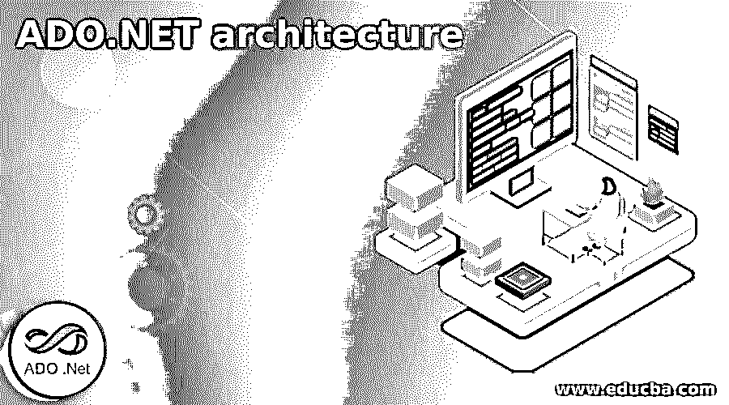

# ADO.NET 建筑

> 原文：<https://www.educba.com/ado-dot-net-architecture/>

## ADO.NET 建筑介绍

ADO.net 体系结构是一种数据处理技术，它通常依赖于基于两层模型的主要连接，其目的是在 ASP.net 和后端数据库之间建立桥梁，首先，它允许应用程序使用相同的方法访问各种类型的数据，并使用不同的类集访问 SQL Server 数据库，其次， 它提供了两种数据访问模型，一种是连接模型，我们可以在其中保持与数据库的连接并执行数据访问，另一种是获取其对象中的所有数据，这使我们可以对断开连接的对象执行数据访问，它也是 Microsoft 附带的一组类。 net 框架，它在。NET 框架。

### ADO.net 建筑

ADO.net 体系结构有两个用于访问和操作数据的主要组件，它们是。net 框架数据提供程序和数据集。ADO.net 设计用于处理各种数据源。下图显示了 ADO.net 模型的组件，并解释了它们的工作原理。

<small>网页开发、编程语言、软件测试&其他</small>

### Diagram-ADO.net 建筑

上图显示了数据集之间的关系，其中包含一个数据表的集合，数据表包含一个数据行、数据列、数据关系的集合。数据表是数据库中表的映射。从图中可以清楚地看出，数据集可以有一个或多个数据表对象。的。Net framework 数据提供程序共享表示数据的公共组件。XML 用于在各种应用程序和数据提供者之间存储和传输数据。架构中的组件代表数据。

下面介绍 ADO.net 建筑的各个组成部分，以展示它们的工作。

#### 1.(点)Net 框架数据提供程序

它是一个为快速数据操作而设计的组件，在这个组件中，我们只能转发数据或者只能读取数据。在使用公共类对象的情况下，数据源的数据提供者对象是不同的。

*   连接:

它用于创建数据源和程序之间的连接以进行通信。我们可以在连接对象的帮助下连接到数据源。比如 sqlconnection，oledbconnection 等。它还通过传递查询来维护后端和前端之间的连接。我们在连接中使用的连接对象取决于数据源的类型。

*   命令:

有一个用于执行命令的命令对象，这对于不同的连接是不同的，例如 sqlcommand、oledbcommand。通过使用它，我们可以访问数据库命令，这样我们就可以执行一些操作，如返回数据，我们可以从数据库返回数据，修改数据，我们可以修改当前数据，我们可以使用命令对象运行存储过程，我们还可以从数据库发送或检索信息的参数，这意味着检索添加、更新和删除我们使用选择、插入、更新和删除查询。有一个查询命令生成器，它可以帮助构建查询，这样我们就可以轻松地构建 SQL Select。

*   数据读取器:

该数据提供程序用于存储数据访问时获得的数据，例如 sqldatareader 和 oledbdatareader，它提供来自数据源的高性能数据流。它用于从数据源顺序读取数据，因此它提供了一种非常有效的访问数据的方式。

*   数据适配器:

它提供了数据集和数据源之间的桥梁。它用于填充和更新数据集。为了执行 SQL 查询，数据适配器使用数据源中的命令对象来加载带有数据的数据集，并将对数据集中的数据所做的更改组合回数据源。数据适配器处理数据集，它知道如何填充数据集，并且适配器在数据源之间建立连接。

#### 2.资料组

数据集是为独立访问任何数据源中的数据而显式设计的。它在一个非连接的数据访问模型上工作，因此它可以用于各种不同的数据源，这些数据源可以用于 XML 数据，否则它可以用于管理应用程序本地的数据。数据集是数据表和数据关系的集合。它有一些类、对象行、数据列，还包含主键、外键和约束。它们还包含数据表对象中数据之间的关系。当数据集被数据填充后，数据被存储在其中，之后与数据源的连接被断开。在数据源中的数据更新之后，通过使用数据适配器来更新它。

它有两个要素，即数据表和数据视图

*   数据表:

数据表是数据表的集合，所以它代表了数据表的集合。

*   数据视图:

它是一种数据集，代表不同类型的数据视图，这意味着数据视图包含不同类型的数据视图。因此它也有一些类型的数据视图，如数据列、数据行、数据关系。这是-

*   数据列表示数据表的列。
*   数据行表示数据表中的行。
*   数据关系表示不同类型的表之间的关系。

### 结论

在上面的文章中，我们得出结论，该架构是 ADO.net 面向连接的架构，其中数据库连接到后端，因此我们还可以得出结论，有一个 ADO.net 充当前端和后端之间的中介，有助于架构中的交互，有关更多详细信息，我们绘制了其架构的结构。

### 推荐文章

这是一本 ADO.NET 建筑指南。这里我们讨论的架构是 ADO.net 面向连接的架构，其中数据库连接到后端。您也可以看看以下文章，了解更多信息–

1.  [DBMS 三层架构](https://www.educba.com/dbms-3-tier-architecture/)
2.  [DB2 架构](https://www.educba.com/db2-architecture/)
3.  [微控制器架构](https://www.educba.com/microcontroller-architecture/)
4.  [逻辑架构](https://www.educba.com/logical-architecture/)

