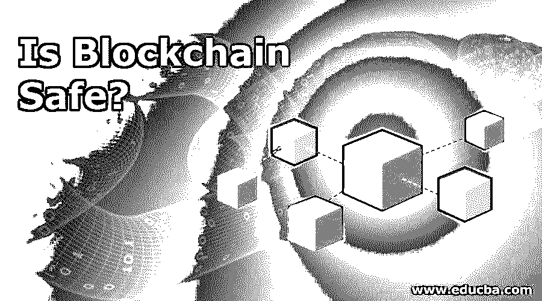

# 区块链安全吗？

> 原文：<https://www.educba.com/is-blockchain-safe/>

## 区块链安全吗？

如今，区块链正在改变做生意的方式。它允许消费者在所有基本服务中去除中间商，降低成本并提高效率。但是使用区块链带来了一个问题，这些技术提供信任和隐私吗，它们能确保隐私和无篡改记录吗？要了解这种差异，了解公共和私人区块链之间的差异非常重要。比特币是公共区块链的一个例子，任何使用它的人都可以读写。另一方面，私人区块链应用包括不同的市场范围，各方都希望在其中有所贡献。因此，当使用区块链时，一个问题出现了，即区块链是安全的。

### 安全和隐私呢？

*   由于公钥基础设施，区块链确保了机密性。即[区块链技术](https://www.educba.com/what-is-blockchain-technology/)是安全的。它可以防止恶意更改数据的企图，并保持分类帐的大小。要回答这个问题，我们可以说安全始于[网络架构](https://www.educba.com/network-security-interview-questions/)。该网络是第一个决定，使安全时，私人区块链考虑在内。为了使区块链对他们的分类账达成一致意见，交易清单是通过公告制作的，并且需要一种通信媒介来书写或背书一项新的交易。
*   发生的通信是在两个节点之间，这两个节点将具有分类帐的副本，并且还将通知其他节点关于这个新信息。管理私有区块链的人员有权在节点和链接节点上工作。具有许多链接的节点将更快地获得信息。拥有许多商品的私人区块链可能会在网络中获得更多的中心位置，并发展贸易伙伴。它可以提供新的节点来维护到这些中心节点之一的链路，作为一种安全措施，并且也如预期的那样运行。

### 私有区块链是否比公有区块链更安全有保障？

*   建造私人区块链的主要目的是在一个被严重误导的地方维护安全。诚然，一个私人的区块链使用户能够筛选或过滤参与者，而公共的区块链是所有人都可以轻松访问的。由于这种公开曝光，区块链公众对黑客攻击免疫。
*   例如，比特币是一个原始的公共区块链，多年来一直坚持不懈地反对黑客攻击。随着每一次攻击，它变得更有弹性，而且总能经受住攻击。这消除了误解，证明了公共区块链是相当安全的，优于私人区块链。

### 公共和私有区块链中的共识协议和访问权限

*   达成共识需要时间。发生的交易通常只有在时间跨度约为一两个小时时才被视为完全确认。一旦达到这一点，在分类帐中的时间是足够的和足够深的，引入分类帐的相反帐户，称为 fork，它将是计算上排他的。这种障碍既容易受到系统的影响，也似乎会建立或失去这种地位，这是使用比特币相关系统进行货币交易等快节奏交易的一个重要障碍。
*   当涉及私有区块链时，运营商是决定将进行验证过程的明确节点的人，并且只有这些可信方将负责并被授权向网络的其余部分传达新确认的交易。因此，对这些节点的安全认证和准入以及为谁增加可信方集合的责任由区块链系统运营商承担，并且是他选择区块链的安全选择。

### 隐私

*   安全伴随着隐私。为了解决数据隐私和安全问题，[区块链运营商可以使用哈希技术存储个人数据](https://www.educba.com/is-blockchain-the-future/)和对该数据的引用。这是数据到不可读信息的单向转换。存储这些数据意味着这些个人数据需要由用户持有，或者应该使用传统的数据库。可以存储在链外的文档包括了解您的客户文档，如扫描的驾照或护照等。，不会频繁更新，可以作为独立的数据库和应用系统存储。通过离线存储数据，用户降低了透明度和不变性。
*   但它也增加了数据丢失或被盗的风险，这是对所有个人信息的威胁，并且它可能会在其他网络上传播。这个问题的解决方案是一个独特的身份。这可以被称为数字概念，它将控制个人信息，并且还可以定义与谁共享这些信息。随着[区块链已经成为](https://www.educba.com/blockchain-interview-questions/)企业和机构的一个组成部分，了解法律并创造出能够最大限度地发挥协同作用并平衡监管和数据隐私的设计是非常重要的。

### 区块链的潜力

*   由于这一蓬勃发展的技术，它已被一些银行成功实施。区块链被认为是不可逆的，它们由加密的数据块组成，这甚至有助于打击网络犯罪。当黑客试图更改数据时，会被标记出来，并立即被管理员发现。区块链确实被证明是安全可靠的，因此使用区块链的应用程序包括[网络安全公司](https://www.educba.com/cybersecurity-basic/)，甚至一些政府也签署了同样的协议。
*   总而言之，区块链技术可以表现为安全、健壮、可靠、值得信赖和私有。其可靠的体系结构和实现的安全设计确保了安全性。它还有一些非常有效的工作策略，可以双重检查安全性。只要实施和执行得当，区块链显然有超过所有风险的潜力。由于采用了全新的技术，新的数字产品在设计时必须始终考虑所有法规、网络安全和数据隐私。这是一种融入区块链的安全技术。

### 推荐文章

这是区块链安全吗？在这里，我们讨论了区块链的安全程度，私人和公共区块链，以及区块链的潜力等。您也可以阅读以下文章，了解更多信息——

<small>网页开发、编程语言、软件测试&其他</small>

1.  [区块链职业](https://www.educba.com/careers-in-blockchain/)
2.  [区块链的优势](https://www.educba.com/advantages-of-blockchain/)
3.  [数据安全技术和隐私](https://www.educba.com/data-security-techniques/)
4.  [区块链的应用](https://www.educba.com/applications-of-blockchain/)

