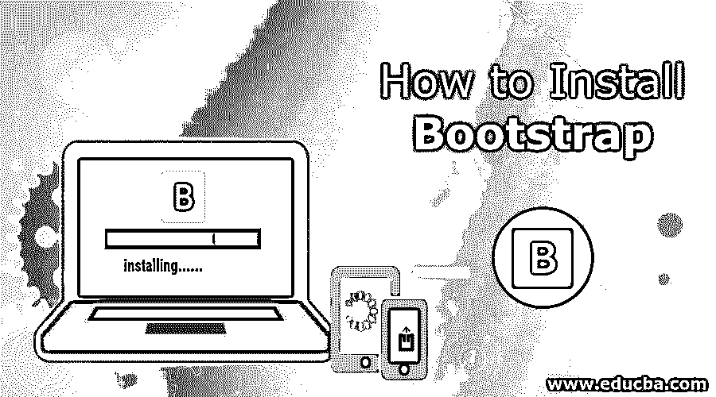
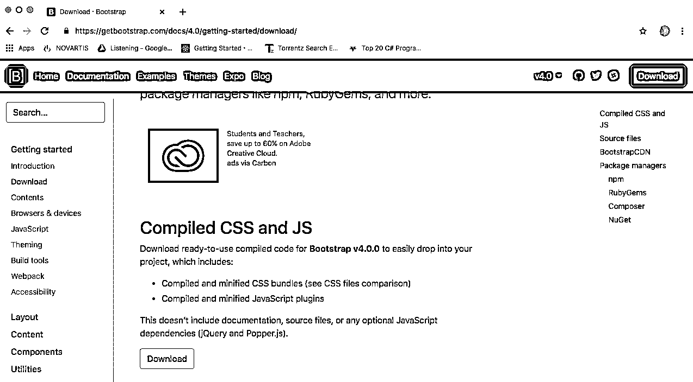
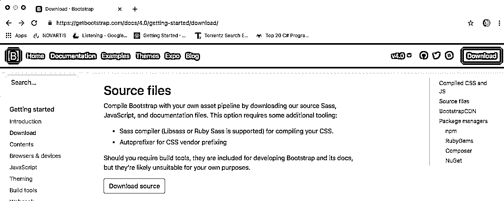
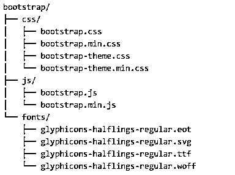

# 如何安装引导程序

> 原文：<https://www.educba.com/install-bootstrap/>




## 如何安装引导程序

[Bootstrap](https://www.educba.com/what-is-bootstrap/) 是一个开源的 web 框架。主要用于前端开发。这是免费的。Bootstrap 核心团队开发了 bootstrap。马克·奥托和雅各布·桑顿最初创建了 bootstrap。它最初发布于 2011 年。它是用 HTML、CSS 和 JavaScript 编写的。

### 引导包

该包装包含以下项目:

<small>网页开发、编程语言、软件测试&其他</small>

1.  **CSS** :层叠样式表，用于样式化 [HTML 元素](https://www.educba.com/html-works/)。
2.  **组件**:在 Bootstrap 包中，有很多可重用的组件，用于下拉、图标、警告、导航等。
3.  **自定义**:在 Bootstrap 包中，可以自定义组件，少变量和 [Jquery 插件](https://www.educba.com/jquery-plugins/)得到样式。
4.  **Scaffolding** :在一个引导包中，它提供了网格系统、链接风格和背景的基本结构。
5.  **JavaScript** :在一个引导包中，会有 JavaScript 插件。

### 安装引导程序的步骤

让我们讨论安装 Bootstrap 所需的步骤。

**步骤 1:** 使用以下链接下载引导程序。点击下载；引导软件包将被下载到一个 Zip 文件夹中。该文件夹包含 CSS 和 JS 文件夹。

[https://getbootstrap.com/docs/4.0/getting-started/download/](https://getbootstrap.com/docs/4.0/getting-started/download/)




The bootstrap package that is downloaded is ready to use compiled code, which can be easily integrated into the project. It consists of compiled and minified CSS bundles and [Javascript Plugins](https://www.educba.com/uses-of-javascript/).

****第二步:**源文件** : Bootstrap 可以借助 javascript、sass 和文档文件，用自己的资产管道编译。




点击下载源下载文件。包含 js，CSS 等文件。

****第三步:**包管理器:** Bootstrap 可以安装在 [Node.js powered](https://www.educba.com/uses-of-node-dot-js/) 文件或应用中。

```
$ npm install bootstrap
```

**步骤 4:** 对于 Node.js 应用程序，bootstrap 也可以在 yarn 包的帮助下安装。

```
$ yarn add bootstrap
```

**步骤 5:** 如果用户想要为 ruby gems 应用程序安装引导程序

*   **使用捆扎机** :

    ```
    gem 'bootstrap', '~> 4.0.0'
    ```

*   **无捆扎机** :

    ```
    $ gem install bootstrap –v 4.0.0
    ```

**步骤 6:** 可以使用 composer 来安装和管理 bootstraps sass 和 javascript

```
$ Composer require twbs/bootstrap: 4.0.0
```

**第七步:**使用 NuGet，可以安装和管理 bootstraps CSS 和 [sass](https://www.educba.com/install-sass/) 和 JavaScript[for.Net 应用](https://www.educba.com/uses-of-net/)。

*   安装包引导
*   安装包 bootstrap.sass

步骤 8: Jquery 也用于引导文件或安装文件夹。需要下载 Jquery 并将 Jquery 文件放在 bootstrap 根文件夹中，以体验更好的用户界面，最重要的是，Jquery 增强了 Bootstrap 的功能，使外观更具吸引力和响应性。

**步骤 9:** 执行完上述步骤后，开发者可以编写 HTML 代码，为 HTML 页面链接所有文件，并可以打开 HTML 文件检查响应。

### 支持的浏览器

bootstrap 主要支持所有浏览器和平台的最新稳定版本。移动设备浏览器已经支持 Android 和 IOS 平台。bootstrap 还支持 Mac 和 Windows 等不同平台的桌面浏览器。

### 引导文件结构

*   Bootstrap 已经预编译，正在下载的 bootstrap 的编译版本，并解压缩 Zip 文件，您将看到以下文件结构:




上图还包括 fonts 文件夹文件，如果开发人员需要额外的字体来根据需要制作用户界面，可以包括 bootstrap 的源包中可用的文件。引导源代码将有一个更详细的文件结构。

### 自举 4

Bootstrap 4 中的[做了重大更改，如主要重写代码、CSS 灵活大小支持、添加了导航定制选项、添加了响应间距和大小调整实用程序、全局字体大小从 14px 增加到 16px、添加了实用程序类的数量、添加了样式按钮、下拉菜单、媒体对象和图像类。它还支持最新版本的浏览器。](https://www.educba.com/bootstrap-4-cheat-sheet/)

Bootstrap 的主要特点是简化网页的开发。使用 bootstrap 的主要原因是选择投影的颜色、大小、字体和布局。它为 HTML 元素提供了基本的样式定义。Jquery 插件和 Javascript 组件提供了一些额外的元素，可以用于对话框和工具提示等用户界面。[引导组件](https://www.educba.com/bootstrap-components/)也由 HTML 元素、CSS 声明和 Javascript 代码组成。它还具有扩展现有界面元素的特性。

bootstrap 的另一个主要组件是它的布局组件。基本布局组件称为容器，页面的每个元素都放在其中。容器被放置在网页上，然后像 CSS 布局这样的其他布局组件可以通过行和列来定义。设计[网页](https://www.educba.com/free-web-page-designing-software/)要看开发者选择哪个容器固定宽度还是流体宽度容器。前者使用四种预定义的宽度，而后者则根据查看网页的屏幕大小来使用填充。

### 自举的使用

Bootstrap 非常容易使用，在 bootstrap 的帮助下，开发人员过去常常开发响应性网站。Bootstrap 也被使用，因为它支持许多浏览器，如 Google Chrome、Mozilla Firefox、Internet Explorer、Safari、Opera 等。Bootstrap 很容易上手，也很容易创建一个响应迅速的网格系统。它捆绑了 javascript 插件，并且有一个可以使用的公司列表。它有良好的文档开始，并能够快速工作。Bootstrap 展示了响应式设计和移动优先的方法。它是开源的，免费的。省了很多力气和时间。它是可定制的。bootstrap 的重要用途是响应性网页设计，它有助于根据所有设备(如笔记本电脑、台式机、手机和平板电脑)的屏幕大小调整网站。

### 结论–安装引导程序

Bootstrap 作为一种前端 web 框架被广泛使用。它还支持许多编程语言和平台无关性。它有很好的在线社区支持，可以帮助初学者，文档也很好，在官方网站上，所有关于新版本发布和高级功能的更新都已正确发布和记录。构建不同的工具并与另一种脚本语言集成已经成为流行的 web 框架。

### 推荐文章

这是一个关于如何安装引导程序的指南。这里我们讨论了安装 bootstrap 的步骤，以及 Bootstrap 4 的基本概念和 Bootstrap 的用法。您也可以阅读以下文章，了解更多信息——

1.  [引导命令](https://www.educba.com/bootstrap-commands/)
2.  [自举面试问题](https://www.educba.com/bootstrap-interview-questions/)
3.  [Bootstrap vs WordPress](https://www.educba.com/bootstrap-vs-wordpress/)
4.  [安装 WordPress](https://www.educba.com/install-wordpress/)


