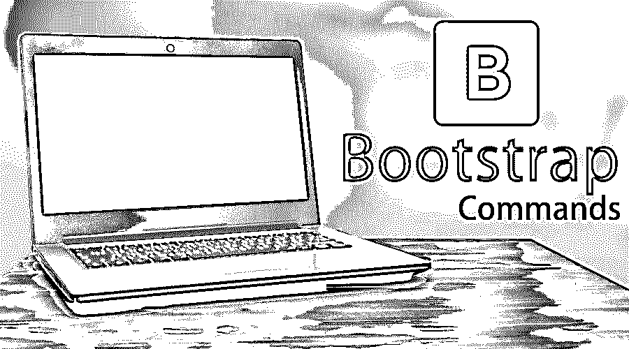

# 引导命令

> 原文：<https://www.educba.com/bootstrap-commands/>




## 自举命令简介

[Bootstrap 是 web 应用开发的前端框架。它提供了创建响应式设计的能力。有许多引导命令，包括](https://www.educba.com/what-is-bootstrap/) [HTML 和 CSS](https://www.educba.com/html-vs-css/) ，以及其他模板。下面列出了一些命令

### 基本引导命令

基本命令如下:

<small>网页开发、编程语言、软件测试&其他</small>

#### 1.警报-主要

它被如下用于获取警报消息

```
<div class="alert alert-primary" role="alert">
<strong>Hello World! </strong>
</div>
```

#### 2.警报信息

```
<div class="alert alert-info" role="alert">
<strong>Heads up! </strong>
</div>
```

#### 3.警报-警告

它被如下用于获取警报警告

```
<div class="alert alert-warning" role="alert">
<strong>Warning! </strong> Please check it.
</div>
```

#### 4.标记

```
<h1>Hello world New</h1>
<h2>Hello world New</h2>
<h3>Hello world New</h3>
<h4>Hello world New</h4>
<h5>Hello world New</h5>
<h6>Hello world New</h6>
```

#### 5.徽章-主要

```
Identity
```

#### 6.徽章-成功

```
Success
```

#### 7.徽章信息

```
Info
```

#### 8.面包屑

从一个目录到另一个目录，比如根目录、根目录/应用程序等等

```
<nav aria-label="breadcrumb">
<li class="breadcrumb-item active" aria-current="page">Root</li>
</ol>
</nav>
<nav aria-label="breadcrumb">
<ol class="breadcrumb">
<li class="breadcrumb-item"><a href="#">Home</a></li>
<li class="breadcrumb-item active" aria-current="page">Application</li>
</ol>
</nav>
```

#### 9.BTN-初级

```
<button type="button" class="btn btn-primary">Primary</button>
```

#### 10.Btn 信息

```
<button type="button" class="btn btn-info">Info</button>
```

### 中间引导命令

中间命令如下:

#### 11.形式组

```
<form>
<div class="form-group">
<label for="formGroupInput">Name label</label>
<input type="text" class="form-control" id=" formGroupInput" placeholder=" Name label ">
</div>
</form>
```

#### 12.表格内联

```
<form class="form-inline">
<label class="sr-only" for="inlineFormInput">Name</label>
<input type="text" class="form-control mb-2 mr-sm-2" id="inlineFormInput" placeholder="TOM Curran">
<button type="submit" class="btn btn-primary mb-2">Submit</button>
</form>
```

#### 13.形式控制

```
<input class="form-control" type="text" placeholder="Default">
```

#### 14.形式检查

```
<div class="form-check">
<input class="form-check-input" type="checkbox" value="" id="defaultCheck1">
<label class="form-check-label" for="defaultCheck1">
Default checkbox
</label>
</div>
<div class="form-check">
<input class="form-check-input" type="radio" name="exampleRadios" id="exampleRadios1" value="option1" checked>
<label class="form-check-label" for="exampleRadios1">
Default radio
</label>
</div>
```

#### 15.只读

```
<input class="form-control" type="text" placeholder="Input would be here--" readonly>
```

#### 16.输入组

```
<div class="input-group">
<div class="input-group-prepend">
Adding on left
</div>
<input type="text" class="form-control">
<div class="input-group-append">
Right addon
</div>
</div>
```

#### 17.检验盒

```
<div class="input-group">
<div class="input-group-prepend">
<div class="input-group-text">
<input type="checkbox" aria-label="Checkbox for following text input">
</div>
</div>
<input type="text" class="form-control" aria-label="Text input with checkbox">
</div>
```

#### 18.收音机

```
<div class="input-group">
<div class="input-group-prepend">
<div class="input-group-text">
<input type="radio" aria-label="Radio button for following text input">
</div>
</div>
<input type="text" class="form-control" aria-label="Text input with radio button">
</div>
```

#### 19.下拉式

```
<div class="input-group">
<div class="input-group-prepend">
<button class="btn btn-primary dropdown-toggle" type="button" data-toggle="dropdown" aria-haspopup="true" aria-expanded="false">Dropdown</button>
<div class="dropdown-menu">
<a class="dropdown-item" href="#">Action</a>
<a class="dropdown-item" href="#">Another action</a>
</div>
</div>
<input type="text" class="form-control" aria-label="Text input with dropdown button">
</div>
```

#### 20.分段按钮

```
<div class="input-group mb-3">
<div class="input-group-prepend">
<button type="button" class="btn btn-primary">Action</button>
<button type="button" class="btn btn-primary dropdown-toggle dropdown-toggle-split" data-toggle="dropdown" aria-haspopup="true" aria-expanded="false">
Toggle Dropdown
</button>
<div class="dropdown-menu">
<a class="dropdown-item" href="#">Action</a>
<a class="dropdown-item" href="#">Another action</a>
</div>
</div>
<input type="text" class="form-control" aria-label="Text input with segmented dropdown button">
</div>
```

### 高级引导命令

高级命令如下:

#### 21.（电视机的）超大屏幕

```
<div class="jumbotron">
<h1 class="display-3">Hello, world!</h1>
<p class="lead">This is a simple jumbotron-style component.</p>
<hr class="my-2">
<p>It uses utility classes for typography and
spacing to space content out within the larger container.</p>
<p class="lead">
<a class="btn btn-primary btn-lg" href="#!" role="button">Some action</a>
</p>
</div>
```

#### 22.列表组

```
<ul class="list-group">
<li class="list-group-item">One</li>
<li class="list-group-item">Two</li>
<li class="list-group-item">Three</li>
</ul>
```

#### 23.媒体

```
<div class="media">

<div class="media-body">
<h5 class="mt-0">Media heading</h5>
Put the content for display
</div>
</div>
```

#### 24.情态的

```
<button type="button" class="btn btn-primary" data-toggle="modal" data-target="#exampleModal">
Launch demo modal
</button>
<!-- Modal -->
<div class="modal" id="exampleModal" tabindex="-1" role="dialog" aria-labelledby="exampleModalLabel" aria-hidden="true">
<div class="modal-dialog" role="document">
<div class="modal-content">
<div class="modal-header">
<h5 class="modal-title" id="exampleModalLabel">Modal title</h5>
<button type="button" class="close" data-dismiss="modal" aria-label="Close">
&times;
</button>
</div>
<div class="modal-body">
...
</div>
<div class="modal-footer">
<button type="button" class="btn btn-secondary" data-dismiss="modal">Close</button>
<button type="button" class="btn btn-primary">Save changes</button>
</div>
</div>
</div>
</div>
```

#### 25.下拉式

```
<div class="dropdown">
<button class="btn btn-secondary dropdown-toggle"
type="button" id="dropdownMenu1" data-toggle="dropdown"
aria-haspopup="true" aria-expanded="false">
Dropdown
</button>
<div class="dropdown-menu" aria-labelledby="dropdownMenu1">
<a class="dropdown-item" href="#!">Action</a>
<a class="dropdown-item" href="#!">Another action</a>
</div>
</div>
```

#### 26.页码

```
<nav aria-label="Page navigation example">
<ul class="pagination">
<li class="page-item">
<a class="page-link" href="#!" aria-label="Previous">
&laquo;
Previous
</a>
</li>
<li class="page-item"><a class="page-link" href="#!">1</a></li>
<li class="page-item"><a class="page-link" href="#!">2</a></li>
<li class="page-item"><a class="page-link" href="#!">3</a></li>
<li class="page-item">
<a class="page-link" href="#!" aria-label="Next">
&raquo;
Next
</a>
</li>
</ul>
</nav>
```

#### 27.波普沃

```
<button type="button" class="btn btn-secondary" data-container="body"
data-toggle="popover" data-placement="top"
data-content="Hello World.">
Popover on top
</button>
<button type="button" class="btn btn-secondary" data-container="body"
data-toggle="popover" data-placement="right"
data-content=" Hello World.">
Popover on right
</button>
<button type="button" class="btn btn-secondary" data-container="body"
data-toggle="popover" data-placement="bottom"
data-content=" Hello World.">
Popover on bottom
</button>
<button type="button" class="btn btn-secondary" data-container="body"
data-toggle="popover" data-placement="left"
data-content=" Hello World.">
Popover on left
</button>
```

#### 28.进步

```
<div class="progress">
<div class="progress-bar" role="progressbar" style="width: 41%" aria-valuenow="41" aria-valuemin="0" aria-valuemax="100"></div>
</div>
```

### 使用 Bootstrap 命令的提示或技巧

1.  根据要求正确使用该类。
2.  选择值和字段时尽量精确。
3.  确保它在尺寸和效率上应该更小。
4.  [Bootstrap 帮助](https://www.educba.com/bootstrap-4-cheat-sheet/)用更少的代码让内容更有吸引力。

### 结论

Bootstrap 结合了基于 HTML 和 CSS 的设计模板和其他的 javascript 插件。它的 CSS 可以在平板电脑、手机和桌面等多种设备上运行。它被广泛用于开发 web 应用程序。由于它的使用和提供的灵活性，它在开发人员中越来越受欢迎。懂 HTML 和 CSS 的人可以很容易地在 bootstrap 上工作。

### 推荐文章

这是引导命令的指南。在这里，我们讨论了概念、基本、中级和高级引导命令，以及有效使用的提示和技巧。您也可以阅读以下文章，了解更多信息——

1.  [自举面试问题](https://www.educba.com/bootstrap-interview-questions/)
2.  [引导组件](https://www.educba.com/bootstrap-components/)
3.  [自举折叠](https://www.educba.com/bootstrap-collapse/)
4.  [引导程序中的导航条](https://www.educba.com/navbar-in-bootstrap/)


