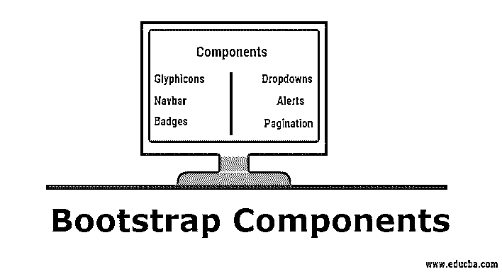
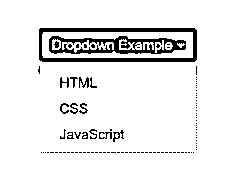
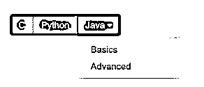
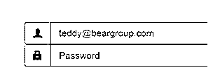
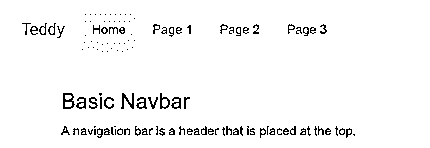
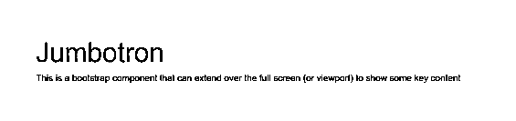
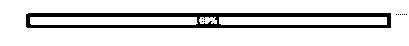
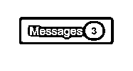
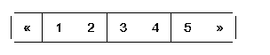

# 引导组件

> 原文：<https://www.educba.com/bootstrap-components/>




## 引导组件介绍

最初被称为 Twitter 蓝图，是由 Twitter 的 Mark Otto 和 Jacob Thronton 开发的。Bootstrap 是一个免费的 CSS 框架，赋予网页响应能力。就响应性而言，这意味着不同的 DOM 元素会随着屏幕大小的变化相应地调整自身的大小，而不会像传统的像素或百分比大小调整 CSS 方法那样影响网页的美观。

这也被称为“移动优先的 CSS 框架”,因为它通过定义行和列来设计 CSS 网格布局。这个框架也有 JavaScript 组件和 CSS 类。为了利用这个框架，你必须强制链接 [jQuery 和 JavaScript](https://www.educba.com/javascript-vs-jquery/) 框架用于引导以及其他引导 CSS 文件。这些 CSS 文件可以下载，也可以 CDNs(内容交付网络)的形式下载。

<small>网页开发、编程语言、软件测试&其他</small>

### 不同的引导组件

Bootstrap 与数十个组件捆绑在一起，这些组件可以重复使用，以在网页中提供良好的用户体验和用户交互，如导航栏、弹出窗口、下拉菜单、图标、按钮、预先设计的表单以及不同 DOM 元素的大小调整选项。

#### 1.图像(glyph)

这些是 Bootstrap 中可用的字体格式图标。他们大约有 200 人。这些雕刻可以在 https://glyphicons.com 找到。

**怎么用？**
几乎所有的动作都有图标，如缩放、编辑、警告、存档、删除等。，它们是在单独的类中定义的。所以，你需要使用基类和单独的类，最好是在一个 span 元素中，并使用这些 glyphicons。

**语法:**

```
<p></p>
```

#### 2.下拉菜单

这些是基于切换的菜单，列出了链接列表。JS 插件使这些更加动态，可以在 http://get bootstrap/JavaScript/# dropdowns 找到

**怎么用？**
你需要使用这个。dropdown class 作为元素的类，其下有列表项和类。下拉菜单。

**语法:**

```
<div class= "dropdown"><!-- have your list in this with the class .dropdown-menu --></div>
```




#### 3.按钮组

使用这个引导组件，您可以将一组按钮组合成一系列相邻的按钮。

**怎么用？**
用定义划分元素。分组类，并用一个带有。btn 类。

```
<div class="btn-group"><button class= "btn">Correct</button></div>
<div class="btn-group"><button class= "btn">Wrong</button></div>
```


#### 4.按钮下拉菜单

该组件用于使用一个按钮元素来触发下拉菜单。

**语法:**

```
<button class = “btn-default dropdown-toggle”><!—Write the dropdown component here --></button>
```




#### 5.输入组

这扩展了 form-control 类，并在 input 元素的输入字段的两侧添加了文本或按钮。为了使用这些输入组，您需要将. input-group 类与. input-group-addon 类一起使用。

**语法:**

```
<div class="input-group">
@
<input type="text" class="form-control" placeholder="Username" aria-describedby="basic-addon1">
</div>
```




#### 6.导航条

这些组件作为你网站的导航标题。在较小屏幕尺寸的设备中，它们被折叠以通过切换[汉堡菜单](https://www.educba.com/bootstrap-hamburger-menu/)垂直展开，并随着屏幕宽度的增加而变成水平。

**语法:**

```
<nav class = "navbar"><!—Code your navigation DOM elements --></nav>
```




#### 7.（电视机的）超大屏幕

这是一个引导组件，可以扩展到整个屏幕(或视窗)来显示一些关键内容。

**语法:**

```
<div class = "jumbotron"><!—Write your content within DOM elements here --></div>
```




#### 8.警报

这是一个带有 jQuery 插件的引导组件，它根据用户的操作提供上下文反馈消息。这主要用于显示警告消息。

**语法:**

```
<div class="alert alert-success" role="alert">...</div>
```


#### 9.进度条

该组件用于通过进度条显示工作或行动的进度反馈。 **T2】**

**Synatx:**

```
<div class="progress-bar" role="progressbar" aria-valuenow="60" aria-valuemin="0" aria-valuemax="100" style="width: 60%;">
```

**举例:**




#### 10.徽章

这是一个通过添加类来突出未读项目的组件。标记到 DOM 元素，最好是一个 span。

**语法:**

```
<button class="btn btn-primary" type="button">
Messages 3
</button>
```




#### 11.页码

该组件为您的站点提供多页分页，以便内容可以




可拆分成多个页面，轻松导航。通常，无序列表的 DOM 元素是用这个类定义的。

**语法:**

```
<ul class = "pagination"><!—List elements goes here --></ul>
```

### 这对你的职业生涯有什么帮助？

所有的企业现在都关注用户交互和用户体验(UI/UX)。因为绝大多数人都在使用平板电脑和智能手机等手持设备，这些设备的像素分辨率和屏幕尺寸差异很大，这就是为什么前端设计非常重要，它的响应速度足以适应任何类型的屏幕，而不会影响网页的优雅。

因此，擅长引导会增加你在技术职业中的价值，公司会期待用一份丰厚的薪水雇佣你。而且，因为它是免费和开源的，所以作为一名开发者，你有很多空间可以贡献，并使它比现在更好。

### 结论

Bootstrap framework 是一个非常方便的工具，可以带来对网页的响应。本博客中解释的组件是一些非常广泛使用的组件，它们可以帮助您编写更少的代码来实现更多的功能，并为您正在构建的 web 页面增添更多的优雅。

### 推荐文章

这是对引导组件的指导。在这里，我们还将讨论 bootstrap 的基本概念和各个组成部分，以及它将如何帮助塑造你的职业生涯。您也可以浏览我们推荐的其他文章，了解更多信息——

1.  [如何安装引导程序](https://www.educba.com/install-bootstrap/)
2.  [角度与自举](https://www.educba.com/angular-vs-bootstrap/)
3.  [引导布局](https://www.educba.com/bootstrap-layout/)
4.  [引导雕刻图案](https://www.educba.com/bootstrap-glyphicons/)


