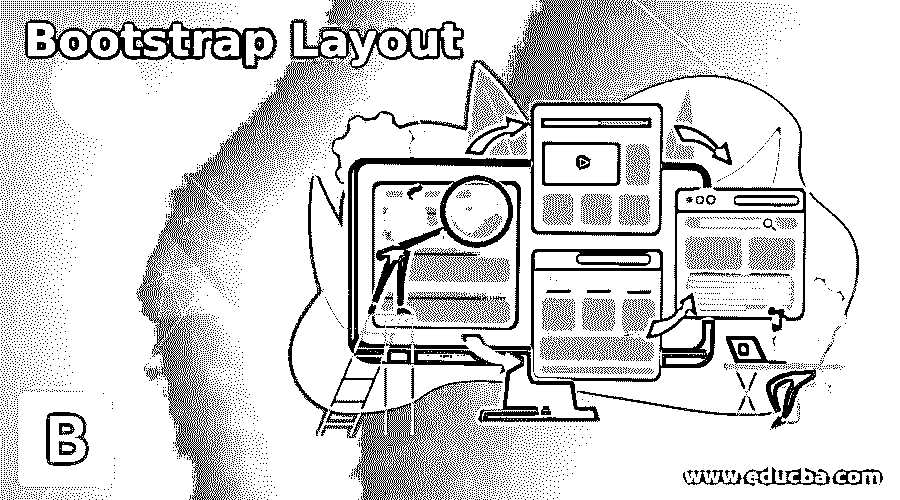

# 自举布局

> 原文：<https://www.educba.com/bootstrap-layout/>

## 自举布局介绍

以下文章提供了引导布局的概要。在我们生活的世界里，互联网已经成为我们生活中至关重要的一部分。全球范围内的数字化正以惊人的方式改变着企业。在这个数字互联的世界里，创建一个强大的、反应迅速的网络形象是最重要的。无论是智能手机、iPad、笔记本电脑还是台式机，在各个平台上拥有相同的观看体验至关重要。

Bootstrap 是一个前端开源框架，结合了 CSS、HTML 和 JavaScript。一般来说， [Bootstrap 用于创建](https://www.educba.com/bootstrap-collapse/)响应迅速、移动友好的网页。使用 Bootstrap 的最新版本，可以重新排序或调整一些组件的大小。这使得用户能够获得便于阅读的尺寸。bootstrap 的布局由容器、有效的网格系统、响应实用程序类和媒体对象组成。

<small>网页开发、编程语言、软件测试&其他</small>

### 引导布局的类型

引导布局的类型取决于所使用的容器类型。

有两种类型的布局:

*   **。容器-流体**(流体布局)
*   **。容器**(固定布局)

创建响应式布局时，您可以从两个容器中选择一个。人们可以用这两种容器创建一个响应性网站。这些容器在某些方面是不同的。流体布局具有最大宽度，而固定布局具有特定的像素宽度值来改变宽度。每当窗口或浏览器的宽度改变时，流体布局不断地调整大小。

### 如何高效利用自举布局？

*   正如我们已经知道的，这个框架由许多元素组成——容器、有效的网格系统、响应工具类和媒体对象。这个 [Bootstrap 框架的网格系统由三个组件](https://www.educba.com/bootstrap-components/)组成，即:容器-行-列。
*   容器是有效保存行和列的元素，在为特定布局提供正确宽度方面起着至关重要的作用。几行？row 是一个类组件，它释放填充菜单并充当所有列的包装器。在引导数据库中，不同的列类前缀用于不同大小的设备。
*   容器、行和列的这种结构负责使网页具有响应性。它们一起在页面上创建了一个有效的内容块。例如文章的主体或产品的特征等等。
*   页面上列出的任何内容都被视为内容块。创建一个响应式网站的第一步是将所有内容包装在. container 中。它只是一个迷你画布，我们可以在其中保存我们的内容。它限制了地方的宽度。这些用于根据视口给出特定的宽度。与。容器-流体，您可以给定的视口最大宽度。借助于此，它可以创建全幅页面布局。
*   在那之后，我们放置。这一步对于我们放入的内容元素的完美对齐非常重要。Bootstrap 框架的最新版本使用了一种样式化方法——带有行元素的 flexbox。只需添加一些类，就可以实现所有类型的规模、分布、排序和对齐。
*   最后，我们把。行内的列元素。.col-elements 只不过是保存内容的实际列。如果我们考虑一个特性列表的例子，每个特性都被放在各自的列中。列与容器和行一起为网页提供响应行为。
*   该列的功能是以内联方式向下显示到视口的特定宽度。当视口变小并填满整个可用宽度时，列会占据它的一个定义的部分，并一个接一个地堆叠。如果屏幕更宽，我们可以看到几列，否则，我们可以一列一列地看到；这样，我们就可以得到一个响应迅速、易于阅读、布局有效的网站。

### 引导布局的配置

下面提到的是配置:

#### 1.容器

这是 Bootstrap 中的主要布局元素。在使用内置网格系统时使用容器。正如我们已经讨论过的，我们有两种容器选择，一种是固定布局容器，另一种是流体布局容器。在 bootstrap 中，这可以嵌套，但是在大多数布局中，不需要嵌套容器。Container-fluid 什么都不是，而是一个全宽的容器，用于查看整个视图。容器有特定的像素值来改变宽度。

#### 2.响应断点

在 Bootstrap 中，需要为布局和界面创建合理的断点，因为它主要用于开发移动友好的网站。这些断点按照最小视窗宽度的原则工作。根据视口的变化，断点可以放大元素。

#### 3.z 指数

很少有组件使用 z 索引来排列内容。Z-index 提供了第三个轴，通过控制布局来正确安排内容。这个 Z 索引专门用于分层导航、模型、工具提示和弹出窗口等。为了避免困难，这些较高的值从任意数字开始。在分层组件中，比如弹出窗口、工具提示、导航条、下拉菜单，需要一组标准的 Z 索引来保证一致的行为。

没有必要更改这些值。如果您更改一个值，那么您必须更改 Z 索引的整个值。一位数的 z 索引值用于处理组件内的边界重叠。较高的索引值用于将某个元素置于最前面。使用这个框架，可以设置五列外观。但是最多三列外观可以给你最好的观看体验。

### 结论

这篇文章的以上部分强调了关于引导布局的一个要点。这篇文章给出了关于不同类型的布局和引导布局元素的信息——它的基本原理和工作原理。在这个指南的帮助下，你可以得到响应式网页设计和框架的基本概念。在 Bootstrap 的帮助下，可以在任何屏幕上显示最佳内容，并轻松开发一个移动就绪、响应迅速的网站。对于初学者和 IT 爱好者来说，这些信息可以帮助他们探索 Bootstrap 技术的世界。

### 推荐文章

这是引导布局的指南。在这里，我们讨论了 Bootstrap 的简介、使用方法、布局类型和配置。您也可以浏览我们推荐的其他文章，了解更多信息——

1.  [引导命令](https://www.educba.com/bootstrap-commands/)
2.  [Bootstrap vs jQuery UI](https://www.educba.com/bootstrap-vs-jquery-ui/)
3.  [引导下拉菜单](https://www.educba.com/bootstrap-dropdown-menu/)
4.  [引导程序中的导航条](https://www.educba.com/navbar-in-bootstrap/)

