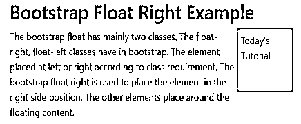
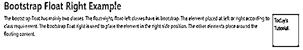
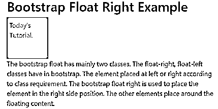
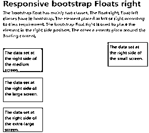
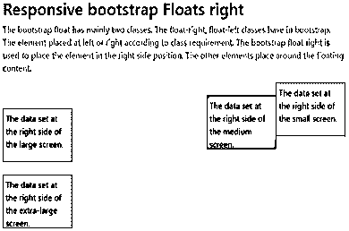
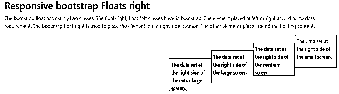

# 引导程序向右浮动

> 原文：<https://www.educba.com/bootstrap-float-right/>


## Bootstrap 右浮动简介

引导浮点主要有两个类。右浮动、左浮动类在 bootstrap 中有。根据类别要求放置在左侧或右侧的元素。右浮动用于将元素放置在右侧位置。浮动内容周围的其他元素。右侧浮动主要用于在右侧放置图像和突出显示元素。默认内容设置在左侧，但使用浮动右，我们可以将内容放在右侧。

### 右浮动是如何工作的？

在 web 应用程序中使用普通视口的右浮动类进行右浮动。根据设备屏幕宽度和大小使用的响应右浮动。这里我们用一个小屏幕的电话设备。

<small>网页开发、编程语言、软件测试&其他</small>

**举例:**

```
<!DOCTYPE html>
<html>
<head>
<title> Bootstrap Float Right Example </title>
<meta name= "viewport" content= "width=device-width, initial-scale=1">
<link rel= "stylesheet" href= "https://maxcdn.bootstrapcdn.com/bootstrap/4.1.0/css/bootstrap.min.css">
</head>
<body>
<div class="container">
<h2> Bootstrap Float Right Example </h2>
<div class="clear">
<div class="float-right"> Today’s Tutorial. </div>
The bootstrap float has mainly two classes. The float-right, float-left classes have in bootstrap. The element placed at left or right according to class requirement.
The bootstrap float right is used to place the element in the right side position. The other elements place around the floating content.
</div>
</div>
<script src= "https://ajax.googleapis.com/ajax/libs/jquery/3.3.1/jquery.min.js"></script>
<script src= "https://maxcdn.bootstrapcdn.com/bootstrap/4.1.0/js/bootstrap.min.js"></script>
</body>
</html>
```

**语法**

*   bootstrap float right 的主要语法如下。

```
<div class = "float- right" >
```

*   响应的浮动右下方。

| **自举右浮动语法** | **语法细节** |
| class= "float-sm-right " | 小屏幕右侧的数据集。 |
| class= "float-md-right " | 介质屏幕右侧的数据集。 |
| class= "float-lg-right " | 大屏幕右侧的数据集。 |
| class= "float-xl-right " | 超大屏幕右侧的数据集。 |

### 引导右浮动示例

以下是不同的例子:

#### 示例#1

使用右浮动的内容的标题和细节。例如使用的基本类 class="float-right"。

**代码:**

```
<!DOCTYPE html>
<html>
<head>
<title> Bootstrap Float Right Example </title>
<meta name= "viewport" content= "width=device-width, initial-scale=1">
<link rel= "stylesheet" href= "https://maxcdn.bootstrapcdn.com/bootstrap/4.1.0/css/bootstrap.min.css">
<style>
.float-right{
width: 100px;
height: 100px;
border: 1px solid black;
padding: 5px;
background-color: orange;
}
</style>
</head>
<body>
<div class= "container">
<h2> Bootstrap Float Right Example </h2>
<div class= "clear">
<div class= "float-right"> Today’s Tutorial. </div>
The bootstrap float has mainly two classes. The float-right, float-left classes have in bootstrap. The element placed at left or right according to class requirement.
The bootstrap float right is used to place the element in the right side position. The other elements place around the floating content.
</div>
</div>
<script src= "https://ajax.googleapis.com/ajax/libs/jquery/3.3.1/jquery.min.js"></script>
<script src= "https://maxcdn.bootstrapcdn.com/bootstrap/4.1.0/js/bootstrap.min.js"></script>
</body>
</html>
```

**输出**




**描述:**

1.  上面的输出在右侧显示了一个橙色的框。
2.  其余的元素自动设置在方框周围。

#### 实施例 2

下面是响应性右浮动的例子。

“float-sm-left”类用于小屏幕设备。

**代码:**

```
<!DOCTYPE html>
<html>
<head>
<title> Bootstrap Float Right Example </title>
<meta name = "viewport" content = "width=device-width, initial-scale=1">
<link rel = "stylesheet" href= "https://maxcdn.bootstrapcdn.com/bootstrap/4.1.0/css/bootstrap.min.css">
<style>
.float-md-right{
width: 100px;
height: 100px;
border: 1px solid black;
padding: 5px;
background-color: orange;
}
</style>
</head>
<body>
<div class= "container">
<h2> Bootstrap Float Right Example </h2>
<div class= "clear">
<div class= "float-md-right"> Today’s Tutorial. </div>
The bootstrap float has mainly two classes. The float-right, float-left classes have in bootstrap. The element placed at left or right according to class requirement.
The bootstrap float right is used to place the element in the right side position. The other elements place around the floating content.
</div>
</div>
<script src = "https://ajax.googleapis.com/ajax/libs/jquery/3.3.1/jquery.min.js">
</script>
<script src = "https://maxcdn.bootstrapcdn.com/bootstrap/4.1.0/js/bootstrap.min.js">
</script>
</body>
</html>
```

**中等尺寸屏幕的输出**




**小尺寸屏幕输出**




**描述:**

1.  以上输出根据中小屏幕尺寸而定。
2.  示例中使用的中等大小的右浮动类。
3.  当设备屏幕尺寸为中等或以上时，内容放置在右侧。
4.  小尺寸屏幕设备简单地显示其他 web 应用程序内容。

#### 实施例 3

下面的例子是所有屏幕尺寸的响应性右浮动。

**代码:**

```
<!DOCTYPE html>
<html>
<head>
<title> Bootstrap float right Example </title>
<meta name ="viewport" content ="width=device-width, initial-scale=1">
<link rel ="stylesheet" href= "https://maxcdn.bootstrapcdn.com/bootstrap/4.4.1/css/bootstrap.min.css">
<script src= "https://ajax.googleapis.com/ajax/libs/jquery/3.4.1/jquery.min.js">
</script>
<script src= "https://cdnjs.cloudflare.com/ajax/libs/popper.js/1.16.0/umd/popper.min.js">
</script>
<script src= "https://maxcdn.bootstrapcdn.com/bootstrap/4.4.1/js/bootstrap.min.js">
</script>
<style>
.float-md-right{
width: 140px;
height: 100px;
border: 1px solid black;
padding: 5px;
background-color: orange;
}
.float-sm-right{
width: 140px;
height: 100px;
border: 1px solid black;
padding: 5px;
background-color: yellow;
}
.float-lg-right{
width: 140px;
height: 100px;
border: 1px solid black;
padding: 5px;
background-color: lightgrey;
}
.float-xl-right{
width: 140px;
height: 100px;
border: 1px solid black;
padding: 5px;
background-color: lightblue;
}
</style>
</head>
<body>
<div class= "container">
<h2> Responsive bootstrap Floats right </h2>
<p> The bootstrap float has mainly two classes. The float-right, float-left classes have in bootstrap. The element placed at left or right according to class requirement.
The bootstrap float right is used to place the element in the right side position. The other elements place around the floating content.
</p>
<div class= "clear">
<div class= "float-sm-right"> The data set at the right side of the small screen.       </div> <br>
<div class= "float-md-right"> The data set at the right side of the medium screen.       </div> <br>
<div class= "float-lg-right"> The data set at the right side of the large screen.       </div> <br>
<div class= "float-xl-right"> The data set at the right side of the extra-large screen. </div> <br>
</div>
</div>
</body>
</html>
```

**小屏幕尺寸输出**




**中等屏幕尺寸输出**




**大屏幕输出**




**描述:**

1.  上述输出是小，中，大屏幕尺寸右浮动。
2.  当屏幕尺寸很大时，所有引导浮动内容都设置在右侧。
3.  用于中小型屏幕尺寸设备的 float-sm-right、float-md-right 类。

### 结论

浮动权限使 web 应用程序成为标准格式。它看起来用户友好，易于指出应用程序中的重要元素。web 应用程序看起来优雅、有吸引力，并且使用了右浮动格式。

### 推荐文章

这是一个引导浮动右。在这里，我们将讨论 Bootstrap float right 如何与示例一起工作。您也可以看看以下文章，了解更多信息–

1.  [引导组合框](https://www.educba.com/bootstrap-combobox/)
2.  [引导程序中的导航条](https://www.educba.com/navbar-in-bootstrap/)
3.  [引导折叠侧边栏](https://www.educba.com/bootstrap-collapse-sidebar/)
4.  [引导下拉菜单](https://www.educba.com/bootstrap-dropdown-menu/)


