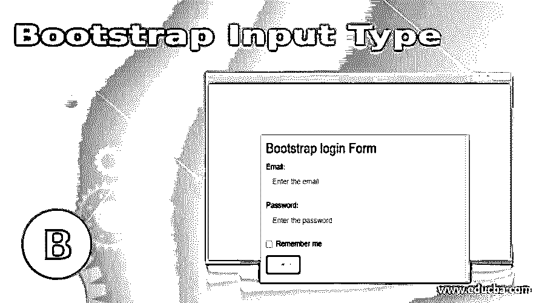
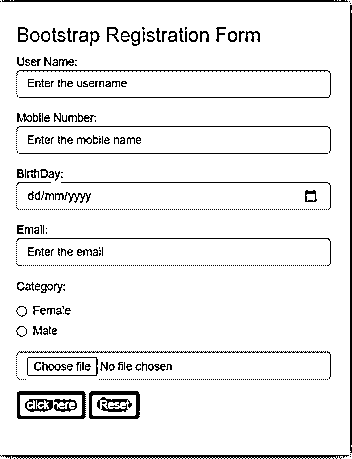
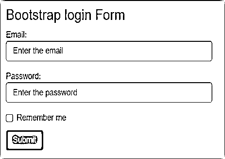

# 自举输入类型

> 原文：<https://www.educba.com/bootstrap-input-type/>




## 自举输入类型的定义

Bootstrap 输入类型是在 web 应用程序中收集用户信息的有用功能。在网站上收集和拥有不同的信息是一个有用的领域。引导输入类型接收不同格式的信息，如文本、数字、密码、日期、电子邮件。它最有用的形式是 web 应用程序。

语法:

<small>网页开发、编程语言、软件测试&其他</small>

*   基本的引导输入类型与 HTML 相同。语法如下。

```
<input type="type format name" >
```

*   具有 div 属性语法的引导输入类型如下。

```
<div class = "class name">
<form>
<input type="type format name">
</form>
</div>
```

### Bootstrap 输入类型如何工作？

引导输入从用户收集文本信息，然后使用以下引导输入类型格式。

*   **输入类型文本:**自举输入类型用于单行文本。

```
<form>
<div class="form-group">
UserName:
<input type="text" class="form-control" >
</div>
</form>
```

*   **输入类型密码:**密码使用自举输入类型。

```
<form>
<div class="form-group">
Password:
<input type="password" class="form-control" >
</div>
</form>
```

*   **输入类型 Email:** 自举输入类型用于 Email。

```
<form>
<div class="form-group">
Email:
<input type="email" class="form-control" >
</div>
</form>
```

*   **输入类型数字:**自举输入类型用于数字。

```
<form>
<div class="form-group">
Product Quantity:
<input type="number" class="form-control" >
</div>
</form>
```

*   **输入类型文件:**引导输入类型用于从设备中选择文件。

```
<form>
<div class="form-group">
Choose the File:
<input type="file" class="form-control" >
</div>
</form>
```

*   **输入类型 URL:** 引导输入类型用于 URL 地址。

```
<form>
<div class="form-group">
Add URLpage:
<input type="url" class="form-control" >
</div>
</form>
```

引导输入从许多选项中选择正确的信息，而不是使用下面的引导输入类型格式。

*   **输入类型复选框:**引导输入类型用于选择一个以上的选项。

```
<form>
Countries:
<div class="checkbox">
<input type="checkbox" value=" India "> India
</div>
<div class="checkbox">
<input type="checkbox" value="USA" >USA
</div>
<div class="checkbox">
<input type="checkbox" value="Canada " >Canada
</div>
<div class="checkbox">
<input type="checkbox" value="England" >England
</div>
</form>
```

*   **输入类型单选按钮:**自举输入类型用于选择唯一的一个选项。

```
<form>
Category:
<div class="radio">
<input type="radio" value="Female" >Female
</div>
<div class="radio">
<input type="radio" value="Male">Male
</div>
</form>
```

*   **输入类型日期:**引导输入类型用于选择日期。

```
<form>
<div class="form-group">
Birthday :
<input type="date" class="form-control" >
</div>
</form>
```

*   **输入类型本地日期和时间:**引导输入类型用于选择本地日期和时间。

```
<form>
<div class="form-group">
Birthday (Day and Time):
<input type="datetime-local" class="form-control" >
</div>
</form>
```

*   **输入类型范围:**bootstrap 输入类型用于选择最小值到最大值之间的数据范围。

```
<form>
<div class="form-group">
Select the range:
<input type="range" class="form-control" min="0" max="50">
</div>
</form>
```

引导输入类型使用按钮来重置和保存数据，然后使用以下格式。

*   **输入类型按钮:**按钮使用自举输入类型。

```
<input type="button" class="btnbtn-danger" value="Click Here">
```

*   **输入类型提交:**自举输入类型用于保存数据。

```
<input type="Submit" class="btnbtn-danger" value="Save">
```

*   **输入类型重置:**bootstrap 输入类型用于重置表单数据。

```
<input type="reset" class="btnbtn-danger" value="Reset">
```

高级 web 应用程序中使用的另一种引导输入类型。

*   **输入类型搜索:**引导输入类型用于搜索内容。

```
<form>
<div class="form-group">
Search:
<input type="search" class="form-control" >
</div>
</form>
```

*   **输入类型电话:**自举输入类型用于电话号码。

```
<form>
<div class="form-group">
Phone number:
<input type="tel" class="form-control"pattern="[0-9]{10}">
</div>
</form>
```

*   **输入类型颜色:**自举输入类型用于设置颜色。

```
<form>
<div class="form-group">
Search:
<input type="color" class="form-control" >
</div>
</form>
```

### 引导输入类型的示例

下面是一些例子:

#### 示例#1

使用 bootstrap 输入类型的登记表。在示例中，我们使用文本、电话、日期、单选、提交和重置引导输入类型。

**代码:**

```
<!DOCTYPE html>
<html>
<head>
<meta name = "viewport" content= "width=device-width, initial-scale=1">
<link rel = "stylesheet" href = "https://maxcdn.bootstrapcdn.com/bootstrap/3.4.1/css/bootstrap.min.css">
<script src = "https://ajax.googleapis.com/ajax/libs/jquery/3.5.1/jquery.min.js">
</script>
<script src = "https://maxcdn.bootstrapcdn.com/bootstrap/3.4.1/js/bootstrap.min.js">
</script>
</head>
<body>
<div class="container-fluid">
<h3>Bootstrap Registration Form</h3>
<form>
<div class= "form-group">
User Name:
<input type= "text" class= "form-control" placeholder= "Enter the username">
</div>
<div class= "form-group">
Mobile Number:
<input type= "tel" class= "form-control" placeholder= "Enter the mobile name">
</div>
<div class= "form-group">
BirthDay:
<input type= "date" class= "form-control" placeholder= "Enter the birthdate">
</div>
<div class= "form-group">
Email:
<input type= "email" class= "form-control" placeholder= "Enter the email">
</div>
<div class= "form-group">
Category:
<div class="radio">
<label><input type="radio" value="Female" > Female </label>
</div>
<div class="radio">
<label><input type="radio" value="Male"> Male </label>
</div>
</div>
<div class="form-group">
<input type="file" class="form-control" >
</div>
<input class= "btnbtn-danger" type= "submit">
<input class= "btnbtn-danger" type= "reset">
</form>
</div>
</body>
</html>
```

**输出**




#### 实施例 2

使用 bootstrap 输入类型的登录表单。在示例中，我们使用电子邮件、密码、复选框和提交引导输入类型。

**代码:**

```
<!DOCTYPE html>
<html>
<head>
<meta name = "viewport" content= "width=device-width, initial-scale=1">
<link rel = "stylesheet" href = "https://maxcdn.bootstrapcdn.com/bootstrap/3.4.1/css/bootstrap.min.css">
<script src = "https://ajax.googleapis.com/ajax/libs/jquery/3.5.1/jquery.min.js">
</script>
<script src = "https://maxcdn.bootstrapcdn.com/bootstrap/3.4.1/js/bootstrap.min.js">
</script>
</head>
<body>
<div class="container-fluid">
<h3> Bootstrap login Form </h3>
<form>
<div class= "form-group">
Email:
<input type= "email" class= "form-control"  placeholder= "Enter the email">
</div>
<div class= "form-group">
Password:
<input type= "password" class= "form-control" placeholder= "Enter the password">
</div>
<div class= "checkbox">
<label>
<input type= "checkbox"> Remember me
</label>
</div>
<input class= "btnbtn-danger" type= "submit">
</form>
</div>
</body>
</html>
```

**输出:**




#### 实施例 3

带导航的引导输入类型表单。我们在示例中使用搜索和按钮引导输入类型。

**代码:**

```
<!DOCTYPE html>
<html>
<head>
<title> Bootstrap Input Type </title>
<meta name = "viewport" content= "width=device-width, initial-scale=1">
<link rel = "stylesheet" href = "https://maxcdn.bootstrapcdn.com/bootstrap/3.4.1/css/bootstrap.min.css">
<script src = "https://ajax.googleapis.com/ajax/libs/jquery/3.5.1/jquery.min.js">
</script>
<script src = "https://maxcdn.bootstrapcdn.com/bootstrap/3.4.1/js/bootstrap.min.js">
</script>
</head>
<body>
<nav class= "navbarnavbar-inverse">
<div class= "container-fluid">
<ul class= "navnavbar-nav">
<li class= "active"><a href="#">Home</a></li>
</ul>
<form class= "navbar-form navbar-left">
<div class= "form-group">
<input type= "search" class="form-control" placeholder="Search" >
</div>
<input type="button" class="btnbtn-warning" value="Enter"></button>
</form>
</div>
</nav>
</body>
</html>
```

**输出:**


### 推荐文章

这是一个引导输入类型的指南。在这里，我们还讨论了 bootstrap 输入类型的定义和工作方式，以及不同的例子和代码实现。您也可以看看以下文章，了解更多信息–

1.  [Bootstrap Datepicker](https://www.educba.com/bootstrap-datepicker/)
2.  [引导转盘](https://www.educba.com/bootstrap-carousel/)
3.  [自举余量](https://www.educba.com/bootstrap-margin/)
4.  [引导所见即所得](https://www.educba.com/bootstrap-wysiwyg/)


