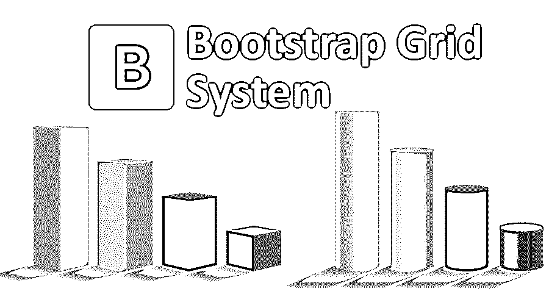

# 引导网格系统

> 原文：<https://www.educba.com/bootstrap-grid-system/>

## 什么是 Bootstrap 网格系统？

Bootstrap Grid System 是一个由 HTML/CSS 元素组成的集合，它使你能够推出一个网站，并帮助你轻松地保持网站内容的重要设置。如果你想创建一个健壮的网站布局，那么这个系统可能是实现它的完美选择，它能够为各种移动设备快速生成网格布局。它使您能够精心设计列和行，从而将数据放置在“相交”区域。自举网格系统能够生成十二列和无数行，也称为十二网格系统。

### 了解引导网格系统

该电网系统由三部分组成，即:

<small>网页开发、编程语言、软件测试&其他</small>

*   **容器:** A ' < div >'元素有效地保存行和列，并在为特定布局提供正确的宽度方面起着至关重要的作用。
*   **行:**是一个类。释放填充菜单并作为所有列的包装的行组件。
*   **列:**在 Bootstrap 中，不同的列类前缀用于不同大小的设备。

**比如**–。col-xs-前缀用于设备尺寸< 768px。

### Bootstrap 网格系统如何让工作变得如此简单？

借助 Bootstrap，基于 Flexbox 进行布局变得很容易，从而实现所需的里程碑。创建高度和宽度相似的柱子是这个网格系统的一个主要诀窍，这使它独一无二，并帮助您实现更真实的柱子。

### 你能用 Bootstrap 网格系统做什么？

使用引导网格系统将允许您:

*   创建两列、三列、自动列、多列和紧凑列布局。

它还有助于:

*   网格列的偏移、嵌套、对齐和重新排序。

### 使用引导网格系统

使用引导网格系统带来了一组重要的规则，包括:

*   列应该是行的即时子级。
*   行应该只包含列。
*   行的正确位置在容器内部。

### 优势

它是一个具有开箱即用特性的框架。它是最前沿的发现之一，在更容易、更好地创建网站和应用程序方面发挥着关键作用。

*   开发速度:提供较少的 CSS 功能和默认代码，帮助你节省时间。此外，其方便的主题有助于按时实现您的目标。
*   **警觉性:**它配备了一个响应式实用程序类功能和一个响应式框架，该框架具有修改屏幕分辨率的技能，从而允许您隐藏/显示特定部分的内容。
*   **一致性:**从长远来看，它确保了产生盈利结果的最大一致性。
*   可定制:这是一个提供个性化服务的综合平台，旨在设计最适合您个人资料的网站。此外，它的选择任何功能，使您能够从其余的选择最好的！
*   **支持:**它由强大的支持社区提供支持，并定期更新以减少风险问题。

### 所需技能

下面是掌握引导网格系统技能所需的一些技能:

#### 1.HTML 基础

在尝试使用 Bootstrap Grid 系统之前，有必要了解 HTML 的基本知识。在使用 Bootstrap Grid 系统时，对 HTML 的基本理解肯定会给你带来优势。

#### 2.CSS 的基础知识

Bootstrap 使用 CSS、JavaScript 和 HTML 工作。因此，对 CSS 的理解是所有想要掌握 Bootstrap 的专业人员的必备技能。

#### 3.JQuery 的基础知识

对 jQuery 的基本理解很重要，因为 Bootstraps 包括 jQuery 框架的一些部分。简而言之，在使用 Bootstrap 之前，了解 CSS、HTML 和 jQuery 的基础知识非常重要。但是，即使你对这三个有了基本的了解，你也可以开始使用 Bootstrap 来开发一个网站。

### 为什么要使用自举网格系统？

以下是使用它的一些原因:

*   **优秀的网格系统:**对于创建任何页面布局来说，需要一个优秀的网格系统是至关重要的。Bootstrap 拥有响应速度最快的网格系统之一。在隐藏内容时，它非常方便。
*   **快速易用:**由于 bootstrap 有预定义的类和模板，减少了编码的[需求](https://www.educba.com/what-is-coding/)。借助 bootstrap，你可以轻松开发一个网站。Bootstrap 是市场上最快和最容易使用的前端框架之一。
*   响应性:在这个数字世界中，创建一个响应性网站的需求至关重要。它的流体网格布局可以调整到完美的屏幕分辨率。使用 Bootstrap，您可以轻松创建一个移动响应网站。
*   开源:由于这是一个开源平台，您不必处理许可和购买问题。
*   **一致性:**在 Bootstrap 的帮助下，你可以解决开发者和设计者之间的不一致。中央开发代码集解决了开发前端和最终用户前端之间的问题。每个平台都从 Bootstrap 得到类似的结果。无论是 Chrome、Firefox 还是 Internet Explorer，Bootstrap 在所有浏览平台上看起来都是一样的。不管谁在项目中工作。Bootstrap 为用户提供了很好的一致性。

### Bootstrap 如何帮助你的职业发展？

在当今互联的数字世界中，互联网在商业世界中扮演着重要的角色。拥有引导技能的专业人士在这个数字世界里有极好的机会。拥有 HTML、JavaScript、jQuery 和 Bootstrap 知识的专业人士可以在许多领域取得成功。当然，每个人学习不同技术的原因都不一样，但是学习 Bootstrap 肯定会增加你的技能，并提供许多发展机会和金钱。

### 结论

在上面的文章中，我们提出了关于引导网格系统的一个要点。本文给出了关于 Bootstrap 网格系统的信息、它的基本原理、它的工作方式以及它的优点。它是一个前端的开源框架，结合了 CSS、HTML 和 JavaScript。借助 Bootstrap，您可以轻松开发一个移动就绪、响应迅速的网站。

### 推荐文章

这是一个引导网格系统的指南。在这里，我们讨论工作，优势，所需的技能，以及为什么我们应该使用引导网格系统。您也可以浏览我们推荐的其他文章，了解更多信息——

1.  [什么是自举？](https://www.educba.com/what-is-bootstrap/)
2.  [引导命令](https://www.educba.com/bootstrap-commands/)
3.  [引导组件](https://www.educba.com/bootstrap-components/)
4.  [引导雕刻图案](https://www.educba.com/bootstrap-glyphicons/)

