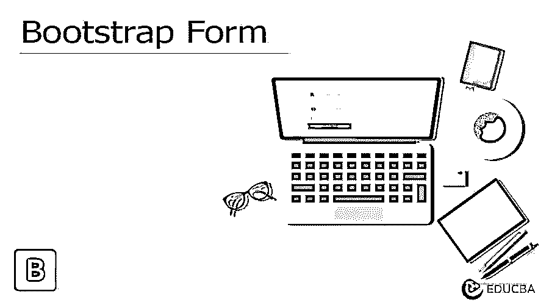
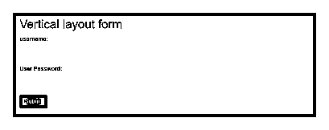
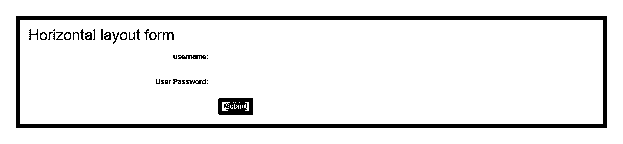
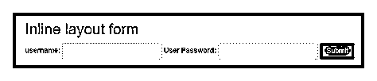
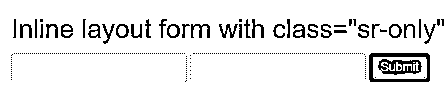

# 自举形式

> 原文：<https://www.educba.com/bootstrap-form/>




## 引导表单介绍

表单是每个网站和 web 应用程序最常见和最重要的组件。引导表单是用于用户输入或信息的引导组件。它有助于自动控制样式和布局。它有选择表单样式和布局的类。它有三种布局，即垂直布局、水平布局和内嵌布局。

### 句法

bootstrap 表单需要这两个类。

<small>网页开发、编程语言、软件测试&其他</small>

1.  类窗体组放在主 div 标签中。它用于表格中的间距。
2.  form-control 类放在文本元素中。它用于控制所有的输入元件。

有三种类型的引导表单，它们的语法如下。

#### 1.垂直布局形式

```
<form>
<div class ="form-group">
<label for ="name"> Name: </label>
<input type ="text" class ="form-control" id="name" />
</div>
</form>
```

#### 2.水平布局形式

```
<form class ="form-horizontal">
<div class ="form-group">
<label for ="name" class ="control-label" > Name: </label>
<input type ="text" class ="form-control" id="name" />
</div>
</form>
```

#### 3.嵌入式布局表单

```
<form class ="form-inline" >
<div class ="form-group" >
<label for ="name"> Name: </label>
<input type ="text" class ="form-control" id="name" />
</div>
</form>
```

### 自举表单是如何工作的？

1.垂直布局形式。

*   垂直布局表单是 bootstrap 中的默认表单。
*   用于垂直布局表单的 class ="form-group "和 class ="form-control"。

```
<form>
<div class="form-group">
<label for="uname">username:</label>
<input type="text" class="form-control" id="uname">
</div>
<div class="form-group">
<label for="paswrd"> User Password:</label>
<input type="password" class="form-control" id="paswrd" >
</div>
<button type="submit" class="btn btn-primary">Submit</button>
</form>
```

2.水平布局形式。

*   标签和文本元素并排是一种水平布局形式的格式。
*   放置在

    <form>标签中的 class ="form-horizontal"。</form>

*   放置在<label>标签中的 class ="control-label"。</label>

```
<form class="form-horizontal">
<div class="form-group">
<label for="uname" class="control-label col-md-4">username:</label>
<div class="col-md-8">
<input type="text" class="form-control" id="uname">
</div>
</div>
<div class="form-group">
<label for="paswrd" class="control-label col-md-4"> User Password:</label>
<div class="col-md-8">
<input type="password" class="form-control" id="paswrd" >
</div>
</div>
<button type="submit" class="btn btn-primary col-md-offset-4">Submit</button>
</form>
```

3.内嵌表单。

*   所有文本元素和文本都在一行中。
*   内嵌表单在大屏幕上显示。屏幕尺寸必须至少为 768 像素。

```
<form class ="form-inline">
<div class="form-group">
<label for="uname">username:</label>
<input type="text" class="form-control" id="uname">
</div>
<div class="form-group">
<label for="paswrd"> User Password:</label>
<input type="password" class="form-control" id="paswrd" >
</div>
<button class ="btn btn-primary" type="submit" > SUBMIT </button>
</form>
```

*   内嵌表单在大屏幕上显示。
*   class="sr-only "用于隐藏引导程序内联形式中的标签。

```
<form class ="form-inline">
<div class ="form-group">
<label for ="uname" class="sr-only" > Name: </label>
<input type ="text" class="form-control" id="uname" />
</div>
<div class ="form-group">
<label for ="Paswrd" class="sr-only" > Password: </label>
<input type ="password" class="form-control" id="paswrd" />
</div>
<button class ="btn btn-primary" type="submit" > SUBMIT </button>
</form>
```

*   表单验证使用验证的引导类。

```
<form  class="was-validated" >
<div class="form-group">
<label for="eml"> Email: </label>
<input type="text" class="form-control" id="eml"  name="uname" required>
<div class="valid-feedback" > Valid. </div>
<div class="invalid-feedback" > Please fill out this field. </div>
</div>
</form>
```

### 例子

以下是不同的例子:

#### 示例 1–垂直布局表单或默认表单

**代码:**

```
<!DOCTYPE html>
<html>
<head>
<title> Bootstrap form Example </title>
<meta charset ="utf-8">
<meta name ="viewport" content= "width=device-width, initial-scale=1">
<link rel = "stylesheet" href ="https://maxcdn.bootstrapcdn.com/bootstrap/3.4.1/css/bootstrap.min.css">
<script src= "https://ajax.googleapis.com/ajax/libs/jquery/3.5.1/jquery.min.js">
</script>
<script src= "https://maxcdn.bootstrapcdn.com/bootstrap/3.4.1/js/bootstrap.min.js">
</script>
</head>
<body>
<div class= "container">
<h2> Vertical layout form </h2>
<form>
<div class="form-group">
<label for="uname"> username: </label>
<input type= "text" class= "form-control" id= "uname">
</div>
<div class="form-group">
<label for="paswrd"> User Password: </label>
<input type= "password" class= "form-control" id= "paswrd" >
</div>
<button type="submit" class="btn btn-primary"> Submit </button>
</form>
</div>
</body>
</html>
```

**输出:**




#### 示例 2–水平布局表单

**代码:**

```
<!DOCTYPE html>
<html>
<head>
<title> Bootstrap form Example </title>
<meta charset ="utf-8">
<meta name ="viewport" content="width=device-width, initial-scale=1">
<link rel ="stylesheet" href ="https://maxcdn.bootstrapcdn.com/bootstrap/3.4.1/css/bootstrap.min.css">
<script src= "https://ajax.googleapis.com/ajax/libs/jquery/3.5.1/jquery.min.js"></script>
<script src= "https://maxcdn.bootstrapcdn.com/bootstrap/3.4.1/js/bootstrap.min.js"></script>
</head>
<body>
<div class= "container">
<h2> Horizontal layout form </h2>
<form class= "form-horizontal">
<div class= "form-group">
<label for= "uname" class= "control-label col-md-4"> username : </label>
<div class="col-md-8">
<input type= "text" class= "form-control" id= "uname">
</div>
</div>
<div class="form-group">
<label for= "paswrd" class= "control-label col-md-4"> User Password: </label>
<div class= "col-md-8">
<input type= "password" class= "form-control" id="paswrd" >
</div>
</div>
<button type= "submit" class= "btn btn-primary col-md-offset-4"> Submit </button>
</form>
</div>
</body>
</html>
```

**输出:**




#### 示例# 3–内嵌表单

**代码:**

```
<!DOCTYPE html>
<html>
<head>
<title> Bootstrap form Example </title>
<meta charset ="utf-8">
<meta name ="viewport" content="width=device-width, initial-scale=1">
<link rel ="stylesheet" href ="https://maxcdn.bootstrapcdn.com/bootstrap/3.4.1/css/bootstrap.min.css">
<script src= "https://ajax.googleapis.com/ajax/libs/jquery/3.5.1/jquery.min.js"></script>
<script src= "https://maxcdn.bootstrapcdn.com/bootstrap/3.4.1/js/bootstrap.min.js"></script>
</head>
<body>
<div class= "container">
<h2> Inline layout form </ h2>
<form class= "form-inline">
<div class= "form-group">
<label for="uname" > username: </label>
<input type="text" class="form-control" id="uname">
</div>
<div class= "form-group">
<label for="paswrd" > User Password: </label>
<input type="password" class= "form-control" id="paswrd" >
</div>
<button type= "submit" class= "btn btn-primary "> Submit </button>
</form>
</div>
</body>
</html>
```

**输出:**




#### 示例 4–使用 sr-only 类的内联表单

**代码:**

```
<!DOCTYPE html>
<html>
<head>
<title> Bootstrap form Example </title>
<meta charset ="utf-8">
<meta name ="viewport" content="width=device-width, initial-scale=1">
<link rel ="stylesheet" href ="https://maxcdn.bootstrapcdn.com/bootstrap/3.4.1/css/bootstrap.min.css">
<script src= "https://ajax.googleapis.com/ajax/libs/jquery/3.5.1/jquery.min.js">
</script>
<script src= "https://maxcdn.bootstrapcdn.com/bootstrap/3.4.1/js/bootstrap.min.js">
</script>
</head>
<body>
<div class= "container">
<h2> Inline layout form with class="sr-only" </h2>
<form class= "form-inline">
<div class= "form-group">
<label for="uname" class= "sr-only" >username:</label>
<input type="text" class= "form-control" id="uname">
</div>
<div class= "form-group">
<label for= "paswrd" class= "sr-only" > User Password: </label>
<input type= "password" class= "form-control" id= "paswrd" >
</div>
<button type ="submit" class ="btn btn-primary "> Submit </button>
</form>
</div>
</body>
</html>
```

**输出:**




#### 示例 5–验证表格

**代码:**

```
<!DOCTYPE html>
<html >
<head>
<title> Bootstrap form Example </title>
<meta charset= "utf-8">
<meta name= "viewport" content= "width=device-width, initial-scale=1">
<link rel= "stylesheet" href= "https://maxcdn.bootstrapcdn.com/bootstrap/4.5.0/css/bootstrap.min.css">
<script src= "https://ajax.googleapis.com/ajax/libs/jquery/3.5.1/jquery.min.js"></script>
<script src= "https://cdnjs.cloudflare.com/ajax/libs/popper.js/1.16.0/umd/popper.min.js"></script>
<script src= "https://maxcdn.bootstrapcdn.com/bootstrap/4.5.0/js/bootstrap.min.js"></script>
</head>
<body>
<div class= "container">
<h2> Form Validation in bootstrap </h2>
<form  class= "was-validated">
<div class= "form-group">
<label for= "eml"> Email: </label>
<input type= "text" class= "form-control" id= "eml"  required>
<div class= "valid-feedback"> Valid. </div>
<div class= "invalid-feedback"> Please fill out this field. </div>
</div>
<button type= "submit" class= "btn btn-primary"> Submit </button>
</form>
</div>
</body>
</html>
```

**输出:**


### 结论

*   它是用于用户请求或连接的组件。
*   它使用 HTML 和 CSS 减少了冗长的代码。对于所需的表单布局，只有一个类就足够了。
*   它有助于表单的简单验证。

### 推荐文章

这是一个自举形式的指南。在这里，我们将讨论简介、语法、工作原理，以及示例和代码实现。您也可以浏览我们推荐的其他文章，了解更多信息——

1.  [引导程序中的图像滑块](https://www.educba.com/image-slider-in-bootstrap/)
2.  [自举搜索框](https://www.educba.com/bootstrap-search-box/)
3.  [引导程序块引用](https://www.educba.com/bootstrap-blockquote/)
4.  [自举容器流体](https://www.educba.com/bootstrap-container-fluid/)


