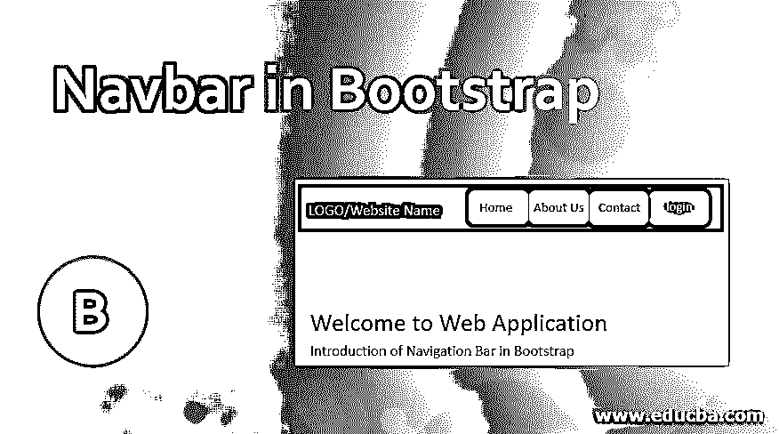
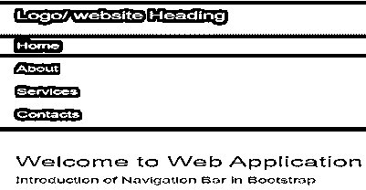
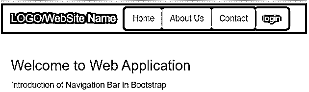
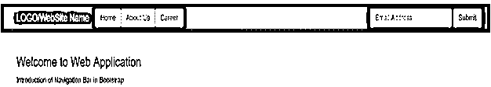

# 引导程序中的导航条

> 原文：<https://www.educba.com/navbar-in-bootstrap/>




## Bootstrap 中的 Navbar 简介

bootstrap 中的导航栏用作网站或 web 应用程序的标题。它被放置在应用程序的顶部。导航条的作用相当于通过一次点击来导航内容。帮助用户找到特定的内容位置。Navbar 具有响应性，它会根据笔记本电脑、手机和平板电脑等设备来调整大小。Navbar 在大屏幕上只占用一行，但是小屏幕比大屏幕占用更多的空间。

### 句法

bootstrap 中常用的两种导航条。一个是默认，另一个是反向。您可以在下面看到这两种导航条语法。

<small>网页开发、编程语言、软件测试&其他</small>

**1。对于默认导航栏**

```
<nav class ="navbar navbar-default">
```

**代码:**

```
<nav class="navbar navbar-default">
<div class="container">
<div class="navbar-header">
<a class="navbar-brand" href="#"> Logo </a>
</div>
<ul class="nav navbar-nav">
<li class="active"><a href="#"> Home </a></li>
<li><a href="#"> About </a></li>
<li><a href="#"> Services </a></li>
<li><a href="#"> Contacts </a></li>
</ul>
</div>
</nav>
```

**2。用于反导航条**

```
<nav class ="navbar navbar-inverse">
```

**代码:**

```
<nav class="navbar navbar-inverse">
<div class="container">
<div class="navbar-header">
<a class="navbar-brand" href="#"> Logo </a>
</div>
<ul class="nav navbar-nav">
<li class="active"> <a href="#"> Home </a></li>
<li><a href="#"> About </a></li>
<li><a href="#"> Services </a></li>
<li><a href="#"> Contacts </a></li>
</ul>
</div>
</nav>
```

**解释:**类 navbar 我们必须在主类中使用 navbar-default 或 navbar-inverse。此类 navbar-header 后用于标题名称或放置徽标。与列表属性中的 navbar-nav 类一起放置的 navbar 标题链接。用于 list 属性的 navbar-nav 类。列表属性是网站内容的索引或标题。

### 如何在 Bootstrap 中使用 Navbar？

简单的导航栏使用默认的标题和链接。没有设计和风格。

**1。默认导航栏**

**代码:**

```
<nav class="navbar navbar-default">
<div class="container">
<div class="navbar-header">
<a class="navbar-brand" href="#"> Logo/ website Heading </a>
</div>
<ul class="nav navbar-nav">
<li class="active"><a href="#"> Home </a></li>
<li><a href="#"> About </a></li>
<li><a href="#"> Services </a></li>
<li><a href="#"> Contacts </a></li>
</ul>
</div>
</nav>
<div class="container">
<h3> Welcome to Web Application </h3>
<p> Introduction of Navigation Bar in Bootstrap </p>
</div>
```

**输出:**


**解释:**当用户想要黑色背景色和白色字体色时，使用反向导航条。用户希望将列表放在标题的右侧。

#### 2.反向导航条

**代码:**

```
<nav class="navbar navbar-inverse">
<div class="container">
<div class="navbar-header">
<a class="navbar-brand" href="#"> Logo/ website Heading </a>
</div>
<ul class="nav navbar-nav navbar-right">
<li class="active"><a href="#"> Home </a></li>
<li><a href="#"> About </a></li>
<li><a href="#"> Services </a></li>
<li><a href="#"> Contacts </a></li>
</ul>
</div>
</nav>
<div class="container">
<h3> Welcome to Web Application </h3>
<p> Introduction of Navigation Bar in Bootstrap </p>
</div>
```

**输出:**





**解释:**以上两个是几乎每个网站和 web 应用都会用到的基本 navbar。根据需求和合适的样式，导航条可以选择默认或反向。我们可以在反向导航条中看到 navbar 如何在大屏幕和短屏幕上工作。

#### 3.固定导航条

navbar 放置在标题中，但有些 navbar 并不固定在应用程序的顶部。在应用程序中使用滚动条后，导航栏看起来是可见的。用于 bootstrap 中固定可见导航条的固定顶部类。

**代码:**

```
<nav class ="navbar navbar-inverse navbar-fixed-top ">
<div class="container">
<div class="navbar-header">
<a class="navbar-brand" href="#"> Logo/ website Heading </a>
</div>
<ul class="nav navbar-nav navbar-right">
<li class="active"><a href="#"> Home </a></li>
<li><a href="#"> About </a></li>
<li><a href="#"> Services </a></li>
<li><a href="#"> Contacts </a></li>
</ul>
</div>
</nav>
```

### 在 Bootstrap 中实现导航条的示例

以下是要实施的示例:

#### 示例#1

下面的例子有一个带下拉列表的反向导航条。下拉列表用于节省空间的内容。导航栏的右侧放置 Sine Up 并使用 glyphicon 登录。

**代码:**

```
<body>
<nav class="navbar navbar-inverse">
<div class="container">
<div class="navbar-header">
<a class="navbar-brand" href="#"> Logo/ website Heading </a>
</div>
<ul class="nav navbar-nav">
<li class="active"><a href="#"> Home </a></li>
<li><a href="#"> Blogs </a></li>
<li class="dropdown"><a class="dropdown-toggle" data-toggle="dropdown" href="#"> About us </a>
<ul class="dropdown-menu">
<li><a href="#"> services </a></li>
<li><a href="#"> career </a></li>
<li><a href="#"> contact </a></li>
</ul>
</li>
</ul>
<ul class ="nav navbar-nav navbar-right">
<li> <a href="#">  Sign Up </a></li>
<li> <a href="#">  Login
</a></li>
</ul>
</div>
</nav>
<div class ="container">
<h3> Welcome to Web Application </h3>
<p> Introduction of Navigation Bar in Bootstrap </p>
</div>
</body>
```

**输出:**

**

** 

#### 实施例 2

我们可以在导航栏中使用一个按钮，这样既方便又有吸引力。用于在导航栏中放置按钮的 navbar-btn 类。在按钮类中，我们使用了默认按钮和危险按钮。

**代码:**

```
<body>
<nav class= "navbar navbar-inverse">
<div class= "container">
<div class= "navbar-header">
<a class= "navbar-brand" href="#"> LOGO/WebSite Name </a>
</div>
<ul class= "nav navbar-nav ">
<li class=" active"> <button class="btn btn-default navbar-btn"> <a href="#"> Home </a> </button> </li>
<li><button class= "btn btn-default navbar-btn"><a href="#"> About Us </a> </button> </li>
<li><button class= "btn btn-default navbar-btn"><a href="#"> Contact </a> </button> </li>
</ul>
<button class= "btn btn-danger navbar-btn"> login </button>
</div>
</nav>
<div class= "container">
<h3> Welcome to Web Application </h3>
<p> Introduction of Navigation Bar in Bootstrap </p>
</div>
</body>
```

**输出:**




#### 实施例 3

在这个例子中，我们使用按钮和表单来连接用户。这是一个反向导航栏，链接使用了 navbar-btn 类。在 navbar 标题列表中使用的 navbar-form 类，用于显示表单内容。在这个表单中，我们使用电子邮件和提交按钮的输入属性。例子如下。

**代码:**

```
<body>
<nav class="navbar navbar-inverse">
<div class="container">
<div class="navbar-header">
<a class="navbar-brand" href="#"> LOGO/WebSite Name </a>
</div>
<ul class="nav navbar-nav ">
<li class=" active"> <button class="btn btn-default navbar-btn"> <a href="#"> Home </a> </button> </li>
<li> <button class="btn btn-default navbar-btn"> <a href="#"> About Us </a> </button> </li>
<li> <button class="btn btn-default navbar-btn"> <a href="#"> Career </a> </button> </li>
</ul>
<form class ="navbar-form navbar-right" >
<div class ="form-group">
<input type ="text" class="form-control" placeholder =" Email Address ">
</div>
<button type ="submit" class ="btn btn-default"> Submit </button>
</form>
</div>
</nav>
<div class ="container">
<h3> Welcome to Web Application </h3>
<p> Introduction of Navigation Bar in Bootstrap </p>
</div>
</body>
```

**输出:**




### 结论

导航栏是所有网站内容的标题列表。这总是放在应用程序的顶部。导航栏的大小可以根据设备屏幕的大小而变化。如果你想在整个网站上查找联系人，只需点击联系人链接或按钮。联系人页面会自动显示在屏幕上。我们可以把 navbar 当做网站的一个索引。你得到了一个网站列表，所有的内容都在一行中。

### 推荐文章

这是一个引导 Navbar 的指南。在这里，我们讨论语法，如何简单的 navbar 工作和例子，以实现适当的代码和输出。您也可以浏览我们的其他相关文章，了解更多信息——

1.  [自举折叠](https://www.educba.com/bootstrap-collapse/)
2.  [引导雕刻图案](https://www.educba.com/bootstrap-glyphicons/)
3.  [引导命令](https://www.educba.com/bootstrap-commands/)
4.  [引导折叠导航条](https://www.educba.com/bootstrap-collapse-navbar/)


