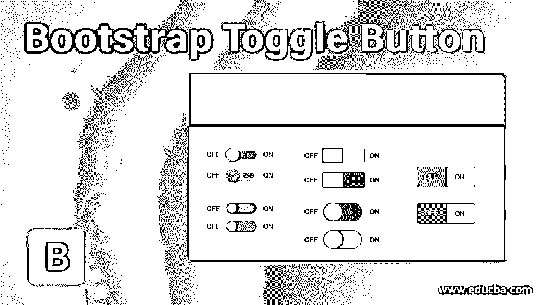
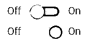
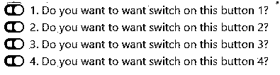
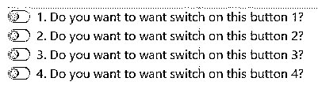
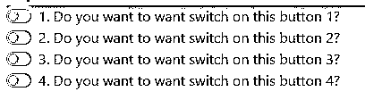
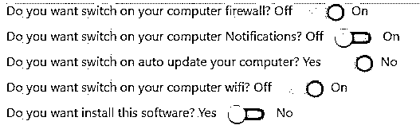
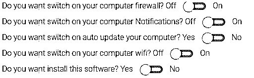

# 引导切换按钮

> 原文：<https://www.educba.com/bootstrap-toggle-button/>




## 引导切换按钮介绍

引导程序中的切换按钮用于从 2 个切换按钮选项中选择任何一个选项。切换按钮也称为开关按钮。我们可以通过使用<input type="”checkbox”">来实现切换按钮功能。它用于激活两个预定义选项中的一个选项。我们可以说这个按钮是开/关动作按钮。




<small>网页开发、编程语言、软件测试&其他</small>

这个切换按钮大部分时间用于与问题相关的表单。

**举例:**你有残疾吗？是/否。如果我们选择是，那么我们必须提供更多信息，如残疾类型、残疾百分比、残疾时间等。

由于这些切换按钮，我们可以通过禁用不适用的选项来减少表单填写时间。切换按钮使用区域:

*   开/关功能
*   形式
*   偏好选择

### 为什么 Bootstrap 超过 HTML？

*   在 HTML 中，开发人员必须编写每一个类、id、链接、按钮、层叠样式等..
*   而在 Bootstrap 中，大多数预定义的类、链接和按钮等。使用它们自己的级联样式来降低代码复杂性。

**Note:** Bootstrap files are also saved with .html extension.

### 它在 Bootstrap 中是如何工作的？

基于<input type="”checkbox”" class="”" any="" bootstrap="" predefined="">工作的引导切换按钮。

#### 1.默认切换按钮

**语法:**

```
<div class="custom-control custom-switch">
<input type="checkbox" class="custom-control-input">
<label class="custom-control-label" for="customSwitches">Any statement</label>
</div>
```

**说明:**

*   class = " custom-control custom-switch " >为复选框按钮提供预定义的引导样式，并提供默认的切换按钮。
*   class=" custom-control-input "使复选框成为自定义控件输入按钮。
*   class="custom-control-label "使用默认样式制作标签。
*   for="customSwitches **"** 使切换按钮迭代。

#### 2.开关按钮

**语法:**

```
<div class="switch">
<label>
Off
<input type="checkbox" checked>
 On
</label>
</div>
```

**说明:**

*   class="switch "用于创建开关切换按钮。
*   class="lever "使按钮具有开/关功能。

#### 3.具有禁用属性的默认切换按钮

**语法:**

```
<div class="custom-control custom-switch">
<input type="checkbox" class="custom-control-input" disabled=”disbaled”>
<label class="custom-control-label" for="customSwitches">Any statement</label>
</div>
```

#### 4.具有禁用属性的开关切换按钮

**语法:**

```
<div class="switch">
<label>
Off
<input type="checkbox" disabled=”disbaled”>
 On
</label>
</div>
```

包括引导功能，我们必须在应用程序中指定一些预定义的库。它们如下:

**1。包括引导视图**

```
<link rel="stylesheet" href="https://maxcdn.bootstrapcdn.com/bootstrap/4.4.1/css/bootstrap.min.css">
```

**2。它包括 ajax 和 jQuery 库**

```
<script src="https://ajax.googleapis.com/ajax/libs/jquery/3.4.1/jquery.min.js"></script>
```

**3。它包括引导库**

```
<script src="https://cdnjs.cloudflare.com/ajax/libs/popper.js/1.16.0/umd/popper.min.js"></script>
```

**4。它包括引导库**

```
<script src="https://maxcdn.bootstrapcdn.com/bootstrap/4.4.1/js/bootstrap.min.js"></script>
```

**Note:** All the examples run in the https://mdbootstrap.com/snippets/jquery/temp/1785302?action=prism_export online compiler. You should run only inside the body part code only.

### 引导切换按钮示例

下面是提到的例子:

#### 示例#1

默认切换按钮。

**代码:**

```
<!DOCTYPE html>
<html>
<head>
<title>Toggle/Switch Button</title>
<meta charset="utf-8">
<meta name="viewport" content="width=device-width, initial-scale=1">
<link rel="stylesheet"
href="https://maxcdn.bootstrapcdn.com/bootstrap/4.4.1/css/bootstrap.min.css">
<script
src="https://ajax.googleapis.com/ajax/libs/jquery/3.4.1/jquery.min.js"></script>
<script
src="https://cdnjs.cloudflare.com/ajax/libs/popper.js/1.16.0/umd/popper.min.js"></script>
<script
src="https://maxcdn.bootstrapcdn.com/bootstrap/4.4.1/js/bootstrap.min.js"></script>
</head>
<body>
<div class="custom-control custom-switch">
<input type="checkbox" class="custom-control-input" id="customSwitches">
<label class="custom-control-label" for="customSwitches">1\. Do you want to want switch on this button 1?</label><br>
<label class="custom-control-label">2\. Do you want to want switch on this button 2?</label><br><label class="custom-control-label" for="customSwitches">3\. Do you want to want switch on this button 3?</label><br><label class="custom-control-label" for="customSwitches">4\. Do you want to want switch on this button 4?</label></div>
</body>
</html>
```

**输出:**







#### 实施例 2

禁用默认切换按钮。

**代码:**

```
<!DOCTYPE html>
<html>
<head>
<title>Disable Toggle/Switch Button</title>
<meta charset="utf-8">
<meta name="viewport" content="width=device-width, initial-scale=1">
<link rel="stylesheet"
href="https://maxcdn.bootstrapcdn.com/bootstrap/4.4.1/css/bootstrap.min.css">
<script
src="https://ajax.googleapis.com/ajax/libs/jquery/3.4.1/jquery.min.js"></script>
<script
src="https://cdnjs.cloudflare.com/ajax/libs/popper.js/1.16.0/umd/popper.min.js"></script>
<script
src="https://maxcdn.bootstrapcdn.com/bootstrap/4.4.1/js/bootstrap.min.js"></script>
</head>
<body>
<div class="custom-control custom-switch">
<input type="checkbox" class="custom-control-input" id="customSwitches" disabled="disabled">
<label class="custom-control-label" for="customSwitches">1\. Do you want to want switch on this button 1?</label><br>
<label class="custom-control-label"> 2\. Do you want to want switch on this button 2?</label><br><label class="custom-control-label" for="customSwitches"> 3\. Do you want to want switch on this button 3?</label><br><label class="custom-control-label" for="customSwitches"> 4\. Do you want to want switch on this button 4?</label></div>
</body>
</html>
```

**输出:**




**说明:**

您不能切换禁用的按钮。

#### 实施例 3

开关按钮示例。

**代码:**

```
<!DOCTYPE html>
<html>
<head>
<title>Toggle/Switch Button</title>
<meta name="viewport" content="width=device-width, initial-scale=1">
<link rel="stylesheet"
href="https://maxcdn.bootstrapcdn.com/bootstrap/4.4.1/css/bootstrap.min.css">
<script
src="https://ajax.googleapis.com/ajax/libs/jquery/3.4.1/jquery.min.js"></script>
<script
src="https://cdnjs.cloudflare.com/ajax/libs/popper.js/1.16.0/umd/popper.min.js"></script>
<script
src="https://maxcdn.bootstrapcdn.com/bootstrap/4.4.1/js/bootstrap.min.js"></script>
</head>
<body>
<div class="switch">
<label>Do you want switch on your computer firewall?</label>
<label>
Off
<input type="checkbox">
 On
</label>
<br> <label>Do you want switch on your computer Notifications?</label>
<label>
Off
<input type="checkbox">
 On
</label>
<br> <label>Do you want switch on auto update your computer?</label>
<label>
Yes
<input type="checkbox">
 No
</label>
<br> <label>Do you want switch on your computer wifi?</label>
<label>
Off
<input type="checkbox">
 On
</label>
<br> <label>Do you want install this software?</label>
<label>
Yes
<input type="checkbox">
 No
</label>
</div>
</body>
</html>
```

**输出:**




#### 实施例 4

禁用开关按钮。

**代码:**

```
<!DOCTYPE html>
<html>
<head>
<title>Toggle/Switch Button</title>
<meta name="viewport" content="width=device-width, initial-scale=1">
<link rel="stylesheet"
href="https://maxcdn.bootstrapcdn.com/bootstrap/4.4.1/css/bootstrap.min.css">
<script
src="https://ajax.googleapis.com/ajax/libs/jquery/3.4.1/jquery.min.js"></script>
<script
src="https://cdnjs.cloudflare.com/ajax/libs/popper.js/1.16.0/umd/popper.min.js"></script>
<script
src="https://maxcdn.bootstrapcdn.com/bootstrap/4.4.1/js/bootstrap.min.js"></script>
</head>
<body>
<br>
<div class="switch">
<label>Do you want switch on your computer firewall?</label>
<label>
Off
<input type="checkbox" disabled>
 On
</label>
<br> <label>Do you want switch on your computer Notifications?</label>
<label>
Off
<input type="checkbox" disabled>
 On
</label>
<br> <label>Do you want switch on auto update your computer?</label>
<label>
Yes
<input type="checkbox" disabled>
 No
</label>
<br> <label>Do you want switch on your computer wifi?</label>
<label>
Off
<input type="checkbox" disabled>
 On
</label>
<br> <label>Do you want install this software?</label>
<label>
Yes
<input type="checkbox" disabled>
 No
</label>
</div>
</body>
</html>
```

**输出:**




**说明:**

您不能切换禁用的按钮。

### 结论

切换按钮用于从两个选项中选择一个。它用于通过从切换按钮中选择是/否选项来减少输入所有表单数据。

### 推荐文章

这是一个引导切换按钮的指南。在这里，我们讨论的介绍，例子和如何切换按钮在引导工作？您也可以看看以下文章，了解更多信息–

1.  [自举粘滞页脚](https://www.educba.com/bootstrap-sticky-footer/)
2.  [引导折叠侧边栏](https://www.educba.com/bootstrap-collapse-sidebar/)
3.  [引导切换按钮](https://www.educba.com/bootstrap-toggle-button/)
4.  [引导折叠导航条](https://www.educba.com/bootstrap-collapse-navbar/)


