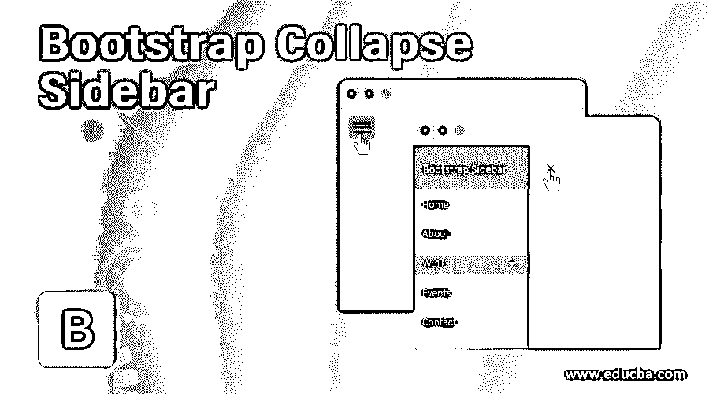
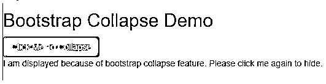
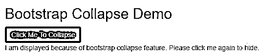
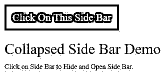
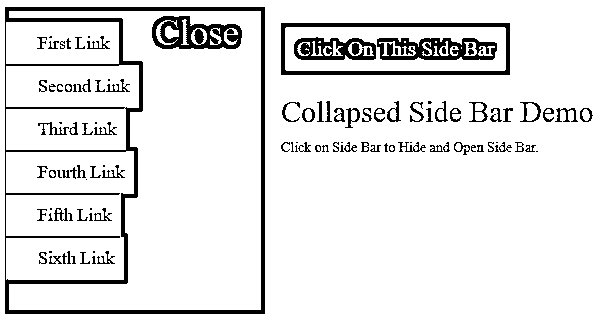

# 引导折叠侧栏

> 原文：<https://www.educba.com/bootstrap-collapse-sidebar/>




## 引导折叠侧栏简介

在 Bootstrap 中折叠侧边栏的定义是，当我们单击隐藏或同时显示的按钮侧边栏时，页面任何一侧的链接或按钮或内容的列表。折叠侧栏可以在左侧或右侧，这取决于用户的要求。让用户感觉全页面显示，而不显示额外的功能，直到点击折叠按钮。

<small>网页开发、编程语言、软件测试&其他</small>

**实时示例:**

如果我们想显示主页、注册、登录、订单详情等主要内容。首选在左侧可折叠的侧边栏。像品牌名称、成本、颜色、尺寸、新产品等过滤器。首选在右侧可折叠的侧边栏。这个我们可以在亚马逊或者 Flipkart 电商网站上观察到。折叠功能也可以应用于顶部和底部。

### 为什么 Bootstrap 超过 HTML？

*   在 HTML 中，开发人员必须编写每一个类、id、链接、按钮等。级联样式。
*   而在 Bootstrap 中，大多数预定义的类、链接和按钮等。使用它们自己的级联样式来降低代码复杂性。

**Note:** Bootstrap files also saved with**.**html extension.

### 在 Bootstrap 中折叠侧栏是如何工作的？

*   在引导折叠侧边栏功能基于数据工作-toggle= "折叠"

**语法:**

```
<button type="button" class="btn btn-info" data-toggle="collapse"
data-target="#collapseText">Collapse</button>
<div id="collapseText">Hide and Show Me by Clicking above button</div>
```

**说明:**

*   **type="button":** 给出文本的类型。
*   **class="btn btn-info":** 提供由引导库提供的预定义样式。
*   **data-toggle="collapse":** 通过点击按钮或其他给出折叠功能。
*   **data-target = " # collapse text ":**给出应用折叠功能的目标字段。
*   **id="collapseText":** 要获得折叠特性，我们必须在 id 属性中给出数据目标值。如你所见，target-field=collapseText 和 id= collapseText 是相同的。

包括引导功能，我们必须在应用程序中指定一些预定义的库。

它们如下:

1.包括引导视图。

```
<meta name="viewport" content="width=device-width, initial-scale=1">
```

2.包括 ajax 和 jQuery 库。

```
<script src="https://ajax.googleapis.com/ajax/libs/jquery/3.4.1/jquery.min.js"></script>
```

3.包括引导库。

```
<link rel="stylesheet" href="https://maxcdn.bootstrapcdn.com/bootstrap/3.4.1/css/bootstrap.min.css">
```

4.包括引导库。

```
<script src="https://maxcdn.bootstrapcdn.com/bootstrap/3.4.1/js/bootstrap.min.js"></script>
```

### 引导折叠侧栏示例

下面是引导折叠侧栏的示例:

#### 示例#1

底部内容折叠。

**代码:**

```
<!DOCTYPE html>
<html>
<head>
<meta name="viewport" content="width=device-width, initial-scale=1">
<script
src="https://ajax.googleapis.com/ajax/libs/jquery/3.4.1/jquery.min.js"></script>
<link rel="stylesheet"
href="https://maxcdn.bootstrapcdn.com/bootstrap/3.4.1/css/bootstrap.min.css">
<script
src="https://maxcdn.bootstrapcdn.com/bootstrap/3.4.1/js/bootstrap.min.js"></script>
</head>
<body>
<h2>Bootstrap Collapse Demo</h2>
<button type="button" class="btn btn-info" data-toggle="collapse"
data-target="#collapseText">Click Me To Collapse</button>
<div id="collapseText" class="collapseClass">I am displayed
because of bootstrap collapse feature. Please click me again to hide.
</div>
</body>
</html>
```

**输出:**

**

** 


**说明:**

*   在上面的代码中，data-toggle = " collapse " data-target = " # collapse text "和 id="collapseText **"** 给出了您想要的折叠输出。

#### 实施例 2

用 href 折叠底部内容。

**代码:**

```
<!DOCTYPE html>
<html>
<head>
<meta name="viewport" content="width=device-width, initial-scale=1">
<script
src="https://ajax.googleapis.com/ajax/libs/jquery/3.4.1/jquery.min.js"></script>
<link rel="stylesheet"
href="https://maxcdn.bootstrapcdn.com/bootstrap/3.4.1/css/bootstrap.min.css">
<script
src="https://maxcdn.bootstrapcdn.com/bootstrap/3.4.1/js/bootstrap.min.js"></script>
</head>
<body>
<h2>Bootstrap Collapse Demo</h2>
<a href="#buttonRef" class="btn btn-primary" data-toggle="collapse">Click
Me To Collapse</a>
<div id="buttonRef" class="collapse">I am displayed because of
bootstrap collapse feature. Please click me again to hide.</div>
</body>
</html>
```

**输出:**





**说明:**

*   在上面的代码中，data-toggle = " collapse " href = " # button ref "和 id="buttonRef "给出了您想要的折叠输出。
*   在第一个例子中，我们采用了 data-target，在第二个例子中采用了 href 属性。在这两种情况下，我们得到了相同的输出。

#### 实施例 3

在底部折叠内容 class= "折叠显示"。

**代码:**

```
<!DOCTYPE html>
<html>
<head>
<meta name="viewport" content="width=device-width, initial-scale=1">
<script
src="https://ajax.googleapis.com/ajax/libs/jquery/3.4.1/jquery.min.js"></script>
<link rel="stylesheet"
href="https://maxcdn.bootstrapcdn.com/bootstrap/3.4.1/css/bootstrap.min.css">
<script
src="https://maxcdn.bootstrapcdn.com/bootstrap/3.4.1/js/bootstrap.min.js"></script>
</head>
<body>
<h2>Bootstrap Collapse Demo</h2>
<button type="button" data-target="#targetText" data-toggle="collapse" class="btn btn-primary">Click Me To Collapse</button>
<div id="targetText" class="collapse show">I am
displayed because of bootstrap collapse feature. Please click me again
to hide.</div>
</body>
</html>
```

**输出:**


**说明:**

*   在上面的代码中，data-toggle = " collapse " data-target = " # data traget " id = " data traget "和 class="collapse show "给出了您想要的折叠输出。
*   在第一个示例中，我们采用 data-target，第二个示例采用 href 属性，第三个示例类采用 collapse show。在所有情况下，我们得到相同的输出。

#### 实施例 4

折叠侧栏内容。

**代码:**

```
<!DOCTYPE html>
<html>
<head>
<meta name="viewport" content="width=device-width, initial-scale=1">
<link rel="stylesheet"
href="https://maxcdn.bootstrapcdn.com/bootstrap/3.4.1/css/bootstrap.min.css">
<script
src="https://ajax.googleapis.com/ajax/libs/jquery/3.4.1/jquery.min.js"></script>
<script
src="https://maxcdn.bootstrapcdn.com/bootstrap/3.4.1/js/bootstrap.min.js"></script>
<link rel="stylesheet" href="SideBarCollapse.css">
<script type="text/javascript" src="SideBarCollapse.js"></script>
<script>function showNagination() {
document.getElementById("sideBarId").style.width = "260px";
document.getElementById("click").style.marginLeft = "260px";
}
function hideNavigation() {
document.getElementById("sideBarId").style.width = "0";
document.getElementById("click").style.marginLeft = "0";
}
</script>
<style>
.sideBarClass {
height: 100%;
z-index: 1;
width: 0;
transition: 0.5s;
position: fixed;
top: 0;
padding-top: 60px;
left: 0;
background-color: #111;
overflow-x: hidden;
}
.sideBarClass button {
padding: 7px 7px 7px 31px;
font-size: 24px;
display: block;
transition: 0.25s;
color: gray;
}
.button {
font-size: 21px;
background-color: purple;
cursor: pointer;
color: silver;
border: none;
padding: 11px 16px;
}
.sideBarClass button:hover {
color: fuchsia;
}
.sideBarClass .hideButton {
position: absolute;
font-size: 37px;
top: 0;
margin-left: 55px;
right: 26px;
}
.clickClass {
padding: 16px;
transition: margin-left .5s;
}
.button:hover {
background-color: #444;
}
@media screen and (max-height: 450px) {
.sideBarClass {
padding-top: 15px
}
.sideBarClass button {
font-size: 18px;
}
}
body {
font-family: serif;
}
</style>
</head>
<body>
<div id="click" class="clickClass">
<button class="button" onclick="showNagination()">Click On This Side Bar</button>
<h2>Collapsed Side Bar Demo</h2>
<p>Click on Side Bar to Hide and Open Side Bar.</p>
</div>
<div id="sideBarId" class="sideBarClass">
<a href="javascript:void(0)" class="hideButton"
onclick="hideNavigation()">Close</a>
<button type="button">First Link</button>
<button type="button">Second Link</button>
<button type="button">Third Link</button>
<button type="button">Fourth Link</button>
<button type="button">Fifth Link</button>
<button type="button">Sixth Link</button>
</div>
</body>
</html>
```

**输出:**







**说明:**

*   正如你在上面的输出中看到的，我们点击了这个侧边栏按钮。
*   内侧内容，我们拿了 5 个按钮。
*   当我们点击侧边栏按钮时，会打开一个侧边栏。

### 推荐文章

这是一个引导折叠侧边栏的指南。在这里，我们讨论介绍，为什么引导 HTML？折叠侧边栏在 bootstrap 中是如何工作的？还有例子。bootstrap 中的折叠可以通过数据目标、href 和 class 作为折叠显示属性来实现。您也可以看看以下文章，了解更多信息–

1.  [引导雕刻图案](https://www.educba.com/bootstrap-glyphicons/)
2.  [自举网格系统](https://www.educba.com/bootstrap-grid-system/)
3.  [引导布局](https://www.educba.com/bootstrap-layout/)
4.  [自举粘滞页脚](https://www.educba.com/bootstrap-sticky-footer/)


