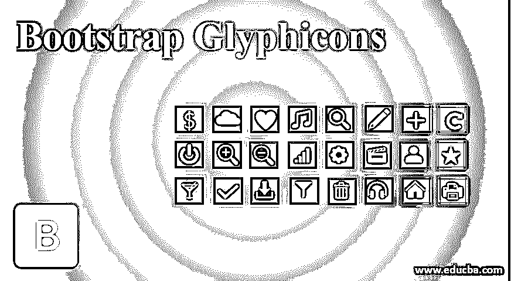
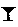
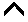
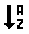
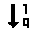
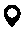
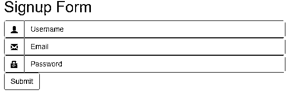
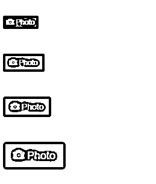
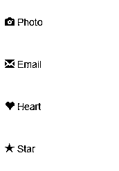
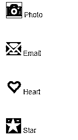

# 引导雕刻

> 原文：<https://www.educba.com/bootstrap-glyphicons/>




## **引导雕刻介绍**

图标是网络应用中最常用的字体图标。雕文半身人系列有 250 个雕文，但这不是免费的。要获得图标，我们需要一个许可证。雕饰半身人的创造者为引导项目免费制作了这些图标。图标是一组符号和图标，在 web 项目中可以更有效、更容易地理解。象形文字用于一些文本、表格、按钮、导航等。

**语法:**

<small>网页开发、编程语言、软件测试&其他</small>

*   引导程序有许多 Glphyicons，但是有一个标准的格式来显示图标。
*   bootstrap glyphicons 语法如下:

```
 
```

*   在语法中,“名称”被更改为 glyphicon 的名称。

### 什么是引导雕刻图标？

引导图形符号有助于获得清晰的信息符号。它有助于轻松理解内容。以下尺寸的雕刻图标可能会根据需要而有所不同。以下是 web 应用程序中常用的一些重要图标:

| **语法** | **图标** |
|  | 


 |
|  | 


 |
|  | 


 |
|  | 


 |
|  | 


 |
|  | 


 |
|  | 


 |
|  | 


 |
|  | 


 |
|  | 


 |
|  | 


 |
|  | 


 |
|  | 


 |
|  | 


 |
|  | 


 |
|  | 


 |
|  | 


 |
|  | 


 |
|  | 


 |
|  | 


 |
|  | 


 |
|  | 


 |
|  | 


 |
|  | 


 |
|  | 


 |
|  | 


 |
|  | 


 |
|  | 


 |
|  | 


 |
|  | 


 |
|  | 


 |
|  | 


 |
|  | 


 |
|  | 


 |
|  | 


 |
|  | 


 |
|  | 


 |
|  | 


 |
|  | 


 |
|  | 


 |
|  | 


 |
|  | 


 |
|  | 


 |
|  | 


 |
|  | 


 |
|  | 


 |
|  | 


 |
|  | 


 |
|  | 


 |
|  | 


 |
|  | 


 |
|  | 


 |
|  | 


 |
|  | 


 |
|  | 


 |
|  | 


 |
|  | 


 |
|  | 


 |

### 实现引导图形图标的示例

以下是机具示例:

#### 示例#1

这个例子有助于理解 glyphicons 如何在 web 项目中工作。

**代码:**

```
<!DOCTYPE>
<html>
<head>
<title> Bootstrap Glyphicons 1 </title>
<meta charset="utf-8">
<meta name="viewport" content="width=device-width, initial-scale=1">
<script src="https://maxcdn.bootstrapcdn.com/bootstrap/3.4.1/js/bootstrap.min.js">
</script>
<script src="https://ajax.googleapis.com/ajax/libs/jquery/3.4.1/jquery.min.js">
</script>
<link rel="stylesheet"    href="https://maxcdn.bootstrapcdn.com/bootstrap/3.4.1/css/bootstrap.min.css">
</head>
<body>
<h2> Signup Form </h2>
<form>
<div class="input-group">
<i class="glyphicon glyphicon-user"></i>
<input type="text" class="form-control" name="username" placeholder="Username">
</div>
<div class="input-group">
<i class="glyphicon glyphicon-envelope"></i>
<input type="text" class="form-control" name="email" placeholder="Email">
</div>
<div class="input-group">
<i class="glyphicon glyphicon-lock"></i>
<input type="password" class="form-control" name="password" placeholder="Password">
</div>
<div class="input-group">
<input type="submit" class="btn btn-default" >
</div>
</form>
</body>
</html>
```

**输出:**




**对上面代码的解释:**class = " input-group-addon "用于放置在输入字段属性旁边的图标。我们在表格格式中使用图标。这种形式看起来既有吸引力又有意义。每个输入字段都有像用户名、密码和电子邮件这样的含义。用于用户名 glyphicon-垂直使用的用户类。密码和电子邮件分别使用密码信封和密码锁。

#### 实施例 2

我们可以根据需要的尺寸来使用雕刻图标。图标大小可以是大的、小的、超小的和默认的。如下例所示。

**代码:**

```
<!DOCTYPE>
<html>
<head>
<meta name="viewport" content="width=device-width, initial-scale=1">
<script src="https://maxcdn.bootstrapcdn.com/bootstrap/3.4.0/js/bootstrap.min.js">
</script>
<script src="https://ajax.googleapis.com/ajax/libs/jquery/3.4.1/jquery.min.js">
</script>
<link rel="stylesheet" href="https://maxcdn.bootstrapcdn.com/bootstrap/3.4.0/css/bootstrap.min.css">
</head>
<body>
<hr>
<button type = "button" class = "btn btn-primary btn-xs">
 Photo
</button>
<hr>
<button type = "button" class = "btn btn-primary btn-sm">

Photo
</button>
<hr>
<button type = "button" class = "btn btn-primary ">

Photo
</button>
<hr>
<button type ="button" class = "btn btn-primary btn-lg">

Photo
</button>
<hr>
</body>
</html>
```

**输出:**




**对上面代码的解释:**使用按钮我们可以根据大小修改图标。这里我们使用了主要的按钮类。我们需要按钮类以及 btn-size 类来修改按钮大小的图标。btn-lg 意味着大按钮，就像 btn-sm 意味着小按钮一样。

#### 实施例 3

下面是带有 CSS 的引导图形图标的例子。

**代码:**

```
<!DOCTYPE>
<html>
<head>
<meta name="viewport" content="width=device-width, initial-scale=1">
<script src="https://maxcdn.bootstrapcdn.com/bootstrap/3.4.0/js/bootstrap.min.js">
</script>
<script src="https://ajax.googleapis.com/ajax/libs/jquery/3.4.1/jquery.min.js">
</script>
<link rel="stylesheet" href="https://maxcdn.bootstrapcdn.com/bootstrap/3.4.0/css/bootstrap.min.css">
<style>
#icon1 {
color: blue;
font-size: 30px;
border: 1px solid black;
margin-left: 10px;
background-color: yellow;
}
#icon2 {
color: orange;
font-size: 30px;
margin-left: 10px;
}
#icon3 {
color: red;
font-size: 30px;
margin-left: 10px;
}
#icon4 {
color: silver;
background-color : black;
font-size: 30px;
margin-left: 10px;
}
</style>
</head>
<body>
<hr>
 Photo
<hr>

Email
<hr>

Heart
<hr>

Star
<hr>
</body>
</html>
```

**输出:**

以前




在...之后




**对上面代码的解释:**可以看到图标前后的区别。使用 CSS 我们可以改变大小，颜色，背景色，边距等。

### 结论

引导图标是一种用于表单、文本、导航和许多其他 web 组件的图标。简而言之，这有助于减少文本并给出有意义的信息。

### 推荐文章

这是引导雕刻的指南。这里我们讨论用于表单、文本、导航和许多其他 web 组件的图标以及要实现的示例。您也可以浏览我们的其他相关文章，了解更多信息——

1.  [自举排版](https://www.educba.com/bootstrap-typography/)
2.  [自举折叠](https://www.educba.com/bootstrap-collapse/)
3.  [引导下拉菜单](https://www.educba.com/bootstrap-dropdown-menu/)
4.  [自举徽章](https://www.educba.com/bootstrap-badge/)


