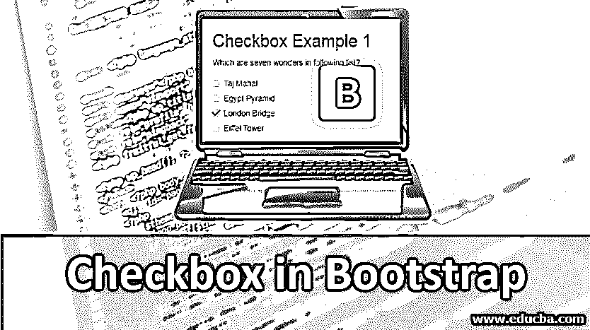
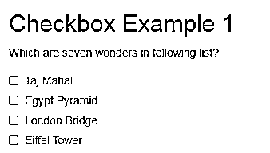
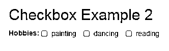
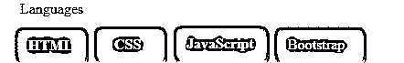
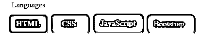

# 引导中的复选框

> 原文：<https://www.educba.com/checkbox-in-bootstrap/>




## 引导程序中复选框的介绍

Bootstrap 使用了许多一键按钮，但有时我们需要选择一个选项。选择一个选项有两种方式，一种是单选按钮，另一种是复选框。单选按钮只有一个选项可供选择。在任何情况下，我们都需要选择一个以上的选项，即时间复选框起作用。复选框有多个选项可供选择。复选框用于通过单击复选框在多个选项中选择选项。复选框按钮的使用是在考试多项选择题时，该题对一个问题有多个答案。引导程序有自己的复选框按钮类，你将在下面看到。

### 在引导中实现复选框的示例

用户可以理解如何实现一个复选框和这些按钮的工作。以下是在 Boostrap 中实现复选框的示例:

<small>网页开发、编程语言、软件测试&其他</small>

1.  垂直复选框
2.  内嵌复选框

#### 1.垂直复选框

下面给出了垂直复选框的示例。

**代码:**

```
<!DOCTYPE html>
<html>
<head>
<title>Bootstrap Example vertical checkbox</title>
<meta charset="utf-8">
<meta name="viewport" content="width=device-width, initial-scale=1">
<link rel="stylesheet" href="https://maxcdn.bootstrapcdn.com/bootstrap/3.3.6/css/bootstrap.min.css">
</head>
<body>
<div class="container">
<h2> Checkbox Example 1 </h2>
<form>
<div class="form-group">
<p> Which are seven wonders in following list?  </p>
</div>
<div class="checkbox">
<label><input type="checkbox" value=""> Taj Mahal </label>
</div>
<div class="checkbox">
<label><input type="checkbox" value=""> Egypt Pyramid </label>
</div>
<div class="checkbox">
<label><input type="checkbox" value=""> London Bridge </label>
</div>
<div class="checkbox">
<label><input type="checkbox" value=""> Eiffel Tower </label>
</div>
</form>
</div>
<script src="https://ajax.googleapis.com/ajax/libs/jquery/1.12.0/jquery.min.js"></script>
<script src="https://maxcdn.bootstrapcdn.com/bootstrap/3.3.6/js/bootstrap.min.js"></script>
</body>
</html>
```

**输出:**




**描述:**

*   你可以看到上面垂直复选框的例子。这是一个默认的复选框，不需要任何特殊的类或实体。
*   所有表单实体都是一个接一个垂直进来的。
*   这多用于选择题考试中，以便清楚地了解选项，不与复选框和标签混淆。每个< div >都使用带有标签的复选框的类。对于问题采用段落实体< p >。
*   您可以点击复选框按钮，点击按钮后复选标记变得可见。

#### 2.内嵌复选框

下面给出了内嵌复选框的示例。

**代码:**

```
<!DOCTYPE html>
<html >
<head>
<title>Bootstrap Example inline checkbox</title>
<meta charset="utf-8">
<meta name="viewport" content="width=device-width, initial-scale=1">
<link rel="stylesheet" href="https://maxcdn.bootstrapcdn.com/bootstrap/3.3.6/css/bootstrap.min.css">
</head>
<body>
<div class="container">
<h2> Checkbox Example 2</h2>
<form class="form-inline">
<label> hobbies: </label>
<label class="checkbox-inline">
<input type="checkbox" value=""> painting
</label>
<label class="checkbox-inline">
<input type="checkbox" value=""> dancing
</label>
<label class="checkbox-inline">
<input type="checkbox" value=""> reading
</label>
</form>
</div>
<script src="https://ajax.googleapis.com/ajax/libs/jquery/1.12.0/jquery.min.js"> </script>
<script src="https://maxcdn.bootstrapcdn.com/bootstrap/3.3.6/js/bootstrap.min.js"></script>
</body>
</html>
```

**输出:**




**描述:**

*   上面的例子是一个内嵌的复选框。我们需要使用 form-inline 类来为其他表单实体显示 inline in 表单。
*   对于 inline 复选框，每个标签< label >都需要 class checkbox-inline。
*   如果你想在其他输入中使用任何形式的复选框，那么内嵌复选框也是有用的。
*   所有的复选框都在一行中。
*   您可以点击复选框按钮，点击按钮后复选标记变得可见。

### 使用按钮的复选框

bootstrap 中的 Checkbox 也与一些类的按钮一起工作，看起来更加时尚和优雅。类按钮-组-切换，按钮类必须分别在< div >和< label >中使用。与 button-group-toggle 类一样，data-toggle='buttons '类也是表单中必需的。在< input >中，类型必须是复选框，才能作为复选框使用。让我们看一些例子来了解更多关于使用 bootstrap 切换复选框的信息。

**代码:**

```
<!DOCTYPE html>
<html >
<head>
<title>Bootstrap Example checkbox</title>
<meta charset="utf-8">
<meta name="viewport" content="width=device-width, initial-scale=1">
<link rel="stylesheet" href="https://maxcdn.bootstrapcdn.com/bootstrap/3.4.0/css/bootstrap.min.css">
<script src="https://ajax.googleapis.com/ajax/libs/jquery/3.4.1/jquery.min.js"></script>
<script src="https://maxcdn.bootstrapcdn.com/bootstrap/3.4.0/js/bootstrap.min.js"></script>
</head>
<body>
<div class="container">
<form>
<label > Languages </label>
<div class="btn-group-toggle" data-toggle = "buttons">
<label class="btn btn-primary ">
<input type="checkbox" checked autocomplete = "off"> HTML
</label>
<label class="btn btn-primary">
<input type="checkbox" checked autocomplete = "off"> CSS
</label>
<label class="btn btn-primary">
<input type="checkbox" checked autocomplete = "off"> JavaScript
</label>
<label class="btn btn-primary">
<input type="checkbox" checked autocomplete = "off"> Bootstrap
</label>
</div>
</form>
</div>
</body>
</html>
```

**输出:**




**描述:**

*   在这个例子中，我们使用了主按钮，但任何按钮都可以用来结帐，但“自动完成”必须关闭，以避免保存额外的数据。
*   如果用户按下按钮，它将自动被选为一个选项，而在[切换按钮](https://www.educba.com/bootstrap-toggle-button/)中，用户只需点击按钮即可选择更多选项。
*   这里我们有四个选项来选择语言，用户可以选择多种语言。
*   ' btn-group-toggle '用于设置表单输入的样式。
*   由于这种数据切换，JavaScript 允许切换到按钮，因此可以解释活动和非活动模式。

### 在引导程序中使用复选框的活动按钮

如果用户活动类添加到按钮，则该按钮自动被选中，用户可以选择剩余的选项。该按钮改变颜色以获得激活的标志。

让我们看下面的例子:

**代码:**

```
<div class="container">
<form>
<label > Languages </label>
<div class="btn-group-toggle"data-toggle= **"**buttons**"**>
<label class="btn btn-primary active ">
<input type="checkbox" checked autocomplete = "off"> HTML
</label>
<label class="btn btn-primary">
<input type="checkbox" checked autocomplete = "off"> CSS
</label>
<label class="btn btn-primary">
<input type="checkbox" checked autocomplete = "off"> JavaScript
</label>
<label class="btn btn-primary">
<input type="checkbox" checked autocomplete = "off"> Bootstrap
</label>
</div>
</form>
</div>
```

**输出:**




**描述:**

*   这个例子可以识别比其他按钮暗的 HTML 按钮，这意味着这个按钮已经被激活。
*   在 HTML 的< label>上，用 primary 按钮添加活动类。
*   由于按钮组的原因，这个示例还需要 button-toggle = "buttons "而不是按钮。

### 结论

如果作业在一个条件下有多个选项可供选择，则复选框非常有用。用户可以选择任务所需的多个选项。复选框勾选表示是，不勾选表示否。使用复选框至少可以选择两个相互条件。

### 推荐文章

这是引导程序中复选框的指南。在这里，我们将讨论 Bootstrap 中 Checkbox 的介绍及其示例和代码实现。您也可以浏览我们推荐的其他文章，了解更多信息——

1.  [引导组件](https://www.educba.com/bootstrap-components/)
2.  [引导布局](https://www.educba.com/bootstrap-layout/)
3.  [Flexbox vs Bootstrap](https://www.educba.com/flexbox-vs-bootstrap/)
4.  [自举面试问题](https://www.educba.com/bootstrap-interview-questions/)


