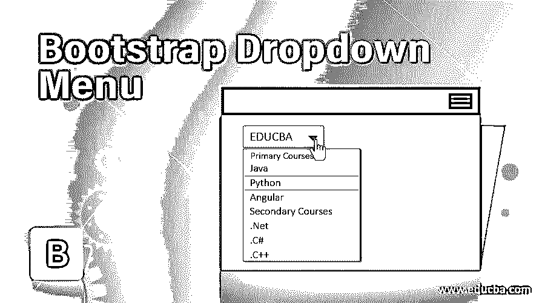
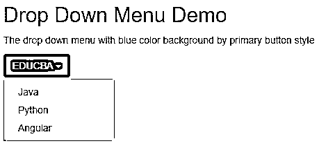
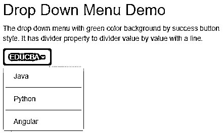
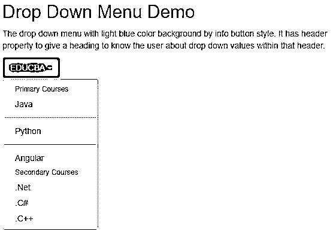
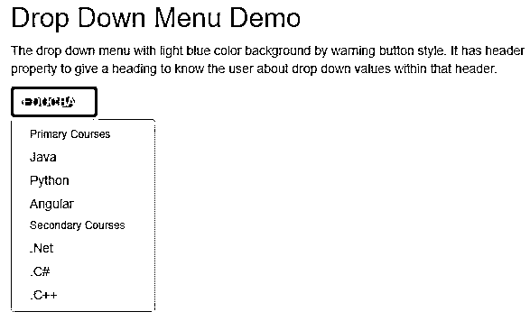
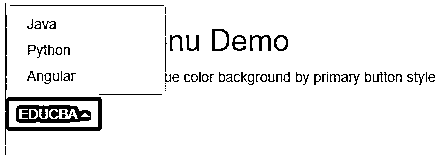

# 引导下拉菜单

> 原文：<https://www.educba.com/bootstrap-dropdown-menu/>




## 引导下拉菜单介绍

引导下拉菜单定义为允许用户从列表的预定义值中选择任何值。下拉菜单可以输入数字、字符串、特殊字符等。一个名为 js 的第三方库中有一个下拉菜单。制作一个下拉菜单，必须包括 bootstrap.bundle.min.js/ bootstrap . bundle . js。在下拉菜单中，我们还可以包括按钮，链接，标题等。在下拉列表中，元素也可以使其不可编辑。

**实时场景:**当我们想要选择州、国家、村庄、产品项目等时。可以通过下拉菜单完成。

<small>网页开发、编程语言、软件测试&其他</small>

### 为什么 Bootstrap 超过 HTML？

*   在 HTML 中，开发人员必须编写每一个类、id、链接、按钮、层叠样式等。
*   而在 Bootstrap 中，大多数预定义的类、链接和按钮等。都有自己的级联样式，以降低代码的复杂性。

**Note:** Bootstrap files are also saved with .html extension.

### 下拉菜单在 Bootstrap 中如何工作？

在引导程序中，导航栏功能基于数据工作-toggle="dropdown "

**语法:**

```
<button type="button" data-toggle="dropdown">Dropdown Menu</button>
```

type="button ":给出按钮类型。

data-toggle="dropdown ":使按钮成为下拉列表

不同样式下拉列表:

*   **class = " BTN BTN Drop-toggle ":**浅棕色下拉列表。
*   **class = " BTN BTN-default Drop down-toggle ":**白色下拉列表。
*   **class = " BTN BTN-primary Drop down-toggle ":**蓝色下拉列表。
*   **class = " BTN BTN-success Drop-toggle ":**绿色下拉列表。
*   **class = " BTN BTN-info Drop down-toggle ":**浅蓝色下拉列表。
*   **class = " BTN BTN-warning Drop down-toggle ":**浅黄色下拉列表。
*   **class = " BTN BTN-danger Drop down-toggle ":**浅红色下拉列表。

包括 bootstrap 特性，我们必须在应用程序中指定一些预定义的库。它们如下:

1.包括引导视图

```
<meta name="viewport" content="width=device-width, initial-scale=1">
```

2.包括 ajax 和 jQuery 库

```
<script src="https://ajax.googleapis.com/ajax/libs/jquery/3.4.1/jquery.min.js"></script>
```

3.包括引导库

```
<link rel="stylesheet" href="https://maxcdn.bootstrapcdn.com/bootstrap/3.4.1/css/bootstrap.min.css">
```

4.包括引导库

```
<script src="https://maxcdn.bootstrapcdn.com/bootstrap/3.4.1/js/bootstrap.min.js"></script>
```

### 引导下拉菜单示例

下面是引导下拉菜单的示例:

#### 示例#1

下拉菜单示例。

**代码:**

```
<!DOCTYPE html>
<html>
<head>
<meta charset="ISO-8859-1">
<title>Drop Down Menu</title>
<meta name="viewport" content="width=device-width, initial-scale=1">
<script
src="https://ajax.googleapis.com/ajax/libs/jquery/3.4.1/jquery.min.js"></script>
<link rel="stylesheet"
href="https://maxcdn.bootstrapcdn.com/bootstrap/3.4.1/css/bootstrap.min.css">
<script
src="https://maxcdn.bootstrapcdn.com/bootstrap/3.4.1/js/bootstrap.min.js"></script>
</head>
<body>
<div class=" main">
<h2>Drop Down Menu Demo</h2>
<p>The drop down menu with blue color background by primary
button style</p>
<div class="dropdown">
<button class="btn btn-primary dropdown-toggle" type="button"
data-toggle="dropdown">
EDUCBA 
<!-- class="caret" used to open drop down list -->
</button>
<ul class="dropdown-menu">
<!-- class="dropdown-menu" display drop down list values -->
<li><a
href="https://www.educba.com/category/software-development/software-development-tutorials/java-tutorial/">Java</a></li>
<li><a
href="https://www.educba.com/category/software-development/software-development-tutorials/python-tutorial/">Python</a></li>
<li><a
href="https://www.educba.com/category/software-development/software-development-tutorials/angular-tutorial/">Angular</a></li>
</ul>
</div>
</div>
</body>
</html>
```

**输出:**




#### 实施例 2

带分隔符的下拉菜单示例:class="divider "用于分隔下拉列表值。

**代码:**

```
<!DOCTYPE html>
<html>
<head>
<meta charset="ISO-8859-1">
<title>Drop Down Menu</title>
<meta name="viewport" content="width=device-width, initial-scale=1">
<script
src="https://ajax.googleapis.com/ajax/libs/jquery/3.4.1/jquery.min.js"></script>
<link rel="stylesheet"
href="https://maxcdn.bootstrapcdn.com/bootstrap/3.4.1/css/bootstrap.min.css">
<script
src="https://maxcdn.bootstrapcdn.com/bootstrap/3.4.1/js/bootstrap.min.js"></script>
</head>
<body>
<div class=" main ">
<h2>Drop Down Menu Demo</h2>
<p>The drop down menu with green color background by success
button style. It has divider property to divider value by value with a line.</p>
<div class="dropdown">
<button class="btn btn-success dropdown-toggle" type="button"
data-toggle="dropdown">
EDUCBA 
<!-- class="caret" used to open drop down list -->
</button>
<ul class="dropdown-menu">
<!-- class="dropdown-menu" display drop down list values -->
<li><a
href="https://www.educba.com/category/software-development/software-development-tutorials/java-tutorial/">Java</a></li>
<li class="divider"></li> <!-- divider property to divide value by value with a line -->
<li><a
href="https://www.educba.com/category/software-development/software-development-tutorials/python-tutorial/">Python</a></li>
<li class="divider"></li>
<li><a
href="https://www.educba.com/category/software-development/software-development-tutorials/angular-tutorial/">Angular</a></li>
</ul>
</div>
</div>
</body>
</html>
```

**输出:**




#### 实施例 3

带有标题的下拉菜单示例:class="dropdown-header "用于分隔带有不同标题的下拉列表值，以使用户能够识别这些值。

**代码:**

```
<!DOCTYPE html>
<html>
<head>
<meta charset="ISO-8859-1">
<title>Drop Down Menu</title>
<meta name="viewport" content="width=device-width, initial-scale=1">
<script
src="https://ajax.googleapis.com/ajax/libs/jquery/3.4.1/jquery.min.js"></script>
<link rel="stylesheet"
href="https://maxcdn.bootstrapcdn.com/bootstrap/3.4.1/css/bootstrap.min.css">
<script
src="https://maxcdn.bootstrapcdn.com/bootstrap/3.4.1/js/bootstrap.min.js"></script>
</head>
<body>
<div class=" main ">
<h2>Drop Down Menu Demo</h2>
<p>The drop down menu with light blue color background by info
button style. It has header property to give a heading to know the user about drop down values within that header.</p>
<div class="dropdown">
<button class="btn btn-info dropdown-toggle" type="button"
data-toggle="dropdown">
EDUCBA 
<!-- class="caret" used to open drop down list -->
</button>
<ul class="dropdown-menu">
<!-- class="dropdown-menu" display drop down list values -->
<li class="dropdown-header">Primary Courses</li> <!-- header to show different drop down values within a header -->
<li><a
href="https://www.educba.com/category/software-development/software-development-tutorials/java-tutorial/">Java</a></li>
<li class="divider"></li>
<li><a
href="https://www.educba.com/category/software-development/software-development-tutorials/python-tutorial/">Python</a></li>
<li class="divider"></li>
<li><a
href="https://www.educba.com/category/software-development/software-development-tutorials/angular-tutorial/">Angular</a></li>
<li class="dropdown-header">Secondary Courses</li>
<li><a href="#">.Net</a></li>
<li><a href="#">.C#</a></li>
<li><a href="#">.C++</a></li>
</ul>
</div>
</div>
</body>
</html>
```

**输出:**




#### 实施例 4

带有禁用值的下拉菜单示例:class="disabled "用于禁用下拉列表中的必需值。

**代码:**

```
<!DOCTYPE html>
<html>
<head>
<meta charset="ISO-8859-1">
<title>Drop Down Menu</title>
<meta name="viewport" content="width=device-width, initial-scale=1">
<script
src="https://ajax.googleapis.com/ajax/libs/jquery/3.4.1/jquery.min.js"></script>
<link rel="stylesheet"
href="https://maxcdn.bootstrapcdn.com/bootstrap/3.4.1/css/bootstrap.min.css">
<script
src="https://maxcdn.bootstrapcdn.com/bootstrap/3.4.1/js/bootstrap.min.js"></script>
</head>
<body>
<div class=" main ">
<h2>Drop Down Menu Demo</h2>
<p>The drop down menu with light blue color background by warning
button style. It has header property to give a heading to know the user about drop down values within that header.</p>
<div class="dropdown">
<button class="btn btn-warning dropdown-toggle" type="button"
data-toggle="dropdown">
EDUCBA 
<!-- class="caret" used to open drop down list -->
</button>
<ul class="dropdown-menu">
<!-- class="dropdown-menu" display drop down list values -->
<li class="dropdown-header">Primary Courses</li> <!-- header to show different drop down values within a header -->
<li><a
href="https://www.educba.com/category/software-development/software-development-tutorials/java-tutorial/">Java</a></li>
<li class="disabled"><a
href="https://www.educba.com/category/software-development/software-development-tutorials/python-tutorial/">Python</a></li>
<li><a
href="https://www.educba.com/category/software-development/software-development-tutorials/angular-tutorial/">Angular</a></li>
<li class="dropdown-header">Secondary Courses</li>
<li class="disabled"><a href="#" >.Net</a></li><!-- class="disabled" is used for disabled the value -->
<li><a href="#">.C#</a></li>
<li><a href="#">.C++</a></li>
</ul>
</div>
</div>
</body>
</html>
```

**输出:**




#### 实施例 5

下拉菜单示例:class="dropup "在 bootstrap 中提供了一个下拉功能。

**代码:**

```
<!DOCTYPE html>
<html>
<head>
<meta charset="ISO-8859-1">
<title>Drop Up Menu</title>
<meta name="viewport" content="width=device-width, initial-scale=1">
<script
src="https://ajax.googleapis.com/ajax/libs/jquery/3.4.1/jquery.min.js"></script>
<link rel="stylesheet"
href="https://maxcdn.bootstrapcdn.com/bootstrap/3.4.1/css/bootstrap.min.css">
<script
src="https://maxcdn.bootstrapcdn.com/bootstrap/3.4.1/js/bootstrap.min.js"></script>
</head>
<body>
<div class="main">
<h2>Drop Up Menu Demo</h2>
<p>The drop up menu with blue color background by primary
button style</p>
<div class="dropup"> <!-- class="dropup" gives drop up feature -->
<button class="btn btn-primary dropdown-toggle" type="button"
data-toggle="dropdown">
EDUCBA 
<!-- class="caret" used to open drop down list -->
</button>
<ul class="dropdown-menu">
<!-- class="dropdown-menu" display drop down list values -->
<li><a
href="https://www.educba.com/category/software-development/software-development-tutorials/java-tutorial/">Java</a></li>
<li><a
href="https://www.educba.com/category/software-development/software-development-tutorials/python-tutorial/">Python</a></li>
<li><a
href="https://www.educba.com/category/software-development/software-development-tutorials/angular-tutorial/">Angular</a></li>
</ul>
</div>
</div>
</body>
</html>
```

**输出:**




### 结论

下拉菜单用于一次从列表中选择一个值。下拉菜单也可以与标题、分隔线、禁用等一起使用。带有列表值的属性。

### 推荐文章

这是一个引导下拉菜单的指南。在这里，我们讨论基本概念，例子和如何折叠侧边栏在 Bootstrap 中工作？您也可以看看以下文章，了解更多信息–

1.  [引导布局](https://www.educba.com/bootstrap-layout/)
2.  [引导组件](https://www.educba.com/bootstrap-components/)
3.  [引导命令](https://www.educba.com/bootstrap-commands/)
4.  [什么是自举？](https://www.educba.com/what-is-bootstrap/)


