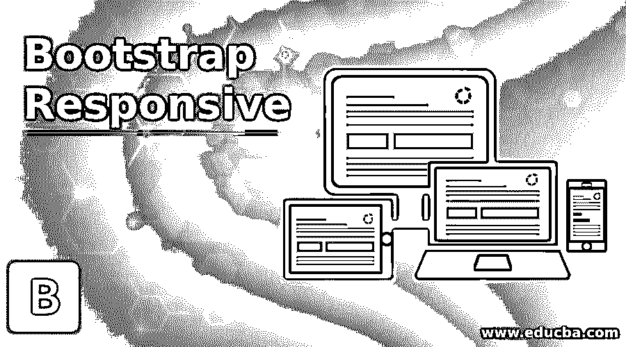
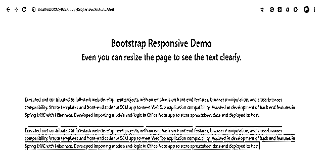
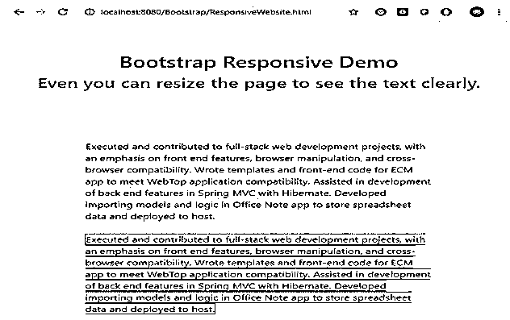
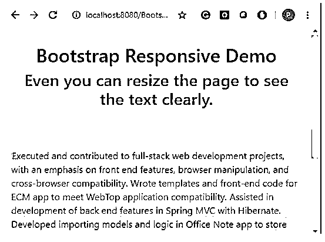
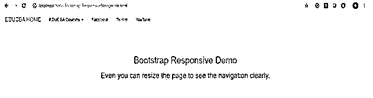
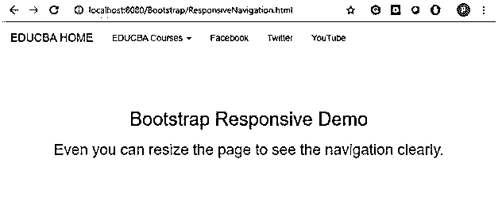
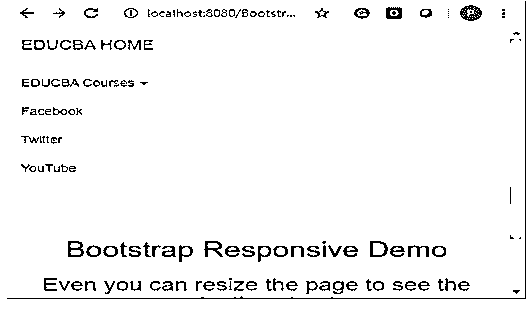
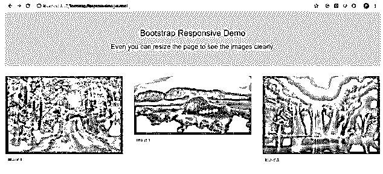
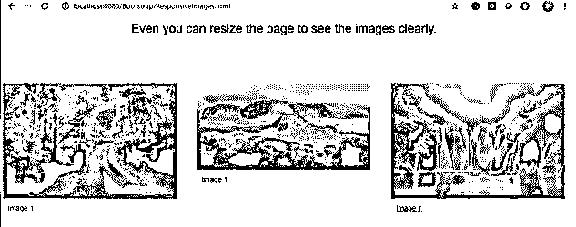
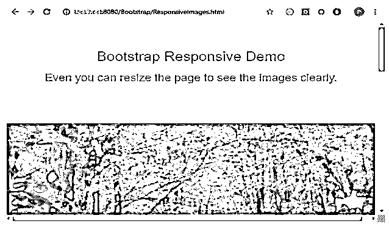

# 自举响应

> 原文：<https://www.educba.com/bootstrap-responsive/>




## 引导响应简介

开发响应性网站是强制性的，以呈现用户需求。人们可以从任何地方访问网站，并从不同的设备如手机、PC、记事本等访问它们。甚至谷歌也考虑强调这些响应网站在网页设计中的重要作用。对于初学者来说，从头开始设计或开发响应式网站变得非常困难。因此，Web 开发人员提出了不同的技术 HTML5、CSS 3 和 bootstrap。在这 3 个包中，bootstraps 的响应速度更快，因为它能够通过包含库在一个包中处理 jQuery、JavaFX 和 CSS。然而，对于那些还没有准备好处理尖端布局技术的人来说， [Bootstrap grid 也为](https://www.educba.com/bootstrap-grid/)提供了一个绝佳的机会。

### “响应式自举网站”是什么意思？

*   首先想到的是“响应式设计”这个词到底是什么。响应式网页设计兼容所有不同类型的设备和不同的屏幕分辨率吗？答案是肯定的。为此，我们可以使用自举技术。
*   如今，由于不同的设备和不同的屏幕尺寸，响应式网站的需求更加稳定。对于多种屏幕尺寸，多次开发相同的网页是非常困难的。在那里，我们遇到了“响应式网页设计”的概念。
*   我们可以在 bootstrap 中包含 CSS3 和 HTML5。由于预定义的库，我们可以在更短的时间内开发“响应性网页”。

**自举的优势**

<small>网页开发、编程语言、软件测试&其他</small>

*   多种设备和多种屏幕类型能够访问内容。
*   通过添加预定义的库，可读性更好，用户界面更美观。

### 如何才能在 Bootstrap 中得到一个响应式的网站？

1.在 bootstrap 中设计响应页面时，“设置视区”很重要。

**语法:**

```
<meta name="viewport" content="width=device-width, initial-scale=1.0">
```

2.在引导媒体查询中设计响应页面时，我们可以为不同的浏览器大小定义不同的样式。

**语法:**

```
@media screen and (min-width:value){
//CSS code
}
```

3.我们有不同的 HTML <picture>标签，允许不同的浏览器使用不同的图片尺寸。</picture>

**语法:**

```

```

4.在我们的应用程序中包含引导功能；我们必须在应用程序中指定一些预定义的库。他们是

*   包括引导视图

```
<meta name="viewport" content="width=device-width, initial-scale=1">
```

*   包括 ajax 和 jQuery 库

```
<script src="https://ajax.googleapis.com/ajax/libs/jquery/3.4.1/jquery.min.js"></script>
```

*   包括引导库

```
<link rel="stylesheet" href="https://maxcdn.bootstrapcdn.com/bootstrap/3.4.1/css/bootstrap.min.css">
```

*   包括引导库

```
<script src="https://maxcdn.bootstrapcdn.com/bootstrap/3.4.1/js/bootstrap.min.js"></script>
```

### **引导示例**响应迅速

下面是引导响应的示例:

#### 示例#1

响应内容示例

**自举代码:ResponsiveContent.html**

```
<!DOCTYPE html>
<html lang="en">
<head>
<title>Bootstrap Responsive</title>
<meta charset="utf-8">
<!-- makes responsive -->
<meta name="viewport" content="width=device-width, initial-scale=1">
<!-- including bootstrap css libraries -->
<link rel="stylesheet"
href="https://maxcdn.bootstrapcdn.com/bootstrap/4.1.3/css/bootstrap.min.css">
<!-- including bootstrap JavaScript libraries -->
<script
src="https://ajax.googleapis.com/ajax/libs/jquery/3.3.1/jquery.min.js"></script>
<!-- including bootstrap Popper libraries -->
<script
src="https://cdnjs.cloudflare.com/ajax/libs/popper.js/1.14.3/umd/popper.min.js"></script>
<!-- including bootstrap libraries -->
<script
src="https://maxcdn.bootstrapcdn.com/bootstrap/4.1.3/js/bootstrap.min.js"></script>
<!-- CSS styles -->
<style type="text/css">
h2
{
color:green;
}
h3
{
color:brown;
}
</style>
</head>
<body>
<div class="jumbotron text-center">
<!-- pre-defined class="jumbotron text-center gives text in the center -->
<h2>Bootstrap Responsive Demo</h2>
<h3>Even you can resize the page to see the text clearly.</h3>
</div>
<div class="container"> <!-- pre-defined class="container" gives proper text alignment at the sides -->
<div>
Executed and contributed to
full-stack web development projects, with an emphasis on front end
features, browser manipulation, and cross-browser compatibility.
Wrote templates and front-end code for ECM app to meet WebTop
application compatibility. Assisted in development of back end
features in Spring MVC with Hibernate. Developed importing models
and logic in Office Note app to store spreadsheet data and deployed
to host. <!-- pre-defined class="border" gives default border with black color -->
</div>
<br>
<div>
Executed and contributed to
full-stack web development projects, with an emphasis on front end
features, browser manipulation, and cross-browser compatibility.
Wrote templates and front-end code for ECM app to meet WebTop
application compatibility. Assisted in development of back end
features in Spring MVC with Hibernate. Developed importing models
and logic in Office Note app to store spreadsheet data and deployed
to host. <!-- pre-defined class="border border-success" gives default border with green color -->
</div>
</div>
</body>
</html>
```

**输出:**

**截图#1**




**截图#2**

**

** 

**截图#3**




**说明:**

*   您可以在输出中看到屏幕截图#1 没有调整大小，而屏幕截图#2 调整了大小，那么页面内容也会自动调整大小。
*   截图#3 进一步调整了大小，然后用滚动条进一步调整了内容的大小。
*   这样，我们可以在 bootstrap 中实现响应特性。

#### 实施例 2

响应导航示例。

**自举代码:ResponsiveNavigation.html**

```
<!DOCTYPE html>
<html>
<head>
<title>Bootstrap Responsive</title>
<meta charset="utf-8">
<!-- makes responsive -->
<meta name="viewport" content="width=device-width, initial-scale=1">
<!-- including bootstrap jQuery libraries -->
<script
src="https://ajax.googleapis.com/ajax/libs/jquery/3.4.1/jquery.min.js"></script>
<!-- including bootstrap libraries -->
<link rel="stylesheet"
href="https://maxcdn.bootstrapcdn.com/bootstrap/3.4.1/css/bootstrap.min.css">
<!-- including bootstrap libraries -->
<script
src="https://maxcdn.bootstrapcdn.com/bootstrap/3.4.1/js/bootstrap.min.js"></script>
<!-- CSS styles -->
<style type="text/css">
h2 {
color: green;
}
h3 {
color: brown;
}
</style>
</head>
</head>
<body>
<nav class="navbar navbar-default">
<!--navbar navbar-default gives you white background with block color text navigation bar -->
<div class="container-fluid">
<!--container-fluid Gives you a full width container -->
<div class="navbar-header">
<!--navbar-header Gives you a navigation header -->
<a class="navbar-brand" href="https://www.educba.com/">EDUCBA
HOME</a>
<!-- navbar-brand used to set logo -->
</div>
<ul class="nav navbar-nav">
<!--nav navbar-nav used to sets the navigation bar size( either increase or reduce) -->
<!-- data-toggle="dropdown" gives drop-down list -->
<li class="dropdownList"><a class="dropdown-toggle"
data-toggle="dropdown" href="https://www.educba.com/tutorials/">EDUCBA
Courses  <!-- class="caret" used to open drop down list -->
</a>
<ul class="dropdown-menu">
<!-- class="dropdown-menu" display drop down list values -->
<li><a
href="https://www.educba.com/category/software-development/software-development-tutorials/java-tutorial/">Java</a></li>
<li><a
href="https://www.educba.com/category/software-development/software-development-tutorials/python-tutorial/">Python</a></li>
<li><a
href="https://www.educba.com/category/software-development/software-development-tutorials/angular-tutorial/">Angular</a></li>
</ul></li>
<li><a href="https://www.facebook.com/">Facebook</a></li>
<li><a href="https://www.twitter.com/">Twitter</a></li>
<li><a href="https://www.youtube.com/">YouTube</a></li>
</ul>
</div>
</nav>
<div class="jumbotron text-center">
<!-- pre-defined class="jumbotron text-center gives text in the center -->
<h2>Bootstrap Responsive Demo</h2>
<h3>Even you can resize the page to see the navigation clearly.</h3>
</div>
</body>
</html>
```

**输出:**

**截图#1**




**截图#2**




**截图#3**




**说明:**

*   您可以在输出中看到屏幕截图#1 没有调整大小，而屏幕截图#2 调整了大小，然后页面内容和导航栏也自动调整了大小。
*   截图#3 进一步调整了大小，然后内容和导航条随着滚动条进一步调整了大小。
*   这样，我们可以在 bootstrap 中实现响应特性。

#### 实施例 3

响应图像示例。

**自举代码:ResponsiveImage.html**

```
<!DOCTYPE html>
<html lang="en">
<head>
<title>Bootstrap Example</title>
<meta charset="utf-8">
<meta name="viewport" content="width=device-width, initial-scale=1">
<link rel="stylesheet"
href="https://maxcdn.bootstrapcdn.com/bootstrap/3.4.1/css/bootstrap.min.css">
<script
src="https://ajax.googleapis.com/ajax/libs/jquery/3.4.1/jquery.min.js"></script>
<script
src="https://maxcdn.bootstrapcdn.com/bootstrap/3.4.1/js/bootstrap.min.js"></script>
</head>
<body>
<div class="jumbotron text-center">
<!-- pre-defined class="jumbotron text-center gives text in the center -->
<h2>Bootstrap Responsive Demo</h2>
<h3>Even you can resize the page to see the images clearly.</h3>
</div>
<div class="row">
<!-- puts all images in single row -->
<div class="col-md-4">
<!-- gives images to equal column size -->
<div class="thumbnail">
<!-- class="thumbnail" Adds 4 pixels of the padding and the gray border -->
<a href="1.jpg" target="_blank">  <!-- target="_blank" which tells the browser to open a new window when we clicked -->
<div class="caption">
<!-- class="caption" gives caption -->
<p>Image 1</p>
</div>
</a>
</div>
</div>
<div class="col-md-4">
<div class="thumbnail">
<a href="2.jpg" target="_blank"> 
<div class="caption">
<p>Image 1</p>
</div>
</a>
</div>
</div>
<div class="col-md-4">
<div class="thumbnail">
<a href="3.jpg" target="_blank"> 
<div class="caption">
<p>Image 1</p>
</div>
</a>
</div>
</div>
</div>
</body>
</html>
```

**输出:**

**截图#1**




**截图#2**




**截图#3**




**说明:**

*   您可以在输出中看到屏幕截图#1 没有调整大小，而屏幕截图#2 调整了大小，然后页面内容和图像也会自动调整大小。
*   截图#3 被进一步调整大小，然后用滚动条进一步调整内容和图像的大小。
*   这样，我们可以在 bootstrap 中实现响应特性。

### 结论

Bootstrap 是一种非常灵活的 web 技术，使用其所有预定义的类和库，可以在更短的时间内开发响应页面。

### 推荐文章

这是一个引导响应的指南。这里我们讨论介绍，各种例子，以及如何在 Bootstrap 中得到一个响应式的网站？您也可以看看以下文章，了解更多信息–

1.  [引导进度条](https://www.educba.com/bootstrap-progress-bars/)
2.  [什么是自举？](https://www.educba.com/what-is-bootstrap/)
3.  [引导表单验证](https://www.educba.com/bootstrap-form-validation/)
4.  [引导下拉菜单](https://www.educba.com/bootstrap-dropdown-menu/)


