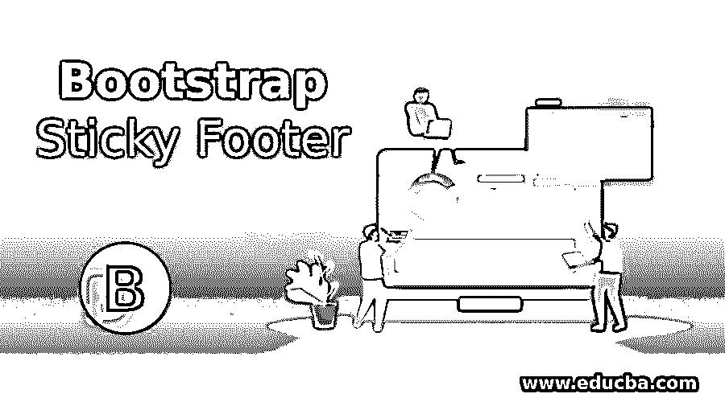
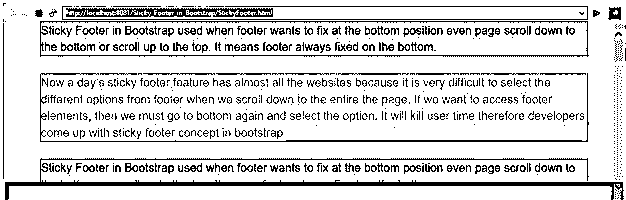
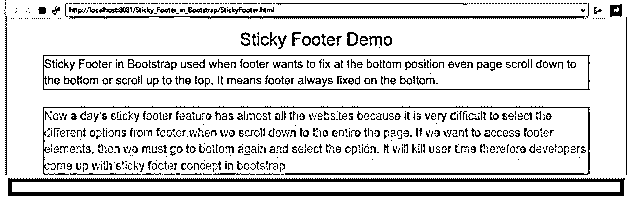
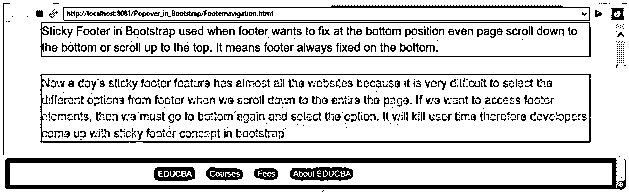
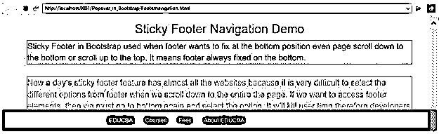
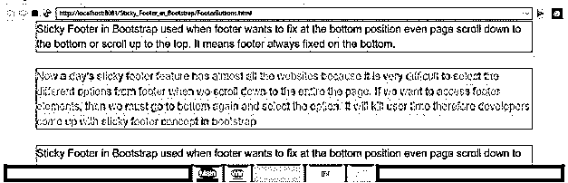
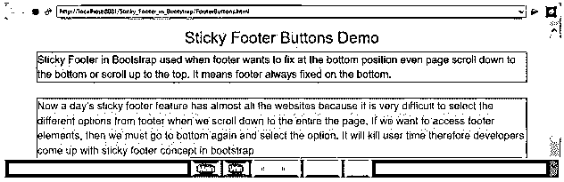

# 引导粘贴页脚

> 原文：<https://www.educba.com/bootstrap-sticky-footer/>




## 引导程序粘滞页脚简介

Bootstrap 中的粘滞页脚是在页脚希望固定在底部位置时使用的，即使页面向下滚动到底部或向上滚动到顶部。这意味着页脚总是固定在底部。现在几乎所有的网站都有一天的粘性页脚功能，因为当我们向下滚动到整个页面时，很难从页脚中选择不同的选项。如果我们想访问页脚元素，那么我们必须再次回到底部并选择选项。这会浪费用户的时间，因此开发人员在 bootstrap 中提出了粘性页脚的概念。它很容易接近底部元件。

### 为什么 Bootstrap 超过 HTML？

*   在 HTML 中，开发人员必须为每个类、id、链接、按钮等编写样式。
*   而 Bootstrap 拥有大多数预定义的类、链接和按钮等。使用它们自己的级联样式来降低代码复杂性。

**Note:** Bootstrap files also saved with .html extension.

### 粘滞页脚在 Bootstrap 中是如何工作的？

*   粘滞页脚只是底部类似导航条的结构，如果我们想让导航条粘在底部(粘滞页脚)，那么使用下面的语法。

**语法:**

<small>网页开发、编程语言、软件测试&其他</small>

```
<style>
.footer {
position: fixed;
}
</style>
<div class="footer">
<p>Footer</p>
</div>
```

包括引导功能，我们必须在应用程序中指定一些预定义的库。

它们如下:

*   包括引导视图

```
<meta name="viewport" content="width=device-width, initial-scale=1">
```

*   包括 ajax 和 jQuery 库

```
<script src="https://ajax.googleapis.com/ajax/libs/jquery/3.4.1/jquery.min.js"></script>
```

*   包括引导库

```
<link rel="stylesheet" href="https://maxcdn.bootstrapcdn.com/bootstrap/3.4.1/css/bootstrap.min.css">
```

*   包括引导库

```
<script src="https://maxcdn.bootstrapcdn.com/bootstrap/3.4.1/js/bootstrap.min.js"></script>
```

### 引导程序粘滞页脚示例

以下是给出的例子:

#### 示例 1–粘滞页脚演示

**代码:**

```
<!DOCTYPE html>
<html>
<head>
<meta name="viewport" content="width=device-width, initial-scale=1">
<!-- include bootstrap alignment -->
<meta name="viewport" content="width=device-width, initial-scale=1">
<!-- include bootstrap CSS libraries -->
<link rel="stylesheet"
href="https://maxcdn.bootstrapcdn.com/bootstrap/3.4.1/css/bootstrap.min.css">
<!-- include jQuery library -->
<script
src="https://ajax.googleapis.com/ajax/libs/jquery/3.4.1/jquery.min.js"></script>
<!-- include bootstrap JavScript library -->
<script
src="https://maxcdn.bootstrapcdn.com/bootstrap/3.4.1/js/bootstrap.min.js"></script>
<style type="text/css">
h2 {
text-align: center;
color: green;
}
.footer {
position: fixed;
width: 100%;
left: 0;
bottom: 0;
color: maroon;
text-align: center;
background-color: green;
}
.p1 {
border-style: solid;
border-color: red;
border-width: 1px;
font-size: 20px;
color: blue;
}
.p2 {
border-style: solid;
border-color: blue;
border-width: 1px;
font-size: 20px;
color: fuchsia;
}
.p3 {
border-style: solid;
border-color: brown;
border-width: 1px;
font-size: 20px;
color: green;
}
div {
width: 600px;
}
</style>
</head>
<body>
<div class="container">
<h2>Sticky Footer Demo</h2>
<p class="p1">Sticky Footer in Bootstrap used when footer wants to
fix at the bottom position even page scroll down to the bottom or
scroll up to the top. It means footer always fixed on the bottom.</p>
<br>
<p class="p2">Now a day’s sticky footer feature has almost all the
websites because it is very difficult to select the different options
from footer when we scroll down to the entire the page. If we want to
access footer elements, then we must go to bottom again and select
the option. It will kill user time therefore developers come up with
sticky footer concept in bootstrap</p>
<br>
<p class="p3">Sticky Footer in Bootstrap used when footer wants to
fix at the bottom position even page scroll down to the bottom or
scroll up to the top. It means footer always fixed on the bottom.</p>
</div>
<div class="footer">
<p>I am sticky footer portion</p>
</div>
</body>
</html>
```

**输出:**







**说明:**

*   正如你在上面的输出中看到的，即使我们上下滚动，页脚也没有移动，所以我们已经满足了我们的要求。

#### 示例 2–带导航栏的页脚

**代码:**

```
<!DOCTYPE html>
<html>
<head>
<meta name="viewport" content="width=device-width, initial-scale=1">
<!-- include bootstrap alignment -->
<meta name="viewport" content="width=device-width, initial-scale=1">
<!-- include bootstrap CSS libraries -->
<link rel="stylesheet"
href="https://maxcdn.bootstrapcdn.com/bootstrap/3.4.1/css/bootstrap.min.css">
<!-- include jQuery library -->
<script
src="https://ajax.googleapis.com/ajax/libs/jquery/3.4.1/jquery.min.js"></script>
<!-- include bootstrap JavScript library -->
<script
src="https://maxcdn.bootstrapcdn.com/bootstrap/3.4.1/js/bootstrap.min.js"></script>
<style type="text/css">
h2 {
text-align: center;
color: green;
}
.footer {
position: fixed;
width: 100%;
left: 0;
bottom: 0;
color: maroon;
text-align: center;
}
.p1 {
border-style: solid;
border-color: red;
border-width: 1px;
font-size: 20px;
color: blue;
}
.p2 {
border-style: solid;
border-color: blue;
border-width: 1px;
font-size: 20px;
color: fuchsia;
}
.p3 {
border-style: solid;
border-color: brown;
border-width: 1px;
font-size: 20px;
color: green;
}
div {
width: 600px;
}
</style>
</head>
<body>
<div class="container">
<h2>Sticky Footer Navigation Demo</h2>
<p class="p1">Sticky Footer in Bootstrap used when footer wants to
fix at the bottom position even page scroll down to the bottom or
scroll up to the top. It means footer always fixed on the bottom. </p>
<br>
<p class="p2">Now a day’s sticky footer feature has almost all the
websites because it is very difficult to select the different options
from footer when we scroll down to the entire the page. If we want to
access footer elements, then we must go to bottom again and select
the option. It will kill user time therefore developers come up with
sticky footer concept in bootstrap</p>
<br>
<p class="p3">Sticky Footer in Bootstrap used when footer wants to
fix at the bottom position even page scroll down to the bottom or
scroll up to the top. It means footer always fixed on the bottom.</p>
</div>
<div class="footer">
<nav class="navbar navbar-inverse">
<div class="container-fluid">
<ul class="nav navbar-nav">
<li class="active"><a href="#">EDUCBA</a></li>
<li><a href="#">Courses</a></li>
<li><a href="#">Fees</a></li>
<li><a href="#">About EDUCBA</a></li>
</ul>
</div>
</nav>
</div>
</body>
</html>
```

**输出:**







**说明:**

*   正如您在上面的输出中看到的，即使我们上下滚动，页脚导航也没有移动，所以我们已经满足了我们的要求。

#### 示例 3–带有不同按钮的页脚

**代码:**

```
<!DOCTYPE html>
<html>
<head>
<meta name="viewport" content="width=device-width, initial-scale=1">
<!-- include bootstrap alignment -->
<meta name="viewport" content="width=device-width, initial-scale=1">
<!-- include bootstrap CSS libraries -->
<link rel="stylesheet"
href="https://maxcdn.bootstrapcdn.com/bootstrap/3.4.1/css/bootstrap.min.css">
<!-- include jQuery library -->
<script
src="https://ajax.googleapis.com/ajax/libs/jquery/3.4.1/jquery.min.js"></script>
<!-- include bootstrap JavScript library -->
<script
src="https://maxcdn.bootstrapcdn.com/bootstrap/3.4.1/js/bootstrap.min.js"></script>
<style type="text/css">
h2 {
text-align: center;
color: green;
}
.footer {
position: fixed;
width: 100%;
left: 0;
bottom: 0;
color: maroon;
text-align: center;
background: black;
}
.p1 {
border-style: solid;
border-color: red;
border-width: 1px;
font-size: 20px;
color: blue;
}
.p2 {
border-style: solid;
border-color: blue;
border-width: 1px;
font-size: 20px;
color: fuchsia;
}
.p3 {
border-style: solid;
border-color: brown;
border-width: 1px;
font-size: 20px;
color: green;
}
div {
width: 600px;
}
</style>
</head>
<body>
<div class="container">
<h2>Sticky Footer Buttons Demo</h2>
<p class="p1">Sticky Footer in Bootstrap used when footer wants to
fix at the bottom position even page scroll down to the bottom or
scroll up to the top. It means footer always fixed on the bottom.</p>
<br>
<p class="p2">Now a day’s sticky footer feature has almost all the
websites because it is very difficult to select the different options
from footer when we scroll down to the entire the page. If we want to
access footer elements, then we must go to bottom again and select
the option. It will kill user time therefore developers come up with
sticky footer concept in bootstrap</p>
<br>
<p class="p3">Sticky Footer in Bootstrap used when footer wants to
fix at the bottom position even page scroll down to the bottom or
scroll up to the top. It means footer always fixed on the bottom.</p>
</div>
<div class="footer">
<button type="button" class="btn btn-primary">Main</button>
<button type="button" class="btn btn-success">Win</button>
<button type="button" class="btn btn-info">Information</button>
<button type="button" class="btn btn-warning">Caution</button>
<button type="button" class="btn btn-danger">Alert</button>
</div>
</body>
</html>
```

**输出:**







**说明:**

*   正如您在上面的输出中看到的，即使我们上下滚动，页脚按钮也没有移动，所以我们已经满足了我们的要求。

### 结论

粘性页脚用于即时访问底部元素，以减少用户时间。我们可以将它应用于按钮、导航、内容等。

### 推荐文章

这是一个引导粘页脚。在这里，我们讨论介绍，为什么引导 HTML？如何粘页脚工作在引导与例子。您也可以看看以下文章，了解更多信息–

1.  [引导响应](https://www.educba.com/bootstrap-responsive/)
2.  [自助汉堡菜单](https://www.educba.com/bootstrap-hamburger-menu/)
3.  [引导雕刻图案](https://www.educba.com/bootstrap-glyphicons/)
4.  [引导程序中的图像滑块](https://www.educba.com/image-slider-in-bootstrap/)


