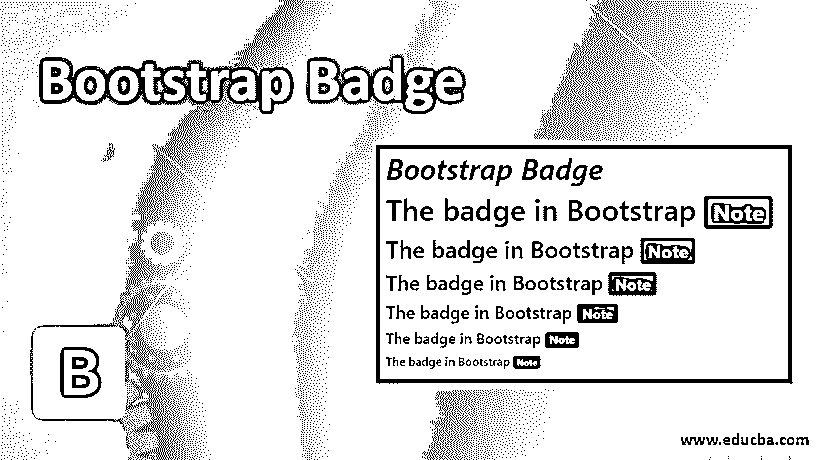
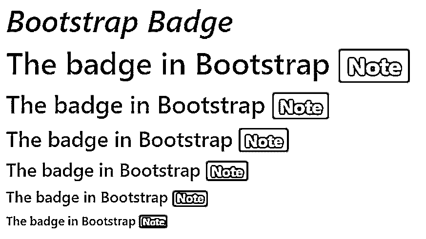
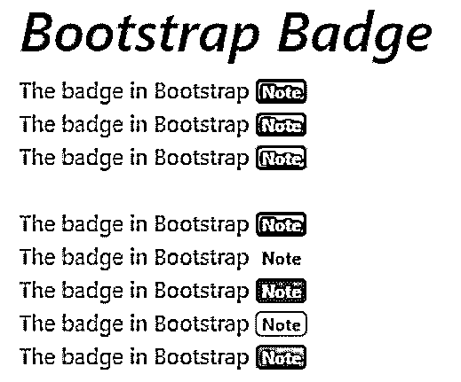
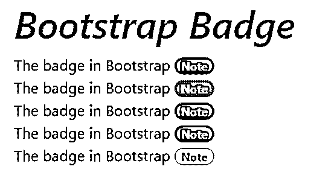
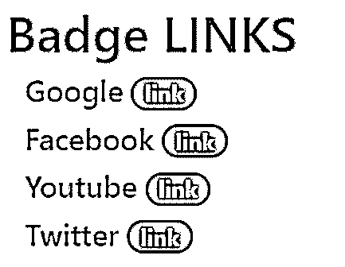

# 引导徽章

> 原文：<https://www.educba.com/bootstrap-badge/>




## 引导徽章介绍

Bootstrap 有许多类、标签和属性来使 web 应用程序对用户友好。bootstrap 中的徽章用于添加内容的额外信息，突出显示内容的附加信息。徽章类似于标签，但它有一些类别，比标签更有效。

徽章类和上下文或药丸徽章类一起工作来创建有效的徽章。badge 类在内容标签中出现了标签。徽章比例和主要内容比例必须相互匹配。

<small>网页开发、编程语言、软件测试&其他</small>

### 引导徽章的语法

*   的。徽章类用于内容文本标签中的标签。

```
<h1> the badge in Bootstrap  Note 
</h1>
```

*   的。badge-主类是上下文相关的类。它用于风格和设计。
*   以下语法是不同的标签和不同的上下文。

bootstrap 中内容文本大小和徽章类的基本语法。

1.这个 bootstrap budge 根据主元素的内容设置大小。

```
<h1> the badge in Bootstrap  Note  </h1>
```

```
<h3> the badge in Bootstrap  Note  </h3>
```

```
<h6> the badge in Bootstrap  Note  </h6>
```

2.带有上下文标记的引导标记。

*   背景徽章是不同颜色和矩形大小的徽章。
*   下面给出了一些上下文标记语法。

```
 Note 
```

```
 Note 
```

```
 Note 
```

3.有药丸徽章的引导徽章。

*   药丸徽章是长方形的，角上有一个圆形。
*   的。徽章-药丸类用于引导程序中的药丸徽章。

```
 Note 
```

```
 Note 
```

```
 Note 
```

### 例子

徽章通常用于表示网页上的一些有价值的信息，如相关标题、警告通知、更新计数器等。下面是一些例子:

#### 示例#1

bootstrap 与标题标签大小的关系。展示带有输出的示例。

**代码:**

```
<!DOCTYPE html>
<html>
<head>
<title> Bootstrap Badge </title>
<meta charset= "utf-8">
<meta name= "viewport" content="width=device-width, initial-scale=1">
<link rel= "stylesheet" href="https://maxcdn.bootstrapcdn.com/bootstrap/4.4.1/css/bootstrap.min.css">
<script src= "https://ajax.googleapis.com/ajax/libs/jquery/3.4.1/jquery.min.js">
</script>
<script src= "https://cdnjs.cloudflare.com/ajax/libs/popper.js/1.16.0/umd/popper.min.js">
</script>
<script src= "https://maxcdn.bootstrapcdn.com/bootstrap/4.4.1/js/bootstrap.min.js">
</script>
</head>
<body>
<div class="container">
<h1> <i> Bootstrap Badge </i> </h1>
<h1> The badge in Bootstrap  Note  </h1>
<h2> The badge in Bootstrap  Note  </h2>
<h3> The badge in Bootstrap  Note  </h3>
<h4> The badge in Bootstrap  Note  </h4>
<h5> The badge in Bootstrap  Note  </h5>
<h6> The badge in Bootstrap  Note  </h6>
</div>
</body>
</html>
```

**输出:**




#### 实施例 2

带有上下文标记的引导标记。显示上下文标记的输出。

**代码:**

```
<!DOCTYPE html>
<html>
<head>
<title> Bootstrap Badge </title>
<meta charset= "utf-8">
<meta name= "viewport" content= "width=device-width, initial-scale=1">
<link rel= "stylesheet" href="https://maxcdn.bootstrapcdn.com/bootstrap/4.4.1/css/bootstrap.min.css">
<script src= "https://ajax.googleapis.com/ajax/libs/jquery/3.4.1/jquery.min.js">
</script>
<script src= "https://cdnjs.cloudflare.com/ajax/libs/popper.js/1.16.0/umd/popper.min.js">
</script>
<script src= "https://maxcdn.bootstrapcdn.com/bootstrap/4.4.1/js/bootstrap.min.js">
</script>
</head>
<body>
<div class= "container">
<h1> <i> Bootstrap Badge </i> </h1>
The badge in Bootstrap  Note  <br>
The badge in Bootstrap  Note  <br>
The badge in Bootstrap  Note  <br><br>
The badge in Bootstrap  Note <br>
The badge in Bootstrap  Note  <br>
The badge in Bootstrap  Note  <br>
The badge in Bootstrap  Note  <br>
The badge in Bootstrap  Note  <br>
</div>
</body>
</html>
```

**输出:**




#### 实施例 3

带有输出的药丸徽章示例。

**代码:**

```
<!DOCTYPE html>
<html>
<head>
<title> Bootstrap Badge </title>
<meta charset= "utf-8">
<meta name= "viewport" content= "width=device-width, initial-scale=1">
<link rel= "stylesheet" href="https://maxcdn.bootstrapcdn.com/bootstrap/4.4.1/css/bootstrap.min.css">
<script src= "https://ajax.googleapis.com/ajax/libs/jquery/3.4.1/jquery.min.js">
</script>
<script src= "https://cdnjs.cloudflare.com/ajax/libs/popper.js/1.16.0/umd/popper.min.js">
</script>
<script src= "https://maxcdn.bootstrapcdn.com/bootstrap/4.4.1/js/bootstrap.min.js">
</script>
</head>
<body>
<div class="container">
<h1> <i> Bootstrap Badge </i> </h1>
The badge in Bootstrap  Note  <br>
The badge in Bootstrap  Note  <br>
The badge in Bootstrap  Note  <br>
The badge in Bootstrap  Note  <br>
The badge in Bootstrap  Note  <br>
</div>
</body>
</html>
```

**输出:**




#### 实施例 4

主页、通知和消息按钮[添加在导航栏](https://www.educba.com/navbar-in-bootstrap/)中。此按钮添加徽章以了解计数。

**代码:**

```
<!DOCTYPE html>
<html>
<head>
<title> Bootstrap badge </title>
<meta charset="utf-8">
<meta name= "viewport" content= "width=device-width, initial-scale=1">
<link rel="stylesheet" href= "https://maxcdn.bootstrapcdn.com/bootstrap/3.4.1/css/bootstrap.min.css">
<script src= "https://ajax.googleapis.com/ajax/libs/jquery/3.4.1/jquery.min.js"></script>
<script src= "https://maxcdn.bootstrapcdn.com/bootstrap/3.4.1/js/bootstrap.min.js"></script>
</head>
<body>
<nav class= "navbar navbar-inverse">
<div class= "container-fluid">
<div class= "navbar-header">
<button type= "button" class= "btn btn-success nav-brand" href="#">
Home 10
</button>
</div>
<ul class= "nav navbar-nav ">
<li><button type ="button" class= "btn btn-danger nav-link" href="#">
Notification  8  </li>
<li> <button type= "button" class= "btn btn-danger nav-link" href="#">
Messages  3 
</button> </li>
</ul>
</div>
</nav>
</body>
</html>
```

**输出:**


#### 实施例 5

它用于统计 web 应用程序的消息、评论和通知。链接和按钮格式中使用的徽章。按钮格式徽章展示了上面的例子。链接格式示例如下。

**代码:**

```
<!DOCTYPE html>
<html >
<head>
<title> Bootstrap badge </title>
<meta charset="utf-8">
<meta name= "viewport" content= "width=device-width, initial-scale=1">
<link rel= "stylesheet" href= "https://maxcdn.bootstrapcdn.com/bootstrap/4.4.1/css/bootstrap.min.css">
<script src= "https://ajax.googleapis.com/ajax/libs/jquery/3.4.1/jquery.min.js"></script>
<script src= "https://cdnjs.cloudflare.com/ajax/libs/popper.js/1.16.0/umd/popper.min.js"></script>
<script src="https://maxcdn.bootstrapcdn.com/bootstrap/4.4.1/js/bootstrap.min.js"></script>
</head>
<body>
<div class="container">
<h1 style="color:blue;">
Badge LINKS
</h1>
<div class="container">
<h4> Google
<a span href= "https://www.google.com/" class= "badge badge-success badge-pill"> link  </a>
</h4>
<h4> Facebook
<a span href= "https://www.facebook.com/" class= "badge badge-success badge-pill"> link  </a>
</h4>
<h4> Youtube
<a span href= "https://www.youtube.com/" class= "badge badge-success badge-pill"> link  </a>
</h4>
<h4> Twitter
<a span href= "https://www.twitter.com/" class= "badge badge-success badge-pill"> link  </a>
</h4>
</div>
</body>
</html>
```

**输出:**




### 结论

它用于计算通知、消息、更新、评论等输入的数量。这用作链接和按钮来显示关于内容的额外信息。这与标签相同，但形状比上下文标记更圆。

### 推荐文章

这是一个引导徽章。在这里，我们讨论介绍和语法，以及不同的例子和它的代码实现。您也可以看看以下文章，了解更多信息–

1.  [引导命令](https://www.educba.com/bootstrap-commands/)
2.  [Bootstrap glyphicon 组件](https://www.educba.com/bootstrap-glyphicons/)
3.  [引导面板](https://www.educba.com/bootstrap-panels/)
4.  [自举粘滞页脚](https://www.educba.com/bootstrap-sticky-footer/)


