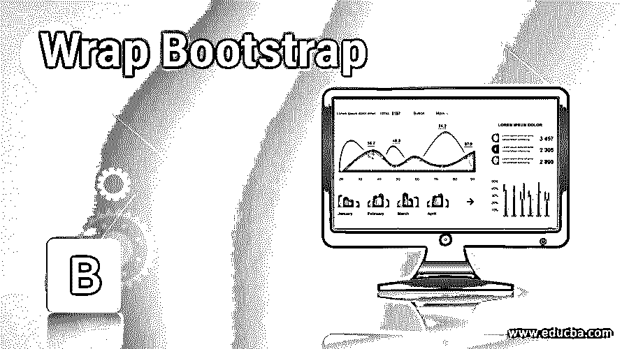
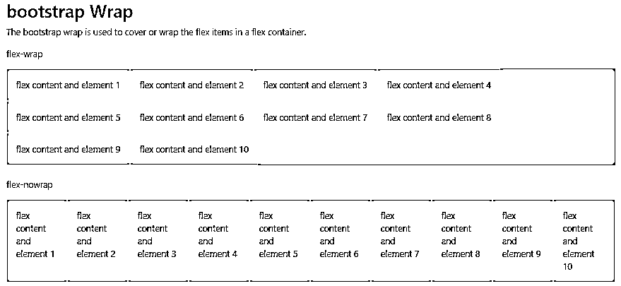
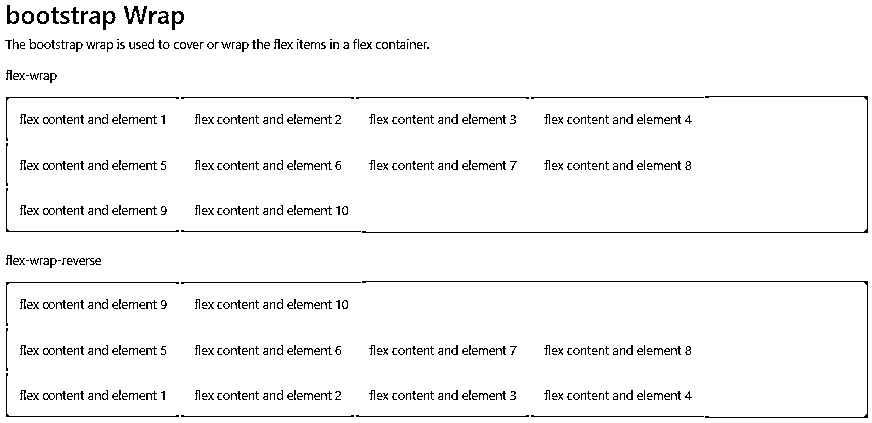
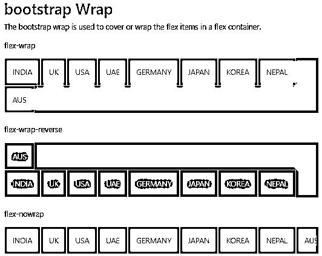

# 包装引导

> 原文：<https://www.educba.com/wrap-bootstrap/>




## 包装自举简介

引导包装用于覆盖或包装柔性容器中的柔性物品。它有三个主要的类。柔性包装。flex-nowrap，。弯曲-缠绕-反转。首先是。包装亚麻制品的柔性包装。其次是。flex-nowrap 无需包装在 flex 容器中。最后是。flex-wrap-reverse 用于在柔性容器中反向包装。

Flex 组织了网格列与布局的对齐和大小调整。使用响应式 Flexbox 实用程序的 flex 控件导航和组件。包装是 flex 的实用工具之一。CSS 对于 flex 中复杂的实现是必要的。

<small>网页开发、编程语言、软件测试&其他</small>

### 包装引导语法

*   包装的三个基本语法。语法如下。
*   flex 容器中的 Flex 项目。

```
<div class= "d-flex flex-wrap"> flex items and content </div>
```

*   flex 项目以相反的方式覆盖在 Flex 容器中。

```
<div class= "d-flex flex-wrap-reverse"> flex items and content </div>
```

*   flex 容器中不包含的 Flex 项目。

```
<div class= "d-flex flex-nowrap"> flex items and content </div>
```

### 例子

下面是一些例子:

#### 示例#1

包装和不包装的例子。

**代码:**

```
<!DOCTYPE html>
<html>
<head>
<title> Bootstrap wrap Example </title>
<meta charset="utf-8">
<meta name="viewport" content="width=device-width, initial-scale=1">
<link rel="stylesheet" href="https://maxcdn.bootstrapcdn.com/bootstrap/4.4.1/css/bootstrap.min.css">
<script src="https://ajax.googleapis.com/ajax/libs/jquery/3.4.1/jquery.min.js"></script>
<script src="https://cdnjs.cloudflare.com/ajax/libs/popper.js/1.16.0/umd/popper.min.js"></script>
<script src="https://maxcdn.bootstrapcdn.com/bootstrap/4.4.1/js/bootstrap.min.js"></script>
</head>
<body>
<div class="container">
<h2> bootstrap Wrap </h2>
<p> The bootstrap wrap is used to cover or wrap the flex items in a flex container.</p>
<p> flex-wrap </p>
<div class="d-flex flex-wrap bg-warning">
<div class="p-3 border"> flex content and element 1</div>
<div class="p-3 border"> flex content and element 2 </div>
<div class="p-3 border"> flex content and element 3</div>
<div class="p-3 border"> flex content and element 4 </div>
<div class="p-3 border"> flex content and element 5</div>
<div class="p-3 border"> flex content and element 6</div>
<div class="p-3 border"> flex content and element 7</div>
<div class="p-3 border"> flex content and element 8</div>
<div class="p-3 border"> flex content and element 9</div>
<div class="p-3 border"> flex content and element 10 </div>
</div>
<br>
<p> flex-nowrap </p>
<div class="d-flex flex-nowrap bg-warning">
<div class="p-3 border"> flex content and element 1</div>
<div class="p-3 border"> flex content and element 2 </div>
<div class="p-3 border"> flex content and element 3</div>
<div class="p-3 border"> flex content and element 4 </div>
<div class="p-3 border"> flex content and element 5</div>
<div class="p-3 border"> flex content and element 6</div>
<div class="p-3 border"> flex content and element 7</div>
<div class="p-3 border"> flex content and element 8</div>
<div class="p-3 border"> flex content and element 9</div>
<div class="p-3 border"> flex content and element 10 </div>
</div>
<br>
</div>
</body>
</html>
```

**输出:**




#### 实施例 2

环绕和反向环绕示例。

**代码:**

```
<!DOCTYPE html>
<html>
<head>
<title> Bootstrap wrap Example </title>
<meta charset="utf-8">
<meta name="viewport" content="width=device-width, initial-scale=1">
<link rel="stylesheet" href="https://maxcdn.bootstrapcdn.com/bootstrap/4.4.1/css/bootstrap.min.css">
<script src="https://ajax.googleapis.com/ajax/libs/jquery/3.4.1/jquery.min.js"></script>
<script src="https://cdnjs.cloudflare.com/ajax/libs/popper.js/1.16.0/umd/popper.min.js"></script>
<script src="https://maxcdn.bootstrapcdn.com/bootstrap/4.4.1/js/bootstrap.min.js"></script>
</head>
<body>
<div class="container">
<h2> bootstrap Wrap </h2>
<p> The bootstrap wrap is used to cover or wrap the flex items in a flex container. </p>
<p> flex-wrap </p>
<div class="d-flex flex-wrap bg-warning">
<div class="p-3 border"> flex content and element 1</div>
<div class="p-3 border"> flex content and element 2 </div>
<div class="p-3 border"> flex content and element 3</div>
<div class="p-3 border"> flex content and element 4 </div>
<div class="p-3 border"> flex content and element 5</div>
<div class="p-3 border"> flex content and element 6</div>
<div class="p-3 border"> flex content and element 7</div>
<div class="p-3 border"> flex content and element 8</div>
<div class="p-3 border"> flex content and element 9</div>
<div class="p-3 border"> flex content and element 10 </div>
</div>
<br>
<p> flex-wrap-reverse </p>
<div class="d-flex flex-wrap-reverse bg-warning">
<div class="p-3 border"> flex content and element 1</div>
<div class="p-3 border"> flex content and element 2 </div>
<div class="p-3 border"> flex content and element 3</div>
<div class="p-3 border"> flex content and element 4 </div>
<div class="p-3 border"> flex content and element 5</div>
<div class="p-3 border"> flex content and element 6</div>
<div class="p-3 border"> flex content and element 7</div>
<div class="p-3 border"> flex content and element 8</div>
<div class="p-3 border"> flex content and element 9</div>
<div class="p-3 border"> flex content and element 10 </div>
</div>
<br>
</div>
<br>
</div>
</body>
</html>
```

**输出:**




#### 实施例 3

**代码:**

```
<!DOCTYPE html>
<html>
<head>
<title> Bootstrap wrap Example </title>
<meta charset="utf-8">
<meta name="viewport" content="width=device-width, initial-scale=1">
<link rel="stylesheet" href="https://maxcdn.bootstrapcdn.com/bootstrap/4.4.1/css/bootstrap.min.css">
<script src="https://ajax.googleapis.com/ajax/libs/jquery/3.4.1/jquery.min.js"></script>
<script src="https://cdnjs.cloudflare.com/ajax/libs/popper.js/1.16.0/umd/popper.min.js"></script>
<script src="https://maxcdn.bootstrapcdn.com/bootstrap/4.4.1/js/bootstrap.min.js"></script>
</head>
<body>
<div class="container">
<h2> bootstrap Wrap </h2>
<p> The bootstrap wrap is used to cover or wrap the flex items in a flex container. </p>
<p> flex-wrap </p>
<div class="d-flex flex-wrap bg-success">
<div class="p-3 border"> INDIA </div> <br>
<div class="p-3 border"> UK </div> <br>
<div class="p-3 border"> USA</div> <br>
<div class="p-3 border"> UAE </div> <br>
<div class="p-3 border"> GERMANY </div> <br>
<div class="p-3 border"> JAPAN </div> <br>
<div class="p-3 border"> KOREA </div> <br>
<div class="p-3 border"> NEPAL </div> <br>
<div class="p-3 border"> AUS </div>
</div>
<br>
<p> flex-wrap-reverse </p>
<div class="d-flex flex-wrap-reverse bg-primary">
<div class="p-3 border"> INDIA </div> <br>
<div class="p-3 border"> UK </div> <br>
<div class="p-3 border"> USA</div> <br>
<div class="p-3 border"> UAE </div> <br>
<div class="p-3 border"> GERMANY </div> <br>
<div class="p-3 border"> JAPAN </div> <br>
<div class="p-3 border"> KOREA </div> <br>
<div class="p-3 border"> NEPAL </div> <br>
<div class="p-3 border"> AUS </div>
</div>
<br>
<p> flex-nowrap </p>
<div class="d-flex flex-nowrap bg-secondary">
<div class="p-3 border"> INDIA </div> <br>
<div class="p-3 border"> UK </div> <br>
<div class="p-3 border"> USA</div> <br>
<div class="p-3 border"> UAE </div> <br>
<div class="p-3 border"> GERMANY </div> <br>
<div class="p-3 border"> JAPAN </div> <br>
<div class="p-3 border"> KOREA </div> <br>
<div class="p-3 border"> NEPAL </div> <br>
<div class="p-3 border"> AUS </div>
</div>
<br>
</div>
</body>
</html>
```

**输出:**




### 推荐文章

这是一个包装自举指南。在这里，我们还讨论了介绍和语法以及不同的例子和它的代码实现。您也可以看看以下文章，了解更多信息–

1.  [引导布局](https://www.educba.com/bootstrap-layout/)
2.  [自举网格系统](https://www.educba.com/bootstrap-grid-system/)
3.  [自举输入类型](https://www.educba.com/bootstrap-input-type/)
4.  [自举日历](https://www.educba.com/bootstrap-calendar/)


