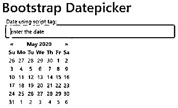
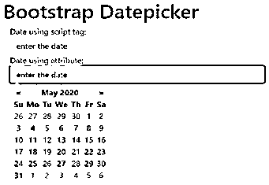
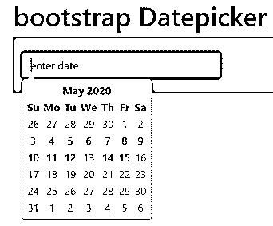
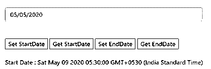
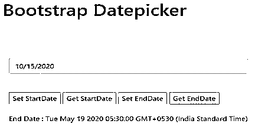

# Bootstrap Datepicker

> 原文：<https://www.educba.com/bootstrap-datepicker/>


## Bootstrap 数据选择器简介

引导程序具有许多高级功能和组件。它使得应用程序更加用户友好。bootstrap datepicker 是 bootstrap 的一个高级特性，用于 web 应用程序中的日期选取。日期选择器可以根据需要的日期选择日期、月份和年份。我们可以很容易地选择过去和未来几十年的数据。datepicker 允许在 datepicker 插件中选择开始和结束日期。支持 datepicker 来启用和禁用日期限制。

**语法**

<small>网页开发、编程语言、软件测试&其他</small>

*   bootstrap 数据选择器使用 bootstrap 和 jquery 技术。
*   有两种方法可以实现日期选择器。
*   datepicker 语法如下。
*   引导语法如下。

```
<div class= "container">
Date: <input type= "text" id="datepicker" placeholder= "Enter a Date"> <br>
</div>
```

*   Jquery 语法如下。

```
<script  type="text/ javascript">
$ (document).ready( function() {
$ ("# datepicker") .datepicker();
});
</script>
```

*   bootstrap 使用了一个属性来获取 bootstrap 中的 datepickert。这是 datepicker 的第二个方法。
*   datepicker 的语法如下。
*   <input type="”text”" data-provide="”datepicker”" placeholder="”Enter" a="" date="">

### Bootstrap Datepicker 是如何工作的？

在 web creator 页面上添加了带有 bootstrap 和 jquery 链接的 datepicker 链接。

```
<script type= "text/javascript" src= "https://cdnjs.cloudflare.com/ajax/libs/bootstrap-datepicker/1.4.1/js/bootstrap-datepicker.min.js"></script>
```

```
<link rel= "stylesheet" href= "https://cdnjs.cloudflare.com/ajax/libs/bootstrap-datepicker/1.4.1/css/bootstrap-datepicker3.css"/>
```

datepicker 用两种方法实现。

这两种方法如下:

**1。在引导中使用 data-provide="datepicker "属性。**

```
<div class= "container">
<div class= "form">
<input type= "text" class= "form-control" data-provide= "datepicker" placeholder= "enter date : using attribute" style= "width:500px;">
</div>
</div>
```

**2。使用 bootstrap 和 JavaScript/ jquery 技术。**

```
<body>
<h1> bootstrap Datepicker </h1>
<div class= "container">
<div class= "form">
<input type= "text" class= "form-control" id= "example" placeholder= "enter date" style="width: 500px;">
</div>
</div>
<script type="text/javascript">
$(document).ready(function(){
$("#example").datepicker();
});
</script>
</body>
```

datepicker 有许多选项可以根据需要控制和修改日期。

以下选项如下。

*   **开始日期:**开始日期是较早的日期。我们可以选择日期或值，如(-5d)、(-6m)、(-2y)。

*   **结束日期:**结束日期是结束日期，可以选择日期或值。

*   **语言:**日期选择器可以更改其他语言，但默认语言是英语。

*   **格式:**日期格式可以根据用户友好和易于理解的方式选择。

格式可以用 yy、yyyy、M、mm、D、dd、yy、YYYY、M、MM、D、DD 的组合来设置。

默认格式是月/日/年，另一种可用的格式是月/日/年。

```
<body>
<h1> bootstrap Datepicker </h1>
<div class= "container">
<div class= "form">
<input type= "text" class= "form-control" id= "example" placeholder= "enter date" style="width: 500px;">
</div>
</div>
<script type= "text/ javascript">
$(document).ready(function(){
$("#example").datepicker({
"format": "d-m-yy",
"startDate": "-5m",
"endDate": "05-15-2020",
});
});
</script>
</body>
```

datepicker 在脚本标记中使用了许多方法。

*   **Show–**这个方法显示了 datepicker 插件。

```
$('#example').datepicker ('show');
```

*   **Hide**–这个方法隐藏了 datepicker 插件。

```
$('#example').datepicker ('hide');
```

*   **Destroy-**删除插件并将事件附加到元素上。

```
$('#example').datepicker ('destroy');
```

*   **getDate—**日期从日期选择器返回。

```
$('#example').datepicker ('getDate');
```

*   **getStartDate-**从 datepicker 返回下限或最早日期。

```
$('#example').datepicker ('getStartDate');
```

*   **set start date–**下限或最早日期由 datepicker 设置。

```
$('#example').datepicker ('setStartDate');
```

*   **getEndDate-**上限日期从 datepicker 返回。

```
$('#example').datepicker ('getEndDate');
```

*   **setEndDate–**上限日期由 datepicker 设置。

```
$('#example').datepicker ('setEndDate');
```

### 例子

下面举几个例子:

#### 示例#1

下面是带有两个方法的简单日期选择器示例。

**代码:**

```
<!doctype html>
<html >
<head>
<meta charset= "utf-8">
<meta name= "viewport" content= "width=device-width, initial-scale=1,  shrink-to-fit=no">
<link rel= "stylesheet" href= "https://stackpath.bootstrapcdn.com/bootstrap/4.5.0/css/bootstrap.min.css">
<script src= "https://cdnjs.cloudflare.com/ajax/libs/bootstrap-datepicker/1.9.0/js/bootstrap-datepicker.min.js">
</script>
<link rel= "stylesheet" href= "https://cdnjs.cloudflare.com/ajax/libs/bootstrap-     datepicker/1.9.0/css/bootstrap-datepicker.min.css" />
<script src= "https://code.jquery.com/jquery-3.5.1.slim.min.js">
</script>
<script src= "https://cdn.jsdelivr.net/npm/popper.js@1.16.0/dist/umd/popper.min.js">
</script>
<script src= "https://stackpath.bootstrapcdn.com/bootstrap/4.5.0/js/bootstrap.min.js" >
</script>
<script src= "https://cdnjs.cloudflare.com/ajax/libs/bootstrap-datepicker/1.9.0/js/bootstrap-datepicker.js" >
</script>
<title> bootstrap Datepicker tutorial l </title>
</head>
<body>
<h1 style= "margin-left:200px;"> Bootstrap Datepicker </h1>
<div class= "container">
<div class= "form">
Date using script tag: <input type= "text" class= "form-control" style= "width: 500px;" id= "example" placeholder= "enter the date">
Date using attribute: <input type= "text" class= "form-control" style= "width: 500px;"
data-provide= "datepicker" placeholder= "enter the date ">
</div>
</div>
<script type= "text/javascript">
$(document) .ready(function(){
$("#example") .datepicker();
});
</script>
</body>
</html>
```

**输出:**




**输出:**




#### 实施例 2

下面是带有条件的 datepicker 示例。

**代码:**

```
<!doctype html>
<html >
<head>
<meta charset= "utf-8">
<meta name= "viewport" content= "width=device-width, initial-scale=1,  shrink-to-fit=no">
<link rel= "stylesheet" href= "https://stackpath.bootstrapcdn.com/bootstrap/4.5.0/css/bootstrap.min.css">
<script src= "https://cdnjs.cloudflare.com/ajax/libs/bootstrap-datepicker/1.9.0/js/bootstrap-datepicker.min.js">
</script>
<link rel= "stylesheet" href= "https://cdnjs.cloudflare.com/ajax/libs/bootstrap-     datepicker/1.9.0/css/bootstrap-datepicker.min.css" />
<script src= "https://code.jquery.com/jquery-3.5.1.slim.min.js">
</script>
<script src= "https://cdn.jsdelivr.net/npm/popper.js@1.16.0/dist/umd/popper.min.js">
</script>
<script src= "https://stackpath.bootstrapcdn.com/bootstrap/4.5.0/js/bootstrap.min.js" >
</script>
<script src= "https://cdnjs.cloudflare.com/ajax/libs/bootstrap-datepicker/1.9.0/js/bootstrap-datepicker.js" >
</script>
<title>bootstrap Datepicker tutorial</title>
</head>
<body>
<h1 style="margin-left:200px;"> bootstrap Datepicker </h1>
<div class="container" style="background-color:orange;">
<br>
<div class="form">
<input type="text" class="form-control" style="width:300px;" id="example" placeholder="enter date">
</div>
<br>
</div>
<script type="text/javascript">
$(document).ready(function(){
$("#example").datepicker({
"format": "m-d-yy",
"startDate": "-10d",
"endDate": "05-15-2020",
});
});
</script>
</body>
</html>
```

**输出**




#### 实施例 3

下面是带有方法示例的 datepicker。

**代码:**

```
<!doctype html>
<html>
<head>
<meta charset= "utf-8">
<meta name= "viewport" content="width=device-width, initial-scale=1, shrink-to-fit=no">
<link rel= "stylesheet" href= "https://stackpath.bootstrapcdn.com/bootstrap/4.5.0/css/bootstrap.min.css">
<script src= "https://cdnjs.cloudflare.com/ajax/libs/bootstrap-datepicker/1.9.0/js/bootstrap-datepicker.min.js">
</script>
<link rel= "stylesheet" href="https://cdnjs.cloudflare.com/ajax/libs/bootstrap-datepicker/1.9.0/css/bootstrap-datepicker.min.css" />
<script src= "https://code.jquery.com/jquery-3.5.1.slim.min.js">
</script>
<script src= "https://cdn.jsdelivr.net/npm/popper.js@1.16.0/dist/umd/popper.min.js">
</script>
<script src= "https://stackpath.bootstrapcdn.com/bootstrap/4.5.0/js/bootstrap.min.js" >
</script>
<script src= "https://cdnjs.cloudflare.com/ajax/libs/bootstrap-datepicker/1.9.0/js/bootstrap-datepicker.js"  >
</script>
<title> bootstrap Datepicker tutorial </title>
</head>
<body>
<h1 style= "margin-left:200px;"> Bootstrap Datepicker </h1>
<div class= 'container' style= 'margin-top: 90px;'>
<input type= 'text' class= "form-control"  id= 'example' placeholder= 'enter the date' style= 'width: 500px;' >
<br/><br/>
<input type= 'button' id= 'id1' value= 'Set StartDate'>
<input type= 'button' id= 'id2' value= 'Get StartDate'>
<input type= 'button' id= 'id3' value= 'Set EndDate'>
<input type= 'button' id= 'id4' value= 'Get EndDate'>
<br/><br/>
<div id= 'responsive'></div>
</div>
<script type="text/javascript">
$(document). ready(function(){
$('#example') .datepicker();
$('#id1') .click(function(){
$('#example') .datepicker ('setStartDate', '-5m');
});
$('#id2') .click(function(){
var startDate = $('#example').datepicker ('getStartDate');
$('# responsive ') .text('Start Date : ' + startDate);
});
$('#id3') .click(function(){
$('#example').datepicker('setEndDate', '+5m');
});
$('#id4') .click(function(){
var startDate = $('#example').datepicker('getEndDate');
$('# responsive ') .text('End Date : ' + startDate);
});
});
</script>
</body>
</html>
```

**输出:**







### 结论

*   datepicker 是 bootstrap 中的一个轻量级插件和用户友好的组件。
*   它有助于轻松选择日期。
*   它有助于控制限制日期。

### 推荐文章

这是一个引导数据选择器的指南。在这里，我们将讨论 Bootstrap Datepicker 如何与相应的示例一起工作。您也可以阅读以下文章，了解更多信息——

1.  [引导程序块引用](https://www.educba.com/bootstrap-blockquote/)
2.  [引导切换按钮](https://www.educba.com/bootstrap-toggle-button/)
3.  [自举粘性头](https://www.educba.com/bootstrap-sticky-header/)
4.  [自举搜索框](https://www.educba.com/bootstrap-search-box/)


