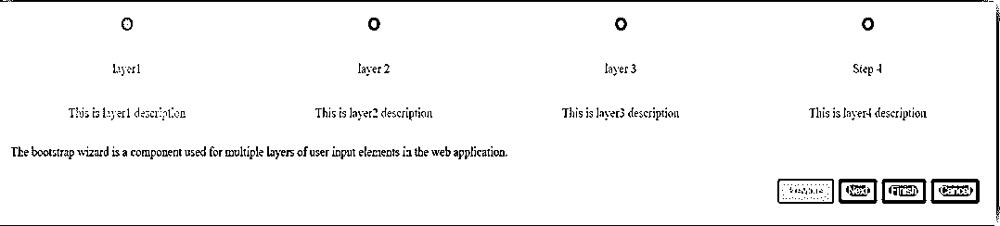
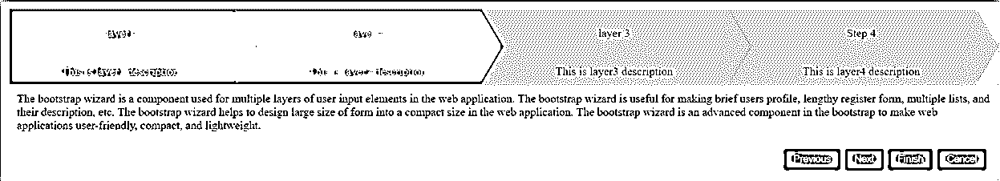
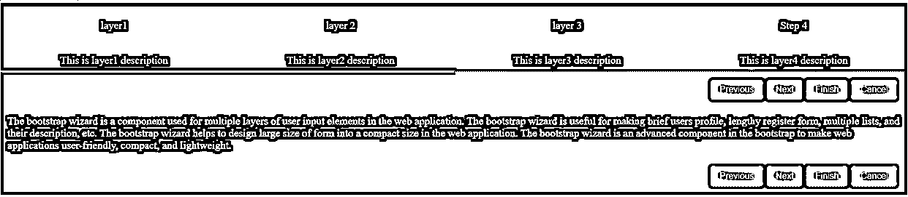

# 引导向导

> 原文：<https://www.educba.com/bootstrap-wizard/>


## 引导向导简介

引导向导是用于 web 应用程序中多层用户输入元素的组件。它对于制作简短的用户简介、冗长的注册表单、多个列表及其描述等非常有用。它有助于在 web 应用程序中将大尺寸的表单设计成紧凑的尺寸。它是 bootstrap 中的一个高级组件，使 web 应用程序变得用户友好、紧凑和轻量级。

**语法:**

<small>网页开发、编程语言、软件测试&其他</small>

*   Bootstrap 和 jquery 是创建向导所必需的。
*   下面是制作向导的简单引导页面语法。

```
<div id="bootstrapwizard">
<ul class="navbar">
<li class="nav-item">
<a href="#layer-1">
Layer 1: This is layer1 description.
</a>
</li>
<li class="nav-item">
<a href="#layer-2">
Layer 2: This is layer2 description.
</a>
</li>
<li class="nav-item">
<a href="#layer-3">
Layer 3: This is layer3 description.
</a>
</li>
</ul>
<div class="content">
<div id="layer-1" >
This is Layer 1 Content description.
</div>
<div id="layer-2">
This is Layer 2 Content description.
</div>
<div id="layer-3">
This is Layer 3 Content description.
</div></div>
```

*   jquery 页面语法如下。

```
<script type="text/javascript">
$(document).ready(function(){
$("#bootstrapwizard").smartWizard({
//the contents, events, and methods are written here.
});
});
</script>
```

### 引导向导是如何工作的？

*   在 HTML 页面中添加 bootstrap 基本链接和脚本标记。

```
<script src= "https://code.jquery.com/jquery-3.5.0.min.js">
</script>
<script src= "https://cdnjs.cloudflare.com/ajax/libs/popper.js/1.14.0/umd/popper.min.js">
</script>
<script src= "https://stackpath.bootstrapcdn.com/bootstrap/4.1.0/js/bootstrap.min.js">
</script>
<link rel="stylesheet" href= "[https://stackpath.bootstrapcdn.com/bootstrap/4.1.0/css/bootstrap.min.css](https://stackpath.bootstrapcdn.com/bootstrap/4.1.0/css/bootstrap.min.css)">
```

*   创建 css 和 js 文件夹，并在该文件夹中下载引导向导 css 和 js 文件。

```
<link type="text/css" href =" path/css/smart_wizard_all.css" rel ="stylesheet">
```

```
<script type= "text/javascript" src= "path/js/jquery.smartWizard.min.js">
</script>
```

*   下面是向导的基本示例，以便理解向导系统的工作原理。

```
<body>
<div id ="bootstrapwizard">
<ul class ="navbar">
<li class ="nav-item">
<a href="#layer-1">
Layer 1: This is layer1 description.
</a>
</li>
<li class ="nav-item">
<a href="#layer-2">
Layer 2: This is layer2 description.
</a>
</li>
<li class ="nav-item">
<a href="#layer-3">
Layer 3: This is layer3 description.
</a>
</li>
</ul>
<div class ="content">
<div id="layer-1" >
This is Layer 1 Content description.
</div>
<div id="layer-2">
This is Layer 2 Content description.
</div>
<div id="layer-3">
This is Layer 3 Content description.
</div>
</div>
<script type ="text/javascript">
$(document).ready(function(){
varbuttonFinish = $('<button></button>').text('Finish')
.addClass('btnbtn-success')
.on('click', function(){ alert('Finish button Clicked'); });
varbuttonCancel = $('<button></button>').text('Cancel')
.addClass('btnbtn-success')
.on('click', function(){ $('bootstrapwizard').smartWizard("reset"); });
$(“#bootstrapwizard”) .smartWizard({
selected: 0,
theme: 'dots',
transition: {
animation: 'slide-horizontal',
},
toolbarSettings: {
toolbarExtraButtons: [buttonFinish, buttonCancel]
}            });
});
</script>
</body>
```

### 例子

下面提到了不同的例子:

#### 示例#1

**代码:**

```
<!doctypehtml>
<html >
<head>
<title> Bootstrap wizard tutorial </title>
<meta charset="UTF-8">
<meta name="viewport" content="width=device-width, initial-scale=1, shrink-to-fit=no">
<link href= "path/css/smart_wizard_all.css" rel= "stylesheet" type= "text/css" />
<style>
body {
padding-right: 4%;
padding-left:  4%;
}
</style>
</head>
<body>
<div id="bootstrapwizard">
<ul class="nav">
<li class="nav-item">
<a href ="#layer-1">
<p>Layer 1</p><br>This is layer1 description
</a>
</li>
<li class="nav-item">
<a href="#layer-2">
<p>Layer 2</p><br>This is layer2 description
</a>
</li>
<li class="nav-item">
<a href="#layer-3">
<p>Layer 3</p><br>This is layer3 description
</a>
</li>
<li class="nav-item">
<a href="#layer-4">
<p>Layer 4</p><br>This is layer4 description
</a>
</li>
</ul>
<div class="tab-content">
<div id="layer-1" class= "tab-pane" role= "tabpanel" aria-labelledby= "layer-1">
The bootstrap wizard is a component used for multiple layers of user input elements in the web application.</div>
<div id="layer-2" class="tab-pane" role="tabpanel" aria-labelledby="layer-2">
The bootstrap wizard is useful for making brief users profile, lengthy register form, multiple lists, and their description, etc.
</div>
</div>
<div id="layer-3" class="tab-pane" role="tabpanel" aria-labelledby="layer-3">
The bootstrap wizard helps to design large size of form into a compact size in the web application.
</div>
<div id="layer-4" class="tab-pane" role="tabpanel" aria-labelledby="layer-4">
The bootstrap wizard is an advanced component in the bootstrap to make web applications user-friendly, compact, and lightweight.</div>
</div></div>
<script src= "https://code.jquery.com/jquery-3.5.0.min.js">
</script>
<script type = "text/javascript" src= "path /js/jquery.smartWizard.min.js"></script>
<script type ="text/javascript">
$(document) .ready(function(){
varbuttonFinish = $('<button></button>').text('Finish')
.addClass('btnbtn-success')
.on('click', function(){ alert('Finish button Clicked'); });
varbuttonCancel = $('<button></button>').text('Cancel')
.addClass('btnbtn-success')
.on('click', function(){ $('bootstrapwizard').smartWizard("reset"); });            $('#bootstrapwizard').smartWizard({
selected: 0,
theme: 'dots,
transition: {
animation: 'slide-horizontal',
},
toolbarSettings: {
toolbarExtraButtons: [buttonFinish, buttonCancel]
}
});
});
</script>
</body>
</html>
```

**输出:**




#### 实施例 2

**代码:**

```
<!doctype html>
<html >
<head>
<title> Bootstrap wizard tutorial </title>
<meta charset="UTF-8">
<meta name ="viewport" content= "width=device-width, initial-scale=1, shrink-to-fit=no">
<link href= "path/css/smart_wizard_all.css" rel= "stylesheet" type= "text/css" />
<style>
body {
padding-right:  4%;
padding-left:  4%;
}
</style>
</head>
<body>
<div id="bootstrapwizard">
<ul class ="nav">
<li class ="nav-item">
<a href ="#layer-1">
<p>Layer 1</p><br>This is layer1 description
</a>
</li>
<li class="nav-item">
<a href="#layer-2">
<p>Layer 2</p><br>This is layer2 description
</a>
</li>
<li class="nav-item">
<a href="#layer-3">
<p>Layer 3</p><br>This is layer3 description
</a>
</li>
<li class="nav-item">
<a href="#layer-4">
<p>Layer 4</p><br> This is layer4 description
</a>
</li>
</ul>
<div class="tab-content">
<div id="layer-1" class= "tab-pane" role= "tabpanel" aria-labelledby= "layer-1">
The bootstrap wizard is a component used for multiple layers of user input elements in the web application. The bootstrap wizard is useful for making brief users profile, lengthy register form, multiple lists, and their description, etc. The bootstrap wizard helps to design large size of form into a compact size in the web application. The bootstrap wizard is an advanced component in the bootstrap to make web applications user-friendly, compact, and lightweight.</div>
<div id= "layer-2" class= "tab-pane" role= "tabpanel" aria-labelledby= "layer-2">
The bootstrap wizard is a component used for multiple layers of user input elements in the web application. The bootstrap wizard is useful for making brief users profile, lengthy register form, multiple lists, and their description, etc. The bootstrap wizard helps to design large size of form into a compact size in the web application. The bootstrap wizard is an advanced component in the bootstrap to make web applications user-friendly, compact, and lightweight.
</div>
</div>
<div id= "layer-3" class= "tab-pane" role= "tabpanel" aria-labelledby= "layer-3">
The bootstrap wizard is a component used for multiple layers of user input elements in the web application. The bootstrap wizard is useful for making brief users profile, lengthy register form, multiple lists, and their description, etc. The bootstrap wizard helps to design large size of form into a compact size in the web application. The bootstrap wizard is an advanced component in the bootstrap to make web applications user-friendly, compact, and lightweight.
</div>
<div id= "layer-4" class= "tab-pane" role= "tabpanel" aria-labelledby= "layer-4">
The bootstrap wizard is a component used for multiple layers of user input elements in the web application. The bootstrap wizard is useful for making brief users profile, lengthy register form, multiple lists, and their description, etc. The bootstrap wizard helps to design large size of form into a compact size in the web application. The bootstrap wizard is an advanced component in the bootstrap to make web applications user-friendly, compact, and lightweight.</div>
</div></div>
<script src= "https://code.jquery.com/jquery-3.5.0.min.js">
</script>
<script type = "text/javascript" src= "path /js/jquery.smartWizard.min.js"></script>
<script type ="text/javascript">
$(document) .ready(function(){
varbuttonFinish = $('<button></button>').text('Finish')
.addClass('btnbtn-success')
.on('click', function(){ alert('Finish button Clicked'); });
varbuttonCancel = $('<button></button>').text('Cancel')
.addClass('btnbtn-success')
.on('click', function(){ $('bootstrapwizard').smartWizard("reset"); }); $('#bootstrapwizard').smartWizard({
selected: 0,
theme: 'arrows,
transition: {
animation: 'slide-horizontal',
},
toolbarSettings: {
toolbarExtraButtons: [buttonFinish, buttonCancel]
}
});
});
</script>
</body>
</html>
```

**输出:**




#### 实施例 3

**代码:**

```
<!doctypehtml>
<html >
<head>
<title> Bootstrap wizard tutorial </title>
<meta charset="UTF-8">
<meta name ="viewport" content= "width=device-width, initial-scale=1, shrink-to-fit=no">
<link href= "path/css/smart_wizard_all.css" rel= "stylesheet" type= "text/css" />
<style>
body {
padding-right:  4%;
padding-left:  4%;
}
</style>
</head>
<body>
<div id="bootstrapwizard">
<ul class ="nav">
<li class ="nav-item">
<a href ="#layer-1">
<p>Layer 1</p><br>This is layer1 description
</a>
</li>
<li class="nav-item">
<a href="#layer-2">
<p>Layer 2</p><br>This is layer2 description
</a>
</li>
<li class="nav-item">
<a href="#layer-3">
<p>Layer 3</p><br>This is layer3 description
</a>
</li>
<li class="nav-item">
<a href="#layer-4">
<p>Layer 4</p><br> This is layer4 description
</a>
</li>
</ul>
<div class="tab-content">
<div id="layer-1" class= "tab-pane" role= "tabpanel" aria-labelledby= "layer-1">
The bootstrap wizard is a component used for multiple layers of user input elements in the web application. The bootstrap wizard is useful for making brief users profile, lengthy register form, multiple lists, and their description, etc. The bootstrap wizard helps to design large size of form into a compact size in the web application. The bootstrap wizard is an advanced component in the bootstrap to make web applications user-friendly, compact, and lightweight.</div>
<div id= "layer-2" class= "tab-pane" role= "tabpanel" aria-labelledby= "layer-2">
The bootstrap wizard is a component used for multiple layers of user input elements in the web application. The bootstrap wizard is useful for making brief users profile, lengthy register form, multiple lists, and their description, etc. The bootstrap wizard helps to design large size of form into a compact size in the web application. The bootstrap wizard is an advanced component in the bootstrap to make web applications user-friendly, compact, and lightweight.
</div>
</div>
<div id= "layer-3" class= "tab-pane" role= "tabpanel" aria-labelledby= "layer-3">
The bootstrap wizard is a component used for multiple layers of user input elements in the web application. The bootstrap wizard is useful for making brief users profile, lengthy register form, multiple lists, and their description, etc. The bootstrap wizard helps to design large size of form into a compact size in the web application. The bootstrap wizard is an advanced component in the bootstrap to make web applications user-friendly, compact, and lightweight.
</div>
<div id= "layer-4" class= "tab-pane" role= "tabpanel" aria-labelledby= "layer-4">
The bootstrap wizard is a component used for multiple layers of user input elements in the web application. The bootstrap wizard is useful for making brief users profile, lengthy register form, multiple lists, and their description, etc. The bootstrap wizard helps to design large size of form into a compact size in the web application. The bootstrap wizard is an advanced component in the bootstrap to make web applications user-friendly, compact, and lightweight.</div>
</div></div>
<script src= "https://code.jquery.com/jquery-3.5.0.min.js">
</script>
<script type = "text/javascript" src= "path /js/jquery.smartWizard.min.js"></script>
<script type ="text/javascript">
$(document) .ready(function(){
varbuttonFinish = $('<button></button>').text('Finish')
.addClass('btnbtn-success')
.on('click', function(){ alert('Finish button Clicked'); });
varbuttonCancel = $('<button></button>').text('Cancel')
.addClass('btnbtn-success')
.on('click', function(){ $('bootstrapwizard').smartWizard("reset"); });    $('#bootstrapwizard').smartWizard({
selected: 0,
theme: 'arrows,
transition: {
animation: 'dark',
},
toolbarSettings: {
toolbarPosition: 'both',
toolbarExtraButtons: [buttonFinish, buttonCancel]
}
});
});
</script>
</body>
</html>
```

**输出:**




### 推荐文章

这是一个引导向导指南。在这里，我们还讨论了介绍，以及它如何与不同的例子及其代码实现一起工作。您也可以看看以下文章，了解更多信息–

1.  [配置 DHCP 服务器](https://www.educba.com/configuring-dhcp-server/)
2.  [包装引导程序](https://www.educba.com/wrap-bootstrap/)
3.  [自举容器流体](https://www.educba.com/bootstrap-container-fluid/)
4.  [自举搜索框](https://www.educba.com/bootstrap-search-box/)


