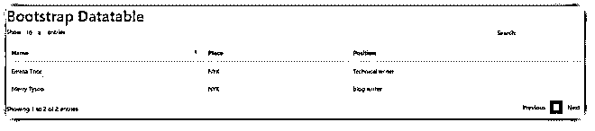
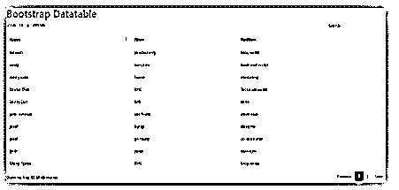
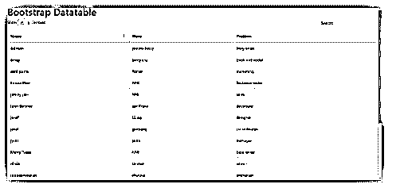
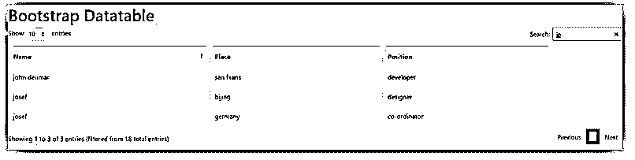

# 引导数据表

> 原文：<https://www.educba.com/bootstrap-datatable/>


## 引导数据表简介

Bootstrap DataTable 是一个高级插件，结合了表的高级数据操作。Bootstrap4 数据表是一个高级的设计和修改版本的引导表。Bootstrap4 数据表提供 JavaScript 验证和级联样式表设计，无需任何配置。它是对表的搜索、排序和分页，不需要任何复杂的编码。

**语法:**

<small>网页开发、编程语言、软件测试&其他</small>

*   基本的引导数据表需要 HTML 页面语法和 JavaScript 语法。

html 页面的引导数据表语法如下:

```
<table id = "daTable" class = "table table-bordered">
<thead>
<tr> <th> Header Name </th>
</thead>
<tbody>
<tr> <td> Header Information </td> </tr>
</tbody>
</table>
```

*   将表 id 放在 body 部分中的 html 语法。

引导数据表 JavaScript 语法如下:

```
<script>
$(document).ready(function() {
$('#daTable').DataTable();
} );
</script>
```

*   放在 head 或 body 部分中的 JavaScript 语法。
*   DataTable()方法与表标记的引用 id 名称一起使用。

### 数据表如何在 Bootstrap 中工作？

*   bootstrap4 支持文件包含在头文件中。

该文件路径如下:

```
<link rel = "stylesheet" href = "https://stackpath.bootstrapcdn.com/bootstrap/4.5.2/css/bootstrap.min.css">
<script src = "https://stackpath.bootstrapcdn.com/bootstrap/4.5.2/js/bootstrap.min.js">
</script>
<script src = "https://ajax.googleapis.com/ajax/libs/jquery/3.5.1/jquery.min.js">
</script>
<script src = "https://cdnjs.cloudflare.com/ajax/libs/popper.js/1.16.0/umd/popper.min.js">
</script>
```

*   bootstrap4 数据库支持文件包括 bootstrap4 在线支持文件。

以下链接和源文件与 bootstrap4 datable 相关。

```
<link rel = "stylesheet" href="https://cdn.datatables.net/1.10.21/css/dataTables.bootstrap4.min.css">
<script src = "https://cdn.datatables.net/1.10.21/js/jquery.dataTables.min.js">
</script>
<script src = "https://cdn.datatables.net/1.10.21/js/dataTables.bootstrap4.min.js">
</script>
```

表标记、Bootstrap4 表类和表 id 名放在 body 部分。

```
<table id="daTable" class="table table-bordered" >
<thead>
<tr>
<th>Name</th>
<th>position</th>
<th>Place</th>
</tr>
</thead>
<tbody>
<tr>
<td>emma thor</td>
<td>writer</td>
<td>NYK</td>
</tr>
</table>
```

*   根据用户需求使用的带有表标签的引导表类。
*   标签用于表格中标题列的名称。
*   标签用于表格的数据或相关内容。
*   带有表 id 名称的 DataTable()方法放在 head 或 body 部分的内部。

引导数据表 JavaScript 语法如下:

```
<script>
$(document).ready(function() {
$('#daTable').DataTable();
} );
</script>
```

基本工作程序如下:

```
<!DOCTYPE html>
<html>
<head>
<link rel = "stylesheet" href = "https://stackpath.bootstrapcdn.com/bootstrap/4.5.2/css/bootstrap.min.css">
<script src = "https://stackpath.bootstrapcdn.com/bootstrap/4.5.2/js/bootstrap.min.js
script>
<script src = "https://ajax.googleapis.com/ajax/libs/jquery/3.5.1/jquery.min.js">
</script>
<script src = "https://cdnjs.cloudflare.com/ajax/libs/popper.js/1.16.0/umd/popper.min.js">
</script>
<link rel = "stylesheet" href = "https://cdn.datatables.net/1.10.21/css/dataTables.bootstrap4.min.css">
<script src = "https://cdn.datatables.net/1.10.21/js/jquery.dataTables.min.js">
</script>
<script src = "https://cdn.datatables.net/1.10.21/js/dataTables.bootstrap4.min.js">
</script>
</head>
<body>
<table id = "myTable" class = "table table-bordered" style = "width:100%">
<thead>
<tr>
<th> Name </th>
<th> Place </th>
<th> Position </th>
</tr>
</thead>
<tbody>
<tr>
<td> Emma thor </td>
<td> NYK </td>
<td> writer </td>
</tr>
</table>
<script>
$(document).ready(function() {
$('#myTable').DataTable();
} );
</script>
</body>
</html>
```

### 例子

下面是提到的例子:

#### 示例#1

输出的基本例子。

**代码:**

```
<!DOCTYPE html>
<html>
<head>
<link rel = "stylesheet" href = "https://stackpath.bootstrapcdn.com/bootstrap/4.5.2/css/bootstrap.min.css">
<script src = "https://stackpath.bootstrapcdn.com/bootstrap/4.5.2/js/bootstrap.min.js
script>
<script src = "https://ajax.googleapis.com/ajax/libs/jquery/3.5.1/jquery.min.js">
</script>
<script src = "https://cdnjs.cloudflare.com/ajax/libs/popper.js/1.16.0/umd/popper.min.js">
</script>
<link rel = "stylesheet" href = "https://cdn.datatables.net/1.10.21/css/dataTables.bootstrap4.min.css">
<script src = "https://cdn.datatables.net/1.10.21/js/jquery.dataTables.min.js">
</script>
<script src = "https://cdn.datatables.net/1.10.21/js/dataTables.bootstrap4.min.js">
</script>
$(document).ready(function() {
$('#myTable').DataTable();
} );
</script>
</head>
<body>
<h1> Bootstrap Datatable </h1>
<table id = "myTable" class = "table table-bordered" style = "width: 100%">
<thead>
<tr>
<th> Name </th>
<th> Place </th>
<th> Position </th>
</tr>
</thead>
<tbody>
<tr>
<td> Emma Thor </td>
<td> NYK </td>
<td> Technical writer </td>
</tr>
<td> Merry Tyson </td>
<td> NYK </td>
<td> blog writer </td>
</tr>
</table>
</body>
</html>
```

**输出:**




**说明:**

*   引导数据表输出显示条目、搜索、上一页和下一页。
*   shows 条目在网页上显示所需数量的表格内容。
*   下一页和上一页在显示屏上显示所需的表格页面。
*   用于过滤所需表格内容或信息的搜索框。

#### 实施例 2

具有大量表格内容和输出。

**代码:**

```
<html>
<head>
<link rel = "stylesheet" href = "https://stackpath.bootstrapcdn.com/bootstrap/4.5.2/css/bootstrap.min.css">
<script src = "https://stackpath.bootstrapcdn.com/bootstrap/4.5.2/js/bootstrap.min.js
script>
<script src = "https://ajax.googleapis.com/ajax/libs/jquery/3.5.1/jquery.min.js">
</script>
<script src = "https://cdnjs.cloudflare.com/ajax/libs/popper.js/1.16.0/umd/popper.min.js">
</script>
<link rel = "stylesheet" href = "https://cdn.datatables.net/1.10.21/css/dataTables.bootstrap4.min.css">
<script src = "https://cdn.datatables.net/1.10.21/js/jquery.dataTables.min.js">
</script>
<script src = "https://cdn.datatables.net/1.10.21/js/dataTables.bootstrap4.min.js">
</script>
$(document).ready(function() {
$('#myTable').DataTable();
} );
</script>
</head>
<body>
<h1> Bootstrap Datatable </h1>
<table id = "myTable" class = "table table-bordered " style = "width:100%">
<thead>
<tr>
<th> Name </th>
<th> Place </th>
<th> Position </th>
</tr>
</thead>
<tbody>
<tr>
<td> Emma Thor </td>
<td> NYK </td>
<td> Technical writer </td>
</tr>
<td> Merry Tyson </td>
<td> NYK </td>
<td> blog writer </td>
</tr>
</tr>
<td> sofia </td>
<td> france </td>
<td> HR </td>
</tr>
<tr>
<td> olivia </td>
<td> landon </td>
<td> sales </td>
</tr>
<tr>
<td> radhakrishanan </td>
<td> chennai </td>
<td> animation </td>
</tr>
<tr>
<td> Adiison </td>
<td> pondecherry </td>
<td> blog writer </td>
</tr>
<tr>
<td> suhas </td>
<td> mumbai </td>
<td> tester </td>
</tr>
<tr>
<td> sangita </td>
<td> delhi </td>
<td> writer </td>
</tr>
<tr>
<td> Ram </td>
<td> pune </td>
<td> developer </td>
</tr>
<tr>
<td> josef </td>
<td> bijing </td>
<td> designer </td>
</tr>
</tr>
<td> josef </td>
<td> germany </td>
<td> co-ordinator </td>
</tr>
<tr>
<td> jyoti </td>
<td> pune </td>
<td> manager </td>
</tr>
<tr>
<td> amay </td>
<td> bengluru </td>
<td>  back-end coder </td>
</tr>
<tr>
<td> sujay </td>
<td> germany </td>
<td> front-end designer </td>
</tr>
<tr>
<td> jimmy jain </td>
<td> NYk </td>
<td> sales </td>
</tr>
<tr>
<td> avni gupta </td>
<td> france </td>
<td> marketing </td>
</tr>
<tr>
<td> john denmar </td>
<td> san Frans </td>
<td> developer </td>
</tr>
<tr>
<td> sania watt </td>
<td> paris </td>
<td> content writer </td>
</tr>
</table>
</body>
</html>
```

**输出:**

*   这个输出显示了 10 个条目的表内容。此输出显示了上一页和下一页的工作程序。




*   此输出显示了表内容的 25 个显示条目。




#### 实施例 3

带有搜索框的引导分条表实现示例和输出。

**代码:**

```
<!DOCTYPE html>
<html>
<head>
<link rel = "stylesheet" href = "https://stackpath.bootstrapcdn.com/bootstrap/4.5.2/css/bootstrap.min.css">
<script src = "https://stackpath.bootstrapcdn.com/bootstrap/4.5.2/js/bootstrap.min.js
script>
<script src = "https://ajax.googleapis.com/ajax/libs/jquery/3.5.1/jquery.min.js">
</script>
<script src = "https://cdnjs.cloudflare.com/ajax/libs/popper.js/1.16.0/umd/popper.min.js">
</script>
<link rel = "stylesheet" href = "https://cdn.datatables.net/1.10.21/css/dataTables.bootstrap4.min.css">
<script src = "https://cdn.datatables.net/1.10.21/js/jquery.dataTables.min.js">
</script>
<script src = "https://cdn.datatables.net/1.10.21/js/dataTables.bootstrap4.min.js">
</script>
$(document).ready(function() {
$('#myTable').DataTable();
} );
</script>
</head>
<body>
<h1> Bootstrap Datatable </h1>
<table id = "myTable" class = "table table-bordered table-striped" style = "width:100%">
<thead>
<tr>
<th> Name </th>
<th> Place </th>
<th> Position </th>
</tr>
</thead>
<tbody>
<tr>
<td> Emma Thor </td>
<td> NYK </td>
<td> Technical writer </td>
</tr>
<tr>
<td> josef </td>
<td> bijing </td>
<td> designer </td>
</tr>
</tr>
<td> josef </td>
<td> germany </td>
<td> co-ordinator </td>
</tr>
<tr>
<td> jyoti </td>
<td> pune </td>
<td> manager </td>
</tr>
<tr>
<td> jimmy jain </td>
<td> NYk </td>
<td> sales </td>
</tr>
<tr>
<td> john denmar </td>
<td> san Frans </td>
<td> developer </td>
</tr>
</table>
</body>
</html>
```

**输出:**

输出出现在搜索框中搜索“jo”字符。




### 结论

它有助于对表数据进行排序，不会带来任何麻烦。它通过使用一种方法减少了编码大小和空间。它是先进的，用户友好的，易于理解的网络应用组件。

### 推荐文章

这是一个引导数据表的指南。在这里，我们讨论的介绍，如何在引导数据表的工作？和示例。您也可以看看以下文章，了解更多信息–

1.  [自举输入类型](https://www.educba.com/bootstrap-input-type/)
2.  [自举日历](https://www.educba.com/bootstrap-calendar/)
3.  [引导所见即所得](https://www.educba.com/bootstrap-wysiwyg/)
4.  [引导向导](https://www.educba.com/bootstrap-wizard/)


