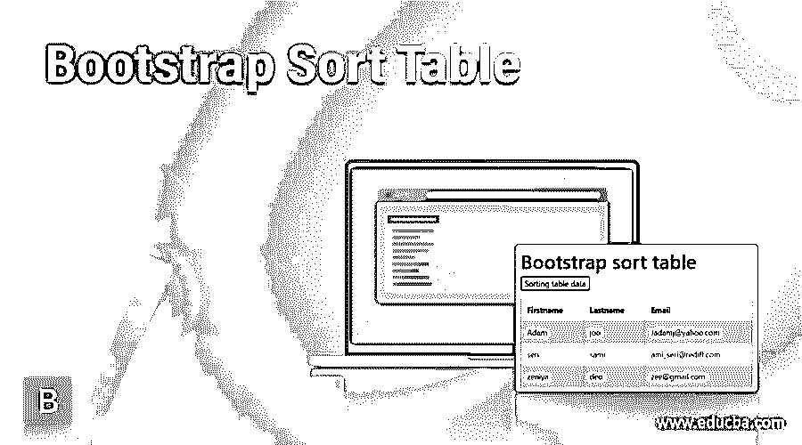
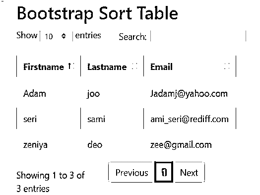
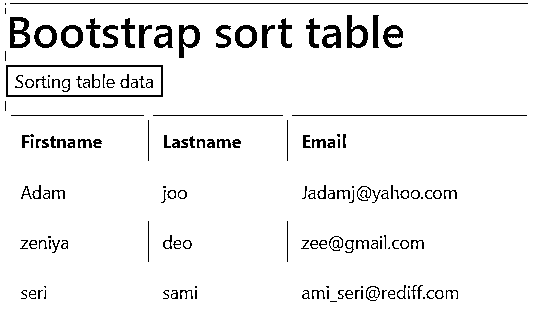
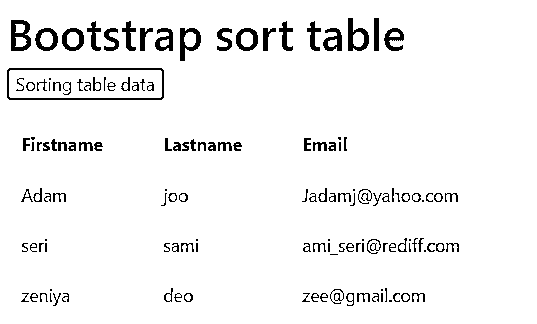
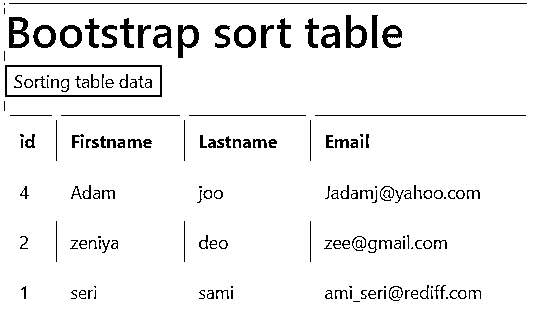
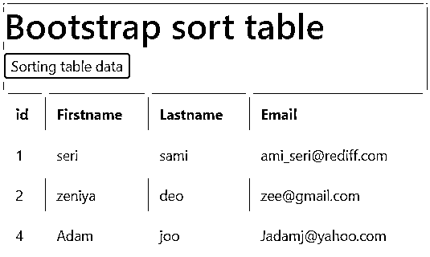

# 引导排序表

> 原文：<https://www.educba.com/bootstrap-sort-table/>




## 引导排序表的定义

bootstrap 排序表是一个高级组件，用于根据用户要求对表中的元素进行排序。这是一个用户友好的组件，用于显示按升序、降序或用户选择排序的表格数据。这对于根据需求分类的大量数据非常有用。按照表列顺序分类或排序的表内容称为引导排序表。

**语法:**

<small>网页开发、编程语言、软件测试&其他</small>

*   排序表需要一个带有 JavaScript 方法的引导表。
*   有两种方法对表格数据进行排序，如下所示。
*   第一种方法有助于使用 DataTable()方法自动对表数据进行排序。
*   第二种方法帮助用户根据需要对表格数据进行排序。

### 方法

让我们讨论一些方法。该语法需要一个 id 为 name 的表类。

#### 方法 1

```
<table class="table" id="sortTable">
<thead>
<tr>
<th>Email</th>
</tr>
</thead>
<tbody>
<tr>
<td>adamj@yahoo.com</td>
</tr>
<tr>
<td>joee@gmail.com</td>
</tr>
</tbody>
</table>
<script>
$('#sortTable').DataTable();
</script>
```

#### 方法 2

*   用下面的 id 制作一个引导表，并为排序表创建按钮。

```
<table class="table" id="sortTable">
</table>
<button onclick="sortingTable()">Sort</button>
```

*   JavaScript 语法有助于根据数据需求对表进行排序。

```
<script>
function sortTable() {
var tables, sort, i, x, y, tableSort;
tables = document.getElementById("SortmyTable");
sort= true;
while (sort) {
sort = false;
tblrow = tables.rows;
for (i = 1; i < (tblrow.length - 1); i++) {
tableSort = false;
x = tblrow[i].getElementsByTagName("td")[n];
y = tblrow[i + 1].getElementsByTagName("td")[n];
if (x.innerHTML.toUpperCase() > y.innerHTML.toUpperCase()) {
tableSort = true;
break;
}
}
if (tableSort) {
tblrow[i].parentNode.insertBefore(tblrow[i + 1], tblrow[i]);
sort = true;
}
}
}
</script>
```

### 如何在 Bootstrap 中对表进行排序？

让我们讨论如何使用一些方法对表进行排序。

#### 方法 1

*   HTML 页面中包含的引导和数据表支持文件。该文件用于网页中的引导支持系统。

```
<link rel="stylesheet" href="https://maxcdn.bootstrapcdn.com/bootstrap/4.5.2/css/bootstrap.min.css">
<script src="https://ajax.googleapis.com/ajax/libs/jquery/3.5.1/jquery.min.js">
</script>
<script src="https://cdnjs.cloudflare.com/ajax/libs/popper.js/1.16.0/umd/popper.min.js">
</script>
<script src="https://maxcdn.bootstrapcdn.com/bootstrap/4.5.2/js/bootstrap.min.js">
</script>
```

*   该文件用于对数据表支持系统中的网页进行排序。

```
<link rel="stylesheet" href="https://cdn.datatables.net/1.10.22/css/dataTables.bootstrap4.min.css">
<script src="https://cdn.datatables.net/1.10.22/js/jquery.dataTables.min.js">
</script>
<script src="https://cdn.datatables.net/1.10.22/js/dataTables.bootstrap4.min.js">
</script>
```

*   用 id 名称和表类创建的表。

```
<table class="table table-striped table-bordered" id="sortTable">
<thead>
<tr>
<th>Firstname</th>
<th>Lastname</th>
<th>Email</th>
</tr>
</thead>
<tbody>
<tr>
<td>Adam</td>
<td>joo</td>
<td>adamj@yahoo.com</td>
</tr>
<tr>
<td>seri</td>
<td>sami</td>
<td>sami_seri@rediff.com</td>
</tr>
</tbody>
</table>
```

*   DataTable()方法在脚本中添加标签来自动排序表格数据。

```
<script>
$('#sortTable').DataTable();
</script>
```

#### 方法 2

*   方法 1 中提到的 HTML 页面中包含的引导支持文件。
*   使用 id 名称创建的表，并创建一个按钮用于自定义表排序。

```
<table class="table" id="sortTable">
</table>
<button onclick="sortingTable()"> Sorting table data </button>
```

*   上面的语法放在脚本标签中。

```
<script>
function sortTable() {
var tables, sort, i, x, y, tableSort;
tables = document.getElementById("#SortmyTable");
```

*   while 循环用于对数据进行排序，直到该表的行没有结束。

```
sort= true;
while (sort) {
sort = false;
tblrow = tables.rows;
```

*   “for 循环”用于对表格行进行排序，而不遍历表格的标题行。

```
for (i = 1; i < (tblrow.length - 1); i++) {
tableSort = false;
```

*   用于根据 if 语句和条件对内容排序进行比较的两个元素。

```
x = tblrow[i].getElementsByTagName("td")[n];
y = tblrow[i + 1].getElementsByTagName("td")[n];
if (x.innerHTML.toUpperCase() > y.innerHTML.toUpperCase()) {
tableSort = true;
break;
}
}
```

*   “if 语句”和排序变量变为真，因为排序内容完成到最后一行。

```
if (tableSort) {
tblrow[i].parentNode.insertBefore(tblrow[i + 1], tblrow[i]);
sort = true;
}
}
}
</script>
```

### 例子

让我们讨论一些引导排序表的例子。

#### 示例 1–使用 DataTable()方法

**代码:**

```
<!DOCTYPE html>
<html lang="en">
<head>
<title> Bootstrap SORT table Example </title>
<meta charset="utf-8">
<meta name="viewport" content="width=device-width, initial-scale=1">
<link rel="stylesheet" href="https://maxcdn.bootstrapcdn.com/bootstrap/4.5.2/css/bootstrap.min.css">
<script src="https://ajax.googleapis.com/ajax/libs/jquery/3.5.1/jquery.min.js"></script>
<script src="https://cdnjs.cloudflare.com/ajax/libs/popper.js/1.16.0/umd/popper.min.js"></script>
<script src="https://maxcdn.bootstrapcdn.com/bootstrap/4.5.2/js/bootstrap.min.js"></script>
<link rel="stylesheet" href="https://cdn.datatables.net/1.10.22/css/dataTables.bootstrap4.min.css">
<script src="https://cdn.datatables.net/1.10.22/js/jquery.dataTables.min.js"></script>
<script src="https://cdn.datatables.net/1.10.22/js/dataTables.bootstrap4.min.js"></script>
</head>
<body>
<div class="container" style="width:40%";>
<h2> Bootstrap Sort Table </h2>
<table class="table table-striped table-bordered" id="sortTable">
<thead>
<tr>
<th>Firstname</th>
<th>Lastname</th>
<th>Email</th>
</tr>
</thead>
<tbody>
<tr>
<td>Adam</td>
<td>joo</td>
<td>Jadamj@yahoo.com</td>
</tr>
<tr>
<td>seri</td>
<td>sami</td>
<td>ami_seri@rediff.com</td>
</tr>
<tr>
<td>zeniya</td>
<td>deo</td>
<td>zee@gmail.com</td>
</tr>
</tbody>
</table>
</div>
<script>
$('#sortTable').DataTable();
</script>
</body>
</html>
```

**输出 1:按名称排序(默认)**




**输出 2:按邮件分类**


#### 示例 2——使用 javascript

**代码:**

```
<!DOCTYPE html>
<html>
<head>
<title> bootstrap Sort Table </title>
<link rel="stylesheet" href="https://maxcdn.bootstrapcdn.com/bootstrap/4.5.2/css/bootstrap.min.css">
<script src="https://ajax.googleapis.com/ajax/libs/jquery/3.5.1/jquery.min.js"></script>
<script src="https://cdnjs.cloudflare.com/ajax/libs/popper.js/1.16.0/umd/popper.min.js"></script>
<script src="https://maxcdn.bootstrapcdn.com/bootstrap/4.5.2/js/bootstrap.min.js"></script>
</head>
<body>
<h1> Bootstrap sort table </h1>
<p><button onclick="mysortTable()">Sorting table data</button></p>
<table class="table table-striped table-bordered"id="sortingTable">
<thead>
<tr>
<th>Firstname</th>
<th>Lastname</th>
<th>Email</th>
</tr>
</thead>
<tbody>
<tr>
<td>Adam</td>
<td>joo</td>
<td>Jadamj@yahoo.com</td>
</tr>
<tr>
<td>zeniya</td>
<td>deo</td>
<td>zee@gmail.com</td>
</tr>
<tr>
<td>seri</td>
<td>sami</td>
<td>ami_seri@rediff.com</td>
</tr>
</tbody>
</table>
<script>
function mysortTable() {
var tables, rows, sorting, c, a, b, tblsort;
tables = document.getElementById("sortingTable");
sorting = true;
while (sorting) {
sorting = false;
rows = tables.rows;
for (c = 1; c < (rows.length - 1); c++) {
tblsort = false;
a = rows[c].getElementsByTagName("TD")[0];
b = rows[c + 1].getElementsByTagName("TD")[0];
if (a.innerHTML.toLowerCase() > b.innerHTML.toLowerCase()) {
tblsort = true;
break;
}
}
if (tblsort) {
rows[c].parentNode.insertBefore(rows[c + 1], rows[c]);
sorting = true;
}
}
}
</script>
</body>
</html>
```

**输出:分拣前**




**输出:排序后**




#### 示例 3–按 Id 排序

**代码:**

```
<!DOCTYPE html>
<html>
<head>
<title> bootstrap Sort Table </title>
<link rel="stylesheet" href="https://maxcdn.bootstrapcdn.com/bootstrap/4.5.2/css/bootstrap.min.css">
<script src="https://ajax.googleapis.com/ajax/libs/jquery/3.5.1/jquery.min.js"></script>
<script src="https://cdnjs.cloudflare.com/ajax/libs/popper.js/1.16.0/umd/popper.min.js"></script>
<script src="https://maxcdn.bootstrapcdn.com/bootstrap/4.5.2/js/bootstrap.min.js"></script>
</head>
<body>
<h1> Bootstrap sort table </h1>
<p><button onclick="mysortTable()">Sorting table data</button></p>
<table class="table table-striped table-bordered"id="sortingTable">
<thead>
<tr>
<th>id</th>
<th>Firstname</th>
<th>Lastname</th>
<th>Email</th>
</tr>
</thead>
<tbody>
<tr>
<td>4</td>
<td>Adam</td>
<td>joo</td>
<td>Jadamj@yahoo.com</td>
</tr>
<tr>
<td>2</td>
<td>zeniya</td>
<td>deo</td>
<td>zee@gmail.com</td>
</tr>
<tr>
<td>1</td>
<td>seri</td>
<td>sami</td>
<td>ami_seri@rediff.com</td>
</tr>
</tbody>
</table>
<script>
function mysortTable() {
var tables, rows, sorting, c, a, b, tblsort;
tables = document.getElementById("sortingTable");
sorting = true;
while (sorting) {
sorting = false;
rows = tables.rows;
for (c = 1; c < (rows.length - 1); c++) {
tblsort = false;
a = rows[c].getElementsByTagName("TD")[0];
b = rows[c + 1].getElementsByTagName("TD")[0];
if (Number(a.innerHTML) > Number(b.innerHTML)) {
tblsort = true;
break;
}
}
if (tblsort) {
rows[c].parentNode.insertBefore(rows[c + 1], rows[c]);
sorting = true;
}
}
}
</script>
</body>
</html>
```

**输出:分拣前**




**输出:排序后**




### 结论

*   它是管理引导表中大量数据的高级组件。
*   它显示表格数据，并以用户需要的格式显示。
*   用户使用它来显示方便的数据，以制作用户友好的应用程序。

### 推荐文章

这是一个引导排序表的指南。这里我们分别讨论 Bootstrap 中表的定义、排序方法和例子。您也可以看看以下文章，了解更多信息–

1.  [引导列表组](https://www.educba.com/bootstrap-list-group/)
2.  [引导页面布局](https://www.educba.com/bootstrap-page-layout/)
3.  [自举日历](https://www.educba.com/bootstrap-calendar/)
4.  [引导向导](https://www.educba.com/bootstrap-wizard/)


