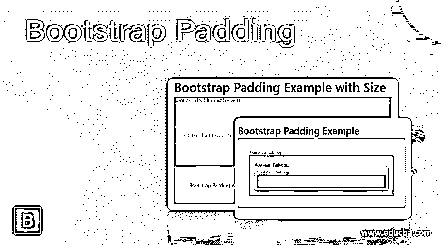
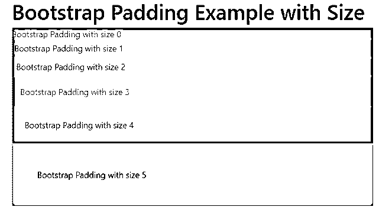
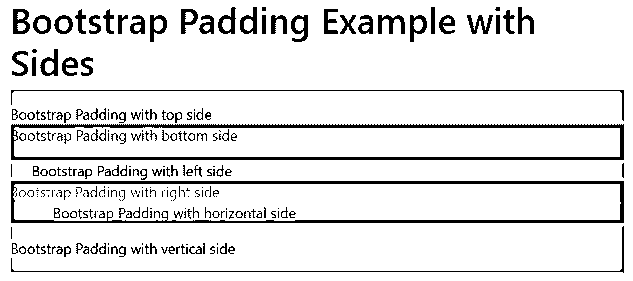
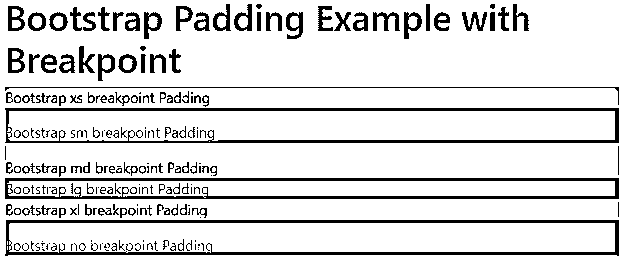
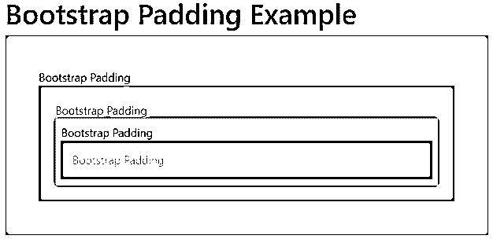

# 自举填充

> 原文：<https://www.educba.com/bootstrap-padding/>




## 自举填充的定义

引导填充是在内容和容器之间留出空间的基本工具之一。这是一个设计组件，使用 bootstrap 类在容器或边框内创建空间。这是一个使用空间和空间大小属性修改元素及其容器的高级实用程序。它用于在 web 应用程序的内容及其边框中留出空间。

**语法:**

<small>网页开发、编程语言、软件测试&其他</small>

*   下面是带有所有边和大小语法的引导填充。

```
{Property}-{Size}
```

*   大小为 1 的引导填充
*   “p”类用于引导填充，p 是填充的首字母缩写。
*   当字体大小为 16px 时，大小 1 用于 4px 空间。
*   具有特定边和大小语法的填充如下。

```
{Property}{Sides}-{Size}
```

*   大小为 3 的引导顶部填充
*   “t”用于表示容器中间隔的顶部。
*   当字体大小为 16px 时，大小 3 用于 16px 空间。
*   具有特定边、断点和大小语法的填充如下。

```
{Property}{Sides}-{Breakpoint}-{Size}
```

*   大小为 2 的响应引导顶部填充
*   断点在 web 应用程序中进行响应填充。
*   “sm”断点适用于等于或大于 576 像素屏幕尺寸的设备。
*   “b”代表容器中间距的底边。
*   当字体大小为 16px 时，大小 2 用于 8px 空间。

### Bootstrap 中的填充是如何工作的？

引导支持文件添加在 HTML 页面的头部。

**代码:**

```
<head>
<meta name = "viewport" content = "width=device-width, initial-scale=1">
<link rel = "stylesheet" href = "https://maxcdn.bootstrapcdn.com/bootstrap/4.5.2/css/bootstrap.min.css">
<script src = "https://ajax.googleapis.com/ajax/libs/jquery/3.5.1/jquery.min.js">
</script>
<script src = "https://cdnjs.cloudflare.com/ajax/libs/popper.js/1.16.0/umd/popper.min.js">
</script>
<script src = "https://maxcdn.bootstrapcdn.com/bootstrap/4.5.2/js/bootstrap.min.js">
</script>
</head>
```

使用

标签将容器及其元素放置在 HTML 页面中。

**代码:**

```
<body>
<div class="container">
<div> responsive bootstrap top Padding with size2 </div>
</div>
</body>
```

根据用户要求放置在

标签中的语法。

```
<div class="p-1"> bootstrap Padding with size 1 </div>
```

```
<div class="pb-sm-2"> responsive bootstrap top Padding with size2 </div>
```

工作程序如下。

**代码:**

```
<!DOCTYPE html>
<html>
<head>
<title>Bootstrap padding Example</title>
<meta charset="utf-8">
<meta name = "viewport" content = "width=device-width, initial-scale=1">
<link rel = "stylesheet" href = "https://maxcdn.bootstrapcdn.com/bootstrap/4.5.2/css/bootstrap.min.css">
<script src = "https://ajax.googleapis.com/ajax/libs/jquery/3.5.1/jquery.min.js">
</script>
<script src = "https://cdnjs.cloudflare.com/ajax/libs/popper.js/1.16.0/umd/popper.min.js">
</script>
<script src = "https://maxcdn.bootstrapcdn.com/bootstrap/4.5.2/js/bootstrap.min.js">
</script>
</head>
<body>
<div class="container">
<h2> Bootstrap Padding Example </h2>
<div class="p-3 bg-light"> bootstrap Padding with size 1 </div>
<div class="pt-2 bg-warning"> responsive bootstrap top Padding with size2 </div>
</div>
</body>
</html>
```

### 例子

以下是不同的例子:

#### 例子#1:用尺寸

**代码:**

```
<!DOCTYPE html>
<html>
<head>
<title>Bootstrap padding Example</title>
<meta charset="utf-8">
<meta name = "viewport" content = "width=device-width, initial-scale=1">
<link rel = "stylesheet" href = "https://maxcdn.bootstrapcdn.com/bootstrap/4.5.2/css/bootstrap.min.css">
<script src = "https://ajax.googleapis.com/ajax/libs/jquery/3.5.1/jquery.min.js">
</script>
<script src = "https://cdnjs.cloudflare.com/ajax/libs/popper.js/1.16.0/umd/popper.min.js">
</script>
<script src = "https://maxcdn.bootstrapcdn.com/bootstrap/4.5.2/js/bootstrap.min.js">
</script>
</head>
<body>
<div class="container">
<h1> Bootstrap Padding Example with Size </h1>
<div class = "p-0 bg-info"> Bootstrap Padding with size 0 </div>
<div class = "p-1 bg-danger"> Bootstrap Padding with size 1 </div>
<div class = "p-2 bg-success"> Bootstrap Padding with size 2 </div>
<div class = "p-3 bg-primary"> Bootstrap Padding with size 3 </div>
<div class = "p-4 bg-secondary"> Bootstrap Padding with size 4 </div>
<div class = "p-5 bg-warning"> Bootstrap Padding with size 5 </div>
</div>
</body>
</html>
```

**输出:**




**描述:**

*   当字体大小为 16px 时，siz 4 用于 24px 空间。
*   当字体大小为 16px 时，大小 E5 用于 48px 空间。
*   负填充大小不适用。

#### 例子#2:有边

**代码:**

```
<!DOCTYPE html>
<html>
<head>
<title>Bootstrap padding Example</title>
<meta charset = "utf-8">
<meta name = "viewport" content = "width=device-width, initial-scale=1">
<link rel = "stylesheet" href = "https://maxcdn.bootstrapcdn.com/bootstrap/4.5.2/css/bootstrap.min.css">
<script src = "https://ajax.googleapis.com/ajax/libs/jquery/3.5.1/jquery.min.js">
</script>
<script src = "https://cdnjs.cloudflare.com/ajax/libs/popper.js/1.16.0/umd/popper.min.js">
</script>
<script src = "https://maxcdn.bootstrapcdn.com/bootstrap/4.5.2/js/bootstrap.min.js">
</script>
</head>
<body>
<div class="container">
<h1> Bootstrap Padding Example with Sides </h1>
<div class = "pt-3 bg-warning"> Bootstrap Padding with top side </div>
<div class = "pb-3 bg-danger"> Bootstrap Padding with bottom side </div>
<div class = "pl-4 bg-warning"> Bootstrap Padding with left side </div>
<div class = "pr-4 bg-primary">Bootstrap Padding with right side </div>
<div class = "px-5 bg-secondary">Bootstrap Padding with horizontal side </div>
<div class = "py-3 bg-warning">Bootstrap Padding with vertical side </div>
</div>
</body>
</html>
```

**输出:**




**描述:**

*   px 用于左右调整的水平填充。
*   py 适用于调整顶部和底部的垂直填充。

#### 示例 3:带有断点

**代码:**

```
<!DOCTYPE html>
<html>
<head>
<title>Bootstrap padding Example</title>
<meta charset = "utf-8">
<meta name = "viewport" content = "width=device-width, initial-scale=1">
<link rel = "stylesheet" href = "https://maxcdn.bootstrapcdn.com/bootstrap/4.5.2/css/bootstrap.min.css">
<script src = "https://ajax.googleapis.com/ajax/libs/jquery/3.5.1/jquery.min.js">
</script>
<script src = "https://cdnjs.cloudflare.com/ajax/libs/popper.js/1.16.0/umd/popper.min.js">
</script>
<script src = "https://maxcdn.bootstrapcdn.com/bootstrap/4.5.2/js/bootstrap.min.js">
</script>
</head>
<body>
<div class="container">
<h1> Bootstrap Padding Example with Breakpoint </h1>
<div class = "pt-xs-3 bg-warning"> Bootstrap xs breakpoint Padding </div>
<div class = "pt-sm-3 bg-info"> Bootstrap sm breakpoint Padding </div>
<div class = "pt-md-3 bg-warning"> Bootstrap md breakpoint Padding </div>
<div class = "pt-lg-3 bg-danger"> Bootstrap lg breakpoint Padding </div>
<div class = "pt-xl-3 bg-warning"> Bootstrap xl breakpoint Padding </div>
<div class = "pt-3 bg-primary"> Bootstrap no breakpoint Padding </div></div>
</body>
</html>
```

**输出:**




**描述:**

*   xs 断点小于 576px 设备屏幕意味着不需要任何断点。
*   sm、md、lg、xl 根据设备屏幕大小有四个主要断点。
*   断点对 web 应用程序进行响应填充。

#### 实施例 4

**代码:**

```
<!DOCTYPE html>
<html>
<head>
<title>Bootstrap padding Example</title>
<meta charset="utf-8">
<meta name = "viewport" content = "width=device-width, initial-scale=1">
<link rel = "stylesheet" href = "https://maxcdn.bootstrapcdn.com/bootstrap/4.5.2/css/bootstrap.min.css">
<script src = "https://ajax.googleapis.com/ajax/libs/jquery/3.5.1/jquery.min.js">
</script>
<script src = "https://cdnjs.cloudflare.com/ajax/libs/popper.js/1.16.0/umd/popper.min.js">
</script>
<script src = "https://maxcdn.bootstrapcdn.com/bootstrap/4.5.2/js/bootstrap.min.js">
</script>
</head>
<body>
<div class="container">
<h1> Bootstrap Padding Example </h1>
<div class = "p-5 bg-warning"> Bootstrap Padding
<div class = "p-4 bg-info"> Bootstrap Padding
<div class = "p-2 bg-warning"> Bootstrap Padding
<div class = "p-3 bg-danger"> Bootstrap Padding
</div>
</div>
</div>
</div>
</div>
</body>
</html>
```

**输出:**




### 结论

*   这在 web 应用程序中是一个非常有用的工具，用于设计和分隔。
*   它使用填充类创建了一个有吸引力的、用户友好的 web 应用程序。
*   使元素和它们的边框排序并易于理解是一个必不可少的组件。

### 推荐文章

这是引导填充的指南。在这里，我们分别讨论了 Bootstrap 中填充的定义、工作原理以及代码实现的例子。您也可以看看以下文章，了解更多信息–

1.  [引导多选](https://www.educba.com/bootstrap-multiselect/)
2.  [引导排序表](https://www.educba.com/bootstrap-sort-table/)
3.  [引导列表组](https://www.educba.com/bootstrap-list-group/)
4.  [引导页面布局](https://www.educba.com/bootstrap-page-layout/)


