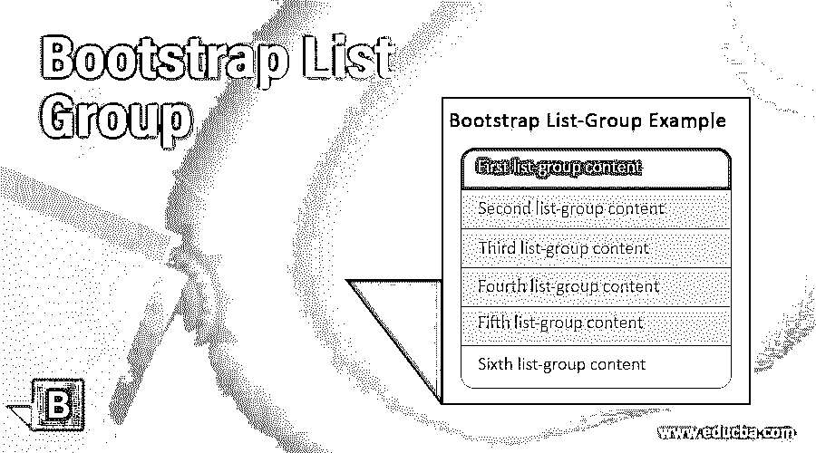
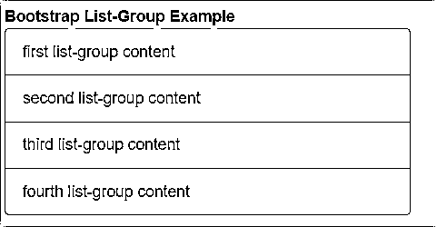
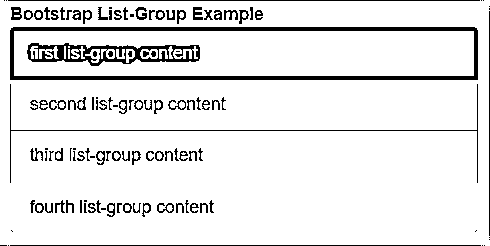
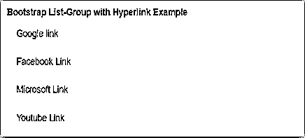
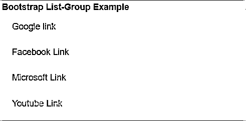
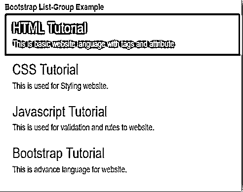

# 引导列表组

> 原文：<https://www.educba.com/bootstrap-list-group/>




## 引导列表组简介

引导列表组是一个灵活的组件，可以根据需要的格式创建元素列表。列表组正在使用类修改链接或按钮样式的内容列表或组。list-group 是 bootstrap 的一个用户友好的组件，用于将无序的列表转换成优雅的方式和理想的格式。list-group 类不仅需要

*   Tags, and many tags of HTML files are also used to create lists.

**语法**

<small>网页开发、编程语言、软件测试&其他</small>

list-group 是一个用户友好的组件，用于创建一个排序的内容列表。这是一个默认的无序列表，包含列表项或内容。

基本的引导列表组语法如下。

```
<ul class= "list-group">
<li class= "list-group-item"> first list-group content
</li>
<li class= "list-group-item"> second list-group content
</li>
<li class= "list-group-item"> third list-group content
</li>
<li class= "list-group-item"> fourth list-group content
</li>
</ul>
```

**描述:**<ul>标签用于显示一个无序列表，这是默认的列表组。类列表组被放在< ul >标签中，以在引导中设置列表组。list-group-item 类放在< li >标签中，以序列格式显示列表项。

### 列表组类如何在 Bootstrap 中工作？

以下是工作步骤:

#### 第一步

支持文件包含在 HTML 文件的部分。引导支持文件如下。

```
<link rel= "stylesheet" href= "https://maxcdn.bootstrapcdn.com/bootstrap/3.4.1/css/bootstrap.min.css">
<script src= "https://ajax.googleapis.com/ajax/libs/jquery/3.5.1/jquery.min.js">
</script>
<script src= "https://maxcdn.bootstrapcdn.com/bootstrap/3.4.1/js/bootstrap.min.js">
</script>
```

#### 第二步

HTML 文件的部分中的列表组语法。列表组的基本语法如下。

```
<body>
<div class="container-fluid">
<ul class= "list-group">
<li class= "list-group-item"> first list-group content </li>
<li class= "list-group-item"> second list-group content </li>
<li class= "list-group-item"> third list-group content </li>
<li class= "list-group-item"> fourth list-group content </li>
</ul>
</div>
</body>
```

*   带有超链接语法的列表组放在正文部分。
*   下面是带有超链接语法的列表组。

```
<div class= "list-group">
<a href= "google.com" class= "list-group-item"> Google link </a>
<a href= "facebook.com" class= "list-group-item"> Facebook Link </a>
<a href= "microsoft.com" class= "list-group-item"> Microsoft Link </a>
<a href= "youtube.com" class= "list-group-item"> Youtube Link </a>
</div>
```

**描述:**

*   放在标签而不是

*   放置在
*   列表组项放在

#### 第三步

活动类与列表-组-列表类放在一起。活动类用于聚焦列表中的当前组项。

```
<div class= "list-group">
<a href= "google.com" class= "list-group-item active"> Google link </a>
<a href= "facebook.com" class= "list-group-item"> Facebook Link </a>
</div>
```

上面的例子谷歌链接是目前使用的链接，因为活动类。

### **例题**

下面是提到的例子:

#### 示例#1

基本的引导列表-组示例和输出。

**代码:**

```
<!DOCTYPE html>
<html>
<head>
<title> Bootstrap list-group Tutorial </title>
<meta charset="utf-8">
<meta name="viewport" content="width=device-width, initial-scale=1">
<link rel="stylesheet" href="https://maxcdn.bootstrapcdn.com/bootstrap/3.4.1/css/bootstrap.min.css">
<script src="https://ajax.googleapis.com/ajax/libs/jquery/3.5.1/jquery.min.js"></script>
<script src="https://maxcdn.bootstrapcdn.com/bootstrap/3.4.1/js/bootstrap.min.js"></script>
</head>
<body>
<div class="container-fluid">
<b>Bootstrap List-Group Example </b>
<ul class= "list-group">
<li class= "list-group-item"> first list-group content
</li>
<li class= "list-group-item"> second list-group content
</li>
<li class= "list-group-item"> third list-group content
</li>
<li class= "list-group-item"> fourth list-group content </li>
</ul>
</div>
</body>
</html>
```

**输出:**




**描述:**

*   上面的例子和输出说明了基本的列表组。
*   用于无序列表及其项目的

    *   标签。
*   基本列表组中使用的列表组和列表组项目类。

#### 实施例 2

具有活动和禁用类示例和输出的列表组。

**代码:**

```
<!DOCTYPE html>
<html>
<head>
<title> Bootstrap list-group Tutorial </title>
<meta charset="utf-8">
<meta name="viewport" content="width=device-width, initial-scale=1">
<link rel="stylesheet" href="https://maxcdn.bootstrapcdn.com/bootstrap/3.4.1/css/bootstrap.min.css">
<script src="https://ajax.googleapis.com/ajax/libs/jquery/3.5.1/jquery.min.js"></script>
<script src="https://maxcdn.bootstrapcdn.com/bootstrap/3.4.1/js/bootstrap.min.js"></script>
</head>
<body>
<div class="container-fluid">
<b>Bootstrap List-Group Example </b>
<ul class= "list-group">
<li class= "list-group-item active"> first list-group content
</li>
<li class= "list-group-item"> second list-group content
</li>
<li class= "list-group-item"> third list-group content
</li>
<li class= "list-group-item disabled"> fourth list-group content </li>
</ul>
</div>
</body>
</html>
```

**输出:**




**描述:**

*   与列表组项目一起放置在第一个列表组内容中的活动类。
*   在第四个列表组内容中与列表组项目放在一起的禁用类。
*   上面的示例和输出显示了组项目中的活动类和禁用类。

#### 实施例 3

带有超链接示例和输出的列表组。

**代码:**

```
<!DOCTYPE html>
<html>
<head>
<title> Bootstrap list-group Tutorial </title>
<meta charset="utf-8">
<meta name="viewport" content="width=device-width, initial-scale=1">
<link rel="stylesheet" href="https://maxcdn.bootstrapcdn.com/bootstrap/3.4.1/css/bootstrap.min.css">
<script src="https://ajax.googleapis.com/ajax/libs/jquery/3.5.1/jquery.min.js"></script>
<script src="https://maxcdn.bootstrapcdn.com/bootstrap/3.4.1/js/bootstrap.min.js"></script>
</head>
<body>
<div class="container-fluid">
<b>Bootstrap List-Group with Hyperlink Example  </b>
<div class= "list-group">
<a href= "google.com" class= "list-group-item"> Google link </a>
<a href= "facebook.com" class= "list-group-item"> Facebook Link </a>
<a href= "microsoft.com" class= "list-group-item"> Microsoft Link </a>
<a href= "youtube.com" class= "list-group-item"> Youtube Link </a>
</div>
</div>
</body>
</html>
```

**输出:**




#### 实施例 4

具有上下文类示例和输出的列表组。

**代码:**

```
<!DOCTYPE html>
<html>
<head>
<title> Bootstrap list-group Tutorial </title>
<meta charset="utf-8">
<meta name="viewport" content="width=device-width, initial-scale=1">
<link rel="stylesheet" href="https://maxcdn.bootstrapcdn.com/bootstrap/3.4.1/css/bootstrap.min.css">
<script src="https://ajax.googleapis.com/ajax/libs/jquery/3.5.1/jquery.min.js"></script>
<script src="https://maxcdn.bootstrapcdn.com/bootstrap/3.4.1/js/bootstrap.min.js"></script>
</head>
<body>
<div class="container-fluid">
<b>Bootstrap List-Group Example  </b>
<div class= "list-group">
<a href= "google.com" class= "list-group-item list-group-item-danger"> Google link </a>
<a href= "facebook.com" class= "list-group-item list-group-item-warning"> Facebook Link </a>
<a href= "microsoft.com" class= "list-group-item list-group-item-success"> Microsoft Link </a>
<a href= "youtube.com" class= "list-group-item list-group-item-info"> Youtube Link </a>
</div>
</div>
</body>
</html>
```

**输出:**




**描述:**

*   上面的例子和输出显示了 list-group 中的上下文类。
*   在 Google 链接中与列表组项放在一起的列表组项危险类。
*   在脸书链接中与列表组项一起放置的列表组项警告类。
*   在 Microsoft 链接中与 list-group-item 一起放置的 list-group-item-success 类。
*   在 YouTube 链接中与 list-group-item 放在一起的 list-group-item-info 类。

#### 实施例 5

定制内容示例和输出的列表组。

**代码:**

```
<!DOCTYPE html>
<html>
<head>
<title> Bootstrap list-group Tutorial </title>
<meta charset="utf-8">
<meta name="viewport" content="width=device-width, initial-scale=1">
<link rel="stylesheet" href="https://maxcdn.bootstrapcdn.com/bootstrap/3.4.1/css/bootstrap.min.css">
<script src="https://ajax.googleapis.com/ajax/libs/jquery/3.5.1/jquery.min.js"></script>
<script src="https://maxcdn.bootstrapcdn.com/bootstrap/3.4.1/js/bootstrap.min.js"></script>
</head>
<body>
<div class="container-fluid">
<b>Bootstrap List-Group Example </b>
<ul class="list-group">
<li class="list-group-item active">
<h3 class="list-group-item-heading"> HTML Tutorial </h3>
<p class="list-group-item-text"> This is basic website language with tags and attribute. </p>
</li>
<li class="list-group-item ">
<h3 class="list-group-item-heading"> CSS Tutorial </h3>
<p class="list-group-item-text"> This is used for Styling website. </p>
</li>
<li class="list-group-item ">
<h3 class="list-group-item-heading"> Javascript Tutorial </h3>
<p class="list-group-item-text"> This is used for validation and rules to website. </p>
</li>
<li class="list-group-item">
<h3 class="list-group-item-heading"> Bootstrap Tutorial </h3>
<p class="list-group-item-text"> This is advance language for website. </p>
</li>
</ul>
</div>
</body>
</html>
```

**输出:**




**描述:**

*   list-group-item-heading 类用于内容标题。这个类被放在

    ### 标签中。

*   list-group-item-text 类用于内容信息。这个类被放在

    标签中。

*   上面显示的示例和输出知道如何在列表组中定制内容类。

### 结论

引导列表组用于根据用户的要求修改内容列表。列表组有助于使用最少的编码制作不同风格的内容系列。这是一个用户友好的组件，易于用户理解。

### 推荐文章

这是引导列表组的指南。在这里，我们讨论了引导列表组的介绍，语法，在引导中应用列表组的步骤和例子。您也可以浏览我们的其他相关文章，了解更多信息——

1.  [自举容器流体](https://www.educba.com/bootstrap-container-fluid/)
2.  [自举寻呼机](https://www.educba.com/bootstrap-pager/?source=leftnav)
3.  [自举文本颜色](https://www.educba.com/bootstrap-text-color/?source=leftnav)
4.  [自举搜索框](https://www.educba.com/bootstrap-search-box/?source=leftnav)


