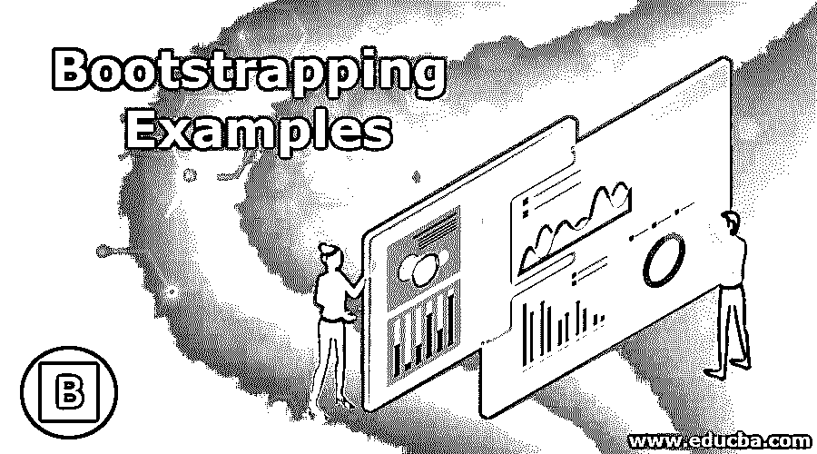
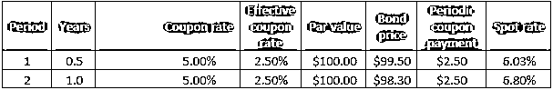
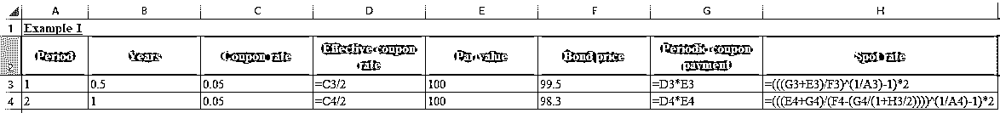
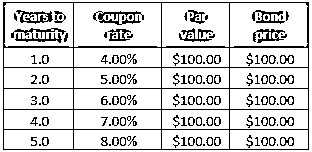
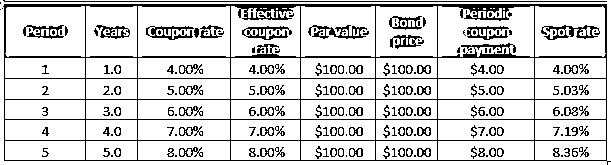
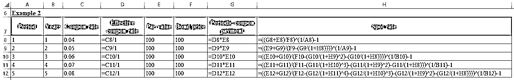

# 引导示例

> 原文：<https://www.educba.com/bootstrapping-examples/>

## 自举的定义

术语“自举”指的是从一组付息债券的市场价格中绘制出零息收益率曲线的技术。bootstrapping 技术主要用于弥补政府提供的短期国库券收益率，因此并不总是在每个时间段都可用。

### 引导示例

下面给出了一些引导示例:

<small>下载企业估值、投行、会计、CFA 计算器&其他</small>

#### 示例#1

让我们以两个 5%息票支付债券为例，信用违约风险为零，票面价值为 100 美元，清洁市场价格(不包括[应计利息](https://www.educba.com/accrued-interest-formula/))分别为 99.50 美元和 98.30 美元，到期时间分别为 6 个月和 1 年。首先，确定 6 个月和 1 年期债券的即期利率。请注意，这是一条票面利率等于到期收益率的平价曲线。

在 6 个月结束时，债券将支付 2.5 美元的息票(= $100 * 5% / 2)加上本金金额(= $100)，总计为$102.50。该债券的交易价格为 99.50 美元。因此，6 个月期即期利率 S 0.5y 可以计算为:

99.50 美元= 102.50 美元/ (1 + S 0.5y /2)

*   S 5y = 6.03%

在另一个 6 个月结束时，债券将支付另一个 2.5 美元的息票(= $100 * 5% / 2)加上本金金额(= $100)，总计为$102.50。该债券的交易价格为 98.30 美元。因此，1 年期即期利率 S 1y 可以用 S 0.5y 计算为:

$ 99.50 = $ 2.50/(1+S0.5y/2)+$ 102.50/(1+S1y/2)2

*   99.50 美元= 2.50 美元/(1+6.03%/2)+102.50 美元/ (1 + S 1y /2) 2
*   S 1y = 6.80%

因此，根据市场价格，前 6 个月的即期汇率为 6.03%，第二个 6 个月的远期汇率为 6.80%

#### 实施例 2

让我们再举一个例子，一些零信用违约风险的支付息票债券，每只债券的面值为 100 美元，按面值交易。但是，每种债券的到期期限都不一样，从 1 年到 5 年不等。确定所有债券的即期汇率。请注意，这是票面利率等于到期收益率的平价曲线。下表给出了详细信息:

1.在 1 年结束时，债券将支付 4 美元的息票(= $100 * 4%)加上本金金额(= $100)，总计为$104，而债券交易价格为$100。因此，1 年期即期利率 S 1y 可以计算为:

100 美元= 104 美元/ (1 + S 1y

*   S 1y = 4.00%

2.在第二和第年末，债券将支付 5 美元的息票(= $100 * 5%)加上本金金额(= $100)，总计为$105，而债券交易价格为$100。因此，2 年期即期利率 S 2y 可以用 S 1y 计算为:

100 美元= $ 4/(1+S1y)+105/(1+S2y)2

*   100 美元= 4 美元/(1+4.00%)+105 美元/ (1 + S 2y ) 2
*   S 1y = 5.03%

3.在第 3 年年末，债券将支付 6 美元的息票(= $100 * 6%)加上本金金额(= $100)，总计为$106，而债券交易价格为$100。因此，3 年期即期利率 S 3y 可以用 S 1y 和 S 2y 计算为:

$ 100 = $ 4/(1+S1y)+5/(1+S2y)2+106/(1+S3y)3

*   100 美元= $ 4/(1+4.00%)+$ 5/(1+5.03%)2+106/(1+S3y)3
*   S 3y = 6.08%

4.在第 4 年年末，债券将支付 7 美元的息票(= $100 * 7%)加上本金金额(= $100)，总计为$107，而债券交易价格为$100。因此，4 年期即期利率 S 4y 可以用 S 1y ，S 2y 和 S 3y 计算为:

$ 100 = $ 4/(1+S1y)+5/(1+S2y)2+6/(1+S3y)3+107/(1+S4y)4

*   100 美元= $ 4/(1+4.00%)+$ 5/(1+5.03%)2+$ 6/(1+6.08%)3+$ 107/(1+S4y)4
*   S 4y = 7.19%

5.在第 5 年年末，债券将支付 8 美元的息票(= $100 * 8%)加上本金金额(= $100)，总计为$108，而债券交易价格为$100。因此，5 年期即期利率 S 5y 可以用 S 1y ，S 2y， S 3y ，S 4y 计算为:

$ 100 = $ 4/(1+S1y)+5/(1+S2y)2+6/(1+S3y)3+7/(1+S4y)4+108/(1+S5y)5

*   100 美元= $ 4/(1+4.00%)+$ 5/(1+5.03%)2+$ 6/(1+6.08%)3+$ 7/(1+7.19%)4+$ 108/(1+S5y)5
*   S 5y = 8.36%

### 结论–引导示例

自举技术可能很简单，但确定实际收益率曲线然后将其平滑可能是一项非常繁琐复杂的活动，涉及冗长的数学运算，主要使用债券价格、票面利率、票面价值和每年的复利数。

### 推荐文章

这是引导示例的指南。这里我们用实例讨论了自举的计算。您也可以浏览我们推荐的其他文章，了解更多信息——

1.  [什么是自举？](https://www.educba.com/what-is-bootstrap/)
2.  [全球化范例](https://www.educba.com/globalization-example/)
3.  [Bootstrap vs jQuery UI](https://www.educba.com/bootstrap-vs-jquery-ui/)
4.  [引导雕刻的例子](https://www.educba.com/bootstrap-glyphicons/)

