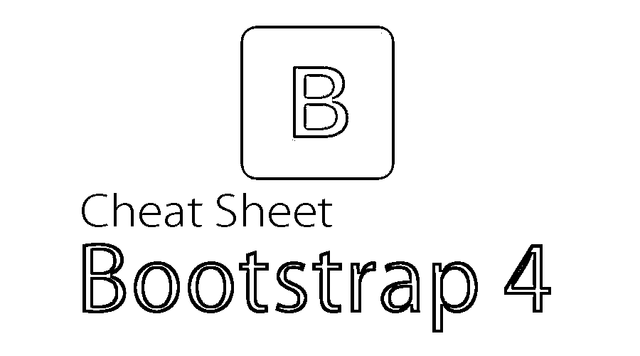

# 自举 4 备忘单

> 原文：<https://www.educba.com/bootstrap-4-cheat-sheet/>

## Bootstrap 4 备忘单简介

Bootstrap 4 备忘单包含了对 Bootstrap 3 的重大修改。大多数组件都发生了很多变化，包括表格、表单、下拉列表、网格、导航栏等。像 [Bootstrap](https://www.educba.com/what-is-bootstrap/) 这样的框架的主要好处是，它们可以加速开发时间，即使是在保持整个站点应用程序的质量和一致性的情况下。Bootstrap 4 cheat sheet 适用于 internet explorer 9 以上的所有现代浏览器。

### 自举 4

Bootstrap 4 是最新、最先进的 Bootstrap 版本。它是最流行的 HTML、CSS 和 JavaScript 框架，用于开发响应式和基于移动设备的应用程序。像早期版本一样，Bootstrap 4 是免费和开源的。我们不再需要为不同的设备组从头开始重写和重新设计一切。此外，我们不需要花费几个小时来尝试修复一切，并确保它在不同的浏览器、独特的平台和设备上都能正常工作。

<small>网页开发、编程语言、软件测试&其他</small>

### Bootstrap 4 备忘单上的命令和描述

下面提供了一些重要的 Bootstrap 4 命令及其描述:

| **命令** | **描述** |
| 固定集装箱 | 固定的容器有固定的宽度。调整浏览器大小时，其宽度保持不变，直到找到断点。 |
| 液体容器 | 流体容器跨越可用视口的整个宽度。它可以流畅地扩展和收缩，这意味着它会随着浏览器大小的改变而改变。 |
| .列- | 它适用于超小型设备，屏幕宽度小于 576 像素 |
| .Col-sm | 它适用于小型设备–屏幕宽度保持等于或大于 576 像素 |
| .Col-md | 它适用于中型设备–屏幕宽度保持等于或大于 768 像素 |
| .科尔-lg- | 它适用于大型设备–屏幕宽度等于或大于 992 像素 |
| .列 xl- | 它适用于超大设备–屏幕宽度等于或大于 1200 像素 |
| 

# –

 | h1 引导大小标题为 2.5rem = 40px
h2 引导大小标题为 2rem = 32px
h3 引导大小标题为 1.75rem = 28px
h4 引导大小标题为 1.5rem = 24px
h5 引导大小标题为 1.25rem = 20px
h6 引导大小标题为 1rem = 16px |
| <mark></mark> | 这个 HTML 标记元素提供了带有一些填充的黄色背景色 |
|  | 这个 HTML 标签元素提供了一个底部虚线边框。 |
|  | 带有

> 的 add 类用于引用来自外部的内容块。

 |
| .字体-粗细-粗体 | 对于粗体文本 |
| .字体-斜体 | 对于斜体文本 |
| .字体-粗细-浅色 | 对于轻量文本 |
| .字体-粗细-正常 | 对于普通文本 |
| .导致 | 它使一个段落明显突出 |
| .小的 | 它表示较小的文本，即它将字体大小缩小到其父字体大小的 85%。 |
| .文本-左侧 | 它指示文本向左对齐。 |
| .文本-*-左侧 | 它表示文本在所有大小的屏幕上都是左对齐的 |
| .文本中心 | 它表示居中对齐的文本 |
| .文本-*-居中 | 它表示在所有尺寸的屏幕上居中对齐的文本 |
| .文本-右侧 | 它表示右对齐文本 |
| .文本-*-对 | 它表示所有尺寸屏幕上的右对齐文本 |
| .文本对齐 | 它表示对齐文本 |
| .文本等宽 | 它有等宽文本 |
| .text-nowrap | 它表示没有换行文本 |
| .文本-小写 | 它表示小写文本 |
| .文本-大写 | 它表示大写文本 |
| .文本-大写 | 它表示大写的文本 |
| .首字母缩略词 | 它以较小的字体显示 HTML <abbr>标签元素中的文本。它删除嵌套列表中列表项可用默认列表样式和左边距</abbr> |
| .桌子 | 该类向表中添加基本样式。 |
| .表条纹的 | 这个班在桌子上添加了斑马条纹。 |
| .桌边的 | 该类在表格和单元格的所有边上添加边框。 |
| .表格悬停 | 该类在可用的表格行上添加了悬停效果，即灰色背景色。 |
| .餐桌-深色 | 这个类给表格添加了一个黑色背景。 |

### 使用 Bootstrap 4 备忘单的免费提示和技巧

本节提到了一些快速破解 bootstrap 4 备忘单的功能并在移动设备上创建一个令人惊叹的应用程序的很酷的提示和技巧:-

*   随着使用。col-(断点)-push-(数字)或使用时。col-(断点)-pull-(数字)类到列，指定列的顺序可以改变。
*   为了在 xs 设备上快速方便地隐藏一个元素，有一个. hidden-xs 类，它可以用来隐藏。
*   .hidden-(断点)类也可以用于其余的断点，当结合使用时，可以实现上面提到的隐藏范围。例句:班级。隐藏-LG，。隐藏-MD，。隐藏-sm。
*   Bootstrap 有 5 种默认的可用按钮样式，分别是默认、主要、成功和危险。当需要更改按钮以减小其边框半径或填充时，最好的方法是重写。btn
*   要禁用单选按钮和复选框，需要将禁用的类添加到父类中。复选框或 to.radio 元素。然后将禁用的属性添加到特定输入中
*   要禁用按钮，将 disabled 属性添加到 HTML 标签<button>按钮中</button>

或者同样可以通过添加来完成。禁用类到

*   要轻松地将一个块元素水平居中，需要添加一个中心块类，如所示。
*   如果要实现内联内容快速居中，或者要实现 div 内的内联块元素，请添加。文本中心类到它的父元素。
*   你也可以使用 Bootstrap 的 embed-responsive 类轻松嵌入 YouTube 视频。需要根据视频的纵横比选择 embed-responsive-16by9 或 embed-responsive-4by3 类

### 结论

上面的 bootstrap 4 备忘单提供了 bootstrap 4 的一瞥。但是有一个更全面的指南，提供了成千上万的其他参数和标签。很明显，关于所有的信息不可能在一篇文章中提供，开发者也不需要记住所有的标签和类来进行开发。最好也是最值得推荐的方法是将这样的备忘单放在手边，用户应该在需要的时候查阅这些备忘单。这将确保在需要时完成所有工作，并在一段时间内提高用户对 bootstrap 4 的理解和知识。

### 推荐文章

这是 Bootstrap 4 备忘单的指南。这里我们已经分别讨论了 Bootstrap 4 备忘单的内容和命令以及免费的提示和技巧。您也可以阅读以下文章，了解更多信息——

1.  [Bootstrap 与 Jquery 的差异](https://www.educba.com/bootstrap-vs-jquery/)
2.  [备忘单 SQL](https://www.educba.com/cheat-sheet-sql/)
3.  [自举示例](https://www.educba.com/bootstrapping-examples/)
4.  [自举网格](https://www.educba.com/bootstrap-grid/)

